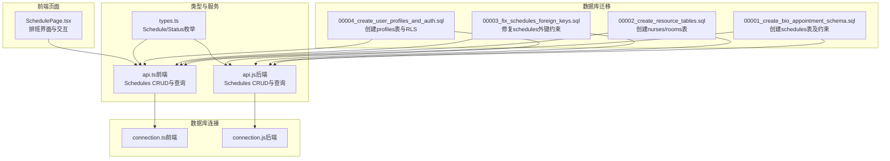
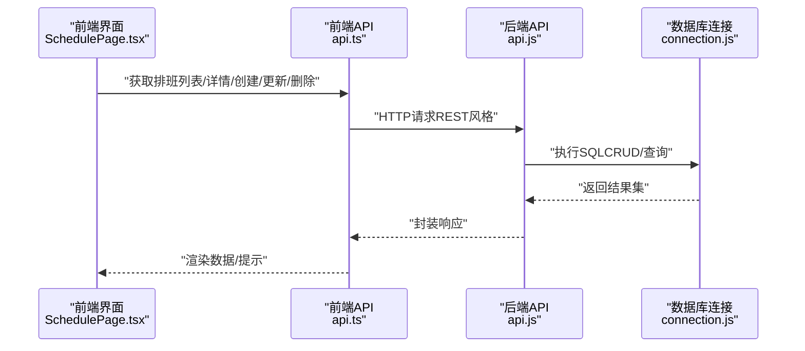
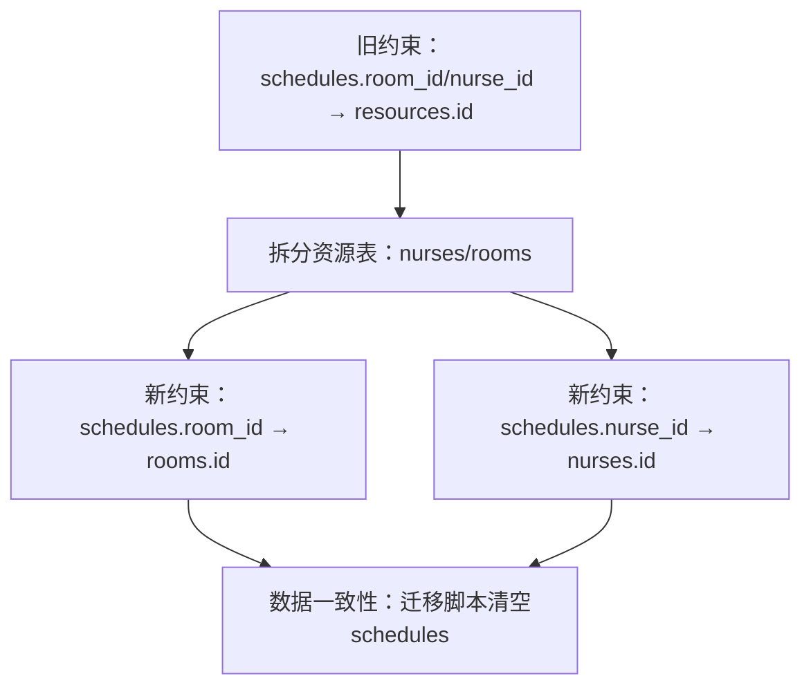
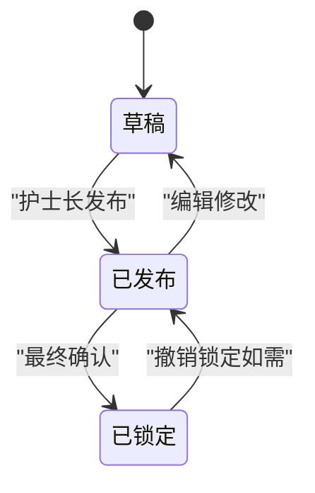
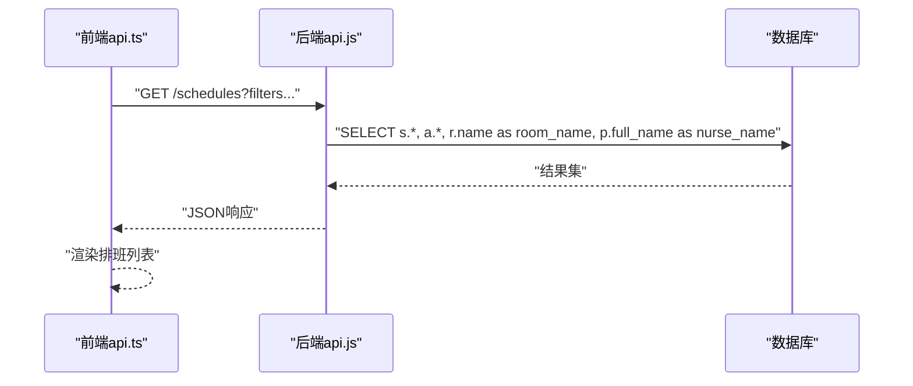
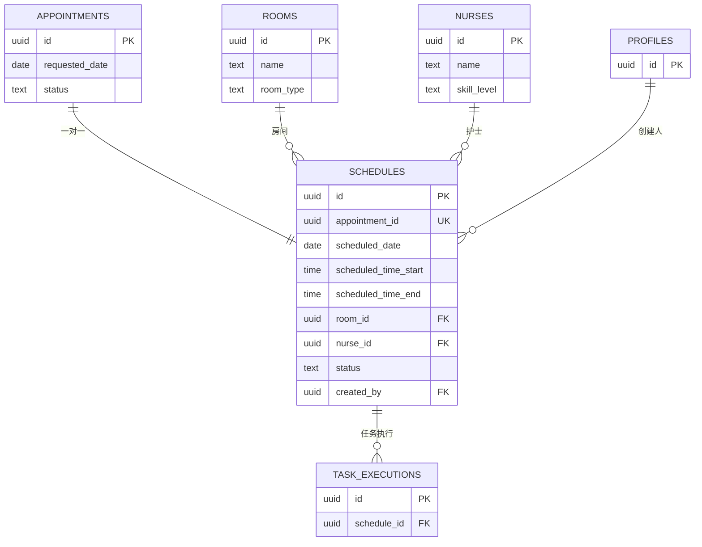

# 排班表结构

<cite>
**本文引用的文件**
- [00001_create_bio_appointment_schema.sql](file://supabase/migrations/00001_create_bio_appointment_schema.sql)
- [00002_create_resource_tables.sql](file://supabase/migrations/00002_create_resource_tables.sql)
- [00003_fix_schedules_foreign_keys.sql](file://supabase/migrations/00003_fix_schedules_foreign_keys.sql)
- [00004_create_user_profiles_and_auth.sql](file://supabase/migrations/00004_create_user_profiles_and_auth.sql)
- [api.js（后端服务）](file://server/src/services/api.js)
- [api.ts（前端服务）](file://src/services/api.ts)
- [connection.ts（前端数据库连接）](file://src/db/connection.ts)
- [connection.js（后端数据库连接）](file://server/src/db/connection.js)
- [SchedulePage.tsx（前端排班页）](file://src/pages/head-nurse/SchedulePage.tsx)
- [types.ts（类型定义）](file://src/types/types.ts)
</cite>

## 目录
1. [简介](#简介)
2. [项目结构](#项目结构)
3. [核心组件](#核心组件)
4. [架构总览](#架构总览)
5. [详细组件分析](#详细组件分析)
6. [依赖关系分析](#依赖关系分析)
7. [性能考量](#性能考量)
8. [故障排除指南](#故障排除指南)
9. [结论](#结论)
10. [附录](#附录)

## 简介
本文件面向“Bio-Appointment”系统的排班表（schedules）结构，系统性梳理字段定义、外键约束演进、状态机设计、审计字段作用，以及前后端API协同实现排班的增删改查流程，并给出通过LEFT JOIN关联appointments、rooms、profiles等表的SQL查询示例，帮助开发者快速理解并正确使用排班数据模型。

## 项目结构
围绕排班表的关键文件与职责如下：
- 数据库迁移文件：定义表结构、约束、索引与触发器
- 类型定义：统一前后端对排班字段与状态的理解
- API服务层：后端api.js与前端api.ts封装CRUD与查询逻辑
- 前端页面：SchedulePage.tsx负责排班界面交互与调用API
- 数据库连接：connection.ts与connection.js提供查询与事务能力

图表来源
- [00001_create_bio_appointment_schema.sql](file://supabase/migrations/00001_create_bio_appointment_schema.sql#L160-L190)
- [00002_create_resource_tables.sql](file://supabase/migrations/00002_create_resource_tables.sql#L1-L182)
- [00003_fix_schedules_foreign_keys.sql](file://supabase/migrations/00003_fix_schedules_foreign_keys.sql#L1-L67)
- [00004_create_user_profiles_and_auth.sql](file://supabase/migrations/00004_create_user_profiles_and_auth.sql#L1-L207)
- [types.ts](file://src/types/types.ts#L17-L20)
- [api.js（后端服务）](file://server/src/services/api.js#L165-L249)
- [api.ts（前端服务）](file://src/services/api.ts#L239-L325)
- [connection.ts（前端数据库连接）](file://src/db/connection.ts#L1-L166)
- [connection.js（后端数据库连接）](file://server/src/db/connection.js#L1-L160)
- [SchedulePage.tsx（前端排班页）](file://src/pages/head-nurse/SchedulePage.tsx#L1-L200)

章节来源
- [00001_create_bio_appointment_schema.sql](file://supabase/migrations/00001_create_bio_appointment_schema.sql#L160-L190)
- [00002_create_resource_tables.sql](file://supabase/migrations/00002_create_resource_tables.sql#L1-L182)
- [00003_fix_schedules_foreign_keys.sql](file://supabase/migrations/00003_fix_schedules_foreign_keys.sql#L1-L67)
- [00004_create_user_profiles_and_auth.sql](file://supabase/migrations/00004_create_user_profiles_and_auth.sql#L1-L207)
- [types.ts](file://src/types/types.ts#L17-L20)
- [api.js（后端服务）](file://server/src/services/api.js#L165-L249)
- [api.ts（前端服务）](file://src/services/api.ts#L239-L325)
- [connection.ts（前端数据库连接）](file://src/db/connection.ts#L1-L166)
- [connection.js（后端数据库连接）](file://server/src/db/connection.js#L1-L160)
- [SchedulePage.tsx（前端排班页）](file://src/pages/head-nurse/SchedulePage.tsx#L1-L200)

## 核心组件
- 排班表（schedules）：承载一次预约的排班安排，包含日期、时间段、房间、护士、调整时长与原因、状态、审计字段等
- 资源表（rooms、nurses）：独立的房间与护士资源，供排班绑定
- 用户档案（profiles）：记录创建人、角色与状态，支撑审计与权限
- API服务层：后端api.js与前端api.ts提供统一的CRUD与查询接口
- 前端页面：SchedulePage.tsx负责排班界面交互、冲突检测与提交

章节来源
- [00001_create_bio_appointment_schema.sql](file://supabase/migrations/00001_create_bio_appointment_schema.sql#L160-L190)
- [00002_create_resource_tables.sql](file://supabase/migrations/00002_create_resource_tables.sql#L1-L182)
- [00004_create_user_profiles_and_auth.sql](file://supabase/migrations/00004_create_user_profiles_and_auth.sql#L1-L207)
- [api.js（后端服务）](file://server/src/services/api.js#L165-L249)
- [api.ts（前端服务）](file://src/services/api.ts#L239-L325)
- [SchedulePage.tsx（前端排班页）](file://src/pages/head-nurse/SchedulePage.tsx#L1-L200)

## 架构总览
排班数据流从“预约（appointments）”到“排班（schedules）”，再到“任务执行（task_executions）”。前端通过api.ts调用后端api.js，后端通过connection.js连接数据库执行SQL。

图表来源
- [SchedulePage.tsx（前端排班页）](file://src/pages/head-nurse/SchedulePage.tsx#L1-L200)
- [api.ts（前端服务）](file://src/services/api.ts#L239-L325)
- [api.js（后端服务）](file://server/src/services/api.js#L165-L249)
- [connection.js（后端数据库连接）](file://server/src/db/connection.js#L1-L160)

## 详细组件分析

### 排班表字段定义与业务含义
- id：主键，唯一标识一条排班记录
- appointment_id：一对一关联预约，唯一约束，确保同一预约只有一条排班
- scheduled_date：排班日期
- scheduled_time_start/scheduled_time_end：排班起止时间
- room_id：房间资源ID，指向rooms表
- nurse_id：护士资源ID，指向nurses表
- adjusted_duration：经护士长调整后的时长（分钟）
- adjustment_reason：调整原因说明
- status：排班状态，枚举值 draft/published/locked
- created_by：创建人（护士长）ID，指向profiles
- created_at/updated_at：审计时间戳，自动维护

字段来源与约束
- 字段定义与约束见迁移文件
- 外键约束演进详见下节

章节来源
- [00001_create_bio_appointment_schema.sql](file://supabase/migrations/00001_create_bio_appointment_schema.sql#L160-L190)
- [types.ts](file://src/types/types.ts#L17-L20)

### 外键约束演进与技术决策
- 初始阶段（00001_create_bio_appointment_schema.sql）：schedules的room_id与nurse_id外键指向旧的resources表
- 升级阶段（00002_create_resource_tables.sql）：系统拆分为独立的nurses与rooms表
- 修复阶段（00003_fix_schedules_foreign_keys.sql）：将schedules的外键从resources迁移到rooms与nurses
  - 删除旧约束（指向resources）
  - 添加新约束（room_id→rooms.id；nurse_id→nurses.id）
  - 由于历史数据可能仍引用旧ID，迁移脚本清空schedules表以保证一致性
- 影响：前端与后端查询逻辑无需变更，但数据库层面必须确保新约束生效

图表来源
- [00001_create_bio_appointment_schema.sql](file://supabase/migrations/00001_create_bio_appointment_schema.sql#L160-L190)
- [00002_create_resource_tables.sql](file://supabase/migrations/00002_create_resource_tables.sql#L1-L182)
- [00003_fix_schedules_foreign_keys.sql](file://supabase/migrations/00003_fix_schedules_foreign_keys.sql#L1-L67)

章节来源
- [00001_create_bio_appointment_schema.sql](file://supabase/migrations/00001_create_bio_appointment_schema.sql#L160-L190)
- [00002_create_resource_tables.sql](file://supabase/migrations/00002_create_resource_tables.sql#L1-L182)
- [00003_fix_schedules_foreign_keys.sql](file://supabase/migrations/00003_fix_schedules_foreign_keys.sql#L1-L67)

### 状态机设计：status（draft/published/locked）
- draft：草稿态，尚未对外发布，可编辑
- published：已发布，对外可见，进入资源可用性校验
- locked：已锁定，最终确认，禁止再次修改
- 前端界面通过状态徽章直观展示状态，护士长在发布时将状态置为published

图表来源
- [types.ts](file://src/types/types.ts#L17-L20)
- [SchedulePage.tsx（前端排班页）](file://src/pages/head-nurse/SchedulePage.tsx#L1-L200)

章节来源
- [types.ts](file://src/types/types.ts#L17-L20)
- [SchedulePage.tsx（前端排班页）](file://src/pages/head-nurse/SchedulePage.tsx#L1-L200)

### 审计字段：created_by、created_at、updated_at
- created_by：排班创建人（护士长）ID，指向profiles
- created_at/updated_at：记录创建与最后更新时间，后端通过触发器自动维护
- 作用：追踪责任人与变更历史，便于审计与问题定位

章节来源
- [00001_create_bio_appointment_schema.sql](file://supabase/migrations/00001_create_bio_appointment_schema.sql#L160-L190)
- [00004_create_user_profiles_and_auth.sql](file://supabase/migrations/00004_create_user_profiles_and_auth.sql#L1-L207)

### 前后端API协同：增删改查
- 前端api.ts
  - 提供 getSchedules/getSchedule/createSchedule/updateSchedule/deleteSchedule 等方法
  - 查询时通过LEFT JOIN关联appointments、rooms、profiles，返回带扩展信息的排班列表
- 后端api.js
  - 提供同名方法，内部同样执行LEFT JOIN查询，返回聚合后的排班数据
  - 支持动态过滤（日期范围、房间ID、护士ID、状态等）

图表来源
- [api.ts（前端服务）](file://src/services/api.ts#L239-L325)
- [api.js（后端服务）](file://server/src/services/api.js#L165-L249)

章节来源
- [api.ts（前端服务）](file://src/services/api.ts#L239-L325)
- [api.js（后端服务）](file://server/src/services/api.js#L165-L249)

### SQL查询示例：LEFT JOIN获取完整排班信息
以下查询展示如何通过LEFT JOIN关联appointments、rooms、profiles，获取完整的排班信息（字段路径参考）：
- 排班列表查询（含预约、房间、护士、服务名称）
  - 参考路径：[api.ts（前端服务）](file://src/services/api.ts#L288-L303)
  - 参考路径：[api.js（后端服务）](file://server/src/services/api.js#L215-L231)
- 任务执行查询（含排班日期、护士名称等）
  - 参考路径：[api.ts（前端服务）](file://src/services/api.ts#L362-L377)
  - 参考路径：[api.js（后端服务）](file://server/src/services/api.js#L275-L289)

章节来源
- [api.ts（前端服务）](file://src/services/api.ts#L288-L303)
- [api.js（后端服务）](file://server/src/services/api.js#L215-L231)
- [api.ts（前端服务）](file://src/services/api.ts#L362-L377)
- [api.js（后端服务）](file://server/src/services/api.js#L275-L289)

## 依赖关系分析
- 表间依赖
  - schedules.appointment_id → appointments.id（唯一）
  - schedules.room_id → rooms.id（RESTRICT）
  - schedules.nurse_id → nurses.id（RESTRICT）
  - schedules.created_by → profiles.id
  - task_executions.schedule_id → schedules.id（CASCADE）
- 类型依赖
  - ScheduleStatus（draft/published/locked）由types.ts定义
- 前后端依赖
  - 前端api.ts依赖connection.ts执行query
  - 后端api.js依赖connection.js执行query与事务

图表来源
- [00001_create_bio_appointment_schema.sql](file://supabase/migrations/00001_create_bio_appointment_schema.sql#L160-L190)
- [00002_create_resource_tables.sql](file://supabase/migrations/00002_create_resource_tables.sql#L1-L182)
- [00004_create_user_profiles_and_auth.sql](file://supabase/migrations/00004_create_user_profiles_and_auth.sql#L1-L207)
- [types.ts](file://src/types/types.ts#L17-L20)

章节来源
- [00001_create_bio_appointment_schema.sql](file://supabase/migrations/00001_create_bio_appointment_schema.sql#L160-L190)
- [00002_create_resource_tables.sql](file://supabase/migrations/00002_create_resource_tables.sql#L1-L182)
- [00004_create_user_profiles_and_auth.sql](file://supabase/migrations/00004_create_user_profiles_and_auth.sql#L1-L207)
- [types.ts](file://src/types/types.ts#L17-L20)

## 性能考量
- 索引建议
  - schedules.scheduled_date + scheduled_time_start：加速按日期与时间排序查询
  - resources.type + status：加速资源可用性查询
  - profiles.role：加速按角色筛选
- 连接池与缓存
  - 前端connection.ts与后端connection.js均提供连接池与健康检查，避免频繁建立连接
- 查询优化
  - 使用LEFT JOIN一次性获取关联数据，减少多次往返
  - 对高频过滤条件（日期范围、房间ID、护士ID、状态）使用参数化查询

章节来源
- [00001_create_bio_appointment_schema.sql](file://supabase/migrations/00001_create_bio_appointment_schema.sql#L192-L197)
- [connection.ts（前端数据库连接）](file://src/db/connection.ts#L1-L166)
- [connection.js（后端数据库连接）](file://server/src/db/connection.js#L1-L160)

## 故障排除指南
- 外键约束报错
  - 现象：插入/更新排班时报外键错误
  - 排查：确认room_id/nurse_id是否存在于rooms/nurses表；检查00003修复脚本是否已执行
  - 参考路径：[00003_fix_schedules_foreign_keys.sql](file://supabase/migrations/00003_fix_schedules_foreign_keys.sql#L33-L58)
- 数据被清空
  - 现象：schedules表数据丢失
  - 说明：修复脚本在迁移期间清空了schedules表，请重新导入或重建数据
  - 参考路径：[00003_fix_schedules_foreign_keys.sql](file://supabase/migrations/00003_fix_schedules_foreign_keys.sql#L28-L32)
- 资源冲突
  - 现象：发布排班时报冲突
  - 处理：前端已内置冲突检测，必要时在护士长界面确认覆盖
  - 参考路径：[SchedulePage.tsx（前端排班页）](file://src/pages/head-nurse/SchedulePage.tsx#L167-L193)
- 查询无结果
  - 现象：排班列表为空
  - 排查：确认过滤条件（日期、房间、护士、状态）是否正确；检查LEFT JOIN字段别名是否一致
  - 参考路径：[api.ts（前端服务）](file://src/services/api.ts#L288-L303)，[api.js（后端服务）](file://server/src/services/api.js#L215-L231)

章节来源
- [00003_fix_schedules_foreign_keys.sql](file://supabase/migrations/00003_fix_schedules_foreign_keys.sql#L28-L32)
- [SchedulePage.tsx（前端排班页）](file://src/pages/head-nurse/SchedulePage.tsx#L167-L193)
- [api.ts（前端服务）](file://src/services/api.ts#L288-L303)
- [api.js（后端服务）](file://server/src/services/api.js#L215-L231)

## 结论
排班表（schedules）是Bio-Appointment系统的核心实体之一，其字段设计清晰、外键约束明确、状态机完备、审计字段健全。通过前后端API的协作与LEFT JOIN查询，能够高效获取完整的排班信息。外键约束从resources迁移到rooms与nurses体现了系统资源模型的演进，迁移脚本确保了数据一致性。建议在生产环境中配合索引与连接池优化，持续监控资源可用性与冲突检测，保障排班流程稳定运行。

## 附录
- 关键字段与类型
  - ScheduleStatus：draft/published/locked
  - RoomType：vip/treatment/consultation
  - SkillLevel：junior/intermediate/senior
- 常用查询路径
  - 排班列表（含预约、房间、护士、服务）：[api.ts（前端服务）](file://src/services/api.ts#L288-L303)，[api.js（后端服务）](file://server/src/services/api.js#L215-L231)
  - 任务执行列表（含排班日期、护士）：[api.ts（前端服务）](file://src/services/api.ts#L362-L377)，[api.js（后端服务）](file://server/src/services/api.js#L275-L289)