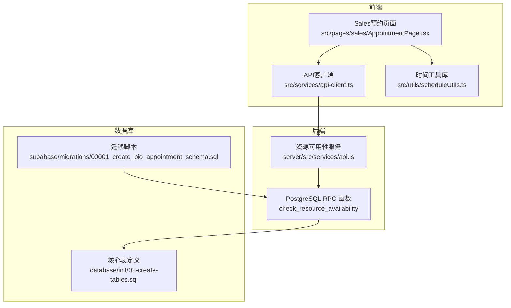
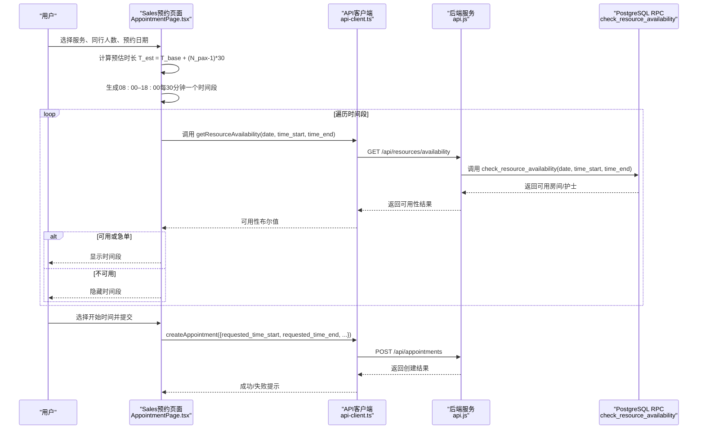
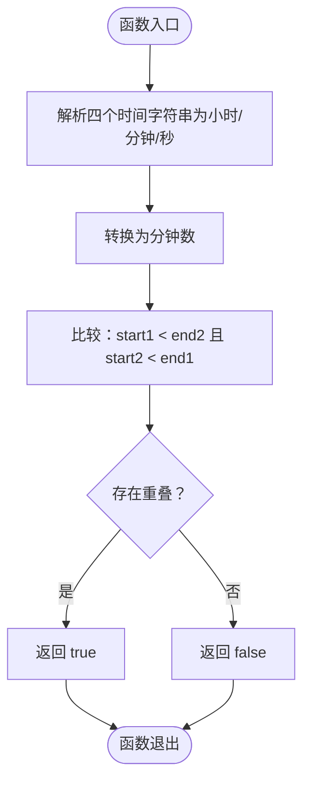
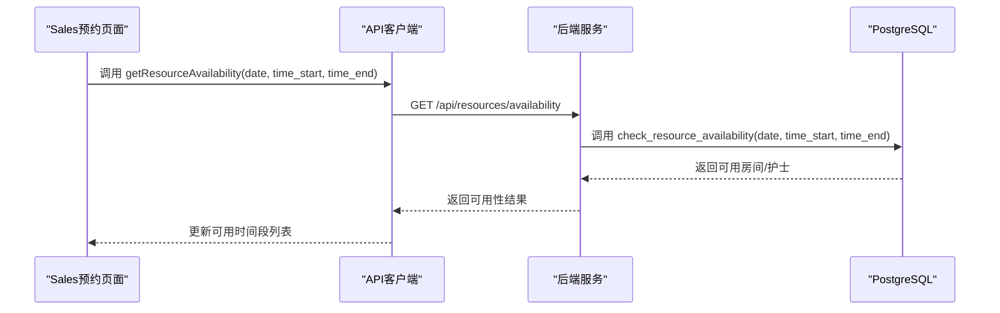
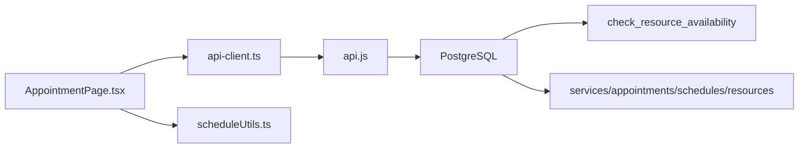

# 时间槽设计

<cite>
**本文引用的文件**
- [src/pages/sales/AppointmentPage.tsx](file://src/pages/sales/AppointmentPage.tsx)
- [src/utils/scheduleUtils.ts](file://src/utils/scheduleUtils.ts)
- [src/services/api-client.ts](file://src/services/api-client.ts)
- [server/src/services/api.js](file://server/src/services/api.js)
- [supabase/migrations/00001_create_bio_appointment_schema.sql](file://supabase/migrations/00001_create_bio_appointment_schema.sql)
- [database/init/02-create-tables.sql](file://database/init/02-create-tables.sql)
- [FEATURE_TIME_SELECTION.md](file://FEATURE_TIME_SELECTION.md)
- [SCHEDULE_ENHANCEMENT.md](file://SCHEDULE_ENHANCEMENT.md)
</cite>

## 目录
1. [简介](#简介)
2. [项目结构](#项目结构)
3. [核心组件](#核心组件)
4. [架构总览](#架构总览)
5. [详细组件分析](#详细组件分析)
6. [依赖关系分析](#依赖关系分析)
7. [性能考量](#性能考量)
8. [故障排查指南](#故障排查指南)
9. [结论](#结论)

## 简介
本文件系统性梳理Bio-Appointment系统的时间槽（Time Slot）设计与实现机制，重点围绕以下目标展开：
- 解释系统采用“30分钟为基本时间单位”的设计原理与边界约束（08:00–18:00，结束时间不超18:00）。
- 详述预约创建页面（Sales端）如何基于服务预估时长动态生成可用时间段列表。
- 深入解析时间重叠检测算法：前端scheduleUtils.ts中的isTimeOverlap函数如何通过将时间转换为分钟数进行数学比较；后端PostgreSQL的OVERLAPS操作符在check_resource_availability函数中的高效应用。
- 对比前后端冲突检测的职责划分：前端用于销售端实时可用性预检，后端用于排班创建时的最终一致性校验。
- 给出从用户选择开始时间到系统计算结束时间并验证资源可用性的完整流程示例路径。
- 讨论时间槽粒度对系统性能与用户体验的权衡。

## 项目结构
时间槽相关的关键位置分布如下：
- 前端预约页面：Sales端预约页面负责动态生成时间段、计算预估时长、调用资源可用性接口。
- 前端工具库：scheduleUtils.ts提供通用的时间重叠检测与资源冲突检测。
- 前端API客户端：封装调用后端资源可用性接口。
- 后端服务：提供资源可用性查询接口，SQL中使用OVERLAPS进行高效区间重叠判断。
- 数据库：定义服务、预约、排班等核心表，包含时间字段与索引。

图表来源
- [src/pages/sales/AppointmentPage.tsx](file://src/pages/sales/AppointmentPage.tsx#L99-L139)
- [src/services/api-client.ts](file://src/services/api-client.ts#L287-L291)
- [src/utils/scheduleUtils.ts](file://src/utils/scheduleUtils.ts#L16-L34)
- [server/src/services/api.js](file://server/src/services/api.js#L305-L351)
- [supabase/migrations/00001_create_bio_appointment_schema.sql](file://supabase/migrations/00001_create_bio_appointment_schema.sql#L238-L281)
- [database/init/02-create-tables.sql](file://database/init/02-create-tables.sql#L54-L96)

章节来源
- [src/pages/sales/AppointmentPage.tsx](file://src/pages/sales/AppointmentPage.tsx#L99-L139)
- [src/services/api-client.ts](file://src/services/api-client.ts#L287-L291)
- [src/utils/scheduleUtils.ts](file://src/utils/scheduleUtils.ts#L16-L34)
- [server/src/services/api.js](file://server/src/services/api.js#L305-L351)
- [supabase/migrations/00001_create_bio_appointment_schema.sql](file://supabase/migrations/00001_create_bio_appointment_schema.sql#L238-L281)
- [database/init/02-create-tables.sql](file://database/init/02-create-tables.sql#L54-L96)

## 核心组件
- 时间槽生成与预估时长计算（Sales端）
  - 依据服务基础时长与同行人数，按“每人+30分钟”计算预估时长。
  - 在08:00–18:00范围内，以30分钟为步进生成时间段，结束时间不得超过18:00。
  - 通过调用资源可用性接口过滤不可用时间段。
- 前端重叠检测
  - isTimeOverlap函数将时间字符串转换为分钟数，使用数学比较判断两区间是否重叠。
- 后端重叠检测
  - 使用PostgreSQL OVERLAPS操作符对时间段区间进行高效重叠判断。
  - 提供check_resource_availability RPC函数，返回可用房间与护士集合。
- 数据模型
  - 服务表包含base_duration字段；预约与排班表包含requested_time_start/End与scheduled_time_start/End字段。

章节来源
- [src/pages/sales/AppointmentPage.tsx](file://src/pages/sales/AppointmentPage.tsx#L99-L139)
- [src/utils/scheduleUtils.ts](file://src/utils/scheduleUtils.ts#L16-L34)
- [server/src/services/api.js](file://server/src/services/api.js#L305-L351)
- [supabase/migrations/00001_create_bio_appointment_schema.sql](file://supabase/migrations/00001_create_bio_appointment_schema.sql#L238-L281)
- [database/init/02-create-tables.sql](file://database/init/02-create-tables.sql#L24-L36)
- [database/init/02-create-tables.sql](file://database/init/02-create-tables.sql#L54-L96)

## 架构总览
从前端到后端再到数据库的时序如下：

图表来源
- [src/pages/sales/AppointmentPage.tsx](file://src/pages/sales/AppointmentPage.tsx#L99-L139)
- [src/services/api-client.ts](file://src/services/api-client.ts#L287-L291)
- [server/src/services/api.js](file://server/src/services/api.js#L305-L351)
- [supabase/migrations/00001_create_bio_appointment_schema.sql](file://supabase/migrations/00001_create_bio_appointment_schema.sql#L238-L281)

## 详细组件分析

### 时间槽生成与预估时长计算（Sales端）
- 预估时长模型
  - 公式：T_est = T_base + (N_pax - 1) × 30
  - T_base来自服务配置；N_pax = 1 + 同行人数。
- 时间段生成规则
  - 范围：08:00–18:00
  - 步进：30分钟
  - 结束时间上限：18:00，若开始时间+预估时长>18:00，则该时间段不可选。
- 资源可用性过滤
  - 对每个时间段调用后端资源可用性接口，只有当房间与护士均可用时才显示。
- 急单模式
  - 当选择日期为当天时，自动进入急单模式，跳过资源校验，所有时间段均可选。

章节来源
- [src/pages/sales/AppointmentPage.tsx](file://src/pages/sales/AppointmentPage.tsx#L99-L139)
- [FEATURE_TIME_SELECTION.md](file://FEATURE_TIME_SELECTION.md#L116-L158)

### 前端重叠检测算法（scheduleUtils.ts）
- isTimeOverlap函数
  - 输入：四个时间字符串（start1, end1, start2, end2）
  - 转换：将时间拆分为小时/分钟/秒，统一转换为分钟数
  - 判断：start1Minutes < end2Minutes 且 start2Minutes < end1Minutes
  - 作用：用于检测两个时间段是否存在重叠，常用于资源冲突检测与可视化排班分行布局
- detectResourceConflicts函数
  - 基于isTimeOverlap检测房间与护士冲突，返回冲突详情数组

图表来源
- [src/utils/scheduleUtils.ts](file://src/utils/scheduleUtils.ts#L16-L34)

章节来源
- [src/utils/scheduleUtils.ts](file://src/utils/scheduleUtils.ts#L16-L34)
- [SCHEDULE_ENHANCEMENT.md](file://SCHEDULE_ENHANCEMENT.md#L74-L118)

### 后端重叠检测（PostgreSQL OVERLAPS）
- check_resource_availability RPC函数
  - 功能：在指定日期内，返回可用房间与可用护士集合
  - 关键点：使用OVERLAPS区间操作符判断时间段重叠
  - 过滤条件：排除草稿状态；排除被排除的排班ID（编辑时）
- 后端服务层实现
  - getResourceAvailability方法分别查询房间与护士，使用三元区间重叠条件组合
  - 并发查询：房间与护士查询并发执行，提高响应速度

图表来源
- [server/src/services/api.js](file://server/src/services/api.js#L305-L351)
- [supabase/migrations/00001_create_bio_appointment_schema.sql](file://supabase/migrations/00001_create_bio_appointment_schema.sql#L238-L281)

章节来源
- [server/src/services/api.js](file://server/src/services/api.js#L305-L351)
- [supabase/migrations/00001_create_bio_appointment_schema.sql](file://supabase/migrations/00001_create_bio_appointment_schema.sql#L238-L281)

### 数据模型与索引
- 服务表（services）
  - base_duration：服务的基础时长（分钟）
  - allow_companions/max_companions：支持/限制同行人数
- 预约表（appointments）
  - requested_time_start/End：销售端期望时间段
  - estimated_duration：预估时长（分钟）
- 排班表（schedules）
  - scheduled_time_start/End：实际排班时间段
  - room_id/nurse_id：资源标识
- 数据库索引
  - 为profiles、services、resources、appointments、schedules等关键字段建立索引，提升查询性能

章节来源
- [database/init/02-create-tables.sql](file://database/init/02-create-tables.sql#L24-L36)
- [database/init/02-create-tables.sql](file://database/init/02-create-tables.sql#L54-L96)
- [database/init/02-create-tables.sql](file://database/init/02-create-tables.sql#L184-L231)

## 依赖关系分析
- 前端依赖
  - AppointmentPage.tsx依赖api-client.ts提供的getResourceAvailability接口
  - scheduleUtils.ts提供通用重叠检测，被多个组件复用
- 后端依赖
  - api.js依赖数据库连接与查询封装
  - check_resource_availability依赖schedules表与resources/profiles表
- 数据库依赖
  - RPC函数依赖schedules表的时间字段与状态字段
  - 服务表提供base_duration作为预估时长计算依据

图表来源
- [src/pages/sales/AppointmentPage.tsx](file://src/pages/sales/AppointmentPage.tsx#L99-L139)
- [src/services/api-client.ts](file://src/services/api-client.ts#L287-L291)
- [src/utils/scheduleUtils.ts](file://src/utils/scheduleUtils.ts#L16-L34)
- [server/src/services/api.js](file://server/src/services/api.js#L305-L351)
- [supabase/migrations/00001_create_bio_appointment_schema.sql](file://supabase/migrations/00001_create_bio_appointment_schema.sql#L238-L281)
- [database/init/02-create-tables.sql](file://database/init/02-create-tables.sql#L54-L96)

章节来源
- [src/pages/sales/AppointmentPage.tsx](file://src/pages/sales/AppointmentPage.tsx#L99-L139)
- [src/services/api-client.ts](file://src/services/api-client.ts#L287-L291)
- [src/utils/scheduleUtils.ts](file://src/utils/scheduleUtils.ts#L16-L34)
- [server/src/services/api.js](file://server/src/services/api.js#L305-L351)
- [supabase/migrations/00001_create_bio_appointment_schema.sql](file://supabase/migrations/00001_create_bio_appointment_schema.sql#L238-L281)
- [database/init/02-create-tables.sql](file://database/init/02-create-tables.sql#L54-L96)

## 性能考量
- 时间槽粒度与性能
  - 30分钟粒度在UI上更易读，同时减少时间段数量，降低前端渲染与网络请求压力。
  - 后端使用OVERLAPS操作符进行区间重叠判断，避免复杂循环遍历，显著提升查询性能。
- 并发与缓存
  - 后端对房间与护士查询采用并发执行，缩短响应时间。
  - 前端可在短时间内多次触发时间段刷新时，结合防抖/节流策略减少重复请求。
- 索引与查询
  - 为profiles、services、resources、appointments、schedules等表建立索引，有助于加速可用性查询与重叠检测。
- 急单模式
  - 急单模式跳过资源校验，显著降低前端与后端的计算与IO开销，但需确保后端仍进行最终一致性校验。

[本节为通用性能讨论，无需列出具体文件来源]

## 故障排查指南
- 常见问题
  - 选择时间段后仍提示资源不足：检查服务基础时长与同行人数是否正确；确认时间段是否超出18:00上限。
  - 急单模式仍被过滤：确认选择日期是否为当天；核对服务类别是否符合急单要求。
  - 资源可用性接口报错：检查API地址与鉴权头；查看后端服务日志。
- 建议排查步骤
  - 前端：确认api-client.ts的getResourceAvailability调用参数（date、time_start、time_end）格式正确。
  - 后端：确认check_resource_availability RPC函数与schedules表状态过滤逻辑。
  - 数据库：确认services.base_duration与schedules.scheduled_time_*字段值有效。

章节来源
- [src/services/api-client.ts](file://src/services/api-client.ts#L287-L291)
- [server/src/services/api.js](file://server/src/services/api.js#L305-L351)
- [supabase/migrations/00001_create_bio_appointment_schema.sql](file://supabase/migrations/00001_create_bio_appointment_schema.sql#L238-L281)

## 结论
- 30分钟为基本时间单位的设计兼顾了用户体验与系统性能，08:00–18:00的边界与结束时间上限保证了业务可操作性。
- Sales端通过预估时长模型与资源可用性接口，实现了“所见即所得”的时间段选择体验。
- 前端使用分钟数比较进行重叠检测，后端使用PostgreSQL OVERLAPS进行高效区间重叠判断，形成前后端互补的冲突检测体系。
- 急单模式在销售端提供快速通道，但后端仍需保留最终一致性校验，确保资源与业务规则的严格遵守。
- 通过合理的索引与并发查询，系统在高并发场景下仍能保持稳定与低延迟。