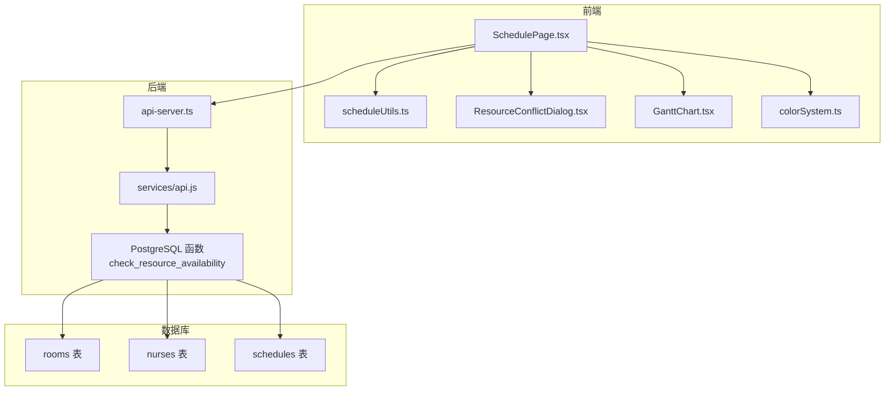
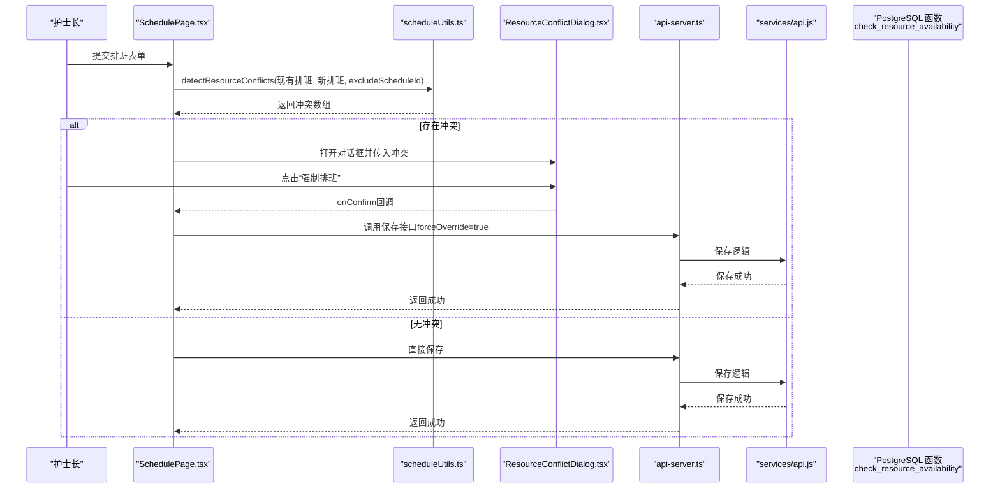
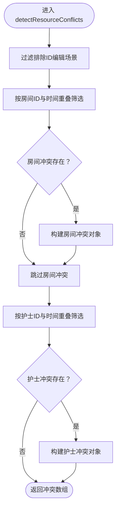
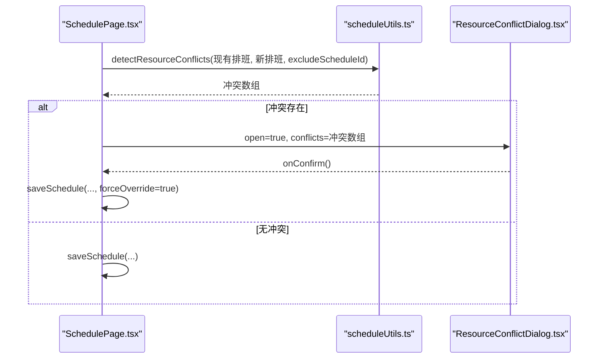
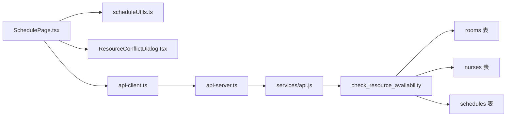

# 资源冲突检测

<cite>
**本文引用的文件**
- [src/utils/scheduleUtils.ts](file://src/utils/scheduleUtils.ts)
- [src/components/appointment/ResourceConflictDialog.tsx](file://src/components/appointment/ResourceConflictDialog.tsx)
- [src/pages/head-nurse/SchedulePage.tsx](file://src/pages/head-nurse/SchedulePage.tsx)
- [src/types/types.ts](file://src/types/types.ts)
- [supabase/migrations/00001_create_bio_appointment_schema.sql](file://supabase/migrations/00001_create_bio_appointment_schema.sql)
- [supabase/migrations/00002_create_resource_tables.sql](file://supabase/migrations/00002_create_resource_tables.sql)
- [supabase/migrations/00003_fix_schedules_foreign_keys.sql](file://supabase/migrations/00003_fix_schedules_foreign_keys.sql)
- [server/src/services/api.js](file://server/src/services/api.js)
- [server/api-server.ts](file://server/api-server.ts)
- [src/services/api-client.ts](file://src/services/api-client.ts)
- [src/utils/colorSystem.ts](file://src/utils/colorSystem.ts)
- [src/components/appointment/GanttChart.tsx](file://src/components/appointment/GanttChart.tsx)
</cite>

## 目录
1. [简介](#简介)
2. [项目结构](#项目结构)
3. [核心组件](#核心组件)
4. [架构总览](#架构总览)
5. [详细组件分析](#详细组件分析)
6. [依赖分析](#依赖分析)
7. [性能考虑](#性能考虑)
8. [故障排除指南](#故障排除指南)
9. [结论](#结论)

## 简介
本文件系统性记录Bio-Appointment系统的“资源冲突检测”机制，重点覆盖以下方面：
- 前端即时检测流程：护士长在排班页面配置排班时，如何调用前端工具函数检测房间与护士在时间维度上的重叠冲突。
- 冲突数据模型：ResourceConflict的结构设计与字段含义。
- 可视化呈现：如何将检测结果传递给对话框组件进行结构化展示，并通过视觉警示提升用户体验。
- 双重校验策略：前端JavaScript即时检测与后端PostgreSQL函数的数据一致性保障。
- “强制排班”机制：在用户确认风险后，允许覆盖冲突并继续提交。
- 编辑场景的自冲突规避：excludeScheduleId参数在编辑现有排班时避免自冲突。
- 视觉设计：通过颜色系统与对话框警示，形成清晰的视觉警告与结构化信息展示。

## 项目结构
围绕资源冲突检测的关键文件组织如下：
- 前端检测与呈现
  - 检测工具：src/utils/scheduleUtils.ts
  - 对话框组件：src/components/appointment/ResourceConflictDialog.tsx
  - 排班页面入口：src/pages/head-nurse/SchedulePage.tsx
  - 类型定义：src/types/types.ts
  - 颜色系统：src/utils/colorSystem.ts
  - 甘特图组件：src/components/appointment/GanttChart.tsx
- 后端资源可用性校验
  - PostgreSQL函数：supabase/migrations/00001_create_bio_appointment_schema.sql
  - 服务层API：server/src/services/api.js
  - API路由：server/api-server.ts
  - 前端API客户端：src/services/api-client.ts
- 数据库资源表
  - 资源表：supabase/migrations/00002_create_resource_tables.sql
  - 外键修复：supabase/migrations/00003_fix_schedules_foreign_keys.sql

图表来源
- [src/pages/head-nurse/SchedulePage.tsx](file://src/pages/head-nurse/SchedulePage.tsx#L167-L238)
- [src/utils/scheduleUtils.ts](file://src/utils/scheduleUtils.ts#L36-L111)
- [src/components/appointment/ResourceConflictDialog.tsx](file://src/components/appointment/ResourceConflictDialog.tsx#L1-L93)
- [src/services/api-client.ts](file://src/services/api-client.ts#L288-L291)
- [server/api-server.ts](file://server/api-server.ts#L450-L475)
- [server/src/services/api.js](file://server/src/services/api.js#L288-L351)
- [supabase/migrations/00001_create_bio_appointment_schema.sql](file://supabase/migrations/00001_create_bio_appointment_schema.sql#L238-L281)
- [supabase/migrations/00002_create_resource_tables.sql](file://supabase/migrations/00002_create_resource_tables.sql#L1-L182)
- [supabase/migrations/00003_fix_schedules_foreign_keys.sql](file://supabase/migrations/00003_fix_schedules_foreign_keys.sql#L1-L67)

章节来源
- [src/pages/head-nurse/SchedulePage.tsx](file://src/pages/head-nurse/SchedulePage.tsx#L1-L200)
- [src/utils/scheduleUtils.ts](file://src/utils/scheduleUtils.ts#L1-L112)
- [src/components/appointment/ResourceConflictDialog.tsx](file://src/components/appointment/ResourceConflictDialog.tsx#L1-L93)
- [server/api-server.ts](file://server/api-server.ts#L450-L475)
- [server/src/services/api.js](file://server/src/services/api.js#L288-L351)
- [supabase/migrations/00001_create_bio_appointment_schema.sql](file://supabase/migrations/00001_create_bio_appointment_schema.sql#L238-L281)
- [supabase/migrations/00002_create_resource_tables.sql](file://supabase/migrations/00002_create_resource_tables.sql#L1-L182)
- [supabase/migrations/00003_fix_schedules_foreign_keys.sql](file://supabase/migrations/00003_fix_schedules_foreign_keys.sql#L1-L67)

## 核心组件
- 前端检测工具：detectResourceConflicts与isTimeOverlap，负责在本地对现有排班与新排班进行房间与护士维度的时间重叠检测。
- 冲突对话框：ResourceConflictDialog，负责将冲突以结构化列表呈现，并提供“强制排班”确认入口。
- 排班页面：SchedulePage，负责触发检测、接收结果、控制对话框开闭、执行保存逻辑。
- 后端校验：check_resource_availability（PostgreSQL函数），用于数据一致性保障；同时提供资源可用性查询接口。
- 类型定义：ResourceConflict、ScheduleWithDetails等，确保前后端数据契约一致。
- 视觉设计：颜色系统与甘特图，提供直观的颜色编码与冲突提示。

章节来源
- [src/utils/scheduleUtils.ts](file://src/utils/scheduleUtils.ts#L1-L112)
- [src/components/appointment/ResourceConflictDialog.tsx](file://src/components/appointment/ResourceConflictDialog.tsx#L1-L93)
- [src/pages/head-nurse/SchedulePage.tsx](file://src/pages/head-nurse/SchedulePage.tsx#L167-L238)
- [src/types/types.ts](file://src/types/types.ts#L139-L183)
- [supabase/migrations/00001_create_bio_appointment_schema.sql](file://supabase/migrations/00001_create_bio_appointment_schema.sql#L238-L281)
- [src/utils/colorSystem.ts](file://src/utils/colorSystem.ts#L1-L140)
- [src/components/appointment/GanttChart.tsx](file://src/components/appointment/GanttChart.tsx)

## 架构总览
前端即时检测与后端一致性校验的双重策略：
- 前端即时检测：用户在排班页面填写时间、房间、护士后，立即调用detectResourceConflicts进行本地检测，若发现冲突则弹出ResourceConflictDialog，用户可选择“取消排班”或“强制排班”。
- 后端一致性校验：后端提供check_resource_availability函数，基于数据库当前状态进行严格校验，确保跨并发与事务边界的一致性。

图表来源
- [src/pages/head-nurse/SchedulePage.tsx](file://src/pages/head-nurse/SchedulePage.tsx#L167-L238)
- [src/utils/scheduleUtils.ts](file://src/utils/scheduleUtils.ts#L36-L111)
- [src/components/appointment/ResourceConflictDialog.tsx](file://src/components/appointment/ResourceConflictDialog.tsx#L1-L93)
- [server/api-server.ts](file://server/api-server.ts#L450-L475)
- [server/src/services/api.js](file://server/src/services/api.js#L288-L351)
- [supabase/migrations/00001_create_bio_appointment_schema.sql](file://supabase/migrations/00001_create_bio_appointment_schema.sql#L238-L281)

## 详细组件分析

### 冲突检测流程与算法
- 输入：现有排班集合、新排班（含开始/结束时间、房间ID、护士ID）、可选的排除ID（编辑场景避免自冲突）。
- 步骤：
  1) 过滤掉正在编辑的排班（排除自身）。
  2) 分别按房间维度与护士维度过滤出与新排班时间重叠的记录。
  3) 将冲突按类型（房间/护士）聚合，输出ResourceConflict数组。
- 时间重叠判断：将字符串时间转换为分钟数，采用区间重叠判定逻辑。

图表来源
- [src/utils/scheduleUtils.ts](file://src/utils/scheduleUtils.ts#L36-L111)

章节来源
- [src/utils/scheduleUtils.ts](file://src/utils/scheduleUtils.ts#L1-L112)

### 冲突数据模型：ResourceConflict
- 字段说明：
  - type：冲突类型，'room' 或 'nurse'
  - resourceId：资源ID（房间或护士）
  - resourceName：资源名称
  - conflictingSchedules：冲突记录数组，包含被占用的排班信息（ID、客户名、起止时间、服务名）
- 类型定义参考：ScheduleWithDetails与Resource接口，确保字段映射正确。

章节来源
- [src/utils/scheduleUtils.ts](file://src/utils/scheduleUtils.ts#L3-L14)
- [src/types/types.ts](file://src/types/types.ts#L139-L183)

### 前端排班页面的检测与交互
- 表单提交时调用detectResourceConflicts，若存在冲突则：
  - 设置对话框状态与冲突数据
  - 打开ResourceConflictDialog
  - 用户确认后，调用saveSchedule并传入forceOverride=true
- 编辑现有排班时，将selectedSchedule.id作为excludeScheduleId传入，避免自冲突。

图表来源
- [src/pages/head-nurse/SchedulePage.tsx](file://src/pages/head-nurse/SchedulePage.tsx#L167-L238)
- [src/utils/scheduleUtils.ts](file://src/utils/scheduleUtils.ts#L36-L111)
- [src/components/appointment/ResourceConflictDialog.tsx](file://src/components/appointment/ResourceConflictDialog.tsx#L1-L93)

章节来源
- [src/pages/head-nurse/SchedulePage.tsx](file://src/pages/head-nurse/SchedulePage.tsx#L167-L238)

### 对话框组件：ResourceConflictDialog
- 结构化展示：
  - 标题与警示图标
  - 按资源类型分组的冲突列表（房间/护士）
  - 每条冲突包含客户名、服务名、时间段
  - 一个醒目的琥珀色提示，强调“强制排班将导致资源重叠使用”的风险
- 交互：
  - 取消：关闭对话框并清空状态
  - 强制排班：触发onConfirm回调，由父组件执行保存（forceOverride=true）

章节来源
- [src/components/appointment/ResourceConflictDialog.tsx](file://src/components/appointment/ResourceConflictDialog.tsx#L1-L93)

### 双重校验策略：前端即时检测 vs 后端一致性校验
- 前端即时检测（JavaScript）：
  - 优点：即时反馈，用户体验流畅
  - 场景：编辑/新建排班时的本地预检
- 后端一致性校验（PostgreSQL函数）：
  - 函数check_resource_availability在数据库层面进行严格校验，排除草稿状态，支持排除指定排班ID
  - 作用：确保并发与事务边界下的数据一致性，防止脏写

章节来源
- [supabase/migrations/00001_create_bio_appointment_schema.sql](file://supabase/migrations/00001_create_bio_appointment_schema.sql#L238-L281)
- [server/src/services/api.js](file://server/src/services/api.js#L288-L351)
- [server/api-server.ts](file://server/api-server.ts#L450-L475)

### “强制排班”功能与风险提示
- 用户在对话框中确认风险后，前端将forceOverride标志传入保存流程，后端在数据库层面仍会进行严格校验（函数check_resource_availability），确保最终一致性。
- 对话框中的琥珀色提示明确告知“强制排班将导致资源重叠使用”，要求线下已协调好安排，降低误操作风险。

章节来源
- [src/pages/head-nurse/SchedulePage.tsx](file://src/pages/head-nurse/SchedulePage.tsx#L239-L248)
- [src/components/appointment/ResourceConflictDialog.tsx](file://src/components/appointment/ResourceConflictDialog.tsx#L73-L88)

### 编辑场景的自冲突规避：excludeScheduleId
- 在编辑现有排班时，将selectedSchedule.id作为excludeScheduleId传入detectResourceConflicts，使检测忽略自身，避免“编辑自己即产生自冲突”的误报。
- 后端函数check_resource_availability同样支持p_exclude_schedule_id参数，确保数据库层面也排除自身。

章节来源
- [src/utils/scheduleUtils.ts](file://src/utils/scheduleUtils.ts#L45-L52)
- [supabase/migrations/00001_create_bio_appointment_schema.sql](file://supabase/migrations/00001_create_bio_appointment_schema.sql#L238-L281)

### 视觉警告与结构化信息展示
- 资源颜色系统：护士使用暖色调、房间使用冷色调，甘特图中采用护士-房间组合渐变，便于快速识别与区分。
- 冲突对话框采用警示图标与琥珀色背景，突出风险提示。
- 冲突列表以嵌套边框与时间片段形式呈现，结构清晰，便于护士长快速核对。

章节来源
- [src/utils/colorSystem.ts](file://src/utils/colorSystem.ts#L1-L140)
- [src/components/appointment/GanttChart.tsx](file://src/components/appointment/GanttChart.tsx)
- [src/components/appointment/ResourceConflictDialog.tsx](file://src/components/appointment/ResourceConflictDialog.tsx#L40-L90)

## 依赖分析
- 前端依赖
  - SchedulePage依赖scheduleUtils进行冲突检测，依赖ResourceConflictDialog进行可视化呈现。
  - 依赖api-client调用后端保存接口。
- 后端依赖
  - api-server路由提供资源可用性查询与排班保存。
  - services/api.js封装数据库查询与保存逻辑。
  - PostgreSQL函数check_resource_availability提供一致性校验。
- 数据库依赖
  - rooms、nurses、schedules表，外键约束指向rooms与nurses。

图表来源
- [src/pages/head-nurse/SchedulePage.tsx](file://src/pages/head-nurse/SchedulePage.tsx#L167-L238)
- [src/utils/scheduleUtils.ts](file://src/utils/scheduleUtils.ts#L36-L111)
- [src/components/appointment/ResourceConflictDialog.tsx](file://src/components/appointment/ResourceConflictDialog.tsx#L1-L93)
- [src/services/api-client.ts](file://src/services/api-client.ts#L288-L291)
- [server/api-server.ts](file://server/api-server.ts#L450-L475)
- [server/src/services/api.js](file://server/src/services/api.js#L288-L351)
- [supabase/migrations/00001_create_bio_appointment_schema.sql](file://supabase/migrations/00001_create_bio_appointment_schema.sql#L238-L281)
- [supabase/migrations/00002_create_resource_tables.sql](file://supabase/migrations/00002_create_resource_tables.sql#L1-L182)
- [supabase/migrations/00003_fix_schedules_foreign_keys.sql](file://supabase/migrations/00003_fix_schedules_foreign_keys.sql#L1-L67)

章节来源
- [src/services/api-client.ts](file://src/services/api-client.ts#L288-L291)
- [server/api-server.ts](file://server/api-server.ts#L450-L475)
- [server/src/services/api.js](file://server/src/services/api.js#L288-L351)
- [supabase/migrations/00001_create_bio_appointment_schema.sql](file://supabase/migrations/00001_create_bio_appointment_schema.sql#L238-L281)
- [supabase/migrations/00002_create_resource_tables.sql](file://supabase/migrations/00002_create_resource_tables.sql#L1-L182)
- [supabase/migrations/00003_fix_schedules_foreign_keys.sql](file://supabase/migrations/00003_fix_schedules_foreign_keys.sql#L1-L67)

## 性能考虑
- 前端检测复杂度：O(n)，其中n为现有排班数量；对编辑场景使用excludeScheduleId过滤，进一步降低比较次数。
- 后端校验复杂度：依赖数据库索引与OVERLAPS运算，建议在scheduled_date、scheduled_time_start、scheduled_time_end上建立合适索引以提升查询性能。
- 前端渲染：对话框列表按冲突类型分组，避免重复渲染；颜色系统与甘特图采用渐变与CSS，避免额外图片资源。

## 故障排除指南
- 冲突检测未生效
  - 检查是否传入了正确的excludeScheduleId（编辑场景）。
  - 确认时间格式与字符串比较逻辑一致。
- 对话框未显示
  - 确认冲突数组非空且已设置open=true。
  - 检查onConfirm/onCancel回调绑定。
- 后端保存失败
  - 检查后端路由参数（date、time_start、time_end）是否齐全。
  - 确认数据库外键约束与表结构一致（rooms、nurses、schedules）。
- 资源不可用
  - 确认资源表状态字段与查询条件匹配（例如is_available）。

章节来源
- [src/pages/head-nurse/SchedulePage.tsx](file://src/pages/head-nurse/SchedulePage.tsx#L167-L238)
- [src/components/appointment/ResourceConflictDialog.tsx](file://src/components/appointment/ResourceConflictDialog.tsx#L1-L93)
- [server/api-server.ts](file://server/api-server.ts#L450-L475)
- [supabase/migrations/00002_create_resource_tables.sql](file://supabase/migrations/00002_create_resource_tables.sql#L1-L182)
- [supabase/migrations/00003_fix_schedules_foreign_keys.sql](file://supabase/migrations/00003_fix_schedules_foreign_keys.sql#L1-L67)

## 结论
本系统通过“前端即时检测 + 后端一致性校验”的双重策略，既保证了用户操作的即时反馈，又确保了数据层面的强一致。ResourceConflict模型与ResourceConflictDialog提供了清晰的结构化展示与风险提示，结合颜色系统与甘特图，显著提升了护士长在复杂排班场景下的识别效率与准确性。excludeScheduleId参数在编辑场景下有效避免自冲突，进一步增强了用户体验与安全性。