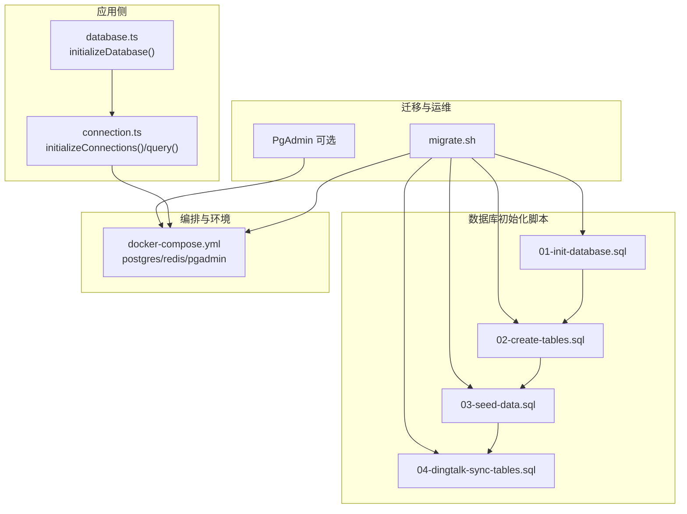
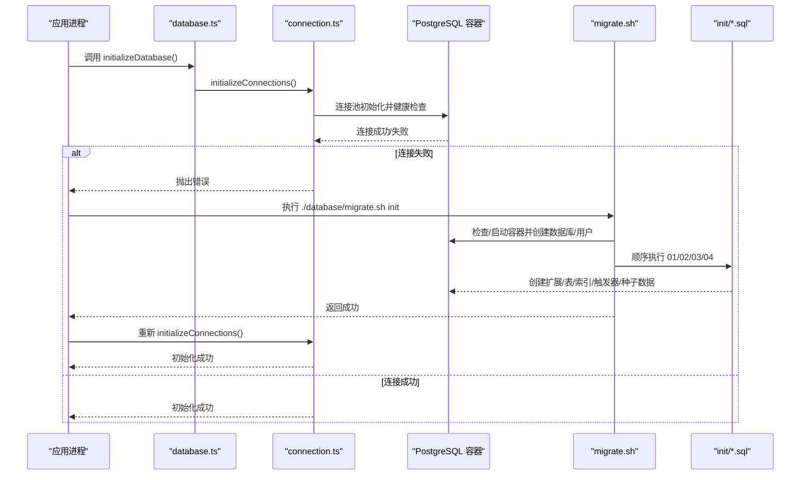
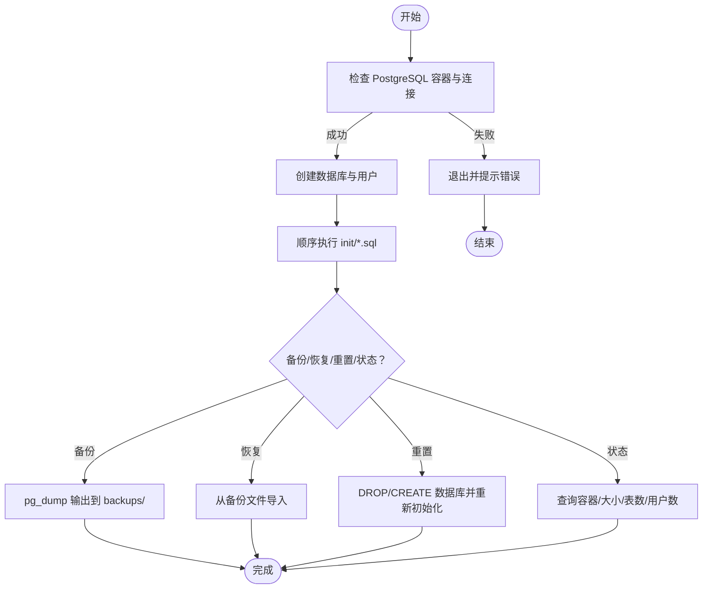
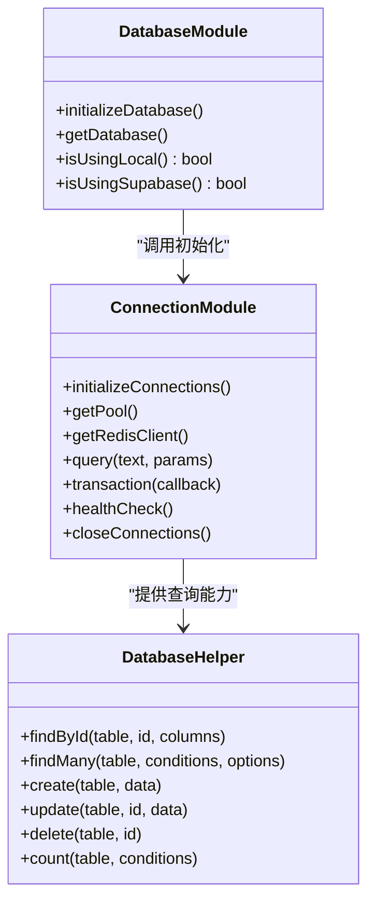
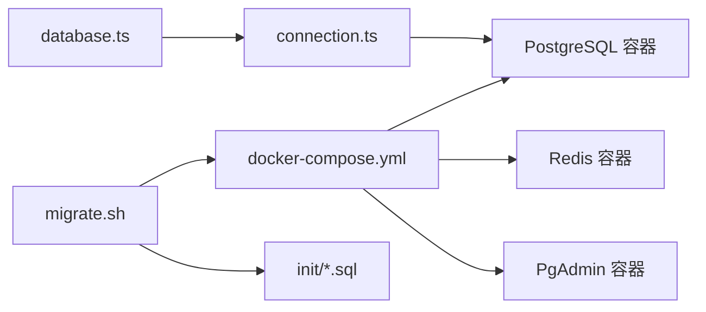

# 数据库初始化与迁移

<cite>
**本文引用的文件**
- [database/init/01-init-database.sql](file://database/init/01-init-database.sql)
- [database/init/02-create-tables.sql](file://database/init/02-create-tables.sql)
- [database/init/03-seed-data.sql](file://database/init/03-seed-data.sql)
- [database/init/04-dingtalk-sync-tables.sql](file://database/init/04-dingtalk-sync-tables.sql)
- [database/migrate.sh](file://database/migrate.sh)
- [src/db/database.ts](file://src/db/database.ts)
- [src/db/connection.ts](file://src/db/connection.ts)
- [docker-compose.yml](file://docker-compose.yml)
- [DEPLOYMENT_GUIDE.md](file://DEPLOYMENT_GUIDE.md)
- [scripts/migrate-from-supabase.ts](file://scripts/migrate-from-supabase.ts)
- [supabase/migrations/00010_create_dingtalk_sync_tables.sql](file://supabase/migrations/00010_create_dingtalk_sync_tables.sql)
- [supabase/migrations/00011_update_dingtalk_sync_tables.sql](file://supabase/migrations/00011_update_dingtalk_sync_tables.sql)
</cite>

## 目录
1. [简介](#简介)
2. [项目结构](#项目结构)
3. [核心组件](#核心组件)
4. [架构总览](#架构总览)
5. [详细组件分析](#详细组件分析)
6. [依赖关系分析](#依赖关系分析)
7. [性能考量](#性能考量)
8. [故障排除指南](#故障排除指南)
9. [结论](#结论)
10. [附录](#附录)

## 简介
本指南面向从零开始搭建与维护 Bio-Appointment 本地 PostgreSQL 数据库的工程师与运维人员。内容覆盖：
- 基于 init 目录 SQL 脚本的数据库初始化流程（创建扩展、自定义枚举、表结构、索引、审计触发器与种子数据）
- migrate.sh 脚本的执行逻辑、命令集与错误处理机制
- 应用启动时如何通过 initializeDatabase 与连接池自动检测并初始化数据库环境
- 从零到一的完整操作步骤（Docker 环境准备、脚本执行顺序、常见问题排查）
- 结合 DEPLOYMENT_GUIDE.md 的故障排除方案

## 项目结构
围绕数据库初始化与迁移的关键文件组织如下：
- database/init：按顺序执行的初始化 SQL 脚本集合
- database/migrate.sh：数据库迁移与管理脚本（包含初始化、备份、恢复、重置、状态查询）
- src/db：应用侧数据库抽象与连接池封装
- docker-compose.yml：本地 PostgreSQL/Redis/PgAdmin 服务编排
- DEPLOYMENT_GUIDE.md：部署与运维指南（含故障排除）
- scripts/migrate-from-supabase.ts：从 Supabase 迁移数据到本地数据库的脚本
- supabase/migrations：Supabase 钉钉同步相关迁移（用于理解目标结构）

图表来源
- [database/migrate.sh](file://database/migrate.sh#L1-L233)
- [database/init/01-init-database.sql](file://database/init/01-init-database.sql#L1-L112)
- [database/init/02-create-tables.sql](file://database/init/02-create-tables.sql#L1-L274)
- [database/init/03-seed-data.sql](file://database/init/03-seed-data.sql#L1-L77)
- [database/init/04-dingtalk-sync-tables.sql](file://database/init/04-dingtalk-sync-tables.sql#L1-L131)
- [src/db/database.ts](file://src/db/database.ts#L1-L43)
- [src/db/connection.ts](file://src/db/connection.ts#L1-L324)
- [docker-compose.yml](file://docker-compose.yml#L1-L75)

章节来源
- [database/migrate.sh](file://database/migrate.sh#L1-L233)
- [database/init/01-init-database.sql](file://database/init/01-init-database.sql#L1-L112)
- [database/init/02-create-tables.sql](file://database/init/02-create-tables.sql#L1-L274)
- [database/init/03-seed-data.sql](file://database/init/03-seed-data.sql#L1-L77)
- [database/init/04-dingtalk-sync-tables.sql](file://database/init/04-dingtalk-sync-tables.sql#L1-L131)
- [src/db/database.ts](file://src/db/database.ts#L1-L43)
- [src/db/connection.ts](file://src/db/connection.ts#L1-L324)
- [docker-compose.yml](file://docker-compose.yml#L1-L75)

## 核心组件
- 初始化 SQL 脚本（按顺序执行）
  - 01-init-database.sql：启用扩展、创建自定义枚举、审计日志表与触发器、授予 app_user 权限
  - 02-create-tables.sql：核心业务表（profiles、services、resources、appointments、schedules、task_executions、钉钉相关表）、索引、各表更新时间触发器、审计触发器
  - 03-seed-data.sql：默认服务、资源、用户、钉钉部门与系统配置种子数据
  - 04-dingtalk-sync-tables.sql：钉钉同步配置、日志与部门映射表（兼容 Supabase 迁移结构）
- 迁移脚本 migrate.sh：检查 PostgreSQL、创建数据库与用户、顺序执行初始化脚本、备份/恢复/重置/状态查询
- 应用侧 database.ts 与 connection.ts：在应用启动时初始化连接池并进行健康检查
- docker-compose.yml：本地 PostgreSQL/Redis/PgAdmin 编排与端口映射
- DEPLOYMENT_GUIDE.md：部署与运维指南（含故障排除）
- scripts/migrate-from-supabase.ts：从 Supabase 迁移数据到本地数据库

章节来源
- [database/init/01-init-database.sql](file://database/init/01-init-database.sql#L1-L112)
- [database/init/02-create-tables.sql](file://database/init/02-create-tables.sql#L1-L274)
- [database/init/03-seed-data.sql](file://database/init/03-seed-data.sql#L1-L77)
- [database/init/04-dingtalk-sync-tables.sql](file://database/init/04-dingtalk-sync-tables.sql#L1-L131)
- [database/migrate.sh](file://database/migrate.sh#L1-L233)
- [src/db/database.ts](file://src/db/database.ts#L1-L43)
- [src/db/connection.ts](file://src/db/connection.ts#L1-L324)
- [docker-compose.yml](file://docker-compose.yml#L1-L75)
- [DEPLOYMENT_GUIDE.md](file://DEPLOYMENT_GUIDE.md#L1-L339)
- [scripts/migrate-from-supabase.ts](file://scripts/migrate-from-supabase.ts#L1-L355)
- [supabase/migrations/00010_create_dingtalk_sync_tables.sql](file://supabase/migrations/00010_create_dingtalk_sync_tables.sql#L1-L189)
- [supabase/migrations/00011_update_dingtalk_sync_tables.sql](file://supabase/migrations/00011_update_dingtalk_sync_tables.sql#L1-L169)

## 架构总览
应用启动时的数据库初始化与连接流程如下：

图表来源
- [src/db/database.ts](file://src/db/database.ts#L1-L43)
- [src/db/connection.ts](file://src/db/connection.ts#L1-L324)
- [database/migrate.sh](file://database/migrate.sh#L1-L233)
- [database/init/01-init-database.sql](file://database/init/01-init-database.sql#L1-L112)
- [database/init/02-create-tables.sql](file://database/init/02-create-tables.sql#L1-L274)
- [database/init/03-seed-data.sql](file://database/init/03-seed-data.sql#L1-L77)
- [database/init/04-dingtalk-sync-tables.sql](file://database/init/04-dingtalk-sync-tables.sql#L1-L131)

## 详细组件分析

### 初始化 SQL 脚本（按顺序）
- 01-init-database.sql
  - 启用 UUID、pgcrypto、btree_gin、btree_gist 扩展
  - 设置时区为 UTC
  - 定义多类自定义枚举（用户角色、状态、服务分类、资源类型、预约状态、医生状态、排班状态、任务执行状态）
  - 创建审计日志表与审计触发器函数
  - 授予 app_user 对 public 模式下表、序列、函数的权限
- 02-create-tables.sql
  - 定义核心业务表：profiles、services、resources、appointments、schedules、task_executions、钉钉用户/部门/通知/同步日志等
  - 为各表创建复合索引以提升查询性能
  - 为每张表注册更新时间触发器，统一记录 updated_at
  - 为关键表注册审计触发器，记录增删改操作
- 03-seed-data.sql
  - 插入默认服务、资源、系统默认用户（含超级管理员）
  - 插入示例钉钉部门层级
  - 插入系统配置表与默认配置项
- 04-dingtalk-sync-tables.sql
  - 兼容 Supabase 迁移结构，创建钉钉同步配置、日志与部门映射表
  - 定义同步状态/类型/冲突策略枚举
  - 提供统计 RPC 函数与索引

章节来源
- [database/init/01-init-database.sql](file://database/init/01-init-database.sql#L1-L112)
- [database/init/02-create-tables.sql](file://database/init/02-create-tables.sql#L1-L274)
- [database/init/03-seed-data.sql](file://database/init/03-seed-data.sql#L1-L77)
- [database/init/04-dingtalk-sync-tables.sql](file://database/init/04-dingtalk-sync-tables.sql#L1-L131)
- [supabase/migrations/00010_create_dingtalk_sync_tables.sql](file://supabase/migrations/00010_create_dingtalk_sync_tables.sql#L1-L189)
- [supabase/migrations/00011_update_dingtalk_sync_tables.sql](file://supabase/migrations/00011_update_dingtalk_sync_tables.sql#L1-L169)

### migrate.sh 脚本执行逻辑与错误处理
- 功能概览
  - 初始化：检查 PostgreSQL、创建数据库与用户、顺序执行 init/*.sql
  - 备份：导出当前数据库到 backups/ 目录
  - 恢复：从指定备份文件恢复数据库
  - 重置：删除并重建数据库，再执行初始化脚本
  - 状态：显示容器运行状态、数据库大小、表数量、用户数量
- 关键流程
  - check_postgres：检测容器是否运行，若未运行则通过 docker-compose 启动；随后使用 pg_isready 检测连接
  - create_database：创建数据库与用户并授权
  - run_init_scripts：遍历 database/init/*.sql 并逐个执行
  - 备份/恢复/重置均包含交互确认与错误分支
- 错误处理
  - set -e 使脚本在任一步失败时退出
  - 对容器状态、连接性、文件存在性进行校验
  - 备份/恢复/重置均打印彩色状态与错误提示

图表来源
- [database/migrate.sh](file://database/migrate.sh#L1-L233)

章节来源
- [database/migrate.sh](file://database/migrate.sh#L1-L233)

### 应用启动时的数据库初始化
- database.ts
  - initializeDatabase：根据配置选择本地数据库类型并初始化连接
  - getDatabase/isUsingLocal/isUsingSupabase：提供数据库客户端与类型判断
- connection.ts
  - initializeConnections：创建 PostgreSQL 连接池并进行健康检查
  - query/transaction：提供查询与事务封装
  - healthCheck/closeConnections：健康检查与连接关闭
  - DatabaseHelper：通用 CRUD 辅助方法

图表来源
- [src/db/database.ts](file://src/db/database.ts#L1-L43)
- [src/db/connection.ts](file://src/db/connection.ts#L1-L324)

章节来源
- [src/db/database.ts](file://src/db/database.ts#L1-L43)
- [src/db/connection.ts](file://src/db/connection.ts#L1-L324)

### 从 Supabase 迁移数据
- 脚本职责
  - 读取 Supabase 配置，导出指定表数据
  - 获取本地表列信息，过滤并转换数据后批量导入
  - 统计迁移结果并生成迁移报告
  - 迁移前后创建备份、清理 Redis 缓存
- 表迁移顺序
  - profiles → services → resources → appointments → schedules → task_executions → dingtalk_departments → dingtalk_users → dingtalk_sync_logs → dingtalk_notifications
- 验证
  - 对比本地与 Supabase 各表记录数，输出差异

章节来源
- [scripts/migrate-from-supabase.ts](file://scripts/migrate-from-supabase.ts#L1-L355)

## 依赖关系分析
- docker-compose.yml
  - postgres 服务：端口映射 5437:5432，挂载 init 脚本目录，健康检查
  - redis 服务：端口映射 6379:6379，持久化
  - pgadmin 服务：可选，便于可视化管理
- migrate.sh 依赖 docker-compose 环境与 init 脚本
- 应用侧依赖 connection.ts 的连接池与查询封装

图表来源
- [docker-compose.yml](file://docker-compose.yml#L1-L75)
- [database/migrate.sh](file://database/migrate.sh#L1-L233)
- [database/init/01-init-database.sql](file://database/init/01-init-database.sql#L1-L112)
- [database/init/02-create-tables.sql](file://database/init/02-create-tables.sql#L1-L274)
- [database/init/03-seed-data.sql](file://database/init/03-seed-data.sql#L1-L77)
- [database/init/04-dingtalk-sync-tables.sql](file://database/init/04-dingtalk-sync-tables.sql#L1-L131)
- [src/db/connection.ts](file://src/db/connection.ts#L1-L324)
- [src/db/database.ts](file://src/db/database.ts#L1-L43)

章节来源
- [docker-compose.yml](file://docker-compose.yml#L1-L75)
- [database/migrate.sh](file://database/migrate.sh#L1-L233)

## 性能考量
- 索引设计：各表均建立常用查询字段索引，有助于提升查询性能
- 触发器：统一的更新时间与审计触发器，便于追踪变更但可能带来写入开销
- 连接池：默认最大连接数、空闲超时与连接超时参数可根据负载调整
- 缓存：Redis 用于会话与缓存，健康检查失败时应用仍可运行但无缓存

章节来源
- [database/init/02-create-tables.sql](file://database/init/02-create-tables.sql#L1-L274)
- [src/db/connection.ts](file://src/db/connection.ts#L1-L324)

## 故障排除指南
- 数据库连接失败
  - 检查容器状态与网络连通性
  - 确认端口映射与环境变量
- 端口冲突
  - 检查宿主机端口占用并修改 docker-compose.yml 中的端口映射
- 权限问题
  - 确保 migrate.sh 可执行
  - 检查数据库用户权限与密码
- 内存不足
  - 清理 Docker 未使用资源或调整容器资源限制
- Supabase 迁移失败
  - 检查 Supabase URL/密钥环境变量
  - 查看迁移报告与错误日志

章节来源
- [DEPLOYMENT_GUIDE.md](file://DEPLOYMENT_GUIDE.md#L234-L339)
- [database/migrate.sh](file://database/migrate.sh#L1-L233)
- [scripts/migrate-from-supabase.ts](file://scripts/migrate-from-supabase.ts#L1-L355)

## 结论
通过 init 目录的顺序化 SQL 脚本与 migrate.sh 的自动化运维工具，配合应用侧的连接池初始化与健康检查，Bio-Appointment 能够在本地快速完成数据库初始化与日常运维。结合 DEPLOYMENT_GUIDE.md 的部署与故障排除方案，可高效完成从零到一的数据库搭建与维护。

## 附录

### 从零开始搭建数据库的完整操作步骤
- 启动数据库服务
  - 启动 PostgreSQL 与 Redis：docker-compose up -d
  - 检查服务状态：docker-compose ps
- 初始化数据库
  - 执行初始化脚本：./database/migrate.sh init
- 配置环境变量
  - 复制并编辑 .env.local，设置数据库连接参数（DATABASE_TYPE、POSTGRES_*）
- 安装依赖并启动应用
  - 安装依赖：npm install
  - 启动开发服务器：npm run dev -- --host 127.0.0.1
- 可选：使用 PgAdmin
  - 启动 PgAdmin：docker-compose --profile admin up -d pgadmin
  - 访问 http://localhost:5050

章节来源
- [DEPLOYMENT_GUIDE.md](file://DEPLOYMENT_GUIDE.md#L1-L120)
- [docker-compose.yml](file://docker-compose.yml#L1-L75)
- [database/migrate.sh](file://database/migrate.sh#L1-L233)

### 脚本执行顺序与依赖
- migrate.sh 顺序执行 init/01-init-database.sql → 02-create-tables.sql → 03-seed-data.sql → 04-dingtalk-sync-tables.sql
- Supabase 迁移脚本顺序：先创建后更新，确保枚举与表结构一致

章节来源
- [database/migrate.sh](file://database/migrate.sh#L67-L79)
- [database/init/01-init-database.sql](file://database/init/01-init-database.sql#L1-L112)
- [database/init/02-create-tables.sql](file://database/init/02-create-tables.sql#L1-L274)
- [database/init/03-seed-data.sql](file://database/init/03-seed-data.sql#L1-L77)
- [database/init/04-dingtalk-sync-tables.sql](file://database/init/04-dingtalk-sync-tables.sql#L1-L131)
- [supabase/migrations/00010_create_dingtalk_sync_tables.sql](file://supabase/migrations/00010_create_dingtalk_sync_tables.sql#L1-L189)
- [supabase/migrations/00011_update_dingtalk_sync_tables.sql](file://supabase/migrations/00011_update_dingtalk_sync_tables.sql#L1-L169)