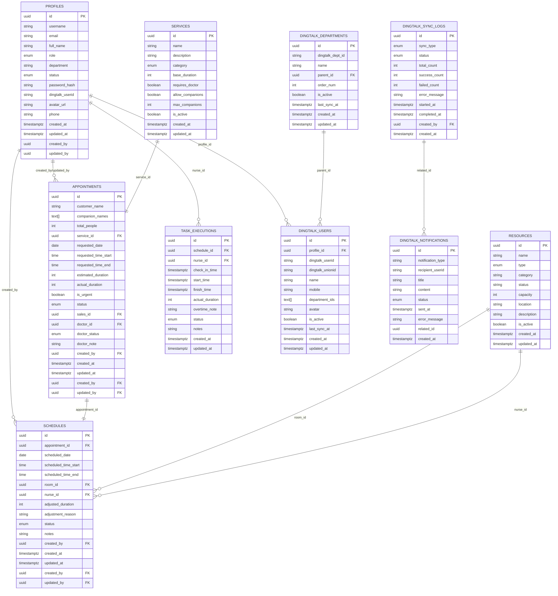
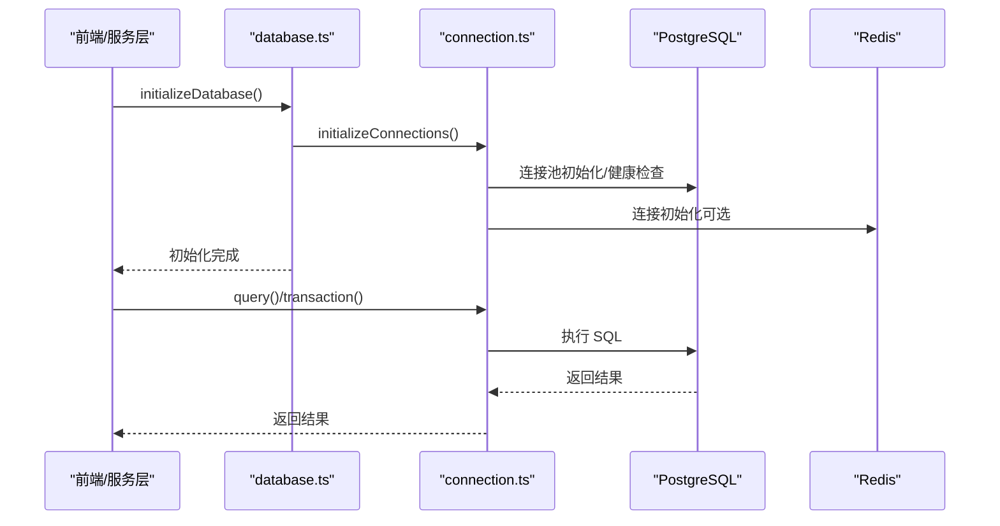
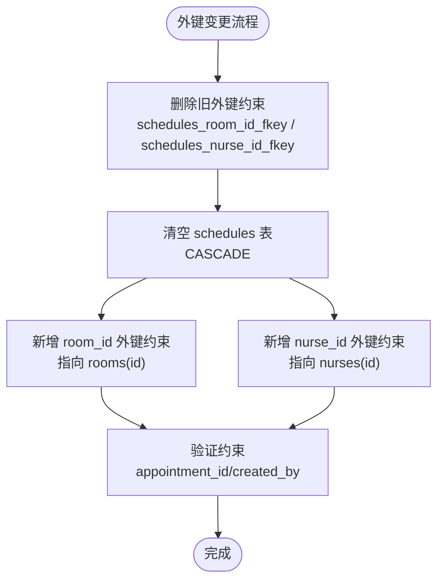

# 数据库架构

<cite>
**本文引用的文件**
- [00001_create_bio_appointment_schema.sql](file://supabase/migrations/00001_create_bio_appointment_schema.sql)
- [00002_create_resource_tables.sql](file://supabase/migrations/00002_create_resource_tables.sql)
- [00003_fix_schedules_foreign_keys.sql](file://supabase/migrations/00003_fix_schedules_foreign_keys.sql)
- [00004_create_user_profiles_and_auth.sql](file://supabase/migrations/00004_create_user_profiles_and_auth.sql)
- [00008_add_rls_policies_for_role_based_access.sql](file://supabase/migrations/00008_add_rls_policies_for_role_based_access.sql)
- [00009_create_dingtalk_integration_tables.sql](file://supabase/migrations/00009_create_dingtalk_integration_tables.sql)
- [00010_create_dingtalk_sync_tables.sql](file://supabase/migrations/00010_create_dingtalk_sync_tables.sql)
- [01-init-database.sql](file://database/init/01-init-database.sql)
- [02-create-tables.sql](file://database/init/02-create-tables.sql)
- [03-seed-data.sql](file://database/init/03-seed-data.sql)
- [04-dingtalk-sync-tables.sql](file://database/init/04-dingtalk-sync-tables.sql)
- [migrate.sh](file://database/migrate.sh)
- [database.ts](file://src/db/database.ts)
- [connection.ts](file://src/db/connection.ts)
- [dataSync.ts](file://src/services/dataSync.ts)
- [config.toml](file://supabase/config.toml)
</cite>

## 目录
1. [简介](#简介)
2. [项目结构](#项目结构)
3. [核心组件](#核心组件)
4. [架构总览](#架构总览)
5. [详细组件分析](#详细组件分析)
6. [依赖分析](#依赖分析)
7. [性能考虑](#性能考虑)
8. [故障排除指南](#故障排除指南)
9. [结论](#结论)
10. [附录](#附录)

## 简介
本文件面向数据架构师与后端开发者，系统化梳理 Bio-Appointment 的数据库架构与数据模型。文档基于 supabase/migrations 与 database/init 中的 SQL 迁移脚本与初始化脚本，完整呈现 PostgreSQL 模式设计，重点覆盖以下核心实体：用户 profiles、预约 appointments、排班 schedules、资源 resources、钉钉通讯录 dingtalk_contacts 及其扩展表。同时，文档解释行级安全（RLS）策略在实现基于角色的访问控制（RBAC）中的作用，给出 ER 图与关键流程图，说明数据库初始化与迁移流程（migrate.sh），并阐述应用层 database.ts 与 connection.ts 如何与数据库交互。

## 项目结构
数据库相关代码主要分布在两个路径：
- supabase/migrations：历史演进的迁移脚本，包含从基础 schema 到资源表、用户认证与 RLS、钉钉集成与同步表的完整演进。
- database/init：本地初始化脚本，定义扩展、枚举、表结构、索引、触发器与种子数据，以及迁移脚本的替代方案。

```mermaid
graph TB
subgraph "迁移脚本Supabase"
M1["00001_create_bio_appointment_schema.sql"]
M2["00002_create_resource_tables.sql"]
M3["00003_fix_schedules_foreign_keys.sql"]
M4["00004_create_user_profiles_and_auth.sql"]
M5["00008_add_rls_policies_for_role_based_access.sql"]
M6["00009_create_dingtalk_integration_tables.sql"]
M7["00010_create_dingtalk_sync_tables.sql"]
end
subgraph "初始化脚本本地"
I1["01-init-database.sql"]
I2["02-create-tables.sql"]
I3["03-seed-data.sql"]
I4["04-dingtalk-sync-tables.sql"]
end
subgraph "应用层"
A1["database.ts"]
A2["connection.ts"]
A3["dataSync.ts"]
end
M1 --> M2 --> M3 --> M4 --> M5 --> M6 --> M7
I1 --> I2 --> I3 --> I4
A1 --> A2 --> A3
```

图表来源
- [00001_create_bio_appointment_schema.sql](file://supabase/migrations/00001_create_bio_appointment_schema.sql#L1-L281)
- [00002_create_resource_tables.sql](file://supabase/migrations/00002_create_resource_tables.sql#L1-L182)
- [00003_fix_schedules_foreign_keys.sql](file://supabase/migrations/00003_fix_schedules_foreign_keys.sql#L1-L67)
- [00004_create_user_profiles_and_auth.sql](file://supabase/migrations/00004_create_user_profiles_and_auth.sql#L1-L207)
- [00008_add_rls_policies_for_role_based_access.sql](file://supabase/migrations/00008_add_rls_policies_for_role_based_access.sql#L1-L180)
- [00009_create_dingtalk_integration_tables.sql](file://supabase/migrations/00009_create_dingtalk_integration_tables.sql#L1-L204)
- [00010_create_dingtalk_sync_tables.sql](file://supabase/migrations/00010_create_dingtalk_sync_tables.sql#L1-L189)
- [01-init-database.sql](file://database/init/01-init-database.sql#L1-L112)
- [02-create-tables.sql](file://database/init/02-create-tables.sql#L1-L274)
- [03-seed-data.sql](file://database/init/03-seed-data.sql#L1-L77)
- [04-dingtalk-sync-tables.sql](file://database/init/04-dingtalk-sync-tables.sql#L1-L131)
- [database.ts](file://src/db/database.ts#L1-L43)
- [connection.ts](file://src/db/connection.ts#L1-L324)
- [dataSync.ts](file://src/services/dataSync.ts#L1-L309)

章节来源
- [00001_create_bio_appointment_schema.sql](file://supabase/migrations/00001_create_bio_appointment_schema.sql#L1-L281)
- [02-create-tables.sql](file://database/init/02-create-tables.sql#L1-L274)

## 核心组件
本节概述核心实体及其职责与关键字段。

- 用户 profiles
  - 角色：sales、head_nurse、nurse、doctor；或在本地模式下包含 super_admin。
  - 字段要点：id（主键，指向 auth.users 或本地 UUID）、username/email、role、department、status、created_at/updated_at。
  - 索引：username、role、status、dingtalk_userid。
  - RLS：本地模式启用 RLS，提供“超级管理员拥有所有权限”、“用户可查看/更新自己的信息”等策略；Supabase 迁移版本在后续阶段启用 RLS 并细化策略。

- 服务 services
  - 字段要点：name、category（nursing/consultation/report）、base_duration、requires_doctor、allow_companions、is_active。
  - 索引：category、is_active。

- 资源 resources
  - 字段要点：name、type（room/nurse）、category、status、capacity/location/description、is_active。
  - 索引：type、status、is_active。
  - 注：Supabase 迁移早期使用统一 resources 表，后拆分为 nurses/rooms 独立表，schedules 外键随之变更。

- 预约 appointments
  - 字段要点：customer_name/companion_names/total_people、service_id、requested_date/time、estimated_duration、actual_duration、is_urgent、status、sales_id/doctor_id、doctor_status/doctor_note、created_by/created_at/updated_at。
  - 索引：requested_date/status、sales_id/doctor_id/service_id、is_urgent。

- 排班 schedules
  - 字段要点：appointment_id（唯一）、scheduled_date/time、room_id/nurse_id、adjusted_duration/adjustment_reason、status、created_by/notes。
  - 索引：appointment_id、scheduled_date、room_id、nurse_id、status。
  - 外键：appointment_id 引用 appointments；room_id/nurse_id 分别指向 rooms/nurses（本地模式）或早期指向 resources（Supabase 迁移早期）。

- 任务执行 task_executions
  - 字段要点：schedule_id、nurse_id、check_in_time/start_time/finish_time、actual_duration/overtime_note、status、notes。
  - 索引：schedule_id、nurse_id、status。

- 钉钉集成（Supabase 迁移）
  - dingtalk_users：profile_id、dingtalk_userid/unionid、name/mobile/department_ids/avatar、is_active/last_sync_at。
  - dingtalk_departments：dingtalk_dept_id/name/parent_id/order_num/is_active/last_sync_at。
  - dingtalk_sync_logs：sync_type、status、counts、error_message、started_at/completed_at/created_by。
  - dingtalk_notifications：notification_type、recipient_userid、title/content/status/sent_at/error_message/related_id。
  - RLS：对 dingtalk_* 表启用 RLS，策略覆盖“超级管理员可查看/管理”、“普通用户仅可查看自己的映射/通知”等。

章节来源
- [00001_create_bio_appointment_schema.sql](file://supabase/migrations/00001_create_bio_appointment_schema.sql#L1-L281)
- [00002_create_resource_tables.sql](file://supabase/migrations/00002_create_resource_tables.sql#L1-L182)
- [00003_fix_schedules_foreign_keys.sql](file://supabase/migrations/00003_fix_schedules_foreign_keys.sql#L1-L67)
- [00004_create_user_profiles_and_auth.sql](file://supabase/migrations/00004_create_user_profiles_and_auth.sql#L1-L207)
- [00008_add_rls_policies_for_role_based_access.sql](file://supabase/migrations/00008_add_rls_policies_for_role_based_access.sql#L1-L180)
- [00009_create_dingtalk_integration_tables.sql](file://supabase/migrations/00009_create_dingtalk_integration_tables.sql#L1-L204)
- [00010_create_dingtalk_sync_tables.sql](file://supabase/migrations/00010_create_dingtalk_sync_tables.sql#L1-L189)
- [02-create-tables.sql](file://database/init/02-create-tables.sql#L1-L274)
- [03-seed-data.sql](file://database/init/03-seed-data.sql#L1-L77)

## 架构总览
下图展示核心实体之间的关系与约束，包括主外键、索引与 RLS 策略的总体布局。

图表来源
- [00001_create_bio_appointment_schema.sql](file://supabase/migrations/00001_create_bio_appointment_schema.sql#L1-L281)
- [00002_create_resource_tables.sql](file://supabase/migrations/00002_create_resource_tables.sql#L1-L182)
- [00003_fix_schedules_foreign_keys.sql](file://supabase/migrations/00003_fix_schedules_foreign_keys.sql#L1-L67)
- [00004_create_user_profiles_and_auth.sql](file://supabase/migrations/00004_create_user_profiles_and_auth.sql#L1-L207)
- [00008_add_rls_policies_for_role_based_access.sql](file://supabase/migrations/00008_add_rls_policies_for_role_based_access.sql#L1-L180)
- [00009_create_dingtalk_integration_tables.sql](file://supabase/migrations/00009_create_dingtalk_integration_tables.sql#L1-L204)
- [00010_create_dingtalk_sync_tables.sql](file://supabase/migrations/00010_create_dingtalk_sync_tables.sql#L1-L189)
- [02-create-tables.sql](file://database/init/02-create-tables.sql#L1-L274)

## 详细组件分析

### 用户 profiles 与认证授权
- 角色与状态枚举：user_role、user_status（本地模式包含 super_admin）。
- RLS 策略（本地模式）：超级管理员拥有所有权限；用户可查看/更新自己的信息；提供 public_profiles 视图用于公开信息展示；handle_new_user 触发器在用户邮箱验证后自动同步至 profiles。
- Supabase 迁移版本：在后续阶段启用 RLS 并细化 appointments/schedules 的访问策略，结合 get_user_role/is_admin 等辅助函数实现 RBAC。

章节来源
- [00004_create_user_profiles_and_auth.sql](file://supabase/migrations/00004_create_user_profiles_and_auth.sql#L1-L207)
- [01-init-database.sql](file://database/init/01-init-database.sql#L1-L112)
- [config.toml](file://supabase/config.toml#L1-L6)

### 预约 appointments 与排班 schedules
- 预约状态：pending/scheduled/confirmed/in_progress/completed/cancelled；医生状态：pending/accepted/rejected。
- 排班状态：draft/published/locked；schedules.appointment_id 唯一约束，确保一对一映射。
- 外键与索引：appointments.service_id、appointments.sales_id/doctor_id；schedules.room_id/nurse_id；按日期/状态建立复合索引提升查询效率。
- Supabase 迁移早期使用统一 resources 表，后拆分 nurses/rooms 并修复 schedules 外键约束，迁移过程中清空 schedules 表以保证一致性。

章节来源
- [00001_create_bio_appointment_schema.sql](file://supabase/migrations/00001_create_bio_appointment_schema.sql#L1-L281)
- [00002_create_resource_tables.sql](file://supabase/migrations/00002_create_resource_tables.sql#L1-L182)
- [00003_fix_schedules_foreign_keys.sql](file://supabase/migrations/00003_fix_schedules_foreign_keys.sql#L1-L67)

### 资源管理 resources（本地模式）与 nurses/rooms（Supabase 迁移）
- 本地模式：resources 统一承载 room 与 nurse 类型，便于早期开发；包含 capacity、location、description 等扩展字段。
- Supabase 迁移：拆分为 nurses、rooms 独立表，schedules 外键分别指向 nurses/rooms；提供 skill_level、room_type 等专用字段。

章节来源
- [02-create-tables.sql](file://database/init/02-create-tables.sql#L1-L274)
- [00002_create_resource_tables.sql](file://supabase/migrations/00002_create_resource_tables.sql#L1-L182)
- [00003_fix_schedules_foreign_keys.sql](file://supabase/migrations/00003_fix_schedules_foreign_keys.sql#L1-L67)

### 任务执行 task_executions
- 记录护士执行任务的关键节点：签到、开始、完成、超时备注；支持实际时长统计与状态流转。
- 与 schedules 一对多关系，通过 schedule_id 关联。

章节来源
- [00001_create_bio_appointment_schema.sql](file://supabase/migrations/00001_create_bio_appointment_schema.sql#L1-L281)
- [02-create-tables.sql](file://database/init/02-create-tables.sql#L1-L274)

### 钉钉集成与同步
- 钉钉用户映射：profiles 与 dingtalk_users 一对多映射，支持 unionid、部门数组、头像等字段。
- 部门映射：支持树形层级 parent_id；同步日志：记录同步类型、状态、计数、错误信息与时间窗口。
- 通知记录：按 recipient_userid 与 related_id 关联业务对象。
- RLS：超级管理员可查看/管理；普通用户仅可查看自己的映射/通知；同步日志与通知记录限制管理员访问。

章节来源
- [00009_create_dingtalk_integration_tables.sql](file://supabase/migrations/00009_create_dingtalk_integration_tables.sql#L1-L204)
- [00010_create_dingtalk_sync_tables.sql](file://supabase/migrations/00010_create_dingtalk_sync_tables.sql#L1-L189)
- [04-dingtalk-sync-tables.sql](file://database/init/04-dingtalk-sync-tables.sql#L1-L131)

### 行级安全（RLS）与基于角色的访问控制（RBAC）
- 本地模式（profiles 表）：is_admin/get_user_role/has_role 辅助函数；策略覆盖“超级管理员拥有所有权限”、“用户可查看自己的信息”、“用户可更新自己的信息（除 role/status）”、“所有认证用户可查看基本信息”。
- Supabase 迁移版本（appointments/schedules）：细化到各角色的查看/创建/更新权限，例如“超级管理员和护士长查看所有预约”、“销售只能查看自己创建的预约”、“医生只能更新分配给自己的预约的医生相关字段”、“护士长可更新所有排班”、“护士仅可更新分配给自己的排班状态”。

章节来源
- [00004_create_user_profiles_and_auth.sql](file://supabase/migrations/00004_create_user_profiles_and_auth.sql#L1-L207)
- [00008_add_rls_policies_for_role_based_access.sql](file://supabase/migrations/00008_add_rls_policies_for_role_based_access.sql#L1-L180)

### 应用层数据库交互（database.ts 与 connection.ts）
- database.ts：根据配置选择本地 PostgreSQL，初始化连接池并导出查询接口与 DatabaseHelper。
- connection.ts：基于 pg.Pool 提供连接池、事务、健康检查、查询封装与通用 CRUD 工具类 DatabaseHelper；支持 Redis 作为可选缓存。
- dataSync.ts：封装实时事件发布与批量变更同步逻辑，配合 transaction 在数据库层保证一致性。

图表来源
- [database.ts](file://src/db/database.ts#L1-L43)
- [connection.ts](file://src/db/connection.ts#L1-L324)
- [dataSync.ts](file://src/services/dataSync.ts#L1-L309)

章节来源
- [database.ts](file://src/db/database.ts#L1-L43)
- [connection.ts](file://src/db/connection.ts#L1-L324)
- [dataSync.ts](file://src/services/dataSync.ts#L1-L309)

## 依赖分析
- 表间依赖
  - appointments.service_id → services.id
  - schedules.appointment_id → appointments.id（唯一）
  - schedules.room_id → rooms.id（Supabase 迁移后）
  - schedules.nurse_id → nurses.id（Supabase 迁移后）
  - task_executions.schedule_id → schedules.id
  - dingtalk_users.profile_id → profiles.id
  - dingtalk_departments.parent_id → dingtalk_departments.id
  - dingtalk_sync_logs.created_by → profiles.id
- RLS 依赖
  - get_user_role/is_admin 等辅助函数用于策略判断；RLS 策略在 profiles、appointments、schedules、dingtalk_* 等表上生效。
- 外键变更
  - schedules 早期外键指向 resources，后迁移到 nurses/rooms；迁移脚本清空 schedules 表以确保一致性。

图表来源
- [00003_fix_schedules_foreign_keys.sql](file://supabase/migrations/00003_fix_schedules_foreign_keys.sql#L1-L67)

章节来源
- [00003_fix_schedules_foreign_keys.sql](file://supabase/migrations/00003_fix_schedules_foreign_keys.sql#L1-L67)

## 性能考虑
- 索引策略
  - appointments：requested_date + status、sales_id、doctor_id、service_id、is_urgent。
  - schedules：scheduled_date、room_id、nurse_id、status。
  - resources：type + status、is_active。
  - profiles：username、role、status、dingtalk_userid。
  - dingtalk_*：按常用查询字段建立索引（如 dingtalk_users.dingtalk_userid、sync_logs.status/created_at 等）。
- 触发器
  - update_updated_at_column：自动维护 updated_at 字段，减少应用层负担。
  - 审计触发器：对关键表（profiles/appointments/schedules/task_executions/dingtalk_users）进行审计记录。
- 扩展
  - uuid-ossp/pgcrypto/btree_gin/gist：提供 UUID 生成、密码哈希、高效索引能力。
- 缓存
  - Redis 作为可选缓存层，connection.ts 支持连接与降级。

章节来源
- [00001_create_bio_appointment_schema.sql](file://supabase/migrations/00001_create_bio_appointment_schema.sql#L1-L281)
- [02-create-tables.sql](file://database/init/02-create-tables.sql#L1-L274)
- [01-init-database.sql](file://database/init/01-init-database.sql#L1-L112)
- [connection.ts](file://src/db/connection.ts#L1-L324)

## 故障排除指南
- 迁移失败或数据不一致
  - schedules 外键变更导致的约束冲突：需先清空 schedules 表再重建约束（迁移脚本已内置此流程）。
  - 解决步骤：执行外键变更迁移前备份数据；若生产环境有重要数据，先离线备份。
- RLS 策略导致访问异常
  - 检查用户状态是否为 active；确认 get_user_role/is_admin 返回值；核对策略条件。
  - 本地模式与 Supabase 迁移版本的策略差异：确认当前使用的迁移阶段。
- 连接与健康检查
  - 使用 healthCheck 确认 PostgreSQL/Redis 连接状态；connection.ts 提供连接池参数与超时配置。
- 同步与通知
  - 钉钉同步日志 status/counts 字段是否正确更新；通知记录 recipient_userid 是否匹配当前用户映射。

章节来源
- [00003_fix_schedules_foreign_keys.sql](file://supabase/migrations/00003_fix_schedules_foreign_keys.sql#L1-L67)
- [00008_add_rls_policies_for_role_based_access.sql](file://supabase/migrations/00008_add_rls_policies_for_role_based_access.sql#L1-L180)
- [connection.ts](file://src/db/connection.ts#L1-L324)
- [00009_create_dingtalk_integration_tables.sql](file://supabase/migrations/00009_create_dingtalk_integration_tables.sql#L1-L204)

## 结论
本数据库架构围绕预约调度场景构建，采用清晰的实体划分与严格的外键约束，辅以 RLS 实现细粒度的基于角色访问控制。Supabase 迁移脚本展示了从统一资源表到独立 nurses/rooms 的演进过程，以及 RLS 策略的逐步完善。本地初始化脚本提供了完整的替代方案，涵盖扩展、枚举、索引、触发器与种子数据。应用层通过 connection.ts 的连接池与事务机制，结合 dataSync.ts 的实时事件发布，保障了数据一致性与用户体验。

## 附录
- 数据库初始化与迁移流程（migrate.sh）
  - 功能：检查 PostgreSQL 容器、创建数据库与用户、顺序执行初始化脚本、备份/恢复/重置数据库、状态查询。
  - 使用：./database/migrate.sh init、backup、restore、reset、status、help。
  - 环境变量：POSTGRES_HOST、POSTGRES_PORT、POSTGRES_DB、POSTGRES_USER、POSTGRES_PASSWORD。

章节来源
- [migrate.sh](file://database/migrate.sh#L1-L233)
- [01-init-database.sql](file://database/init/01-init-database.sql#L1-L112)
- [02-create-tables.sql](file://database/init/02-create-tables.sql#L1-L274)
- [03-seed-data.sql](file://database/init/03-seed-data.sql#L1-L77)
- [04-dingtalk-sync-tables.sql](file://database/init/04-dingtalk-sync-tables.sql#L1-L131)