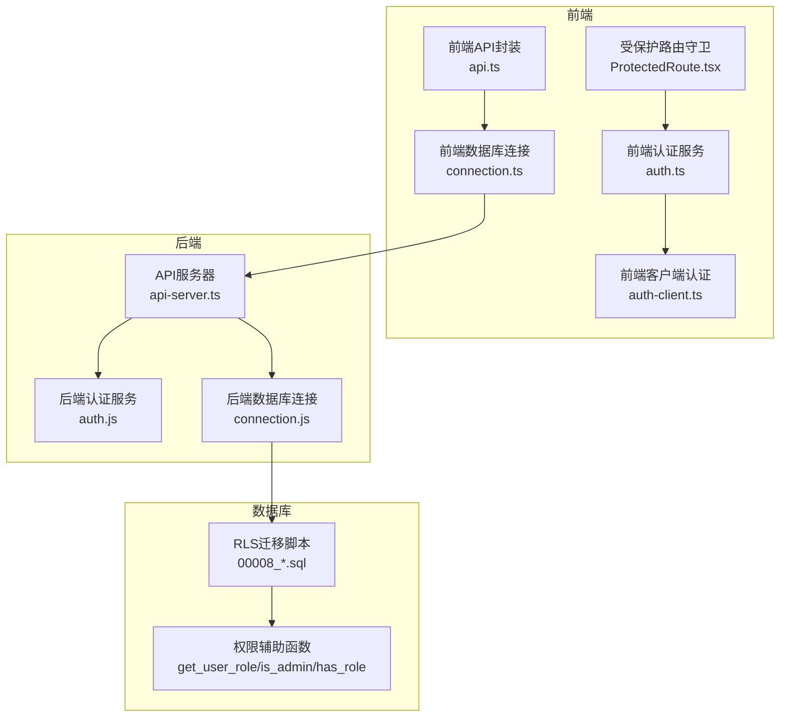
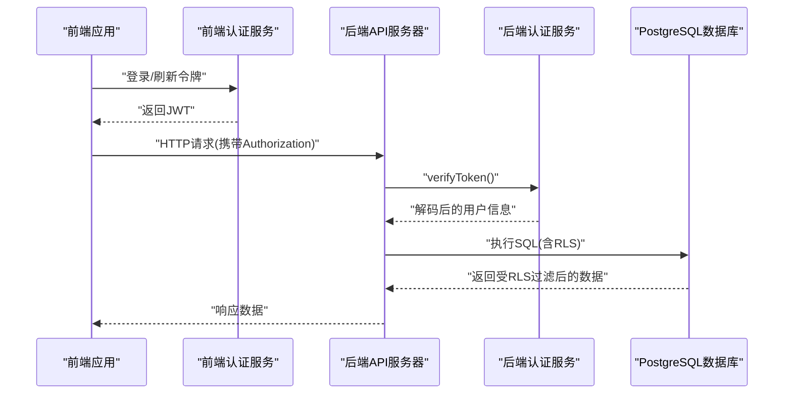
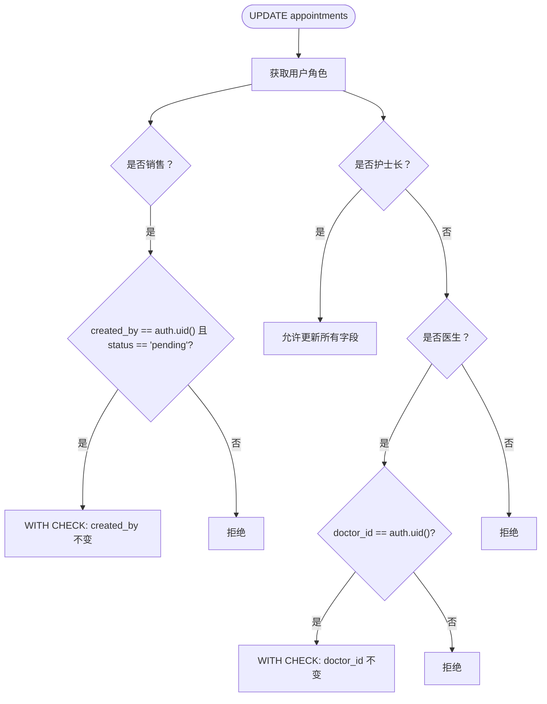
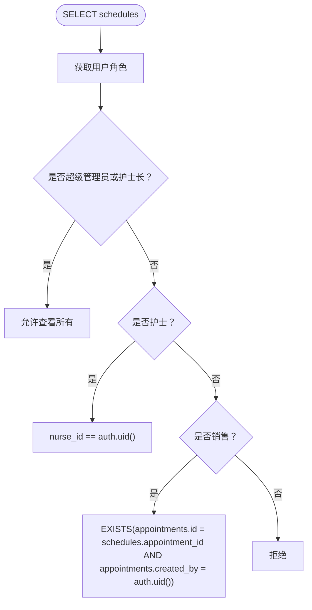
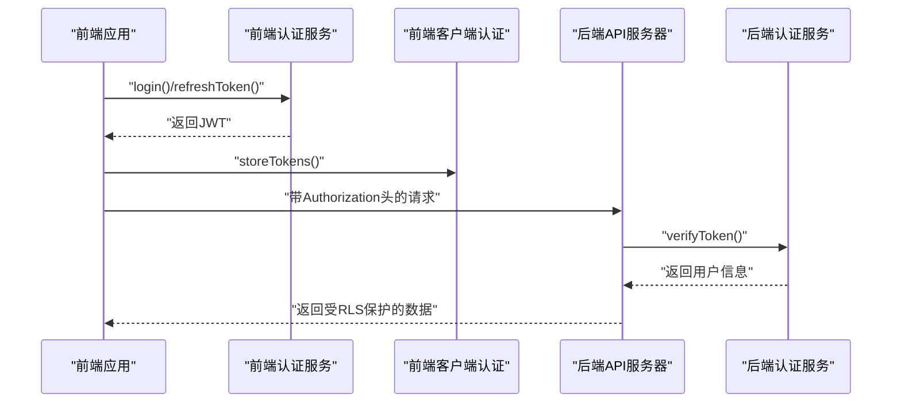
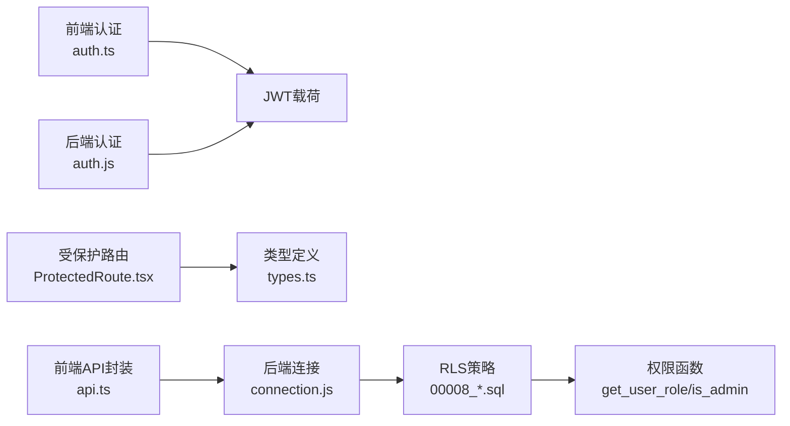

# RLS安全策略

<cite>
**本文引用的文件**
- [00008_add_rls_policies_for_role_based_access.sql](file://supabase/migrations/00008_add_rls_policies_for_role_based_access.sql)
- [00004_create_user_profiles_and_auth.sql](file://supabase/migrations/00004_create_user_profiles_and_auth.sql)
- [00005_update_profiles_for_auth_system.sql](file://supabase/migrations/00005_update_profiles_for_auth_system.sql)
- [00007_update_profiles_structure_and_auth.sql](file://supabase/migrations/00007_update_profiles_structure_and_auth.sql)
- [auth.js](file://server/src/services/auth.js)
- [auth.ts](file://src/services/auth.ts)
- [api-server.ts](file://server/api-server.ts)
- [auth-client.ts](file://src/services/auth-client.ts)
- [ProtectedRoute.tsx](file://src/components/auth/ProtectedRoute.tsx)
- [connection.ts](file://src/db/connection.ts)
- [connection.js](file://server/src/db/connection.js)
- [types.ts](file://src/types/types.ts)
- [api.ts](file://src/services/api.ts)
</cite>

## 目录
1. [简介](#简介)
2. [项目结构](#项目结构)
3. [核心组件](#核心组件)
4. [架构总览](#架构总览)
5. [详细组件分析](#详细组件分析)
6. [依赖关系分析](#依赖关系分析)
7. [性能考量](#性能考量)
8. [故障排查指南](#故障排查指南)
9. [结论](#结论)
10. [附录](#附录)

## 简介
本文件围绕Bio-Appointment系统的行级安全（RLS）策略展开，基于迁移脚本00008_add_rls_policies_for_role_based_access.sql，系统性解析PostgreSQL RLS在用户、预约、排班等表上的实现机制，包括：
- 启用RLS的表范围与策略粒度
- 基于JWT声明的角色匹配逻辑
- SELECT/INSERT/UPDATE/DELETE的精细化权限控制规则
- 如何通过RLS防止越权访问
- 结合后端auth.js与前端auth.ts的认证流程，形成完整的安全数据访问链路
- 提供RLS策略的创建、测试与调试方法，以及常见安全漏洞的防范建议

## 项目结构
本项目采用前后端分离架构，RLS策略主要位于数据库层（Supabase迁移），认证与授权在服务端与前端协同完成：
- 数据库层：通过迁移脚本启用RLS并对多张表设置策略
- 服务端：负责生成/校验JWT，保护API路由
- 前端：负责存储令牌、路由守卫与UI权限控制

图表来源
- [00008_add_rls_policies_for_role_based_access.sql](file://supabase/migrations/00008_add_rls_policies_for_role_based_access.sql#L31-L180)
- [auth.js](file://server/src/services/auth.js#L33-L103)
- [auth.ts](file://src/services/auth.ts#L49-L103)
- [api-server.ts](file://server/api-server.ts#L107-L151)
- [auth-client.ts](file://src/services/auth-client.ts#L1-L235)
- [ProtectedRoute.tsx](file://src/components/auth/ProtectedRoute.tsx#L1-L49)
- [connection.ts](file://src/db/connection.ts#L1-L120)
- [connection.js](file://server/src/db/connection.js#L1-L120)

章节来源
- [00008_add_rls_policies_for_role_based_access.sql](file://supabase/migrations/00008_add_rls_policies_for_role_based_access.sql#L31-L180)
- [auth.js](file://server/src/services/auth.js#L33-L103)
- [auth.ts](file://src/services/auth.ts#L49-L103)
- [api-server.ts](file://server/api-server.ts#L107-L151)
- [auth-client.ts](file://src/services/auth-client.ts#L1-L235)
- [ProtectedRoute.tsx](file://src/components/auth/ProtectedRoute.tsx#L1-L49)
- [connection.ts](file://src/db/connection.ts#L1-L120)
- [connection.js](file://server/src/db/connection.js#L1-L120)

## 核心组件
- RLS策略定义：在迁移脚本中对appointments与schedules表启用RLS，并针对不同角色设置SELECT/INSERT/UPDATE/DELETE策略
- 权限辅助函数：在数据库侧提供get_user_role/is_admin/has_role等函数，用于在RLS策略中进行角色判断
- 认证服务：后端与前端分别提供JWT生成/校验能力，确保请求携带有效身份信息
- 受保护路由：前端通过ProtectedRoute.tsx对路由进行角色校验，避免越权访问UI
- API封装：前端api.ts与后端DatabaseHelper封装了统一的数据访问接口，便于在RLS下进行细粒度控制

章节来源
- [00008_add_rls_policies_for_role_based_access.sql](file://supabase/migrations/00008_add_rls_policies_for_role_based_access.sql#L31-L180)
- [00004_create_user_profiles_and_auth.sql](file://supabase/migrations/00004_create_user_profiles_and_auth.sql#L51-L120)
- [00005_update_profiles_for_auth_system.sql](file://supabase/migrations/00005_update_profiles_for_auth_system.sql#L93-L141)
- [00007_update_profiles_structure_and_auth.sql](file://supabase/migrations/00007_update_profiles_structure_and_auth.sql#L85-L137)
- [auth.js](file://server/src/services/auth.js#L33-L103)
- [auth.ts](file://src/services/auth.ts#L49-L103)
- [ProtectedRoute.tsx](file://src/components/auth/ProtectedRoute.tsx#L1-L49)
- [api.ts](file://src/services/api.ts#L1-L120)

## 架构总览
RLS安全链路由“前端令牌—后端鉴权—数据库策略”三层构成：
- 前端：生成/存储JWT，携带Authorization头访问后端
- 后端：中间件校验JWT，注入用户上下文
- 数据库：RLS策略按角色与业务字段进行过滤

图表来源
- [auth.js](file://server/src/services/auth.js#L33-L103)
- [auth.ts](file://src/services/auth.ts#L49-L103)
- [api-server.ts](file://server/api-server.ts#L107-L151)
- [00008_add_rls_policies_for_role_based_access.sql](file://supabase/migrations/00008_add_rls_policies_for_role_based_access.sql#L31-L180)

## 详细组件分析

### RLS策略总览与表启用
- 启用RLS的表：appointments、schedules
- 策略删除与重建：先DROP旧策略，再CREATE新策略，确保幂等
- 策略粒度：按FOR SELECT/INSERT/UPDATE/DELETE分类，结合USING/WITH CHECK表达式

章节来源
- [00008_add_rls_policies_for_role_based_access.sql](file://supabase/migrations/00008_add_rls_policies_for_role_based_access.sql#L31-L51)

### 角色与权限辅助函数
- get_user_role(uid)：返回当前认证用户的活动角色
- is_admin(uid)：判断是否为超级管理员
- has_role(uid, required_role)：判断是否具备某角色
- 这些函数在RLS策略中作为USING/WITH CHECK的判定条件

章节来源
- [00004_create_user_profiles_and_auth.sql](file://supabase/migrations/00004_create_user_profiles_and_auth.sql#L75-L120)
- [00005_update_profiles_for_auth_system.sql](file://supabase/migrations/00005_update_profiles_for_auth_system.sql#L93-L141)
- [00007_update_profiles_structure_and_auth.sql](file://supabase/migrations/00007_update_profiles_structure_and_auth.sql#L85-L137)

### appointments表RLS策略
- 查看权限（SELECT）
  - 超级管理员与护士长：可查看所有预约
  - 销售：仅能查看自己创建的预约
  - 医生：仅能查看分配给自己的预约
  - 护士：可查看所有预约（用于执行任务）
- 创建权限（INSERT）
  - 仅销售可创建预约，且created_by必须等于auth.uid()
- 更新权限（UPDATE）
  - 销售：仅能更新自己创建的、状态为pending的预约
  - 护士长：可更新所有预约
  - 医生：仅能更新分配给自己的预约的医生相关字段（通过WITH CHECK约束）

图表来源
- [00008_add_rls_policies_for_role_based_access.sql](file://supabase/migrations/00008_add_rls_policies_for_role_based_access.sql#L55-L124)

章节来源
- [00008_add_rls_policies_for_role_based_access.sql](file://supabase/migrations/00008_add_rls_policies_for_role_based_access.sql#L55-L124)

### schedules表RLS策略
- 查看权限（SELECT）
  - 超级管理员与护士长：可查看所有排班
  - 护士：仅能查看分配给自己的排班
  - 销售：仅能查看与其创建的预约相关的排班（通过EXISTS子查询关联）
- 创建权限（INSERT）
  - 仅护士长可创建排班
- 更新权限（UPDATE）
  - 护士长：可更新所有排班
  - 护士：仅能更新分配给自己的排班的状态字段（通过WITH CHECK约束）

图表来源
- [00008_add_rls_policies_for_role_based_access.sql](file://supabase/migrations/00008_add_rls_policies_for_role_based_access.sql#L125-L180)

章节来源
- [00008_add_rls_policies_for_role_based_access.sql](file://supabase/migrations/00008_add_rls_policies_for_role_based_access.sql#L125-L180)

### JWT与认证流程
- 前端生成/刷新令牌：auth.ts提供generateAccessToken/generateRefreshToken/verifyToken
- 后端中间件校验：api-server.ts中的authenticateToken从Authorization头提取Bearer令牌并调用AuthService.verifyToken
- 前端路由守卫：ProtectedRoute.tsx基于用户角色决定页面可见性；超级管理员拥有所有权限
- 前端API调用：auth-client.ts通过localStorage存储令牌并在请求头中携带Authorization

图表来源
- [auth.ts](file://src/services/auth.ts#L49-L103)
- [auth-client.ts](file://src/services/auth-client.ts#L1-L235)
- [api-server.ts](file://server/api-server.ts#L107-L151)
- [auth.js](file://server/src/services/auth.js#L33-L103)

章节来源
- [auth.ts](file://src/services/auth.ts#L49-L103)
- [auth-client.ts](file://src/services/auth-client.ts#L1-L235)
- [api-server.ts](file://server/api-server.ts#L107-L151)
- [auth.js](file://server/src/services/auth.js#L33-L103)

### 数据访问与RLS交互
- 前端api.ts封装了对appointments/schedules/task_executions等表的CRUD，内部通过DatabaseHelper与后端query交互
- 后端connection.js提供query/transaction等数据库操作，最终落到PostgreSQL
- RLS在数据库层生效，即使前端/后端逻辑正确，也必须依赖RLS策略保证数据隔离

章节来源
- [api.ts](file://src/services/api.ts#L150-L325)
- [connection.ts](file://src/db/connection.ts#L77-L120)
- [connection.js](file://server/src/db/connection.js#L77-L120)

## 依赖关系分析
- RLS策略依赖权限辅助函数：get_user_role/is_admin/has_role
- 前端auth.ts与后端auth.js共享JWT结构与签名参数，确保两端一致
- 受保护路由ProtectedRoute.tsx依赖前端types.ts中的UserRole枚举
- API封装api.ts依赖后端DatabaseHelper，后者依赖连接池connection.js

图表来源
- [00008_add_rls_policies_for_role_based_access.sql](file://supabase/migrations/00008_add_rls_policies_for_role_based_access.sql#L31-L180)
- [00004_create_user_profiles_and_auth.sql](file://supabase/migrations/00004_create_user_profiles_and_auth.sql#L75-L120)
- [auth.ts](file://src/services/auth.ts#L49-L103)
- [auth.js](file://server/src/services/auth.js#L33-L103)
- [ProtectedRoute.tsx](file://src/components/auth/ProtectedRoute.tsx#L1-L49)
- [types.ts](file://src/types/types.ts#L1-L20)
- [api.ts](file://src/services/api.ts#L150-L325)
- [connection.js](file://server/src/db/connection.js#L77-L120)

章节来源
- [00008_add_rls_policies_for_role_based_access.sql](file://supabase/migrations/00008_add_rls_policies_for_role_based_access.sql#L31-L180)
- [auth.ts](file://src/services/auth.ts#L49-L103)
- [auth.js](file://server/src/services/auth.js#L33-L103)
- [ProtectedRoute.tsx](file://src/components/auth/ProtectedRoute.tsx#L1-L49)
- [types.ts](file://src/types/types.ts#L1-L20)
- [api.ts](file://src/services/api.ts#L150-L325)
- [connection.js](file://server/src/db/connection.js#L77-L120)

## 性能考量
- RLS在数据库层生效，可能增加查询计划复杂度。建议：
  - 为常用过滤字段建立索引（如appointments.created_by、schedules.nurse_id、profiles.role/status）
  - 避免在RLS表达式中使用昂贵的子查询；必要时将复杂逻辑下沉至视图或物化视图
  - 对高频查询使用缓存（Redis）降低数据库压力
- JWT校验成本低，但需注意令牌过期与刷新策略，避免频繁刷新导致的后端压力

[本节为通用指导，无需列出具体文件来源]

## 故障排查指南
- 令牌无效/过期
  - 现象：后端authenticateToken返回401
  - 排查：确认前端auth-client.ts是否正确存储与发送令牌；后端auth.js.verifyToken是否抛出异常
- 路由越权
  - 现象：访问受保护页面被重定向
  - 排查：ProtectedRoute.tsx是否正确识别用户角色；超级管理员是否绕过校验
- 数据越权
  - 现象：查询返回空集或部分数据
  - 排查：RLS策略是否正确匹配角色；USING/WITH CHECK表达式是否符合预期
- 数据库连接问题
  - 现象：查询报错或超时
  - 排查：connection.ts/connection.js健康检查；连接池配置与Redis可用性

章节来源
- [api-server.ts](file://server/api-server.ts#L107-L151)
- [auth-client.ts](file://src/services/auth-client.ts#L1-L235)
- [ProtectedRoute.tsx](file://src/components/auth/ProtectedRoute.tsx#L1-L49)
- [connection.ts](file://src/db/connection.ts#L116-L166)
- [connection.js](file://server/src/db/connection.js#L112-L160)

## 结论
本项目通过数据库层RLS与前后端认证协作，实现了细粒度的角色权限控制。RLS策略覆盖appointments与schedules两大核心表，结合JWT与路由守卫，形成“令牌—鉴权—数据”的完整安全链路。建议持续完善索引与缓存策略，定期审计RLS策略与权限函数，确保系统在高并发场景下的安全性与稳定性。

[本节为总结性内容，无需列出具体文件来源]

## 附录

### 实际SQL示例（策略创建/测试/调试）
- 启用RLS与删除旧策略
  - 参考路径：[00008_add_rls_policies_for_role_based_access.sql](file://supabase/migrations/00008_add_rls_policies_for_role_based_access.sql#L31-L51)
- 查询策略（查看权限）
  - 参考路径：[00008_add_rls_policies_for_role_based_access.sql](file://supabase/migrations/00008_add_rls_policies_for_role_based_access.sql#L55-L84)
- 插入策略（销售创建预约）
  - 参考路径：[00008_add_rls_policies_for_role_based_access.sql](file://supabase/migrations/00008_add_rls_policies_for_role_based_access.sql#L86-L93)
- 更新策略（销售更新自己的预约）
  - 参考路径：[00008_add_rls_policies_for_role_based_access.sql](file://supabase/migrations/00008_add_rls_policies_for_role_based_access.sql#L95-L105)
- 更新策略（护士长/医生更新）
  - 参考路径：[00008_add_rls_policies_for_role_based_access.sql](file://supabase/migrations/00008_add_rls_policies_for_role_based_access.sql#L107-L124)
- 排班查询/插入/更新策略
  - 参考路径：[00008_add_rls_policies_for_role_based_access.sql](file://supabase/migrations/00008_add_rls_policies_for_role_based_access.sql#L125-L180)
- 权限辅助函数
  - 参考路径：[00004_create_user_profiles_and_auth.sql](file://supabase/migrations/00004_create_user_profiles_and_auth.sql#L75-L120)

### 常见安全漏洞与防范
- 令牌泄露
  - 防范：仅在HTTPS环境下传输；限制令牌有效期；前端localStorage安全存储；后端严格校验签名与受众
- 角色提升
  - 防范：RLS策略严格绑定auth.uid()与业务字段；禁止在客户端修改JWT载荷
- 越权访问UI
  - 防范：前端路由守卫与后端中间件双重校验；超级管理员特例仅在后端策略中生效
- 数据库滥用
  - 防范：最小权限原则；对敏感字段（如password_hash）在返回前清理；事务边界明确

[本节为通用指导，无需列出具体文件来源]