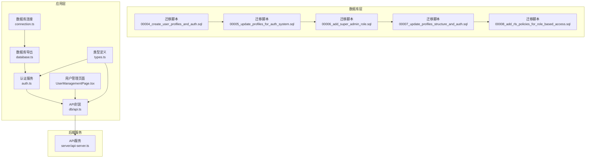
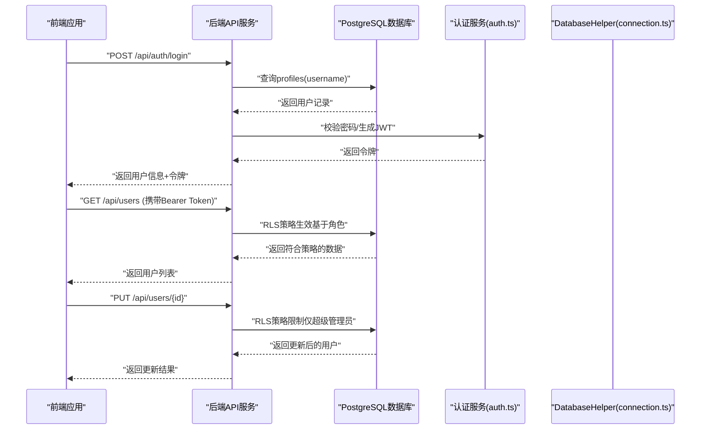
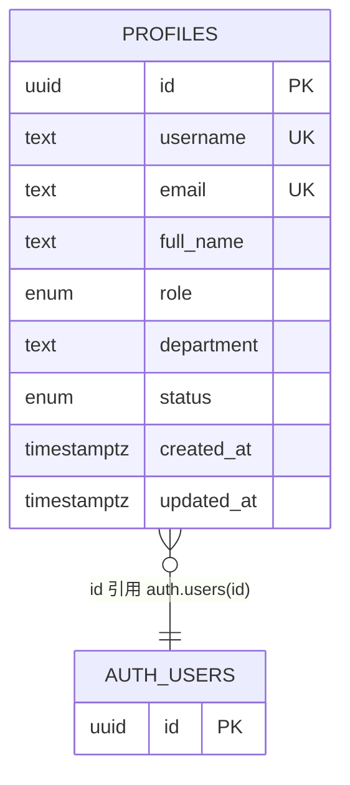
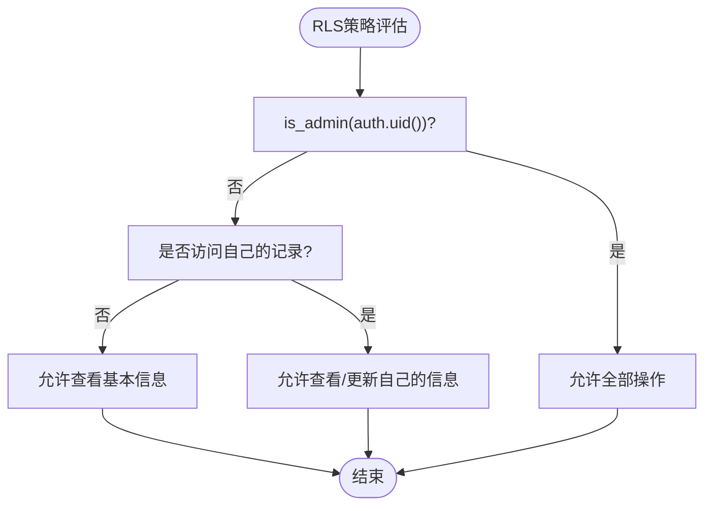
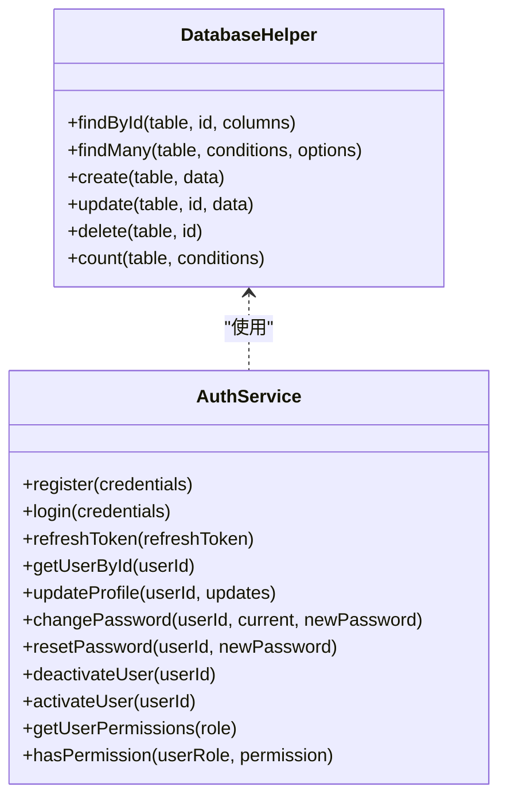
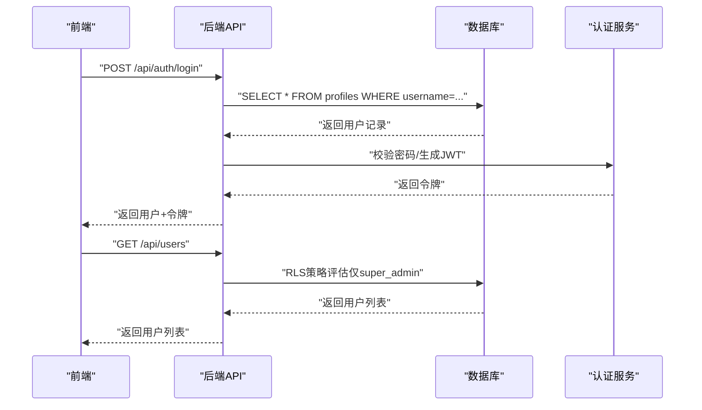
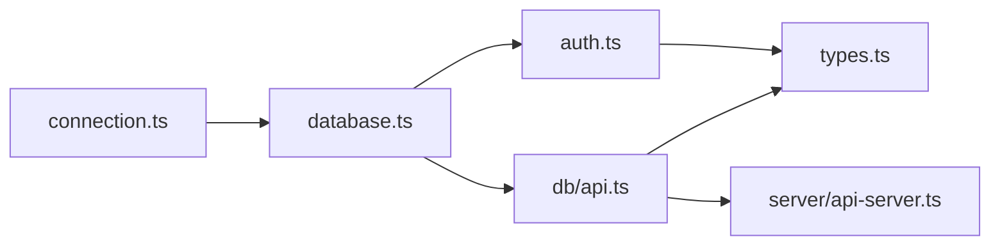

# 用户模型

<cite>
**本文引用的文件**
- [supabase/migrations/00004_create_user_profiles_and_auth.sql](file://supabase/migrations/00004_create_user_profiles_and_auth.sql)
- [supabase/migrations/00005_update_profiles_for_auth_system.sql](file://supabase/migrations/00005_update_profiles_for_auth_system.sql)
- [supabase/migrations/00006_add_super_admin_role.sql](file://supabase/migrations/00006_add_super_admin_role.sql)
- [supabase/migrations/00007_update_profiles_structure_and_auth.sql](file://supabase/migrations/00007_update_profiles_structure_and_auth.sql)
- [supabase/migrations/00008_add_rls_policies_for_role_based_access.sql](file://supabase/migrations/00008_add_rls_policies_for_role_based_access.sql)
- [src/db/connection.ts](file://src/db/connection.ts)
- [src/db/database.ts](file://src/db/database.ts)
- [src/services/auth.ts](file://src/services/auth.ts)
- [src/types/types.ts](file://src/types/types.ts)
- [src/db/api.ts](file://src/db/api.ts)
- [src/pages/admin/UserManagementPage.tsx](file://src/pages/admin/UserManagementPage.tsx)
- [server/api-server.ts](file://server/api-server.ts)
</cite>

## 目录
1. [简介](#简介)
2. [项目结构](#项目结构)
3. [核心组件](#核心组件)
4. [架构总览](#架构总览)
5. [详细组件分析](#详细组件分析)
6. [依赖关系分析](#依赖关系分析)
7. [性能考量](#性能考量)
8. [故障排查指南](#故障排查指南)
9. [结论](#结论)
10. [附录](#附录)

## 简介
本文件面向Bio-Appointment系统的“用户数据模型”，基于Supabase迁移脚本与应用层数据库访问接口，系统化梳理users与profiles表的结构设计、主键与外键约束、行级安全（RLS）策略、多角色权限体系与超级管理员特权，以及应用层如何安全地查询与更新用户数据。同时提供基于角色的访问控制（RBAC）示例与认证授权数据流说明，帮助开发者与运维人员理解并正确使用用户模型。

## 项目结构
围绕用户模型的关键文件分布如下：
- Supabase迁移脚本：定义用户角色枚举、profiles表结构、RLS策略、辅助函数与触发器
- 应用层数据库访问：连接池、查询封装、事务与健康检查
- 认证服务：JWT签发、刷新、登录/注册、密码哈希与权限判定
- 类型定义：Profile、UserRole、UserStatus等强类型
- API封装：前端对后端REST接口的调用封装
- 管理界面：管理员用户管理页面，展示角色与权限说明

图表来源
- [supabase/migrations/00004_create_user_profiles_and_auth.sql](file://supabase/migrations/00004_create_user_profiles_and_auth.sql#L1-L207)
- [supabase/migrations/00005_update_profiles_for_auth_system.sql](file://supabase/migrations/00005_update_profiles_for_auth_system.sql#L1-L228)
- [supabase/migrations/00006_add_super_admin_role.sql](file://supabase/migrations/00006_add_super_admin_role.sql#L1-L17)
- [supabase/migrations/00007_update_profiles_structure_and_auth.sql](file://supabase/migrations/00007_update_profiles_structure_and_auth.sql#L1-L219)
- [supabase/migrations/00008_add_rls_policies_for_role_based_access.sql](file://supabase/migrations/00008_add_rls_policies_for_role_based_access.sql#L1-L180)
- [src/db/connection.ts](file://src/db/connection.ts#L1-L324)
- [src/db/database.ts](file://src/db/database.ts#L1-L43)
- [src/services/auth.ts](file://src/services/auth.ts#L1-L341)
- [src/types/types.ts](file://src/types/types.ts#L1-L120)
- [src/db/api.ts](file://src/db/api.ts#L1-L200)
- [src/pages/admin/UserManagementPage.tsx](file://src/pages/admin/UserManagementPage.tsx#L1-L120)
- [server/api-server.ts](file://server/api-server.ts#L1043-L1133)

章节来源
- [supabase/migrations/00004_create_user_profiles_and_auth.sql](file://supabase/migrations/00004_create_user_profiles_and_auth.sql#L1-L207)
- [src/db/connection.ts](file://src/db/connection.ts#L1-L324)
- [src/services/auth.ts](file://src/services/auth.ts#L1-L341)
- [src/types/types.ts](file://src/types/types.ts#L1-L120)
- [src/db/api.ts](file://src/db/api.ts#L1-L200)
- [src/pages/admin/UserManagementPage.tsx](file://src/pages/admin/UserManagementPage.tsx#L1-L120)
- [server/api-server.ts](file://server/api-server.ts#L1043-L1133)

## 核心组件
- 用户角色与状态
  - 角色枚举：super_admin、sales、head_nurse、nurse、doctor
  - 状态枚举：active、disabled
- profiles表关键字段
  - id：UUID，主键，引用auth.users(id)，ON DELETE CASCADE
  - username：文本，唯一且非空
  - email：文本，唯一（由迁移脚本注释说明）
  - full_name：文本
  - role：用户角色，默认sales
  - department：文本
  - status：用户状态，默认active
  - created_at、updated_at：时间戳，默认now()
- RLS策略与辅助函数
  - is_admin(uid)：判断是否为激活状态的超级管理员
  - get_user_role(uid)：获取激活状态下的用户角色
  - has_role(uid, required_role)：判断是否具有某角色
  - profiles表RLS策略：超级管理员拥有全部权限；用户可查看/更新自己的信息；所有认证用户可查看基本信息
- 触发器与自动同步
  - handle_new_user()：当auth.users中用户邮箱验证或注册后，自动同步到profiles表；第一个注册用户为super_admin，其余默认sales
  - update_profiles_updated_at：更新updated_at列
- 应用层数据库访问
  - connection.ts：PostgreSQL连接池、Redis客户端、query封装、事务、健康检查
  - database.ts：导出getDatabase()，统一暴露query与DatabaseHelper
  - DatabaseHelper：通用CRUD封装（findById/findMany/create/update/delete/count）
- 认证与授权
  - auth.ts：JWT签发/刷新、登录/注册、密码哈希、用户信息变更、权限判定（静态权限清单）
- 类型定义
  - types.ts：Profile/PublicProfile/UserRole/UserStatus等强类型
- API封装与管理界面
  - db/api.ts：前端对后端REST接口的封装（登录、注册、用户管理、个人资料等）
  - UserManagementPage.tsx：管理员用户管理UI，展示角色与权限说明

章节来源
- [supabase/migrations/00004_create_user_profiles_and_auth.sql](file://supabase/migrations/00004_create_user_profiles_and_auth.sql#L51-L151)
- [supabase/migrations/00005_update_profiles_for_auth_system.sql](file://supabase/migrations/00005_update_profiles_for_auth_system.sql#L28-L169)
- [supabase/migrations/00007_update_profiles_structure_and_auth.sql](file://supabase/migrations/00007_update_profiles_structure_and_auth.sql#L85-L160)
- [src/db/connection.ts](file://src/db/connection.ts#L1-L324)
- [src/db/database.ts](file://src/db/database.ts#L1-L43)
- [src/services/auth.ts](file://src/services/auth.ts#L1-L341)
- [src/types/types.ts](file://src/types/types.ts#L1-L120)
- [src/db/api.ts](file://src/db/api.ts#L1-L200)
- [src/pages/admin/UserManagementPage.tsx](file://src/pages/admin/UserManagementPage.tsx#L1-L120)

## 架构总览
用户模型的认证与授权数据流如下：

图表来源
- [src/services/auth.ts](file://src/services/auth.ts#L148-L204)
- [src/db/api.ts](file://src/db/api.ts#L1-L120)
- [server/api-server.ts](file://server/api-server.ts#L1057-L1133)
- [supabase/migrations/00008_add_rls_policies_for_role_based_access.sql](file://supabase/migrations/00008_add_rls_policies_for_role_based_access.sql#L52-L180)

## 详细组件分析

### 数据模型：profiles表
- 主键与外键
  - 主键：id（UUID）
  - 外键：id 引用 auth.users(id)，ON DELETE CASCADE
- 字段与约束
  - username：唯一、非空
  - email：唯一（迁移脚本注释说明）
  - role：枚举，default 'sales'
  - status：枚举，default 'active'
  - created_at/updated_at：默认now()
- 索引
  - idx_profiles_username、idx_profiles_role、idx_profiles_status
- 视图
  - public_profiles：仅展示激活状态的公开字段

图表来源
- [supabase/migrations/00004_create_user_profiles_and_auth.sql](file://supabase/migrations/00004_create_user_profiles_and_auth.sql#L58-L68)
- [supabase/migrations/00005_update_profiles_for_auth_system.sql](file://supabase/migrations/00005_update_profiles_for_auth_system.sql#L38-L87)
- [supabase/migrations/00007_update_profiles_structure_and_auth.sql](file://supabase/migrations/00007_update_profiles_structure_and_auth.sql#L25-L44)

章节来源
- [supabase/migrations/00004_create_user_profiles_and_auth.sql](file://supabase/migrations/00004_create_user_profiles_and_auth.sql#L58-L68)
- [supabase/migrations/00005_update_profiles_for_auth_system.sql](file://supabase/migrations/00005_update_profiles_for_auth_system.sql#L38-L87)
- [supabase/migrations/00007_update_profiles_structure_and_auth.sql](file://supabase/migrations/00007_update_profiles_structure_and_auth.sql#L25-L44)

### 行级安全（RLS）策略
- 辅助函数
  - is_admin(uid)：仅激活状态的super_admin返回true
  - get_user_role(uid)：返回激活状态用户的角色
  - has_role(uid, required_role)：判断是否具有某角色
- profiles表策略
  - 超级管理员：FOR ALL（拥有全部权限）
  - 用户：可查看/更新自己的信息（WITH CHECK限制role/status不变）
  - 所有认证用户：可查看基本信息（用于显示名称等）
- appointments/schedules表策略（与用户模型联动）
  - 不同角色对预约与排班的查看/创建/更新权限
  - 禁用状态用户无法访问任何数据

图表来源
- [supabase/migrations/00004_create_user_profiles_and_auth.sql](file://supabase/migrations/00004_create_user_profiles_and_auth.sql#L79-L141)
- [supabase/migrations/00005_update_profiles_for_auth_system.sql](file://supabase/migrations/00005_update_profiles_for_auth_system.sql#L93-L169)
- [supabase/migrations/00007_update_profiles_structure_and_auth.sql](file://supabase/migrations/00007_update_profiles_structure_and_auth.sql#L85-L160)
- [supabase/migrations/00008_add_rls_policies_for_role_based_access.sql](file://supabase/migrations/00008_add_rls_policies_for_role_based_access.sql#L52-L180)

章节来源
- [supabase/migrations/00004_create_user_profiles_and_auth.sql](file://supabase/migrations/00004_create_user_profiles_and_auth.sql#L79-L141)
- [supabase/migrations/00005_update_profiles_for_auth_system.sql](file://supabase/migrations/00005_update_profiles_for_auth_system.sql#L93-L169)
- [supabase/migrations/00007_update_profiles_structure_and_auth.sql](file://supabase/migrations/00007_update_profiles_structure_and_auth.sql#L85-L160)
- [supabase/migrations/00008_add_rls_policies_for_role_based_access.sql](file://supabase/migrations/00008_add_rls_policies_for_role_based_access.sql#L1-L180)

### 多角色系统与超级管理员特权
- 角色定义
  - super_admin：超级管理员，拥有所有权限
  - sales：销售/健康管理师，发起预约
  - head_nurse：护士长，智能排班与资源分配
  - nurse：护士，执行任务
  - doctor：医生，预约确认
- 超级管理员特权
  - 在profiles表上拥有全部权限
  - 在后端API中，仅超级管理员可创建/更新/删除用户
- 应用层权限判定
  - auth.ts提供静态权限清单与hasPermission方法，便于前端路由与菜单控制

章节来源
- [supabase/migrations/00004_create_user_profiles_and_auth.sql](file://supabase/migrations/00004_create_user_profiles_and_auth.sql#L1-L47)
- [supabase/migrations/00006_add_super_admin_role.sql](file://supabase/migrations/00006_add_super_admin_role.sql#L1-L17)
- [src/services/auth.ts](file://src/services/auth.ts#L301-L338)
- [server/api-server.ts](file://server/api-server.ts#L1057-L1133)

### 应用层数据库访问与安全更新
- 连接与查询
  - connection.ts：初始化PostgreSQL连接池与Redis客户端；query封装；transaction；healthCheck；closeConnections
  - database.ts：导出getDatabase()，统一暴露query与DatabaseHelper
  - DatabaseHelper：find/create/update/delete/count等通用CRUD
- 安全更新要点
  - auth.ts在更新用户资料时，过滤敏感字段（如id、password_hash、created_at、updated_at），避免意外覆盖
  - 后端API在创建/更新用户时，先校验调用者是否为super_admin

图表来源
- [src/db/connection.ts](file://src/db/connection.ts#L170-L321)
- [src/services/auth.ts](file://src/services/auth.ts#L118-L341)

章节来源
- [src/db/connection.ts](file://src/db/connection.ts#L1-L324)
- [src/db/database.ts](file://src/db/database.ts#L1-L43)
- [src/services/auth.ts](file://src/services/auth.ts#L118-L341)

### 实际SQL查询示例（基于角色的访问控制）
以下示例展示不同角色在RLS策略下的典型查询行为（以文本形式描述，不直接粘贴SQL代码）：
- 查询所有用户（仅超级管理员）
  - 说明：RLS策略要求调用者必须为超级管理员，否则会被拒绝
  - 关联策略：profiles表“超级管理员拥有所有权限”
- 查询当前用户信息（本人）
  - 说明：RLS策略允许authenticated用户查看自己的记录
  - 关联策略：profiles表“用户可以查看自己的信息”
- 更新当前用户信息（本人）
  - 说明：RLS策略允许authenticated用户更新自己的记录，但WITH CHECK限制role与status不可变
  - 关联策略：profiles表“用户可以更新自己的信息”
- 按角色筛选用户（后端API）
  - 说明：后端API在创建/更新/删除用户时，先查询调用者的角色，仅允许super_admin执行
  - 关联策略：server/api-server.ts中的角色校验逻辑

章节来源
- [supabase/migrations/00004_create_user_profiles_and_auth.sql](file://supabase/migrations/00004_create_user_profiles_and_auth.sql#L112-L141)
- [supabase/migrations/00005_update_profiles_for_auth_system.sql](file://supabase/migrations/00005_update_profiles_for_auth_system.sql#L136-L169)
- [supabase/migrations/00007_update_profiles_structure_and_auth.sql](file://supabase/migrations/00007_update_profiles_structure_and_auth.sql#L129-L160)
- [server/api-server.ts](file://server/api-server.ts#L1057-L1133)

### 认证与授权数据流
- 登录流程
  - 前端调用db/api.ts的login，携带用户名与密码
  - 后端server/api-server.ts查询profiles表，校验状态与密码
  - 返回JWT令牌，前端存储并用于后续请求
- 用户管理流程（管理员）
  - 前端调用db/api.ts的getAllUsers/createUser/updateUser/deleteUser
  - 后端server/api-server.ts校验调用者是否为super_admin
  - 返回对应结果

图表来源
- [src/db/api.ts](file://src/db/api.ts#L1-L120)
- [server/api-server.ts](file://server/api-server.ts#L1057-L1133)
- [src/services/auth.ts](file://src/services/auth.ts#L148-L204)

章节来源
- [src/db/api.ts](file://src/db/api.ts#L1-L120)
- [server/api-server.ts](file://server/api-server.ts#L1057-L1133)
- [src/services/auth.ts](file://src/services/auth.ts#L148-L204)

## 依赖关系分析
- 组件耦合
  - connection.ts与database.ts低耦合：database.ts仅导出getDatabase()，内部依赖connection.ts的query与DatabaseHelper
  - auth.ts依赖DatabaseHelper进行用户查询与更新
  - db/api.ts依赖localStorage与fetch，间接依赖后端API
  - server/api-server.ts直接依赖connection.ts进行数据库查询
- 外部依赖
  - PostgreSQL连接池（pg.Pool）
  - Redis客户端（可选）
  - JWT（jsonwebtoken）
  - bcrypt（密码哈希）

图表来源
- [src/db/connection.ts](file://src/db/connection.ts#L1-L324)
- [src/db/database.ts](file://src/db/database.ts#L1-L43)
- [src/services/auth.ts](file://src/services/auth.ts#L1-L341)
- [src/db/api.ts](file://src/db/api.ts#L1-L200)
- [server/api-server.ts](file://server/api-server.ts#L1057-L1133)
- [src/types/types.ts](file://src/types/types.ts#L1-L120)

章节来源
- [src/db/connection.ts](file://src/db/connection.ts#L1-L324)
- [src/db/database.ts](file://src/db/database.ts#L1-L43)
- [src/services/auth.ts](file://src/services/auth.ts#L1-L341)
- [src/db/api.ts](file://src/db/api.ts#L1-L200)
- [server/api-server.ts](file://server/api-server.ts#L1057-L1133)
- [src/types/types.ts](file://src/types/types.ts#L1-L120)

## 性能考量
- 连接池与并发
  - connection.ts使用pg.Pool管理连接，合理设置max、idleTimeoutMillis、connectionTimeoutMillis
- 查询优化
  - profiles表建立username、role、status索引，有助于高频查询
- 缓存
  - Redis作为可选缓存，可在高并发场景下减轻数据库压力（需在业务层合理使用）
- 事务
  - 对于需要一致性的批量操作，使用transaction封装，确保原子性

章节来源
- [src/db/connection.ts](file://src/db/connection.ts#L1-L166)
- [supabase/migrations/00005_update_profiles_for_auth_system.sql](file://supabase/migrations/00005_update_profiles_for_auth_system.sql#L89-L92)
- [supabase/migrations/00007_update_profiles_structure_and_auth.sql](file://supabase/migrations/00007_update_profiles_structure_and_auth.sql#L79-L84)

## 故障排查指南
- 登录失败
  - 检查用户名是否存在、账户状态是否为active、密码是否正确
  - 关注auth.ts的登录流程与错误处理
- 无法查看用户列表
  - 确认当前登录用户是否为super_admin（后端API会校验）
- 更新用户信息被拒绝
  - 确认调用者是否为super_admin（后端API会校验）
  - 确认RLS策略是否生效（数据库侧）
- 数据库连接异常
  - 使用healthCheck检查PostgreSQL与Redis状态
  - 检查环境变量与连接配置

章节来源
- [src/services/auth.ts](file://src/services/auth.ts#L148-L204)
- [server/api-server.ts](file://server/api-server.ts#L1057-L1133)
- [src/db/connection.ts](file://src/db/connection.ts#L119-L166)

## 结论
本用户模型通过Supabase迁移脚本定义了清晰的用户角色与状态、完善的RLS策略与辅助函数，并在应用层提供了安全的数据库访问与认证授权能力。超级管理员在数据库与后端API层面均享有最高权限，确保系统管理的安全可控。前端通过db/api.ts与后端交互，后端通过server/api-server.ts进行严格的权限校验，形成“数据库RLS + 应用层鉴权”的双重保障。

## 附录
- 角色权限说明（来自管理界面）
  - 超级管理员：拥有所有权限，可管理用户、分配角色、访问所有功能模块
  - 销售/健康管理师：发起预约、查看自己创建的预约、跟进客户
  - 护士长：智能排班、资源分配、查看所有预约和排班、管理护士任务
  - 护士：查看分配给自己的任务、执行护理任务、更新任务状态
  - 医生：预约握手、接受/拒绝/改期预约、查看分配给自己的预约

章节来源
- [src/pages/admin/UserManagementPage.tsx](file://src/pages/admin/UserManagementPage.tsx#L440-L476)