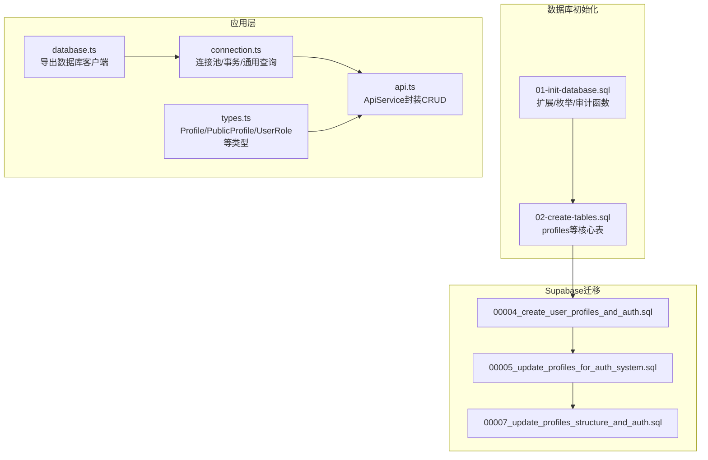
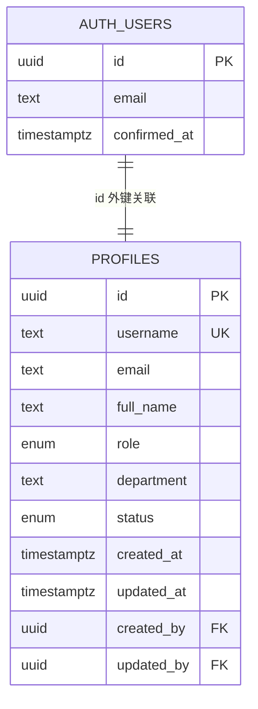
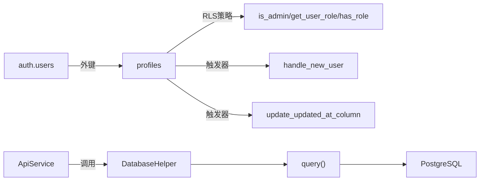

# 用户表结构

<cite>
**本文引用的文件**
- [02-create-tables.sql](file://database/init/02-create-tables.sql)
- [01-init-database.sql](file://database/init/01-init-database.sql)
- [00004_create_user_profiles_and_auth.sql](file://supabase/migrations/00004_create_user_profiles_and_auth.sql)
- [00005_update_profiles_for_auth_system.sql](file://supabase/migrations/00005_update_profiles_for_auth_system.sql)
- [00007_update_profiles_structure_and_auth.sql](file://supabase/migrations/00007_update_profiles_structure_and_auth.sql)
- [database.ts](file://src/db/database.ts)
- [connection.ts](file://src/db/connection.ts)
- [types.ts](file://src/types/types.ts)
- [api.ts](file://src/services/api.ts)
</cite>

## 目录
1. [简介](#简介)
2. [项目结构](#项目结构)
3. [核心组件](#核心组件)
4. [架构总览](#架构总览)
5. [详细组件分析](#详细组件分析)
6. [依赖关系分析](#依赖关系分析)
7. [性能考量](#性能考量)
8. [故障排查指南](#故障排查指南)
9. [结论](#结论)
10. [附录](#附录)

## 简介
本文件聚焦于Bio-Appointment系统的用户表结构，基于本地初始化SQL与Supabase迁移脚本，系统化梳理users与profiles两表的字段定义、主键/外键约束、数据类型设计与RLS策略；阐明“身份信息与个人资料”的分离设计模式；解释多角色系统中各字段的语义与权限控制；并结合应用层数据库访问接口database.ts与connection.ts，展示安全查询与更新用户数据的方法，提供可直接对照的SQL示例路径与最佳实践。

## 项目结构
围绕用户表结构的关键文件分布如下：
- 初始化与基础类型定义：database/init/01-init-database.sql（自定义枚举、扩展、审计函数）
- 核心业务表定义：database/init/02-create-tables.sql（包含profiles表）
- Supabase迁移脚本：supabase/migrations/*（逐步演进的用户与权限体系）
- 应用层数据库访问：src/db/database.ts、src/db/connection.ts
- 类型定义与服务封装：src/types/types.ts、src/services/api.ts

图表来源
- [01-init-database.sql](file://database/init/01-init-database.sql#L1-L112)
- [02-create-tables.sql](file://database/init/02-create-tables.sql#L1-L274)
- [00004_create_user_profiles_and_auth.sql](file://supabase/migrations/00004_create_user_profiles_and_auth.sql#L1-L207)
- [00005_update_profiles_for_auth_system.sql](file://supabase/migrations/00005_update_profiles_for_auth_system.sql#L1-L228)
- [00007_update_profiles_structure_and_auth.sql](file://supabase/migrations/00007_update_profiles_structure_and_auth.sql#L1-L219)
- [database.ts](file://src/db/database.ts#L1-L43)
- [connection.ts](file://src/db/connection.ts#L1-L324)
- [types.ts](file://src/types/types.ts#L1-L120)
- [api.ts](file://src/services/api.ts#L1-L120)

章节来源
- [01-init-database.sql](file://database/init/01-init-database.sql#L1-L112)
- [02-create-tables.sql](file://database/init/02-create-tables.sql#L1-L274)
- [database.ts](file://src/db/database.ts#L1-L43)
- [connection.ts](file://src/db/connection.ts#L1-L120)
- [types.ts](file://src/types/types.ts#L1-L120)
- [api.ts](file://src/services/api.ts#L1-L120)

## 核心组件
- profiles表：承载用户身份与个人资料，包含id、username、email、full_name、role、department、status、created_at、updated_at等字段；通过RLS策略实现按角色的访问控制。
- auth.users（Supabase）：用户认证主体，与profiles.id建立一对一外键关联；迁移脚本通过触发器在用户创建/确认时自动同步至profiles。
- 应用层数据库访问：通过connection.ts的Pool与事务封装，database.ts导出统一客户端；ApiService对profiles进行安全的CRUD封装。

章节来源
- [02-create-tables.sql](file://database/init/02-create-tables.sql#L1-L60)
- [00004_create_user_profiles_and_auth.sql](file://supabase/migrations/00004_create_user_profiles_and_auth.sql#L50-L120)
- [00005_update_profiles_for_auth_system.sql](file://supabase/migrations/00005_update_profiles_for_auth_system.sql#L28-L120)
- [00007_update_profiles_structure_and_auth.sql](file://supabase/migrations/00007_update_profiles_structure_and_auth.sql#L25-L120)
- [connection.ts](file://src/db/connection.ts#L1-L120)
- [database.ts](file://src/db/database.ts#L1-L43)
- [api.ts](file://src/services/api.ts#L1-L120)

## 架构总览
用户表结构与权限控制的整体关系如下：

图表来源
- [02-create-tables.sql](file://database/init/02-create-tables.sql#L1-L40)
- [00004_create_user_profiles_and_auth.sql](file://supabase/migrations/00004_create_user_profiles_and_auth.sql#L50-L120)
- [00005_update_profiles_for_auth_system.sql](file://supabase/migrations/00005_update_profiles_for_auth_system.sql#L28-L120)
- [00007_update_profiles_structure_and_auth.sql](file://supabase/migrations/00007_update_profiles_structure_and_auth.sql#L25-L120)

## 详细组件分析

### 1) 表结构与字段语义
- 主键与外键
  - profiles.id为主键，同时作为auth.users.id的外键（ON DELETE CASCADE），确保用户删除时级联清理。
  - created_by/updated_by为profiles.id的外键，用于审计追踪。
- 字段与数据类型
  - id：UUID，主键且与auth.users.id一致。
  - username：文本，唯一且非空，用于登录标识。
  - email：文本，唯一（可为空），迁移脚本中曾自动派生为username@domain。
  - full_name：文本，真实姓名。
  - role：枚举user_role，包含super_admin、sales、head_nurse、nurse、doctor。
  - department：文本，所属部门。
  - status：枚举user_status，包含active、disabled。
  - created_at/updated_at：带时区的时间戳，默认CURRENT_TIMESTAMP或now()。
  - password_hash：字符串，用于本地登录场景（初始化脚本中出现）。
  - dingtalk_userid、avatar_url、phone：扩展字段，支持钉钉集成。
  - created_by/updated_by：审计字段，引用profiles.id。

章节来源
- [02-create-tables.sql](file://database/init/02-create-tables.sql#L1-L60)
- [01-init-database.sql](file://database/init/01-init-database.sql#L18-L52)
- [00004_create_user_profiles_and_auth.sql](file://supabase/migrations/00004_create_user_profiles_and_auth.sql#L50-L120)
- [00005_update_profiles_for_auth_system.sql](file://supabase/migrations/00005_update_profiles_for_auth_system.sql#L28-L120)
- [00007_update_profiles_structure_and_auth.sql](file://supabase/migrations/00007_update_profiles_structure_and_auth.sql#L25-L120)

### 2) 多角色系统与语义
- 角色枚举user_role：super_admin（超级管理员）、sales（销售/健康管理师）、head_nurse（护士长）、nurse（护士）、doctor（医生）。
- 角色语义与权限边界
  - super_admin：拥有所有权限（RLS策略）。
  - sales/head_nurse/nurse/doctor：根据业务职责划分，通过RLS策略限制可见范围与更新范围。
- 状态枚举user_status：active/disabled，用于启用/禁用用户。

章节来源
- [01-init-database.sql](file://database/init/01-init-database.sql#L18-L52)
- [00004_create_user_profiles_and_auth.sql](file://supabase/migrations/00004_create_user_profiles_and_auth.sql#L50-L120)
- [00005_update_profiles_for_auth_system.sql](file://supabase/migrations/00005_update_profiles_for_auth_system.sql#L28-L120)
- [00007_update_profiles_structure_and_auth.sql](file://supabase/migrations/00007_update_profiles_structure_and_auth.sql#L25-L120)

### 3) 分离设计：身份信息与个人资料
- 身份信息（auth.users）：由Supabase提供，包含id、email、confirmed_at等认证相关字段。
- 个人资料（profiles）：包含username、full_name、department、role、status等业务相关信息。
- 同步机制：迁移脚本通过触发器在用户创建/确认后自动将auth.users中的email等信息同步到profiles，并设置首个用户为super_admin，其余为sales。

章节来源
- [00004_create_user_profiles_and_auth.sql](file://supabase/migrations/00004_create_user_profiles_and_auth.sql#L150-L207)
- [00005_update_profiles_for_auth_system.sql](file://supabase/migrations/00005_update_profiles_for_auth_system.sql#L170-L214)
- [00007_update_profiles_structure_and_auth.sql](file://supabase/migrations/00007_update_profiles_structure_and_auth.sql#L160-L205)

### 4) RLS策略与访问控制
- 超级管理员：拥有所有权限（FOR ALL）。
- 查看权限：authenticated用户可查看其他用户的基本信息（public_profiles视图）。
- 更新权限：用户仅能更新自己的信息，且不允许修改role与status（WITH CHECK校验）。
- 辅助函数：is_admin、get_user_role、has_role用于简化策略判断。

章节来源
- [00004_create_user_profiles_and_auth.sql](file://supabase/migrations/00004_create_user_profiles_and_auth.sql#L112-L152)
- [00005_update_profiles_for_auth_system.sql](file://supabase/migrations/00005_update_profiles_for_auth_system.sql#L133-L170)
- [00007_update_profiles_structure_and_auth.sql](file://supabase/migrations/00007_update_profiles_structure_and_auth.sql#L125-L160)

### 5) 应用层安全查询与更新
- 初始化与客户端
  - database.ts导出getDatabase()，返回query与DatabaseHelper。
  - connection.ts提供initializeConnections()、query()、transaction()、DatabaseHelper类方法。
- ApiService对profiles的CRUD封装
  - getProfile/getProfiles：安全读取，过滤敏感字段（如password_hash）。
  - createProfile/updateProfile/deleteProfile：统一入口，避免绕过RLS。
- 类型定义
  - types.ts中定义Profile、PublicProfile、UserRole、UserStatus等类型，保证前端与后端一致性。

章节来源
- [database.ts](file://src/db/database.ts#L1-L43)
- [connection.ts](file://src/db/connection.ts#L1-L324)
- [api.ts](file://src/services/api.ts#L1-L120)
- [types.ts](file://src/types/types.ts#L1-L120)

### 6) 实际SQL查询示例（路径指引）
以下为常见用户信息读取与更新操作的SQL示例路径，请在对应文件中查看具体实现：
- 查询单个用户（按id）
  - 示例路径：[查询示例](file://src/services/api.ts#L15-L30)
- 查询用户列表（支持role/status/department过滤）
  - 示例路径：[查询示例](file://src/services/api.ts#L28-L42)
- 创建用户（含默认状态与时间戳）
  - 示例路径：[创建示例](file://src/services/api.ts#L44-L60)
- 更新用户（仅允许更新full_name、department等字段）
  - 示例路径：[更新示例](file://src/services/api.ts#L62-L70)
- 删除用户
  - 示例路径：[删除示例](file://src/services/api.ts#L72-L75)
- 获取公共资料视图（public_profiles）
  - 示例路径：[视图定义](file://supabase/migrations/00004_create_user_profiles_and_auth.sql#L142-L152)

章节来源
- [api.ts](file://src/services/api.ts#L1-L120)
- [00004_create_user_profiles_and_auth.sql](file://supabase/migrations/00004_create_user_profiles_and_auth.sql#L142-L152)

### 7) 数据验证规则与完整性约束
- 唯一性
  - username唯一（UNIQUE NOT NULL）。
  - email唯一（UNIQUE，可为空）。
  - dingtalk_userid唯一（UNIQUE，可为空）。
- 非空性
  - username必须非空。
  - role默认sales，status默认active。
- 外键约束
  - profiles.id引用auth.users(id)，ON DELETE CASCADE。
  - created_by/updated_by引用profiles(id)。
- 时间戳
  - created_at/updated_at默认CURRENT_TIMESTAMP或now()，并有触发器自动更新。
- 触发器
  - update_profiles_updated_at：更新时自动设置updated_at。
  - handle_new_user：用户创建/确认后自动同步到profiles。

章节来源
- [02-create-tables.sql](file://database/init/02-create-tables.sql#L1-L40)
- [00004_create_user_profiles_and_auth.sql](file://supabase/migrations/00004_create_user_profiles_and_auth.sql#L50-L120)
- [00005_update_profiles_for_auth_system.sql](file://supabase/migrations/00005_update_profiles_for_auth_system.sql#L28-L120)
- [00007_update_profiles_structure_and_auth.sql](file://supabase/migrations/00007_update_profiles_structure_and_auth.sql#L25-L120)

## 依赖关系分析

图表来源
- [02-create-tables.sql](file://database/init/02-create-tables.sql#L1-L40)
- [00004_create_user_profiles_and_auth.sql](file://supabase/migrations/00004_create_user_profiles_and_auth.sql#L150-L207)
- [00005_update_profiles_for_auth_system.sql](file://supabase/migrations/00005_update_profiles_for_auth_system.sql#L170-L214)
- [00007_update_profiles_structure_and_auth.sql](file://supabase/migrations/00007_update_profiles_structure_and_auth.sql#L160-L205)
- [connection.ts](file://src/db/connection.ts#L1-L120)
- [api.ts](file://src/services/api.ts#L1-L120)

章节来源
- [02-create-tables.sql](file://database/init/02-create-tables.sql#L1-L60)
- [00004_create_user_profiles_and_auth.sql](file://supabase/migrations/00004_create_user_profiles_and_auth.sql#L150-L207)
- [00005_update_profiles_for_auth_system.sql](file://supabase/migrations/00005_update_profiles_for_auth_system.sql#L170-L214)
- [00007_update_profiles_structure_and_auth.sql](file://supabase/migrations/00007_update_profiles_structure_and_auth.sql#L160-L205)
- [connection.ts](file://src/db/connection.ts#L1-L120)
- [api.ts](file://src/services/api.ts#L1-L120)

## 性能考量
- 索引
  - profiles.username、role、status、email、dingtalk_userid等常用过滤字段已建立索引，提升查询效率。
- 触发器
  - update_updated_at_column在UPDATE前自动设置updated_at，减少重复逻辑。
- 事务
  - connection.ts提供transaction()，适合需要原子性的批量写入场景。
- 缓存
  - connection.ts包含Redis客户端初始化，可在应用层按需使用缓存优化热点查询（如用户列表）。

章节来源
- [02-create-tables.sql](file://database/init/02-create-tables.sql#L180-L231)
- [00004_create_user_profiles_and_auth.sql](file://supabase/migrations/00004_create_user_profiles_and_auth.sql#L70-L74)
- [00005_update_profiles_for_auth_system.sql](file://supabase/migrations/00005_update_profiles_for_auth_system.sql#L89-L92)
- [00007_update_profiles_structure_and_auth.sql](file://supabase/migrations/00007_update_profiles_structure_and_auth.sql#L75-L84)
- [connection.ts](file://src/db/connection.ts#L1-L120)

## 故障排查指南
- 认证与同步
  - 若用户注册后未出现在profiles，检查handle_new_user触发器是否存在且生效。
  - 参考路径：[触发器定义](file://supabase/migrations/00004_create_user_profiles_and_auth.sql#L154-L194)
- RLS访问异常
  - 确认当前会话为authenticated，且is_admin/get_user_role/has_role函数正常工作。
  - 参考路径：[RLS策略](file://supabase/migrations/00004_create_user_profiles_and_auth.sql#L112-L152)
- 更新被拒绝
  - 更新时若修改了role或status，会被RLS WITH CHECK拒绝；请通过管理员接口或专用流程变更。
  - 参考路径：[RLS WITH CHECK](file://supabase/migrations/00004_create_user_profiles_and_auth.sql#L125-L135)
- 时间戳未更新
  - 检查update_profiles_updated_at触发器是否创建成功。
  - 参考路径：[触发器创建](file://supabase/migrations/00004_create_user_profiles_and_auth.sql#L195-L207)
- 连接与事务
  - 如遇连接失败，先执行healthCheck()检查PostgreSQL与Redis状态。
  - 参考路径：[健康检查](file://src/db/connection.ts#L116-L165)

章节来源
- [00004_create_user_profiles_and_auth.sql](file://supabase/migrations/00004_create_user_profiles_and_auth.sql#L112-L207)
- [connection.ts](file://src/db/connection.ts#L116-L165)

## 结论
本项目采用“认证主体（auth.users）+ 业务资料（profiles）”的分离设计，配合RLS策略与触发器，实现了安全、可审计、可扩展的用户管理能力。应用层通过ApiService与DatabaseHelper统一封装，既保障了数据一致性，也降低了业务代码的复杂度。建议在生产环境中持续完善索引与监控，并通过专用管理员接口处理role/status变更，确保权限边界清晰。

## 附录
- 关键SQL示例路径
  - 查询单个用户：[示例](file://src/services/api.ts#L15-L30)
  - 查询用户列表：[示例](file://src/services/api.ts#L28-L42)
  - 创建用户：[示例](file://src/services/api.ts#L44-L60)
  - 更新用户：[示例](file://src/services/api.ts#L62-L70)
  - 删除用户：[示例](file://src/services/api.ts#L72-L75)
  - 公共资料视图：[视图定义](file://supabase/migrations/00004_create_user_profiles_and_auth.sql#L142-L152)
- 类型定义参考
  - Profile/PublicProfile/UserRole/UserStatus：[类型定义](file://src/types/types.ts#L1-L120)