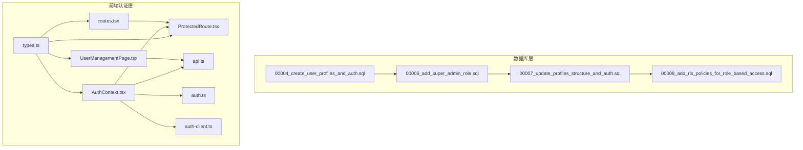
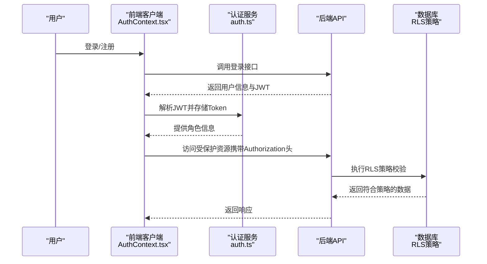
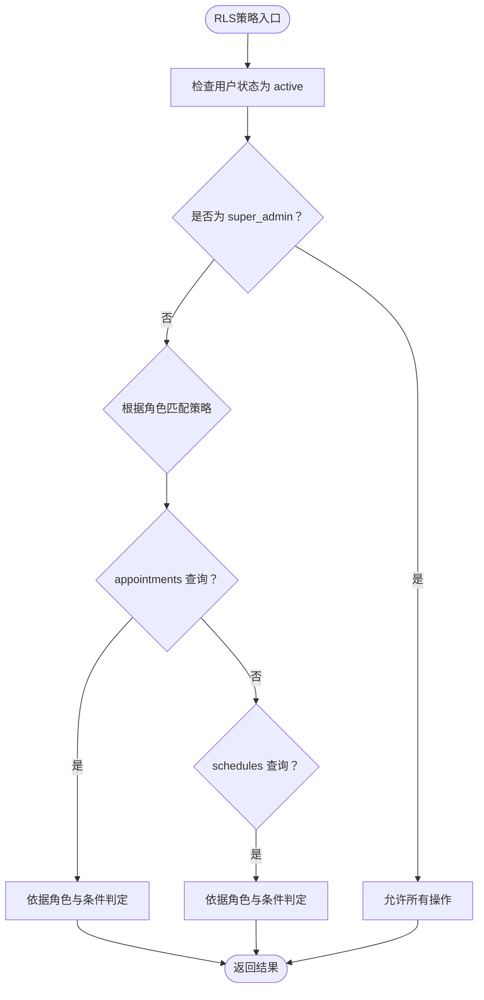
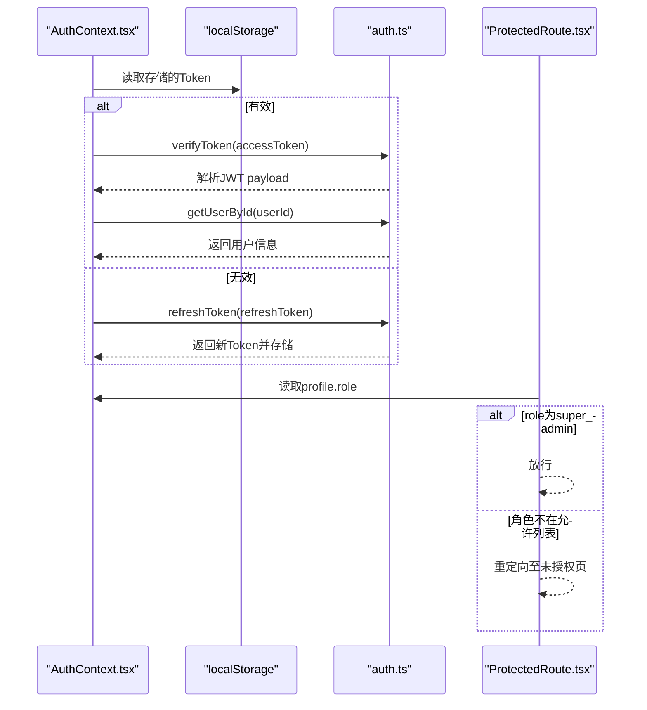
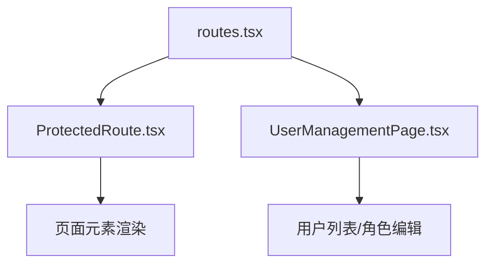
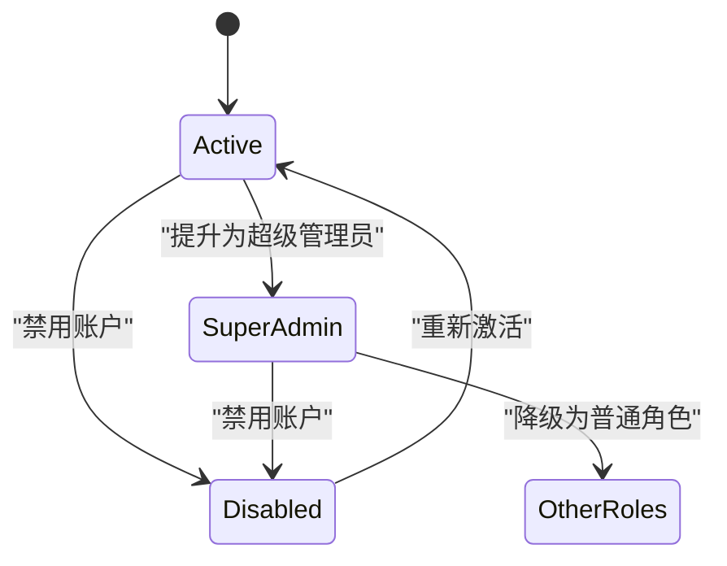
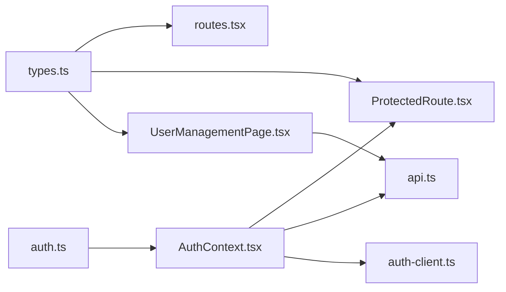

# 角色权限体系

<cite>
**本文引用的文件**
- [00004_create_user_profiles_and_auth.sql](file://supabase/migrations/00004_create_user_profiles_and_auth.sql)
- [00006_add_super_admin_role.sql](file://supabase/migrations/00006_add_super_admin_role.sql)
- [00007_update_profiles_structure_and_auth.sql](file://supabase/migrations/00007_update_profiles_structure_and_auth.sql)
- [00008_add_rls_policies_for_role_based_access.sql](file://supabase/migrations/00008_add_rls_policies_for_role_based_access.sql)
- [auth.ts](file://src/services/auth.ts)
- [auth-client.ts](file://src/services/auth-client.ts)
- [AuthContext.tsx](file://src/contexts/AuthContext.tsx)
- [ProtectedRoute.tsx](file://src/components/auth/ProtectedRoute.tsx)
- [routes.tsx](file://src/routes.tsx)
- [UserManagementPage.tsx](file://src/pages/admin/UserManagementPage.tsx)
- [types.ts](file://src/types/types.ts)
- [api.ts](file://src/db/api.ts)
</cite>

## 目录
1. [简介](#简介)
2. [项目结构](#项目结构)
3. [核心组件](#核心组件)
4. [架构总览](#架构总览)
5. [详细组件分析](#详细组件分析)
6. [依赖关系分析](#依赖关系分析)
7. [性能考量](#性能考量)
8. [故障排查指南](#故障排查指南)
9. [结论](#结论)
10. [附录](#附录)

## 简介
本文件系统化梳理 Bio-Appointment 的角色权限体系，围绕五种核心角色（super_admin、sales、head_nurse、nurse、doctor）展开，结合数据库迁移脚本与前端认证逻辑，完整说明角色字段枚举定义、超级管理员的特殊权限配置、各角色在不同业务场景下的操作边界，并解释 JWT 中角色信息的传递与在请求上下文中的使用方式。同时提供基于角色的路由守卫与组件渲染控制示例路径，以及权限升级与降级的管理流程说明。

## 项目结构
围绕角色权限的关键文件分布如下：
- 数据库层：通过多阶段迁移脚本定义角色枚举、用户状态、权限辅助函数与 RLS 策略，覆盖 profiles、appointments、schedules 等表。
- 前端认证层：提供 JWT 生成与校验、Token 存储与刷新、上下文状态管理、路由守卫与组件渲染控制。
- 类型定义层：统一声明 UserRole、UserStatus 等类型，确保前后端一致。

图表来源
- [00004_create_user_profiles_and_auth.sql](file://supabase/migrations/00004_create_user_profiles_and_auth.sql#L50-L151)
- [00006_add_super_admin_role.sql](file://supabase/migrations/00006_add_super_admin_role.sql#L9-L17)
- [00007_update_profiles_structure_and_auth.sql](file://supabase/migrations/00007_update_profiles_structure_and_auth.sql#L25-L137)
- [00008_add_rls_policies_for_role_based_access.sql](file://supabase/migrations/00008_add_rls_policies_for_role_based_access.sql#L31-L180)
- [types.ts](file://src/types/types.ts#L5-L10)
- [AuthContext.tsx](file://src/contexts/AuthContext.tsx#L283-L308)
- [ProtectedRoute.tsx](file://src/components/auth/ProtectedRoute.tsx#L12-L49)
- [routes.tsx](file://src/routes.tsx#L39-L135)
- [UserManagementPage.tsx](file://src/pages/admin/UserManagementPage.tsx#L66-L110)
- [api.ts](file://src/db/api.ts#L193-L342)

章节来源
- [00004_create_user_profiles_and_auth.sql](file://supabase/migrations/00004_create_user_profiles_and_auth.sql#L50-L151)
- [00006_add_super_admin_role.sql](file://supabase/migrations/00006_add_super_admin_role.sql#L9-L17)
- [00007_update_profiles_structure_and_auth.sql](file://supabase/migrations/00007_update_profiles_structure_and_auth.sql#L25-L137)
- [00008_add_rls_policies_for_role_based_access.sql](file://supabase/migrations/00008_add_rls_policies_for_role_based_access.sql#L31-L180)
- [types.ts](file://src/types/types.ts#L5-L10)
- [AuthContext.tsx](file://src/contexts/AuthContext.tsx#L283-L308)
- [ProtectedRoute.tsx](file://src/components/auth/ProtectedRoute.tsx#L12-L49)
- [routes.tsx](file://src/routes.tsx#L39-L135)
- [UserManagementPage.tsx](file://src/pages/admin/UserManagementPage.tsx#L66-L110)
- [api.ts](file://src/db/api.ts#L193-L342)

## 核心组件
- 角色枚举与状态
  - 枚举类型：super_admin、sales、head_nurse、nurse、doctor；状态：active、disabled。
  - 迁移脚本在多处定义并启用 user_role 与 user_status 枚举，确保数据库层面的强约束。
- 权限辅助函数
  - is_admin(uid)：判断是否为超级管理员且状态为 active。
  - get_user_role(uid)：获取当前有效用户的角色。
  - has_role(uid, required_role)：检查用户是否拥有指定角色。
- RLS 策略
  - 对 profiles、appointments、schedules 等表建立基于角色的行级安全策略，明确各角色的查看、创建、更新权限边界。
- 前端认证与上下文
  - JWT 生成与校验、Token 存储与刷新、AuthContext 提供认证状态、isAdmin 判断、路由守卫 ProtectedRoute 实现角色级访问控制。
- 类型与路由
  - types.ts 统一 UserRole 类型；routes.tsx 定义各页面所需角色；UserManagementPage.tsx 提供用户管理界面与角色变更入口。

章节来源
- [00004_create_user_profiles_and_auth.sql](file://supabase/migrations/00004_create_user_profiles_and_auth.sql#L50-L151)
- [00006_add_super_admin_role.sql](file://supabase/migrations/00006_add_super_admin_role.sql#L9-L17)
- [00007_update_profiles_structure_and_auth.sql](file://supabase/migrations/00007_update_profiles_structure_and_auth.sql#L85-L137)
- [00008_add_rls_policies_for_role_based_access.sql](file://supabase/migrations/00008_add_rls_policies_for_role_based_access.sql#L31-L180)
- [auth.ts](file://src/services/auth.ts#L17-L34)
- [auth-client.ts](file://src/services/auth-client.ts#L21-L57)
- [AuthContext.tsx](file://src/contexts/AuthContext.tsx#L283-L308)
- [ProtectedRoute.tsx](file://src/components/auth/ProtectedRoute.tsx#L12-L49)
- [routes.tsx](file://src/routes.tsx#L39-L135)
- [UserManagementPage.tsx](file://src/pages/admin/UserManagementPage.tsx#L66-L110)
- [types.ts](file://src/types/types.ts#L5-L10)

## 架构总览
角色权限体系由“数据库层（RLS + 辅助函数）+ 前端认证层（JWT + 上下文 + 路由守卫）”构成，形成“服务端强约束 + 客户端弱约束”的双层保障。

图表来源
- [auth.ts](file://src/services/auth.ts#L52-L113)
- [auth-client.ts](file://src/services/auth-client.ts#L59-L126)
- [AuthContext.tsx](file://src/contexts/AuthContext.tsx#L154-L189)
- [00008_add_rls_policies_for_role_based_access.sql](file://supabase/migrations/00008_add_rls_policies_for_role_based_access.sql#L31-L180)

## 详细组件分析

### 数据库角色与RLS策略
- 角色枚举与状态
  - 在 profiles 表中，role 字段使用 user_role 枚举，status 使用 user_status 枚举，默认 role 为 sales，status 为 active。
- 权限辅助函数
  - is_admin(uid)：仅当用户角色为 super_admin 且状态为 active 时返回真。
  - get_user_role(uid)：返回当前有效用户的角色。
  - has_role(uid, required_role)：检查用户是否拥有指定角色且状态为 active。
- RLS 策略（appointments）
  - 查看权限：super_admin 与 head_nurse 可查看所有；sales 仅可查看自己创建的；doctor 仅可查看分配给自己的；nurse 可查看所有。
  - 创建权限：sales 可创建预约。
  - 更新权限：sales 仅可更新自己创建的且状态为 pending 的预约；head_nurse 可更新所有；doctor 仅可更新分配给自己的预约的医生相关字段。
- RLS 策略（schedules）
  - 查看权限：super_admin 与 head_nurse 可查看所有；nurse 仅可查看分配给自己的；sales 可查看与其创建的预约相关的排班。
  - 创建权限：head_nurse 可创建排班。
  - 更新权限：head_nurse 可更新所有；nurse 仅可更新分配给自己的排班的状态字段。

图表来源
- [00004_create_user_profiles_and_auth.sql](file://supabase/migrations/00004_create_user_profiles_and_auth.sql#L75-L151)
- [00008_add_rls_policies_for_role_based_access.sql](file://supabase/migrations/00008_add_rls_policies_for_role_based_access.sql#L52-L180)

章节来源
- [00004_create_user_profiles_and_auth.sql](file://supabase/migrations/00004_create_user_profiles_and_auth.sql#L50-L151)
- [00006_add_super_admin_role.sql](file://supabase/migrations/00006_add_super_admin_role.sql#L9-L17)
- [00007_update_profiles_structure_and_auth.sql](file://supabase/migrations/00007_update_profiles_structure_and_auth.sql#L85-L137)
- [00008_add_rls_policies_for_role_based_access.sql](file://supabase/migrations/00008_add_rls_policies_for_role_based_access.sql#L31-L180)

### 前端认证与JWT
- JWT 结构与生成
  - payload 包含 userId、email、role；前端使用密钥生成与校验，支持刷新。
- Token 存储与刷新
  - 前端使用 localStorage 存储 accessToken 与 refreshToken；在过期前自动刷新；异常时清理并登出。
- 上下文与角色判断
  - AuthContext 暴露 isAdmin（role === super_admin）与 profile，供组件与路由守卫使用。
- 路由守卫与组件渲染
  - ProtectedRoute 支持 requiredRole 或角色数组；super_admin 直接放行；否则校验当前角色是否在允许列表。

图表来源
- [auth.ts](file://src/services/auth.ts#L52-L113)
- [auth-client.ts](file://src/services/auth-client.ts#L31-L57)
- [AuthContext.tsx](file://src/contexts/AuthContext.tsx#L154-L189)
- [ProtectedRoute.tsx](file://src/components/auth/ProtectedRoute.tsx#L12-L49)

章节来源
- [auth.ts](file://src/services/auth.ts#L17-L34)
- [auth.ts](file://src/services/auth.ts#L52-L113)
- [auth-client.ts](file://src/services/auth-client.ts#L31-L57)
- [AuthContext.tsx](file://src/contexts/AuthContext.tsx#L283-L308)
- [ProtectedRoute.tsx](file://src/components/auth/ProtectedRoute.tsx#L12-L49)

### 路由与页面权限
- 路由配置
  - routes.tsx 为各页面设置 requireAuth 与 requiredRole，如销售端预约、护士长排班、护士任务、医生预约、管理员用户管理与系统配置。
- 页面渲染控制
  - UserManagementPage.tsx 展示用户列表与角色标签，提供角色编辑入口；当前用户不可编辑自身。

图表来源
- [routes.tsx](file://src/routes.tsx#L39-L135)
- [ProtectedRoute.tsx](file://src/components/auth/ProtectedRoute.tsx#L12-L49)
- [UserManagementPage.tsx](file://src/pages/admin/UserManagementPage.tsx#L66-L110)

章节来源
- [routes.tsx](file://src/routes.tsx#L39-L135)
- [ProtectedRoute.tsx](file://src/components/auth/ProtectedRoute.tsx#L12-L49)
- [UserManagementPage.tsx](file://src/pages/admin/UserManagementPage.tsx#L66-L110)

### 权限升级与降级管理流程
- 升级
  - 通过管理员界面（UserManagementPage.tsx）将用户角色从 sales/head_nurse/nurse/doctor 提升为 super_admin。
- 降级
  - 将用户角色从 super_admin 降为其他角色，或禁用账户（status=disabled）使其无法访问。
- 数据一致性
  - 数据库侧通过 RLS 策略与辅助函数保证：只有 active 状态且满足角色条件的用户才能访问对应资源。

图表来源
- [00004_create_user_profiles_and_auth.sql](file://supabase/migrations/00004_create_user_profiles_and_auth.sql#L75-L151)
- [00008_add_rls_policies_for_role_based_access.sql](file://supabase/migrations/00008_add_rls_policies_for_role_based_access.sql#L31-L180)
- [UserManagementPage.tsx](file://src/pages/admin/UserManagementPage.tsx#L116-L169)

章节来源
- [00004_create_user_profiles_and_auth.sql](file://supabase/migrations/00004_create_user_profiles_and_auth.sql#L75-L151)
- [00008_add_rls_policies_for_role_based_access.sql](file://supabase/migrations/00008_add_rls_policies_for_role_based_access.sql#L31-L180)
- [UserManagementPage.tsx](file://src/pages/admin/UserManagementPage.tsx#L116-L169)

## 依赖关系分析
- 类型依赖
  - types.ts 定义 UserRole，被 routes.tsx、ProtectedRoute.tsx、UserManagementPage.tsx 引用，确保角色类型一致。
- 认证服务依赖
  - auth.ts 与 auth-client.ts 分别负责服务端与客户端的 JWT 生成/校验与 API 调用；AuthContext.tsx 作为全局状态容器协调二者。
- 路由与守卫
  - routes.tsx 通过 requiredRole 与 ProtectedRoute.tsx 实现页面级权限控制；UserManagementPage.tsx 通过 API 调用实现用户角色变更。

图表来源
- [types.ts](file://src/types/types.ts#L5-L10)
- [routes.tsx](file://src/routes.tsx#L39-L135)
- [ProtectedRoute.tsx](file://src/components/auth/ProtectedRoute.tsx#L12-L49)
- [UserManagementPage.tsx](file://src/pages/admin/UserManagementPage.tsx#L66-L110)
- [auth.ts](file://src/services/auth.ts#L52-L113)
- [auth-client.ts](file://src/services/auth-client.ts#L59-L126)
- [AuthContext.tsx](file://src/contexts/AuthContext.tsx#L154-L189)
- [api.ts](file://src/db/api.ts#L193-L342)

章节来源
- [types.ts](file://src/types/types.ts#L5-L10)
- [routes.tsx](file://src/routes.tsx#L39-L135)
- [ProtectedRoute.tsx](file://src/components/auth/ProtectedRoute.tsx#L12-L49)
- [UserManagementPage.tsx](file://src/pages/admin/UserManagementPage.tsx#L66-L110)
- [auth.ts](file://src/services/auth.ts#L52-L113)
- [auth-client.ts](file://src/services/auth-client.ts#L59-L126)
- [AuthContext.tsx](file://src/contexts/AuthContext.tsx#L154-L189)
- [api.ts](file://src/db/api.ts#L193-L342)

## 性能考量
- RLS 策略复杂度
  - RLS 策略在查询时动态评估，涉及函数调用与条件判断，建议在 profiles、appointments、schedules 表上维护合适的索引（如 role、status、created_by、doctor_id、nurse_id 等）以降低查询成本。
- 前端鉴权
  - ProtectedRoute 与 AuthContext 的角色判断为轻量计算，对性能影响较小；Token 刷新采用定时器轮询，建议在空闲时减少检查频率或合并刷新逻辑。
- 缓存与懒加载
  - 对于用户列表与角色详情，可在前端引入缓存与分页，避免一次性加载过多数据。

## 故障排查指南
- 登录失败
  - 检查 auth-client.ts 的登录接口返回与错误消息；确认 API 地址与网络连通性。
- Token 过期或无效
  - 检查 AuthContext.tsx 的自动刷新逻辑与错误处理分支；确认 localStorage 中的 token 是否存在。
- 页面无权限访问
  - 检查 routes.tsx 的 requiredRole 设置与 ProtectedRoute.tsx 的角色判断；确认当前用户 profile.role 是否正确。
- 用户管理异常
  - 检查 UserManagementPage.tsx 的 API 调用与错误提示；确认管理员权限与数据库 RLS 策略未被意外覆盖。

章节来源
- [auth-client.ts](file://src/services/auth-client.ts#L59-L126)
- [AuthContext.tsx](file://src/contexts/AuthContext.tsx#L232-L276)
- [ProtectedRoute.tsx](file://src/components/auth/ProtectedRoute.tsx#L12-L49)
- [routes.tsx](file://src/routes.tsx#L39-L135)
- [UserManagementPage.tsx](file://src/pages/admin/UserManagementPage.tsx#L116-L169)

## 结论
本权限体系通过数据库层的 RLS 策略与辅助函数，配合前端的 JWT 认证与路由守卫，实现了清晰、可扩展的角色权限模型。super_admin 拥有最高权限，其他角色在预约与排班等关键业务场景下具备明确的操作边界。管理员可通过用户管理界面完成角色升级与降级，并通过状态变更实现即时生效的访问控制。

## 附录
- 角色权限对照（摘自数据库策略注释）
  - appointments
    - 查看：super_admin、head_nurse；sales（仅自己创建）；doctor（仅分配给自己）；nurse（所有）
    - 创建：sales
    - 更新：sales（仅 pending 且自己创建）；head_nurse（所有）；doctor（仅分配给自己）
  - schedules
    - 查看：super_admin、head_nurse；nurse（仅自己）；sales（与其创建的预约相关）
    - 创建：head_nurse
    - 更新：head_nurse（所有）；nurse（仅自己）

章节来源
- [00008_add_rls_policies_for_role_based_access.sql](file://supabase/migrations/00008_add_rls_policies_for_role_based_access.sql#L1-L29)