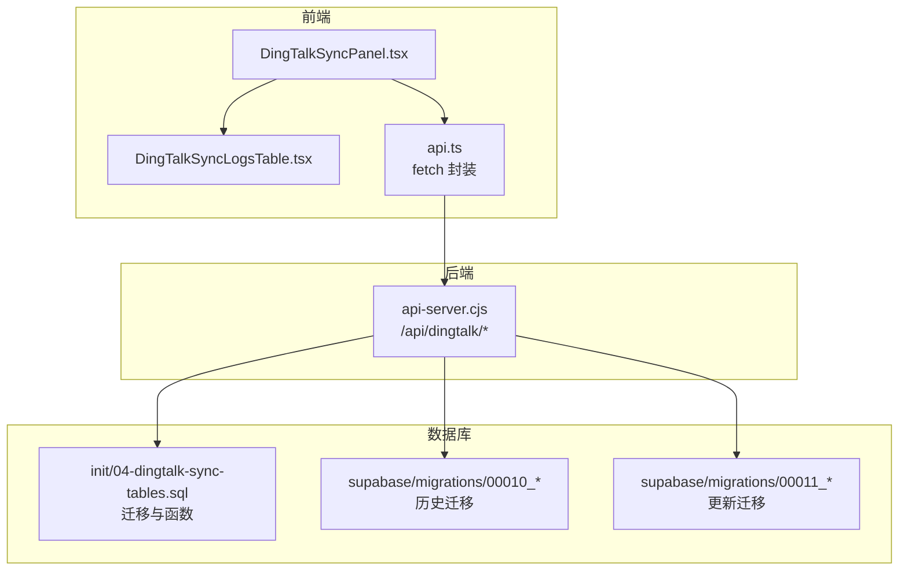
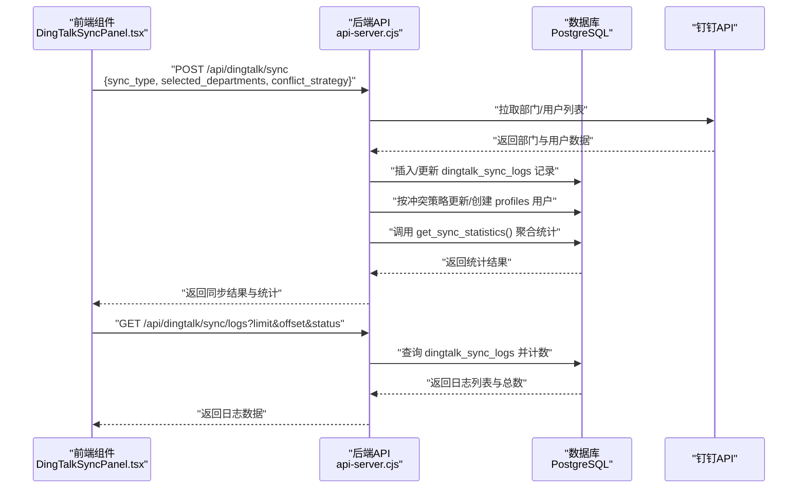
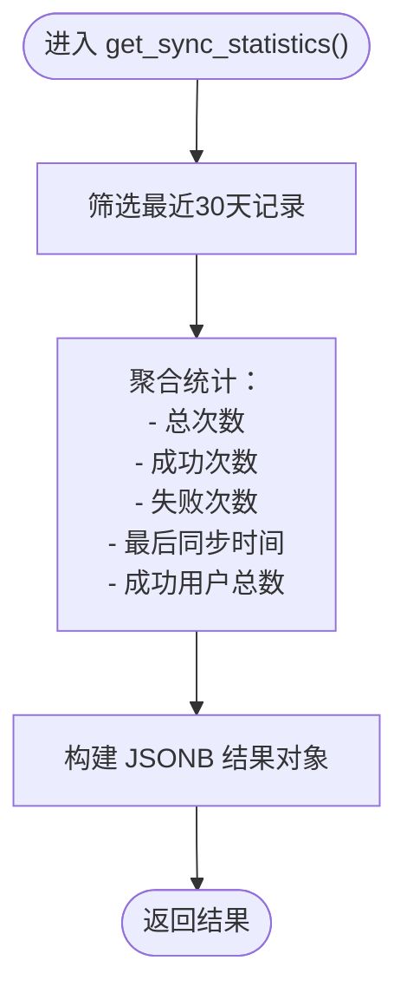
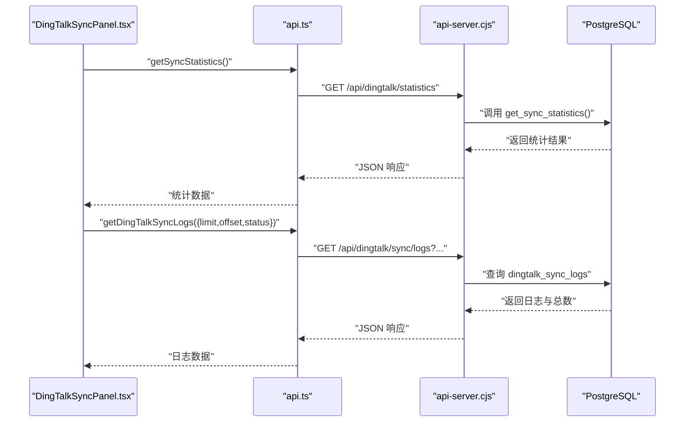
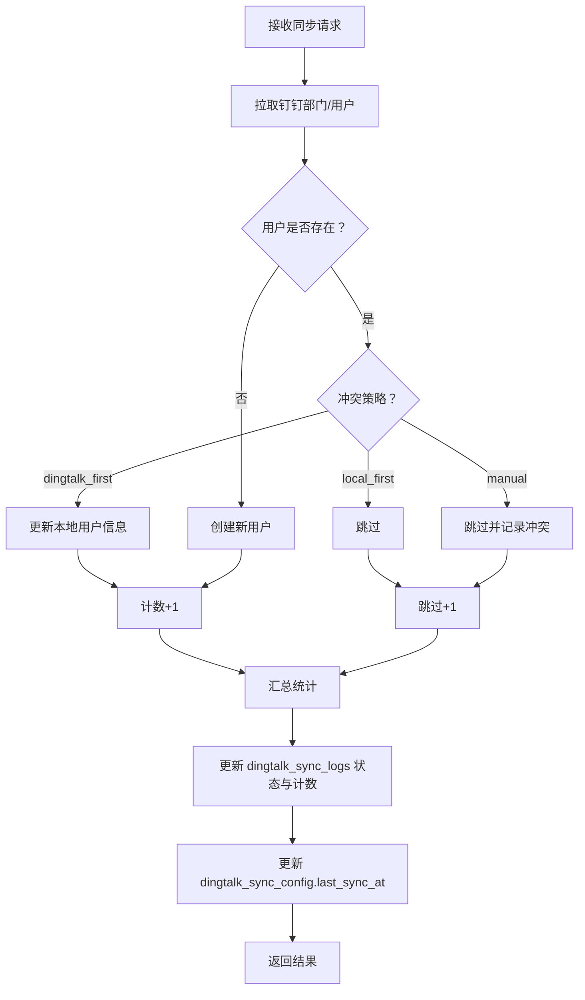
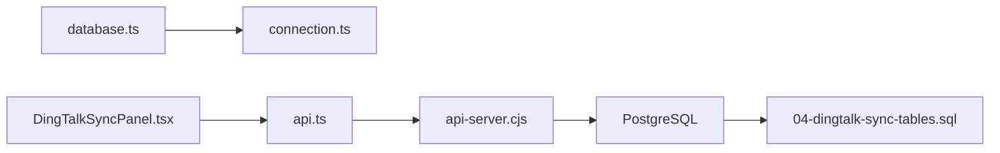

# 同步日志与监控

<cite>
**本文引用的文件**
- [04-dingtalk-sync-tables.sql](file://database/init/04-dingtalk-sync-tables.sql)
- [00010_create_dingtalk_sync_tables.sql](file://supabase/migrations/00010_create_dingtalk_sync_tables.sql)
- [00011_update_dingtalk_sync_tables.sql](file://supabase/migrations/00011_update_dingtalk_sync_tables.sql)
- [database.ts](file://src/db/database.ts)
- [connection.ts](file://src/db/connection.ts)
- [DingTalkSyncPanel.tsx](file://src/components/dingtalk/DingTalkSyncPanel.tsx)
- [DingTalkSyncLogsTable.tsx](file://src/components/dingtalk/DingTalkSyncLogsTable.tsx)
- [api.ts](file://src/db/api.ts)
- [api-server.cjs](file://server/api-server.cjs)
- [钉钉同步快速参考.md](file://钉钉同步快速参考.md)
</cite>

## 目录
1. [简介](#简介)
2. [项目结构](#项目结构)
3. [核心组件](#核心组件)
4. [架构总览](#架构总览)
5. [详细组件分析](#详细组件分析)
6. [依赖关系分析](#依赖关系分析)
7. [性能考量](#性能考量)
8. [故障排查指南](#故障排查指南)
9. [结论](#结论)

## 简介
本文件面向“钉钉同步日志与监控”主题，系统化梳理数据库表结构、枚举类型语义、统计函数、前端调用链路以及索引与触发器优化策略。重点围绕 dingtalk_sync_logs 表的字段含义（sync_type、status、total_users、success_count、failed_count、skipped_count、details），解释 get_sync_statistics() 如何聚合最近30天的同步记录生成统计报表，并结合 src/db/database.ts 中的 getDatabase() 接口说明前端如何通过后端 API 获取日志列表与统计信息。同时给出索引优化建议与触发器自动维护 updated_at 的机制说明。

## 项目结构
该系统由前端 React 组件、数据库迁移脚本、后端 API 服务器三部分组成：
- 数据库层：定义同步配置、日志与部门映射表，创建枚举类型、索引与触发器，并提供 get_sync_statistics() 聚合统计函数。
- 后端 API 层：提供钉钉同步触发、日志查询、统计查询等接口。
- 前端层：通过组件发起请求，渲染日志表格与统计卡片，并在同步完成后刷新用户列表。

图表来源
- [DingTalkSyncPanel.tsx](file://src/components/dingtalk/DingTalkSyncPanel.tsx#L1-L237)
- [DingTalkSyncLogsTable.tsx](file://src/components/dingtalk/DingTalkSyncLogsTable.tsx#L1-L91)
- [api.ts](file://src/db/api.ts#L1366-L1407)
- [api-server.cjs](file://server/api-server.cjs#L1444-L1483)
- [04-dingtalk-sync-tables.sql](file://database/init/04-dingtalk-sync-tables.sql#L44-L131)
- [00010_create_dingtalk_sync_tables.sql](file://supabase/migrations/00010_create_dingtalk_sync_tables.sql#L57-L120)
- [00011_update_dingtalk_sync_tables.sql](file://supabase/migrations/00011_update_dingtalk_sync_tables.sql#L129-L169)

章节来源
- [04-dingtalk-sync-tables.sql](file://database/init/04-dingtalk-sync-tables.sql#L44-L131)
- [00010_create_dingtalk_sync_tables.sql](file://supabase/migrations/00010_create_dingtalk_sync_tables.sql#L57-L120)
- [00011_update_dingtalk_sync_tables.sql](file://supabase/migrations/00011_update_dingtalk_sync_tables.sql#L129-L169)
- [api-server.cjs](file://server/api-server.cjs#L1444-L1483)
- [DingTalkSyncPanel.tsx](file://src/components/dingtalk/DingTalkSyncPanel.tsx#L1-L237)
- [DingTalkSyncLogsTable.tsx](file://src/components/dingtalk/DingTalkSyncLogsTable.tsx#L1-L91)
- [api.ts](file://src/db/api.ts#L1366-L1407)

## 核心组件
- 数据库表与枚举
  - 同步配置表：保存钉钉应用参数、冲突策略、自动同步开关与时间等。
  - 同步日志表：记录每次同步的类型、状态、计数、错误信息与详情。
  - 部门映射表：维护钉钉部门与本地部门的映射关系。
  - 枚举类型：sync_type（manual/auto/incremental）、status（pending/running/success/failed/partial）、conflict_strategy（dingtalk_first/local_first/manual）。
- 统计函数：get_sync_statistics() 聚合最近30天的同步记录，返回总次数、成功/失败次数、最后同步时间、累计同步用户数。
- 触发器：update_updated_at_column() 自动更新 updated_at 字段。
- 前端组件：DingTalkSyncPanel.tsx 负责加载配置、统计与日志；DingTalkSyncLogsTable.tsx 渲染日志表格。
- 后端 API：/api/dingtalk/sync/logs 提供分页查询；/api/dingtalk/sync 触发同步；/api/dingtalk/statistics 返回统计。

章节来源
- [04-dingtalk-sync-tables.sql](file://database/init/04-dingtalk-sync-tables.sql#L44-L131)
- [00010_create_dingtalk_sync_tables.sql](file://supabase/migrations/00010_create_dingtalk_sync_tables.sql#L57-L120)
- [00011_update_dingtalk_sync_tables.sql](file://supabase/migrations/00011_update_dingtalk_sync_tables.sql#L129-L169)
- [DingTalkSyncPanel.tsx](file://src/components/dingtalk/DingTalkSyncPanel.tsx#L1-L237)
- [DingTalkSyncLogsTable.tsx](file://src/components/dingtalk/DingTalkSyncLogsTable.tsx#L1-L91)
- [api-server.cjs](file://server/api-server.cjs#L1444-L1483)

## 架构总览
下图展示了从前端到后端再到数据库的整体流程，包括同步触发、日志写入、统计聚合与前端展示。

图表来源
- [DingTalkSyncPanel.tsx](file://src/components/dingtalk/DingTalkSyncPanel.tsx#L1-L237)
- [api-server.cjs](file://server/api-server.cjs#L1190-L1503)
- [04-dingtalk-sync-tables.sql](file://database/init/04-dingtalk-sync-tables.sql#L104-L131)

## 详细组件分析

### 数据库表与字段语义
- dingtalk_sync_logs
  - sync_type：同步类型，枚举值包括 manual（手动）、auto（自动）、incremental（增量）。用于区分触发来源与策略差异。
  - status：同步状态，枚举值包括 pending（待处理）、running（进行中，通常由后端在执行时设置）、success（成功）、failed（失败）、partial（部分成功）。用于直观反映同步结果。
  - total_users、success_count、failed_count、skipped_count：统计字段，分别表示本次同步处理的总用户数、成功数、失败数、跳过数，便于快速评估同步质量。
  - error_message：失败时记录错误信息，辅助定位问题。
  - details JSONB：存储详细的同步过程数据，例如每个部门的处理摘要、失败明细等，便于审计与复盘。
  - started_at、completed_at：记录同步开始与结束时间，支持按时间排序与筛选。
  - created_by：记录触发同步的操作者，便于追踪责任。
  - created_at：记录日志创建时间，配合索引支持高效查询。
- dingtalk_sync_config
  - 包含钉钉应用参数、冲突策略、自动同步开关与时间等，决定同步行为与策略。
- dingtalk_department_mapping
  - 维护钉钉部门与本地部门的映射，支持排序与启用状态控制。

章节来源
- [04-dingtalk-sync-tables.sql](file://database/init/04-dingtalk-sync-tables.sql#L44-L103)
- [00010_create_dingtalk_sync_tables.sql](file://supabase/migrations/00010_create_dingtalk_sync_tables.sql#L84-L112)
- [00011_update_dingtalk_sync_tables.sql](file://supabase/migrations/00011_update_dingtalk_sync_tables.sql#L129-L169)

### get_sync_statistics() 统计函数
- 功能：聚合最近30天的同步记录，返回以下指标：
  - total_syncs：总同步次数
  - success_count：成功次数
  - failed_count：失败次数
  - last_sync：最近一次同步时间
  - total_users_synced：累计成功同步用户数（sum(success_count)）
- 实现要点：
  - 使用窗口期过滤（started_at > now() - interval '30 days'）
  - 使用条件聚合（COUNT(*) FILTER (WHERE status = 'success'|'failed')）与 SUM(success_count)
  - 返回 JSONB 结构，便于前端直接消费

图表来源
- [04-dingtalk-sync-tables.sql](file://database/init/04-dingtalk-sync-tables.sql#L104-L131)
- [00010_create_dingtalk_sync_tables.sql](file://supabase/migrations/00010_create_dingtalk_sync_tables.sql#L167-L189)
- [00011_update_dingtalk_sync_tables.sql](file://supabase/migrations/00011_update_dingtalk_sync_tables.sql#L147-L169)

章节来源
- [04-dingtalk-sync-tables.sql](file://database/init/04-dingtalk-sync-tables.sql#L104-L131)
- [00010_create_dingtalk_sync_tables.sql](file://supabase/migrations/00010_create_dingtalk_sync_tables.sql#L167-L189)
- [00011_update_dingtalk_sync_tables.sql](file://supabase/migrations/00011_update_dingtalk_sync_tables.sql#L147-L169)

### 前端调用链路与 UI 组件
- DingTalkSyncPanel.tsx
  - 初始化加载配置、统计与日志
  - 提供手动同步按钮，调用后端 /api/dingtalk/sync
  - 调用 getSyncStatistics() 获取统计卡片数据
  - 调用 getDingTalkSyncLogs() 获取日志列表
  - 同步完成后可触发 onSyncComplete 回调以刷新用户列表
- DingTalkSyncLogsTable.tsx
  - 渲染日志表格，包含同步时间、类型、状态、计数与操作人
  - 提供刷新按钮与骨架屏加载态
- api.ts 中的 getDingTalkSyncLogs() 与 getSyncStatistics() 封装了 fetch 请求，统一处理鉴权头与错误

图表来源
- [DingTalkSyncPanel.tsx](file://src/components/dingtalk/DingTalkSyncPanel.tsx#L1-L237)
- [DingTalkSyncLogsTable.tsx](file://src/components/dingtalk/DingTalkSyncLogsTable.tsx#L1-L91)
- [api.ts](file://src/db/api.ts#L1366-L1407)
- [api-server.cjs](file://server/api-server.cjs#L1444-L1483)

章节来源
- [DingTalkSyncPanel.tsx](file://src/components/dingtalk/DingTalkSyncPanel.tsx#L1-L237)
- [DingTalkSyncLogsTable.tsx](file://src/components/dingtalk/DingTalkSyncLogsTable.tsx#L1-L91)
- [api.ts](file://src/db/api.ts#L1366-L1407)
- [api-server.cjs](file://server/api-server.cjs#L1444-L1483)

### 同步执行与日志更新（后端）
- 触发同步后，后端会：
  - 拉取钉钉部门与用户列表
  - 根据冲突策略（conflict_strategy）决定更新或跳过
  - 插入/更新 dingtalk_sync_logs 记录
  - 在同步完成后根据成功/失败情况更新 status、计数字段与 details
  - 更新 dingtalk_sync_config.last_sync_at

图表来源
- [api-server.cjs](file://server/api-server.cjs#L1190-L1503)

章节来源
- [api-server.cjs](file://server/api-server.cjs#L1190-L1503)

### 索引与触发器优化
- 索引
  - idx_sync_logs_status：加速按状态过滤
  - idx_sync_logs_created_at：按时间倒序查询，支持分页与最新记录展示
  - idx_sync_logs_created_by：关联 profiles 查询
  - idx_dept_mapping_dingtalk_id、idx_dept_mapping_enabled：加速部门映射查询
- 触发器
  - update_updated_at_column()：在更新配置与部门映射表时自动更新 updated_at 字段，避免遗漏

章节来源
- [04-dingtalk-sync-tables.sql](file://database/init/04-dingtalk-sync-tables.sql#L75-L103)
- [00010_create_dingtalk_sync_tables.sql](file://supabase/migrations/00010_create_dingtalk_sync_tables.sql#L114-L120)
- [00011_update_dingtalk_sync_tables.sql](file://supabase/migrations/00011_update_dingtalk_sync_tables.sql#L134-L146)

## 依赖关系分析
- 前端依赖
  - getDatabase() 从 src/db/database.ts 导出，封装 query 与 DatabaseHelper，供业务模块使用
  - DingTalkSyncPanel.tsx 依赖 api.ts 的 getDingTalkSyncLogs、getSyncStatistics、triggerDingTalkSync 等方法
- 后端依赖
  - api-server.cjs 依赖数据库连接池与查询方法，负责同步逻辑与日志写入
- 数据库依赖
  - 迁移脚本定义表结构、枚举、索引与统计函数，保证查询与聚合性能

图表来源
- [database.ts](file://src/db/database.ts#L1-L43)
- [connection.ts](file://src/db/connection.ts#L1-L120)
- [DingTalkSyncPanel.tsx](file://src/components/dingtalk/DingTalkSyncPanel.tsx#L1-L237)
- [api.ts](file://src/db/api.ts#L1366-L1407)
- [api-server.cjs](file://server/api-server.cjs#L1444-L1483)
- [04-dingtalk-sync-tables.sql](file://database/init/04-dingtalk-sync-tables.sql#L44-L131)

章节来源
- [database.ts](file://src/db/database.ts#L1-L43)
- [connection.ts](file://src/db/connection.ts#L1-L120)
- [DingTalkSyncPanel.tsx](file://src/components/dingtalk/DingTalkSyncPanel.tsx#L1-L237)
- [api.ts](file://src/db/api.ts#L1366-L1407)
- [api-server.cjs](file://server/api-server.cjs#L1444-L1483)
- [04-dingtalk-sync-tables.sql](file://database/init/04-dingtalk-sync-tables.sql#L44-L131)

## 性能考量
- 查询路径
  - 日志列表：按 created_at DESC 分页，需依赖 idx_sync_logs_created_at
  - 按状态过滤：需依赖 idx_sync_logs_status
  - 关联查询：LEFT JOIN profiles 需要 idx_sync_logs_created_by
- 统计函数
  - get_sync_statistics() 对最近30天的数据进行条件聚合，建议在大量历史数据场景下保持索引有效，避免全表扫描
- 写入路径
  - 同步过程中频繁更新 dingtalk_sync_logs 与 profiles，建议批量提交与合理事务边界，减少锁竞争
- 缓存与重试
  - 可考虑在后端对热点统计结果做短期缓存，降低重复聚合开销

[本节为通用性能建议，无需特定文件引用]

## 故障排查指南
- 常见问题定位
  - 同步失败：查看 dingtalk_sync_logs.error_message 与 details，确认钉钉 API 返回码与错误消息
  - 状态异常：检查后端是否正确设置 status（success/partial/failed），以及是否在异常分支更新了日志
  - 查询缓慢：确认是否命中索引，必要时重建或调整索引顺序
- 前端调试
  - 使用钉钉同步快速参考中的命令检查配置、日志与统计函数返回
  - 在 DingTalkSyncPanel.tsx 中观察 toast 提示与统计卡片变化
- 后端调试
  - 查看 api-server.cjs 中同步流程的日志输出，确认部门/用户拉取、冲突策略执行与日志更新步骤

章节来源
- [钉钉同步快速参考.md](file://钉钉同步快速参考.md#L150-L244)
- [api-server.cjs](file://server/api-server.cjs#L1190-L1503)
- [DingTalkSyncPanel.tsx](file://src/components/dingtalk/DingTalkSyncPanel.tsx#L1-L237)

## 结论
本系统通过明确的枚举类型、完善的统计函数与索引策略，实现了对钉钉同步过程的可观测性与可运维性。前端通过统一的 API 封装与组件化展示，能够实时掌握同步状态与结果；后端在同步执行过程中严格记录日志与统计，确保问题可追溯、性能可优化。建议在生产环境中持续关注索引命中率与统计缓存策略，以进一步提升查询与聚合性能。