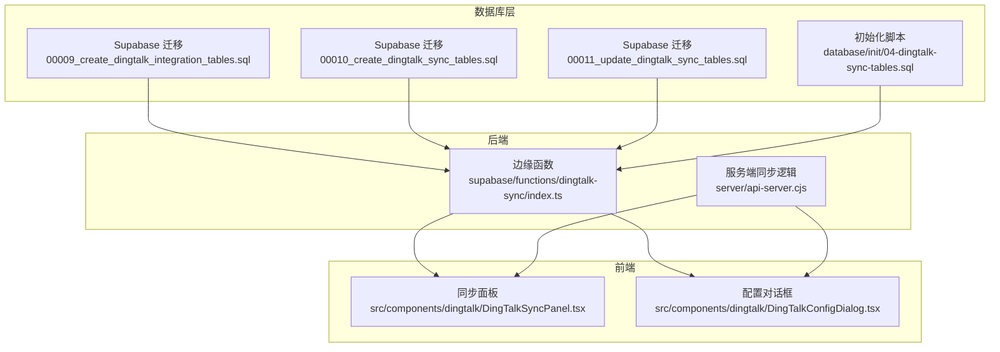
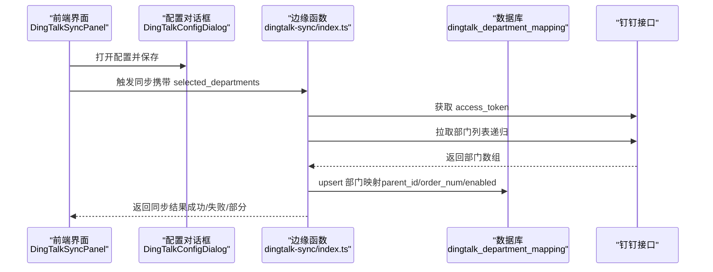
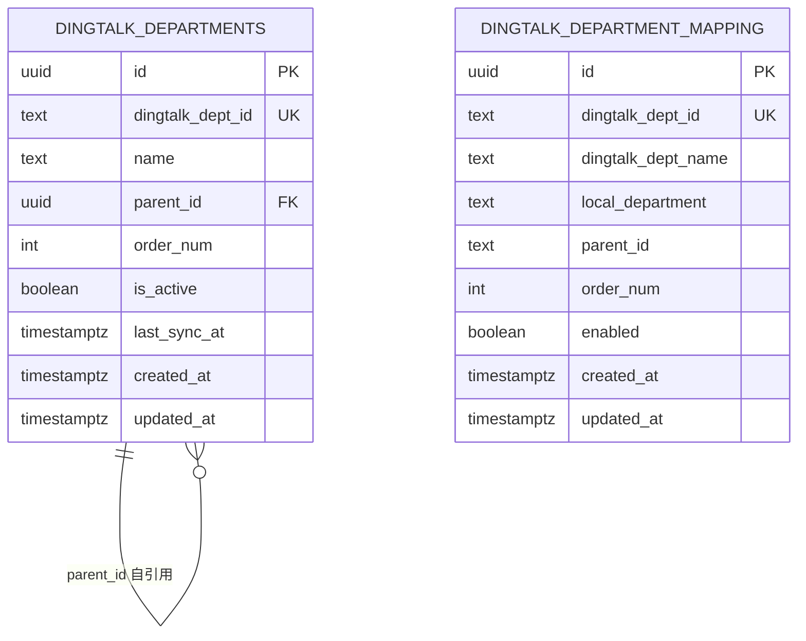
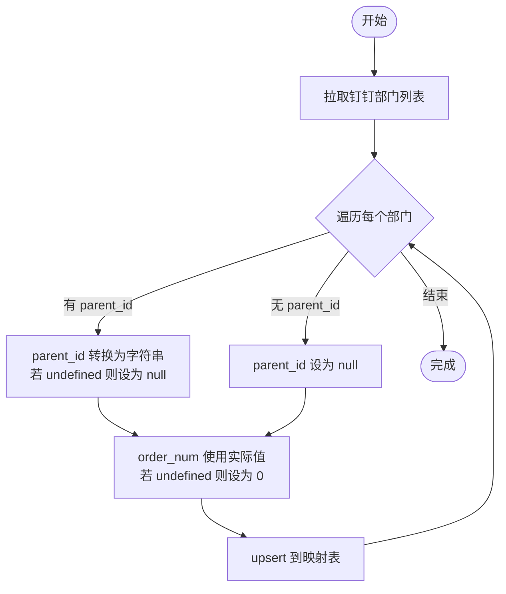
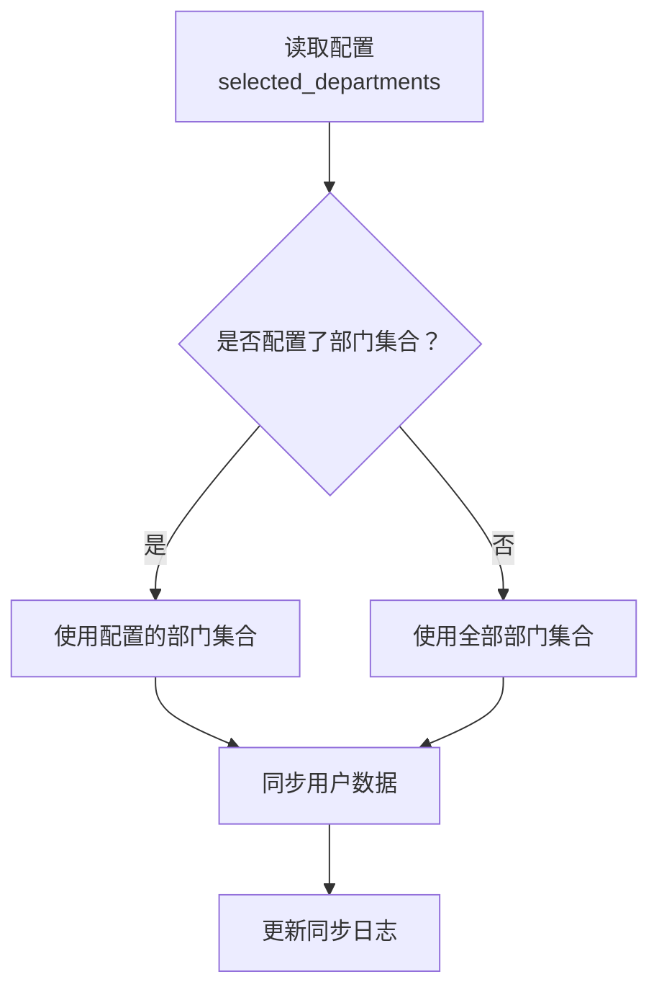
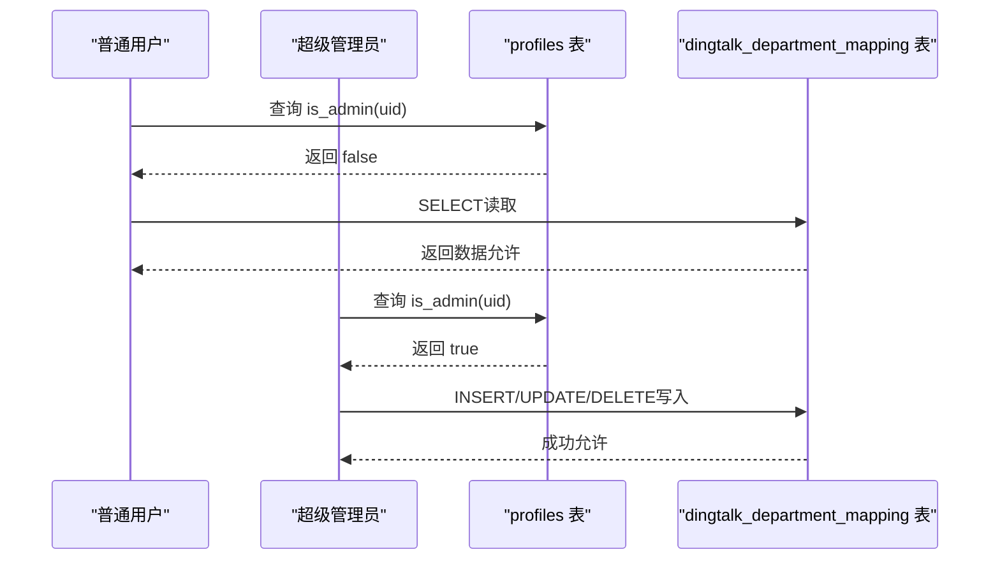
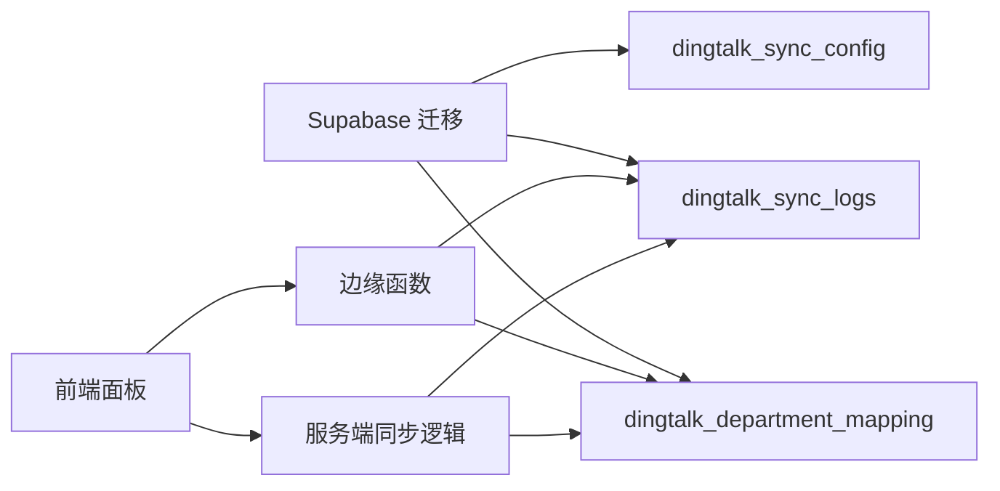

# 部门组织架构

<cite>
**本文引用的文件**
- [supabase/migrations/00009_create_dingtalk_integration_tables.sql](file://supabase/migrations/00009_create_dingtalk_integration_tables.sql)
- [supabase/migrations/00010_create_dingtalk_sync_tables.sql](file://supabase/migrations/00010_create_dingtalk_sync_tables.sql)
- [supabase/migrations/00011_update_dingtalk_sync_tables.sql](file://supabase/migrations/00011_update_dingtalk_sync_tables.sql)
- [database/init/04-dingtalk-sync-tables.sql](file://database/init/04-dingtalk-sync-tables.sql)
- [supabase/functions/dingtalk-sync/index.ts](file://supabase/functions/dingtalk-sync/index.ts)
- [server/api-server.cjs](file://server/api-server.cjs)
- [src/components/dingtalk/DingTalkSyncPanel.tsx](file://src/components/dingtalk/DingTalkSyncPanel.tsx)
- [src/components/dingtalk/DingTalkConfigDialog.tsx](file://src/components/dingtalk/DingTalkConfigDialog.tsx)
- [database/init/02-create-tables.sql](file://database/init/02-create-tables.sql)
- [database/init/03-seed-data.sql](file://database/init/03-seed-data.sql)
- [supabase/migrations/00004_create_user_profiles_and_auth.sql](file://supabase/migrations/00004_create_user_profiles_and_auth.sql)
- [supabase/migrations/00005_update_profiles_for_auth_system.sql](file://supabase/migrations/00005_update_profiles_for_auth_system.sql)
- [supabase/migrations/00007_update_profiles_structure_and_auth.sql](file://supabase/migrations/00007_update_profiles_structure_and_auth.sql)
- [supabase/migrations/00008_add_rls_policies_for_role_based_access.sql](file://supabase/migrations/00008_add_rls_policies_for_role_based_access.sql)
</cite>

## 目录
1. [简介](#简介)
2. [项目结构](#项目结构)
3. [核心组件](#核心组件)
4. [架构总览](#架构总览)
5. [详细组件分析](#详细组件分析)
6. [依赖分析](#依赖分析)
7. [性能考虑](#性能考虑)
8. [故障排除指南](#故障排除指南)
9. [结论](#结论)
10. [附录](#附录)

## 简介
本文件面向“钉钉部门组织架构集成”的完整设计与实现，重点说明两套表的设计目的与差异：
- dingtalk_departments：存储原始钉钉部门数据，用于保留钉钉侧的部门结构与元数据。
- dingtalk_department_mapping：实现钉钉部门与本地系统的映射配置，支持“本地部门名称”自定义、启用/禁用、父子关系与排序等。

同时，本文解释 parent_id 形成的树形结构如何维护层级关系，order_num 的排序作用，selected_departments JSONB 在同步范围控制中的应用；并通过 RLS 策略实现部门数据的权限控制，确保普通用户可读而仅超级管理员可修改；最后结合初始化脚本说明表结构创建与索引优化策略。

## 项目结构
围绕“钉钉部门组织架构”，涉及以下关键位置：
- 数据库迁移与初始化：Supabase 迁移与本地初始化脚本，定义表结构、索引与 RLS 策略。
- 边缘函数与服务端同步逻辑：负责拉取钉钉部门数据、写入映射表，并按配置的同步范围进行筛选。
- 前端同步面板与配置对话框：提供可视化配置与触发同步的能力。

图表来源
- [supabase/migrations/00009_create_dingtalk_integration_tables.sql](file://supabase/migrations/00009_create_dingtalk_integration_tables.sql#L1-L204)
- [supabase/migrations/00010_create_dingtalk_sync_tables.sql](file://supabase/migrations/00010_create_dingtalk_sync_tables.sql#L1-L189)
- [supabase/migrations/00011_update_dingtalk_sync_tables.sql](file://supabase/migrations/00011_update_dingtalk_sync_tables.sql#L1-L169)
- [database/init/04-dingtalk-sync-tables.sql](file://database/init/04-dingtalk-sync-tables.sql#L1-L131)
- [supabase/functions/dingtalk-sync/index.ts](file://supabase/functions/dingtalk-sync/index.ts#L1-L384)
- [server/api-server.cjs](file://server/api-server.cjs#L1186-L1268)
- [src/components/dingtalk/DingTalkSyncPanel.tsx](file://src/components/dingtalk/DingTalkSyncPanel.tsx#L1-L237)
- [src/components/dingtalk/DingTalkConfigDialog.tsx](file://src/components/dingtalk/DingTalkConfigDialog.tsx#L1-L302)

章节来源
- [supabase/migrations/00009_create_dingtalk_integration_tables.sql](file://supabase/migrations/00009_create_dingtalk_integration_tables.sql#L1-L204)
- [supabase/migrations/00010_create_dingtalk_sync_tables.sql](file://supabase/migrations/00010_create_dingtalk_sync_tables.sql#L1-L189)
- [supabase/migrations/00011_update_dingtalk_sync_tables.sql](file://supabase/migrations/00011_update_dingtalk_sync_tables.sql#L1-L169)
- [database/init/04-dingtalk-sync-tables.sql](file://database/init/04-dingtalk-sync-tables.sql#L1-L131)
- [supabase/functions/dingtalk-sync/index.ts](file://supabase/functions/dingtalk-sync/index.ts#L1-L384)
- [server/api-server.cjs](file://server/api-server.cjs#L1186-L1268)
- [src/components/dingtalk/DingTalkSyncPanel.tsx](file://src/components/dingtalk/DingTalkSyncPanel.tsx#L1-L237)
- [src/components/dingtalk/DingTalkConfigDialog.tsx](file://src/components/dingtalk/DingTalkConfigDialog.tsx#L1-L302)

## 核心组件
- dingtalk_departments（原始钉钉部门表）
  - 存储来自钉钉的部门原始数据，包含部门 ID、名称、父部门 ID、排序号、激活状态等。
  - 通过 parent_id 引用自身形成树形结构，order_num 控制展示顺序。
- dingtalk_department_mapping（部门映射表）
  - 实现钉钉部门与本地系统的映射，支持“本地部门名称”自定义、启用/禁用、父子关系与排序。
  - selected_departments JSONB 字段用于控制同步范围，支持手动选择部门集合。
- RLS 权限策略
  - 对 dingtalk_departments 与 dingtalk_department_mapping 启用 RLS，普通用户可读，超级管理员可写。
- 同步流程
  - 边缘函数/服务端从钉钉拉取部门列表，写入映射表；根据配置的 selected_departments 决定同步范围。

章节来源
- [supabase/migrations/00009_create_dingtalk_integration_tables.sql](file://supabase/migrations/00009_create_dingtalk_integration_tables.sql#L84-L120)
- [supabase/migrations/00010_create_dingtalk_sync_tables.sql](file://supabase/migrations/00010_create_dingtalk_sync_tables.sql#L37-L120)
- [supabase/migrations/00011_update_dingtalk_sync_tables.sql](file://supabase/migrations/00011_update_dingtalk_sync_tables.sql#L72-L133)
- [supabase/functions/dingtalk-sync/index.ts](file://supabase/functions/dingtalk-sync/index.ts#L138-L177)
- [database/init/04-dingtalk-sync-tables.sql](file://database/init/04-dingtalk-sync-tables.sql#L25-L81)

## 架构总览
下图展示了“钉钉部门组织架构”的端到端流程：前端触发同步 -> 后端拉取钉钉部门 -> 写入映射表 -> 前端读取并渲染。

图表来源
- [src/components/dingtalk/DingTalkSyncPanel.tsx](file://src/components/dingtalk/DingTalkSyncPanel.tsx#L66-L103)
- [src/components/dingtalk/DingTalkConfigDialog.tsx](file://src/components/dingtalk/DingTalkConfigDialog.tsx#L74-L96)
- [supabase/functions/dingtalk-sync/index.ts](file://supabase/functions/dingtalk-sync/index.ts#L138-L177)
- [supabase/migrations/00010_create_dingtalk_sync_tables.sql](file://supabase/migrations/00010_create_dingtalk_sync_tables.sql#L101-L120)

章节来源
- [src/components/dingtalk/DingTalkSyncPanel.tsx](file://src/components/dingtalk/DingTalkSyncPanel.tsx#L1-L237)
- [src/components/dingtalk/DingTalkConfigDialog.tsx](file://src/components/dingtalk/DingTalkConfigDialog.tsx#L1-L302)
- [supabase/functions/dingtalk-sync/index.ts](file://supabase/functions/dingtalk-sync/index.ts#L1-L384)

## 详细组件分析

### 表结构与职责对比
- dingtalk_departments（原始表）
  - 字段要点：dingtalk_dept_id、name、parent_id（自引用）、order_num、is_active。
  - 用途：保留钉钉原始部门结构与元数据，便于直接展示或二次加工。
- dingtalk_department_mapping（映射表）
  - 字段要点：dingtalk_dept_id、dingtalk_dept_name、local_department（本地自定义名称）、parent_id、order_num、enabled。
  - 用途：实现“钉钉部门 ↔ 本地部门”的灵活映射，支持企业内部组织结构调整。

图表来源
- [supabase/migrations/00009_create_dingtalk_integration_tables.sql](file://supabase/migrations/00009_create_dingtalk_integration_tables.sql#L84-L120)
- [supabase/migrations/00010_create_dingtalk_sync_tables.sql](file://supabase/migrations/00010_create_dingtalk_sync_tables.sql#L101-L120)

章节来源
- [supabase/migrations/00009_create_dingtalk_integration_tables.sql](file://supabase/migrations/00009_create_dingtalk_integration_tables.sql#L84-L120)
- [supabase/migrations/00010_create_dingtalk_sync_tables.sql](file://supabase/migrations/00010_create_dingtalk_sync_tables.sql#L37-L120)

### 树形结构与排序
- parent_id 的树形结构
  - 通过 parent_id 自引用，形成部门层级树。根部门 parent_id 通常为 null 或自引用指向自身，具体取决于实现。
  - 后端在同步时对 parent_id 进行空值安全处理，避免 undefined 调用 toString 导致异常。
- order_num 的排序作用
  - 用于控制部门在前端展示时的顺序，支持按 order_num 升序排列。
  - 若 order 不存在或为 undefined，则回退为 0，保证排序稳定性。

图表来源
- [server/api-server.cjs](file://server/api-server.cjs#L1236-L1254)
- [supabase/functions/dingtalk-sync/index.ts](file://supabase/functions/dingtalk-sync/index.ts#L160-L172)

章节来源
- [server/api-server.cjs](file://server/api-server.cjs#L1236-L1254)
- [supabase/functions/dingtalk-sync/index.ts](file://supabase/functions/dingtalk-sync/index.ts#L160-L172)

### 同步范围控制：selected_departments JSONB
- 配置表字段 selected_departments（JSONB）
  - 存储用户选择的钉钉部门 ID 列表，作为同步范围的白名单。
  - 若为空或未配置，则默认同步全部部门。
- 边缘函数/服务端逻辑
  - 读取配置中的 selected_departments；
  - 若存在，则仅对该集合内的部门发起用户拉取与同步；
  - 若为空，则使用返回的全部部门 ID 集合。

图表来源
- [supabase/functions/dingtalk-sync/index.ts](file://supabase/functions/dingtalk-sync/index.ts#L174-L177)
- [supabase/migrations/00010_create_dingtalk_sync_tables.sql](file://supabase/migrations/00010_create_dingtalk_sync_tables.sql#L76-L82)

章节来源
- [supabase/functions/dingtalk-sync/index.ts](file://supabase/functions/dingtalk-sync/index.ts#L174-L177)
- [supabase/migrations/00010_create_dingtalk_sync_tables.sql](file://supabase/migrations/00010_create_dingtalk_sync_tables.sql#L76-L82)

### 本地部门名称自定义与映射
- local_department 字段
  - 允许企业内部将“钉钉部门名称”映射为“本地部门名称”，便于与现有系统命名保持一致。
- enabled 字段
  - 控制该映射是否生效，支持临时禁用某些部门映射而不影响原始数据。
- 与 parent_id、order_num 协同
  - 通过 parent_id 维护层级，通过 order_num 控制排序，实现灵活的本地化展示。

章节来源
- [supabase/migrations/00010_create_dingtalk_sync_tables.sql](file://supabase/migrations/00010_create_dingtalk_sync_tables.sql#L101-L120)
- [supabase/migrations/00011_update_dingtalk_sync_tables.sql](file://supabase/migrations/00011_update_dingtalk_sync_tables.sql#L72-L83)

### 权限控制：RLS 策略
- 启用 RLS
  - 对 dingtalk_departments、dingtalk_department_mapping 等表启用行级安全策略。
- 策略要点
  - 普通用户可读：select 策略允许 authenticated 用户读取。
  - 超级管理员可写：仅 is_admin(auth.uid()) 的用户可对表进行 ALL 操作。
- 辅助函数
  - is_admin(uid)：判断用户是否为超级管理员。
  - get_user_role(uid)、has_role(uid, required_role)：用于其他表的细粒度权限控制。

图表来源
- [supabase/migrations/00004_create_user_profiles_and_auth.sql](file://supabase/migrations/00004_create_user_profiles_and_auth.sql#L75-L123)
- [supabase/migrations/00005_update_profiles_for_auth_system.sql](file://supabase/migrations/00005_update_profiles_for_auth_system.sql#L89-L141)
- [supabase/migrations/00007_update_profiles_structure_and_auth.sql](file://supabase/migrations/00007_update_profiles_structure_and_auth.sql#L85-L137)
- [supabase/migrations/00008_add_rls_policies_for_role_based_access.sql](file://supabase/migrations/00008_add_rls_policies_for_role_based_access.sql#L31-L180)
- [supabase/migrations/00010_create_dingtalk_sync_tables.sql](file://supabase/migrations/00010_create_dingtalk_sync_tables.sql#L121-L155)

章节来源
- [supabase/migrations/00004_create_user_profiles_and_auth.sql](file://supabase/migrations/00004_create_user_profiles_and_auth.sql#L75-L123)
- [supabase/migrations/00005_update_profiles_for_auth_system.sql](file://supabase/migrations/00005_update_profiles_for_auth_system.sql#L89-L141)
- [supabase/migrations/00007_update_profiles_structure_and_auth.sql](file://supabase/migrations/00007_update_profiles_structure_and_auth.sql#L85-L137)
- [supabase/migrations/00008_add_rls_policies_for_role_based_access.sql](file://supabase/migrations/00008_add_rls_policies_for_role_based_access.sql#L31-L180)
- [supabase/migrations/00010_create_dingtalk_sync_tables.sql](file://supabase/migrations/00010_create_dingtalk_sync_tables.sql#L121-L155)

### 初始化脚本与索引优化
- 表结构创建
  - 通过 Supabase 迁移与本地初始化脚本创建 dingtalk_sync_config、dingtalk_sync_logs、dingtalk_department_mapping 等表。
- 索引优化
  - 为常用查询字段建立索引，如 status、created_at、dingtalk_dept_id、enabled 等，提升查询性能。
- 更新时间触发器
  - 为配置表与映射表创建 updated_at 触发器，自动维护更新时间戳。

章节来源
- [supabase/migrations/00010_create_dingtalk_sync_tables.sql](file://supabase/migrations/00010_create_dingtalk_sync_tables.sql#L66-L120)
- [supabase/migrations/00011_update_dingtalk_sync_tables.sql](file://supabase/migrations/00011_update_dingtalk_sync_tables.sql#L37-L91)
- [database/init/04-dingtalk-sync-tables.sql](file://database/init/04-dingtalk-sync-tables.sql#L75-L103)

## 依赖分析
- 表间依赖
  - dingtalk_department_mapping.parent_id 与 dingtalk_dept_id 形成映射关系，支持本地化名称与层级。
  - dingtalk_departments.parent_id 自引用，形成原始树形结构。
- 后端依赖
  - 边缘函数依赖钉钉 API 获取部门列表，并将数据 upsert 到映射表。
  - 服务端同步逻辑同样依赖钉钉 API 并处理 parent_id/order_num 的空值安全。
- 前端依赖
  - 同步面板与配置对话框依赖后端接口读取配置与触发同步。

图表来源
- [supabase/migrations/00010_create_dingtalk_sync_tables.sql](file://supabase/migrations/00010_create_dingtalk_sync_tables.sql#L66-L120)
- [supabase/functions/dingtalk-sync/index.ts](file://supabase/functions/dingtalk-sync/index.ts#L138-L177)
- [server/api-server.cjs](file://server/api-server.cjs#L1186-L1268)
- [src/components/dingtalk/DingTalkSyncPanel.tsx](file://src/components/dingtalk/DingTalkSyncPanel.tsx#L1-L237)

章节来源
- [supabase/migrations/00010_create_dingtalk_sync_tables.sql](file://supabase/migrations/00010_create_dingtalk_sync_tables.sql#L66-L120)
- [supabase/functions/dingtalk-sync/index.ts](file://supabase/functions/dingtalk-sync/index.ts#L138-L177)
- [server/api-server.cjs](file://server/api-server.cjs#L1186-L1268)
- [src/components/dingtalk/DingTalkSyncPanel.tsx](file://src/components/dingtalk/DingTalkSyncPanel.tsx#L1-L237)

## 性能考虑
- 索引策略
  - 为 dingtalk_department_mapping.dingtalk_dept_id、enabled 建立索引，加速映射查询与启用过滤。
  - 为 dingtalk_sync_logs.status、created_at 建立索引，提升日志检索效率。
- 查询优化
  - 使用 upsert 替代重复 insert/update，减少写入开销。
  - 对 parent_id/order_num 的空值安全处理，避免异常导致重试与回滚。
- 同步范围控制
  - 通过 selected_departments 缩小同步范围，降低网络与数据库压力。

章节来源
- [supabase/migrations/00010_create_dingtalk_sync_tables.sql](file://supabase/migrations/00010_create_dingtalk_sync_tables.sql#L114-L120)
- [database/init/04-dingtalk-sync-tables.sql](file://database/init/04-dingtalk-sync-tables.sql#L75-L81)
- [supabase/functions/dingtalk-sync/index.ts](file://supabase/functions/dingtalk-sync/index.ts#L174-L177)

## 故障排除指南
- 同步失败：检查钉钉配置是否正确、access_token 是否有效、selected_departments 是否为空但期望同步范围。
- 根部门/子部门 parent_id 为空：确认后端对 parent_id 的空值安全处理逻辑已生效。
- order 字段缺失：确认后端对 order 的默认值处理逻辑已生效。
- 权限不足：确认当前用户角色为超级管理员，且 is_admin(uid) 返回 true。

章节来源
- [supabase/functions/dingtalk-sync/index.ts](file://supabase/functions/dingtalk-sync/index.ts#L138-L177)
- [server/api-server.cjs](file://server/api-server.cjs#L1236-L1254)
- [supabase/migrations/00004_create_user_profiles_and_auth.sql](file://supabase/migrations/00004_create_user_profiles_and_auth.sql#L75-L123)

## 结论
- dingtalk_departments 与 dingtalk_department_mapping 分别承担“原始数据存储”与“本地映射配置”的职责，二者配合实现“钉钉部门 ↔ 本地部门”的灵活映射。
- parent_id 与 order_num 共同维护树形结构与排序，selected_departments JSONB 控制同步范围，RLS 确保数据安全。
- 初始化脚本与索引策略保障了部署与运行时的性能与稳定性。

## 附录
- 示例数据与层级更新
  - 初始化脚本中包含示例部门数据与层级更新，可用于验证树形结构与排序效果。
- 前端交互
  - 同步面板与配置对话框提供直观的操作入口，支持手动触发同步与查看统计。

章节来源
- [database/init/03-seed-data.sql](file://database/init/03-seed-data.sql#L42-L66)
- [src/components/dingtalk/DingTalkSyncPanel.tsx](file://src/components/dingtalk/DingTalkSyncPanel.tsx#L1-L237)
- [src/components/dingtalk/DingTalkConfigDialog.tsx](file://src/components/dingtalk/DingTalkConfigDialog.tsx#L1-L302)