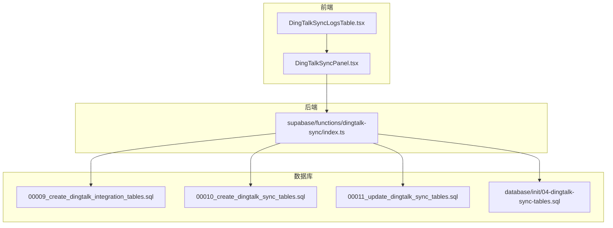
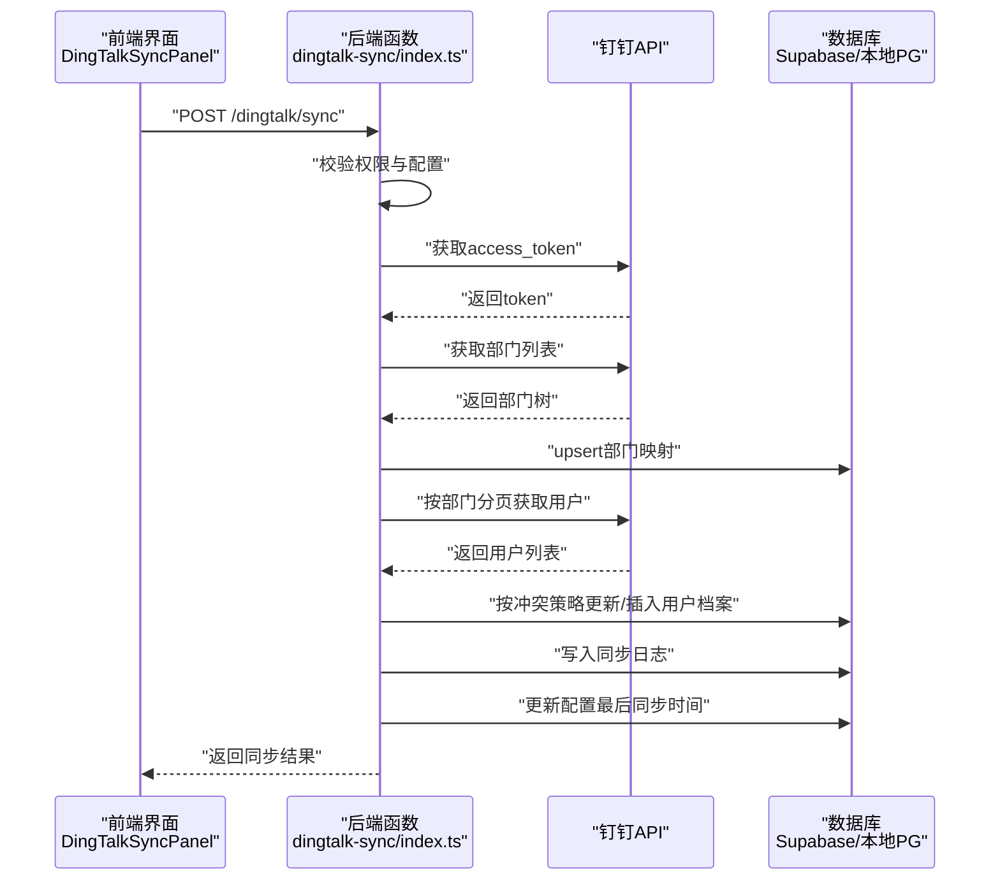
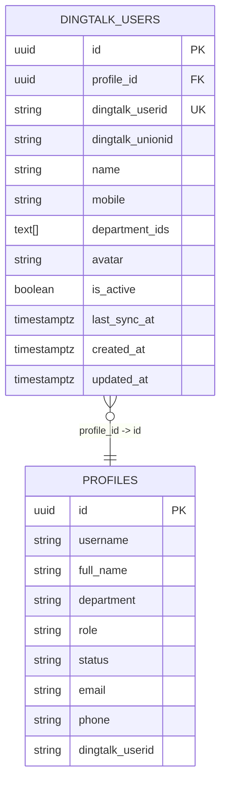
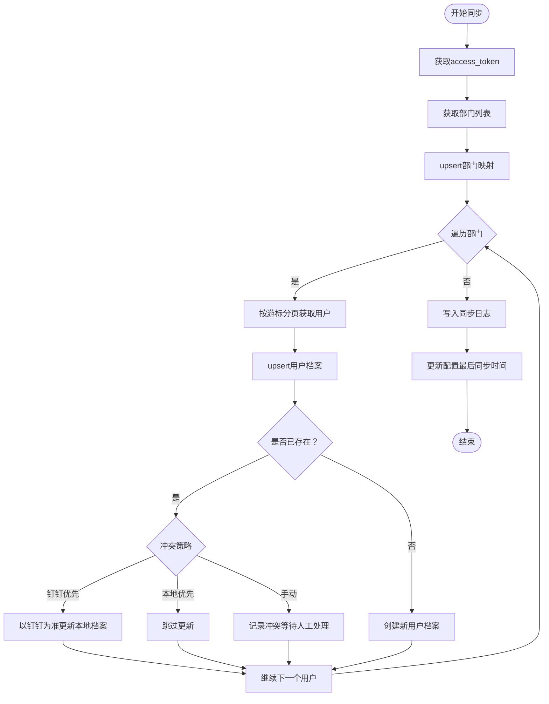
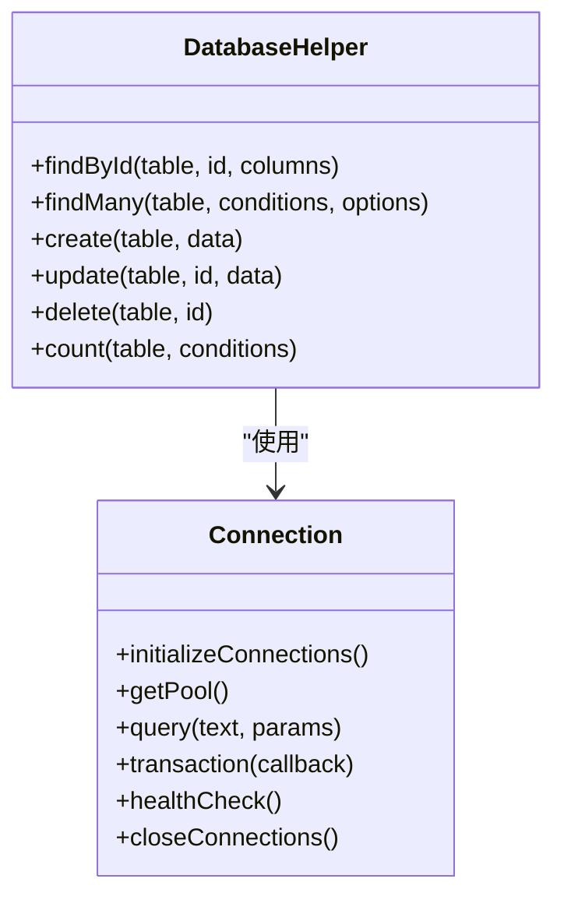
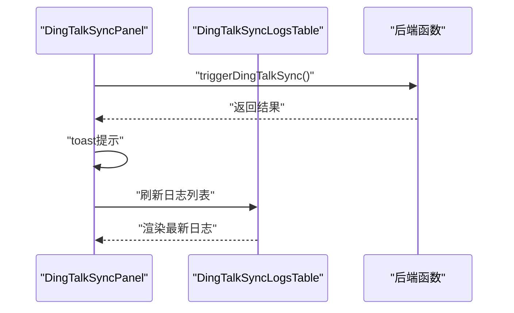
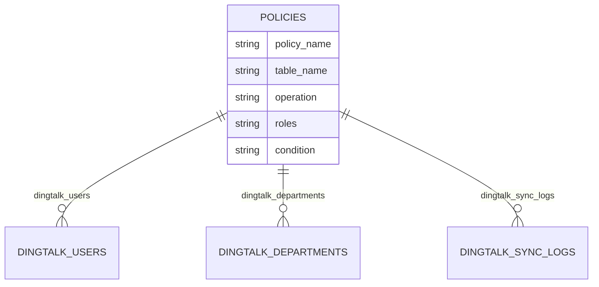
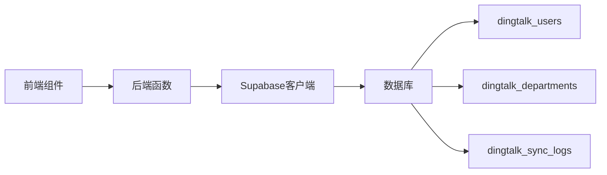

# 钉钉用户同步

<cite>
**本文引用的文件**
- [database.ts](file://src/db/database.ts)
- [connection.ts](file://src/db/connection.ts)
- [dingtalk.ts](file://src/utils/dingtalk.ts)
- [DingTalkSyncPanel.tsx](file://src/components/dingtalk/DingTalkSyncPanel.tsx)
- [DingTalkSyncLogsTable.tsx](file://src/components/dingtalk/DingTalkSyncLogsTable.tsx)
- [index.ts](file://supabase/functions/dingtalk-sync/index.ts)
- [00009_create_dingtalk_integration_tables.sql](file://supabase/migrations/00009_create_dingtalk_integration_tables.sql)
- [00010_create_dingtalk_sync_tables.sql](file://supabase/migrations/00010_create_dingtalk_sync_tables.sql)
- [00011_update_dingtalk_sync_tables.sql](file://supabase/migrations/00011_update_dingtalk_sync_tables.sql)
- [04-dingtalk-sync-tables.sql](file://database/init/04-dingtalk-sync-tables.sql)
- [钉钉同步toString错误修复.md](file://钉钉同步toString错误修复.md)
- [钉钉同步人数不全问题修复.md](file://钉钉同步人数不全问题修复.md)
</cite>

## 目录
1. [简介](#简介)
2. [项目结构](#项目结构)
3. [核心组件](#核心组件)
4. [架构总览](#架构总览)
5. [详细组件分析](#详细组件分析)
6. [依赖关系分析](#依赖关系分析)
7. [性能考量](#性能考量)
8. [故障排除指南](#故障排除指南)
9. [结论](#结论)

## 简介
本文件面向Bio-Appointment系统的“钉钉用户同步”功能，聚焦于以下目标：
- 钉钉用户映射表dingtalk_users的结构设计与约束：profile_id与系统用户profiles的外键关联、dingtalk_userid唯一性约束、department_ids数组字段用途。
- 双向同步流程：从钉钉拉取用户信息并映射到本地系统，处理手机号、头像等属性的更新策略。
- 结合database.ts中的数据访问层，展示如何通过query接口实现用户同步的增删改查操作。
- RLS安全策略如何控制不同角色对用户映射数据的访问权限。
- 解决“同步人数不全”和“toString错误”等已知问题的具体SQL与修复方案。

## 项目结构
围绕钉钉同步的关键文件分布如下：
- 前端组件：钉钉同步面板与日志表格，负责触发同步、展示统计与日志。
- 后端函数：Supabase Edge Function实现钉钉API调用、部门与用户同步、冲突策略处理、日志记录与配置更新。
- 数据库迁移：定义dingtalk_users、dingtalk_departments、dingtalk_sync_logs等表及RLS策略。
- 数据访问层：本地PostgreSQL连接池与通用查询封装，供本地数据库使用。

图表来源
- [DingTalkSyncPanel.tsx](file://src/components/dingtalk/DingTalkSyncPanel.tsx#L1-L237)
- [DingTalkSyncLogsTable.tsx](file://src/components/dingtalk/DingTalkSyncLogsTable.tsx#L1-L91)
- [index.ts](file://supabase/functions/dingtalk-sync/index.ts#L1-L384)
- [00009_create_dingtalk_integration_tables.sql](file://supabase/migrations/00009_create_dingtalk_integration_tables.sql#L60-L204)
- [00010_create_dingtalk_sync_tables.sql](file://supabase/migrations/00010_create_dingtalk_sync_tables.sql#L56-L189)
- [00011_update_dingtalk_sync_tables.sql](file://supabase/migrations/00011_update_dingtalk_sync_tables.sql#L97-L132)
- [04-dingtalk-sync-tables.sql](file://database/init/04-dingtalk-sync-tables.sql#L1-L131)

章节来源
- [DingTalkSyncPanel.tsx](file://src/components/dingtalk/DingTalkSyncPanel.tsx#L1-L237)
- [DingTalkSyncLogsTable.tsx](file://src/components/dingtalk/DingTalkSyncLogsTable.tsx#L1-L91)
- [index.ts](file://supabase/functions/dingtalk-sync/index.ts#L1-L384)
- [00009_create_dingtalk_integration_tables.sql](file://supabase/migrations/00009_create_dingtalk_integration_tables.sql#L60-L204)
- [00010_create_dingtalk_sync_tables.sql](file://supabase/migrations/00010_create_dingtalk_sync_tables.sql#L56-L189)
- [00011_update_dingtalk_sync_tables.sql](file://supabase/migrations/00011_update_dingtalk_sync_tables.sql#L97-L132)
- [04-dingtalk-sync-tables.sql](file://database/init/04-dingtalk-sync-tables.sql#L1-L131)

## 核心组件
- 钉钉用户映射表dingtalk_users
  - 字段要点：profile_id指向profiles.id；dingtalk_userid唯一；department_ids为数组；包含活跃状态与时间戳。
  - 作用：建立钉钉用户与本地用户档案的映射关系，便于后续权限与通知联动。
- 钉钉部门映射表dingtalk_departments
  - 字段要点：dingtalk_dept_id唯一；parent_id自引用；order_num排序；is_active开关。
  - 作用：维护组织架构映射，支持前端筛选与权限判断。
- 同步日志表dingtalk_sync_logs
  - 字段要点：sync_type、status、计数字段、details、created_by外键。
  - 作用：记录每次同步的执行结果、失败详情与统计信息。
- 数据访问层database.ts/connection.ts
  - 提供initializeConnections、query、transaction等方法，封装PG连接池与通用CRUD。
- 前端组件DingTalkSyncPanel与DingTalkSyncLogsTable
  - 负责触发同步、展示统计与日志、刷新用户列表。

章节来源
- [00009_create_dingtalk_integration_tables.sql](file://supabase/migrations/00009_create_dingtalk_integration_tables.sql#L60-L204)
- [00010_create_dingtalk_sync_tables.sql](file://supabase/migrations/00010_create_dingtalk_sync_tables.sql#L56-L189)
- [00011_update_dingtalk_sync_tables.sql](file://supabase/migrations/00011_update_dingtalk_sync_tables.sql#L97-L132)
- [04-dingtalk-sync-tables.sql](file://database/init/04-dingtalk-sync-tables.sql#L1-L131)
- [database.ts](file://src/db/database.ts#L1-L43)
- [connection.ts](file://src/db/connection.ts#L1-L324)
- [DingTalkSyncPanel.tsx](file://src/components/dingtalk/DingTalkSyncPanel.tsx#L1-L237)
- [DingTalkSyncLogsTable.tsx](file://src/components/dingtalk/DingTalkSyncLogsTable.tsx#L1-L91)

## 架构总览
下图展示了从前端触发同步到后端函数执行、再到数据库写入与日志记录的整体流程。

图表来源
- [DingTalkSyncPanel.tsx](file://src/components/dingtalk/DingTalkSyncPanel.tsx#L66-L103)
- [index.ts](file://supabase/functions/dingtalk-sync/index.ts#L53-L383)

章节来源
- [DingTalkSyncPanel.tsx](file://src/components/dingtalk/DingTalkSyncPanel.tsx#L66-L103)
- [index.ts](file://supabase/functions/dingtalk-sync/index.ts#L53-L383)

## 详细组件分析

### 钉钉用户映射表dingtalk_users结构设计
- profile_id与profiles外键关联
  - 通过外键将钉钉用户与本地用户档案绑定，便于统一管理与权限控制。
- dingtalk_userid唯一性约束
  - 保证钉钉用户ID在映射表中的唯一性，避免重复映射。
- department_ids数组字段
  - 存储用户所属的多个钉钉部门ID，便于后续按部门筛选与权限判定。
- 其他字段
  - name、mobile、avatar、is_active、last_sync_at、created_at、updated_at等，支撑用户信息展示与同步追踪。

图表来源
- [00009_create_dingtalk_integration_tables.sql](file://supabase/migrations/00009_create_dingtalk_integration_tables.sql#L68-L82)
- [00009_create_dingtalk_integration_tables.sql](file://supabase/migrations/00009_create_dingtalk_integration_tables.sql#L202-L204)

章节来源
- [00009_create_dingtalk_integration_tables.sql](file://supabase/migrations/00009_create_dingtalk_integration_tables.sql#L68-L82)
- [00009_create_dingtalk_integration_tables.sql](file://supabase/migrations/00009_create_dingtalk_integration_tables.sql#L202-L204)

### 冲突策略与用户更新策略
- 冲突策略
  - 支持“钉钉优先”“本地优先”“手动”三种策略，由配置决定。
- 用户更新策略
  - 若本地存在同名用户（以钉钉userid为唯一标识），按策略更新本地档案字段（如姓名、部门等）。
  - 若不存在，则创建新用户档案并写入映射表。
- 部门映射
  - 同步部门树并upsert到部门映射表，确保后续用户按部门正确归属。

图表来源
- [index.ts](file://supabase/functions/dingtalk-sync/index.ts#L127-L334)

章节来源
- [index.ts](file://supabase/functions/dingtalk-sync/index.ts#L127-L334)

### 数据访问层与CRUD操作
- 初始化与连接
  - database.ts导出getDatabase，内部调用initializeConnections初始化本地PG连接池。
- 查询封装
  - connection.ts提供query、transaction、DatabaseHelper等工具，支持find、create、update、delete、count等通用操作。
- 在同步流程中的应用
  - 后端函数通过Supabase客户端直接执行SQL（Edge Function场景），但在本地数据库模式下，可复用上述封装进行CRUD。

图表来源
- [database.ts](file://src/db/database.ts#L1-L43)
- [connection.ts](file://src/db/connection.ts#L1-L324)

章节来源
- [database.ts](file://src/db/database.ts#L1-L43)
- [connection.ts](file://src/db/connection.ts#L1-L324)

### 前端交互与日志展示
- 钉钉同步面板
  - 负责加载配置、统计、日志，触发同步并回调刷新用户列表。
- 日志表格
  - 展示最近同步记录，包含类型、状态、计数与操作人。

图表来源
- [DingTalkSyncPanel.tsx](file://src/components/dingtalk/DingTalkSyncPanel.tsx#L66-L103)
- [DingTalkSyncLogsTable.tsx](file://src/components/dingtalk/DingTalkSyncLogsTable.tsx#L1-L91)

章节来源
- [DingTalkSyncPanel.tsx](file://src/components/dingtalk/DingTalkSyncPanel.tsx#L66-L103)
- [DingTalkSyncLogsTable.tsx](file://src/components/dingtalk/DingTalkSyncLogsTable.tsx#L1-L91)

### RLS安全策略与权限控制
- dingtalk_users
  - 超级管理员可查看/管理；普通用户仅可查看自己的映射。
- dingtalk_departments
  - 所有认证用户可查看；超级管理员可管理。
- dingtalk_sync_logs
  - 超级管理员可查看与创建；普通用户不可见。
- profiles.dingtalk_userid
  - 新增字段并建立索引，便于快速关联与查询。

图表来源
- [00009_create_dingtalk_integration_tables.sql](file://supabase/migrations/00009_create_dingtalk_integration_tables.sql#L156-L201)
- [00010_create_dingtalk_sync_tables.sql](file://supabase/migrations/00010_create_dingtalk_sync_tables.sql#L121-L150)
- [00011_update_dingtalk_sync_tables.sql](file://supabase/migrations/00011_update_dingtalk_sync_tables.sql#L97-L132)

章节来源
- [00009_create_dingtalk_integration_tables.sql](file://supabase/migrations/00009_create_dingtalk_integration_tables.sql#L156-L201)
- [00010_create_dingtalk_sync_tables.sql](file://supabase/migrations/00010_create_dingtalk_sync_tables.sql#L121-L150)
- [00011_update_dingtalk_sync_tables.sql](file://supabase/migrations/00011_update_dingtalk_sync_tables.sql#L97-L132)

### 已知问题与修复方案

#### 问题一：同步人数不全
- 现象
  - 仅同步到部分用户，实际组织人数远高于同步结果。
- 根因
  - 仅获取根部门的一级子部门，未递归遍历所有层级。
- 修复要点
  - 递归获取所有部门树，确保覆盖所有子部门。
  - 增强日志输出，明确每个部门的同步进度。
  - 保持分页游标处理，支持大部门用户分批获取。
- SQL验证建议
  - 统计profiles中钉钉用户数量与按部门分组统计，核对是否覆盖全部部门。

章节来源
- [钉钉同步人数不全问题修复.md](file://钉钉同步人数不全问题修复.md#L1-L277)

#### 问题二：toString错误
- 现象
  - 后端抛出Cannot read properties of undefined (reading 'toString')。
- 根因
  - 根部门parent_id为undefined，且某些部门可能缺少order字段，直接调用toString导致异常。
- 修复要点
  - 在写入部门映射时，对parent_id进行空值检查，缺失时写入NULL；对order字段提供默认值0。
  - 支持根部门与所有子部门的正确存储。
- SQL验证建议
  - 检查dingtalk_department_mapping表的parent_id与order_num字段是否正确入库，根部门parent_id应为NULL，order_num应为0。

章节来源
- [钉钉同步toString错误修复.md](file://钉钉同步toString错误修复.md#L1-L235)

## 依赖关系分析
- 前端组件依赖后端函数提供的同步接口，后端函数依赖Supabase客户端与钉钉API。
- 数据库层面，同步流程涉及dingtalk_users、dingtalk_departments、dingtalk_sync_logs等表，RLS策略贯穿各表。
- 数据访问层提供通用CRUD能力，便于在本地数据库模式下扩展或替换。

图表来源
- [index.ts](file://supabase/functions/dingtalk-sync/index.ts#L53-L383)
- [00009_create_dingtalk_integration_tables.sql](file://supabase/migrations/00009_create_dingtalk_integration_tables.sql#L60-L204)
- [00010_create_dingtalk_sync_tables.sql](file://supabase/migrations/00010_create_dingtalk_sync_tables.sql#L56-L189)

章节来源
- [index.ts](file://supabase/functions/dingtalk-sync/index.ts#L53-L383)
- [00009_create_dingtalk_integration_tables.sql](file://supabase/migrations/00009_create_dingtalk_integration_tables.sql#L60-L204)
- [00010_create_dingtalk_sync_tables.sql](file://supabase/migrations/00010_create_dingtalk_sync_tables.sql#L56-L189)

## 性能考量
- 分页与游标
  - 用户分页大小固定，配合has_more与next_cursor循环拉取，避免一次性请求过大。
- 部门递归
  - 递归获取部门树时注意深度与并发，必要时可改为队列式逐层拉取，降低单次请求压力。
- 索引与统计
  - 为常用查询字段建立索引，如dingtalk_users.dingtalk_userid、profiles.dingtalk_userid等，提升查找效率。
- 日志与监控
  - 通过同步日志表记录成功/失败/跳过的计数，便于定位性能瓶颈与异常。

## 故障排除指南
- 同步人数不全
  - 确认是否递归获取了所有部门层级；检查日志中部门数量与每个部门的用户数。
  - SQL验证：统计profiles中钉钉用户总数与按部门分组统计。
- toString错误
  - 检查部门映射写入逻辑，确保parent_id为空时写NULL，order缺省时写0。
  - SQL验证：确认dingtalk_department_mapping中根部门parent_id为NULL，order_num为0。
- 权限不足
  - 确认后端函数调用者具备超级管理员角色；检查RLS策略是否生效。
- API权限
  - 确认钉钉应用具备“通讯录只读”权限，并正确配置AppKey/AppSecret。

章节来源
- [钉钉同步人数不全问题修复.md](file://钉钉同步人数不全问题修复.md#L1-L277)
- [钉钉同步toString错误修复.md](file://钉钉同步toString错误修复.md#L1-L235)
- [00009_create_dingtalk_integration_tables.sql](file://supabase/migrations/00009_create_dingtalk_integration_tables.sql#L156-L201)
- [00010_create_dingtalk_sync_tables.sql](file://supabase/migrations/00010_create_dingtalk_sync_tables.sql#L121-L150)

## 结论
本文件系统梳理了Bio-Appointment中钉钉用户同步的表结构、流程与安全策略，并针对“同步人数不全”“toString错误”两个关键问题提供了可落地的修复思路与SQL验证建议。通过RLS策略与前端交互组件的配合，系统实现了可控、可观测、可扩展的用户同步能力。