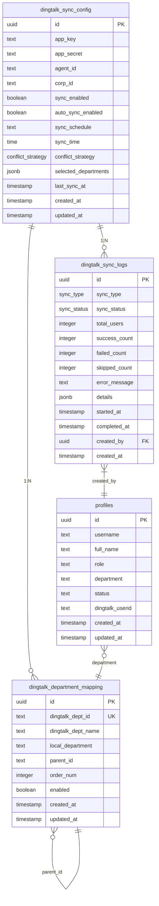
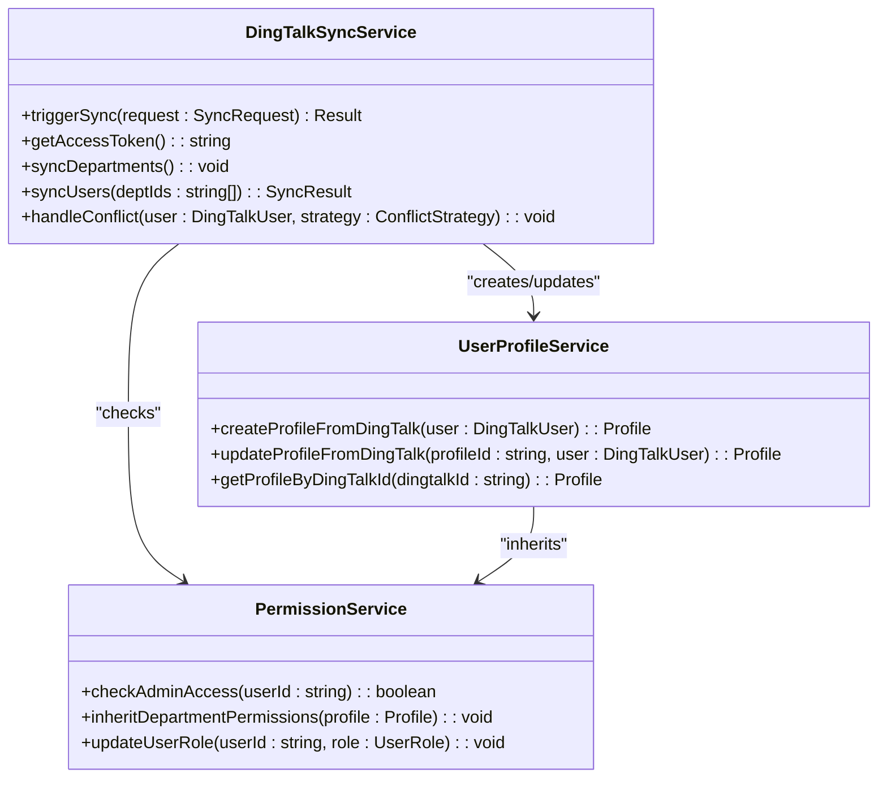
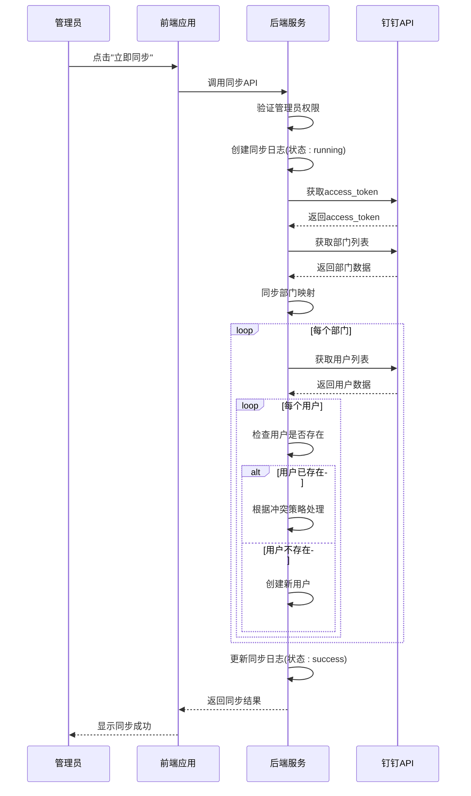
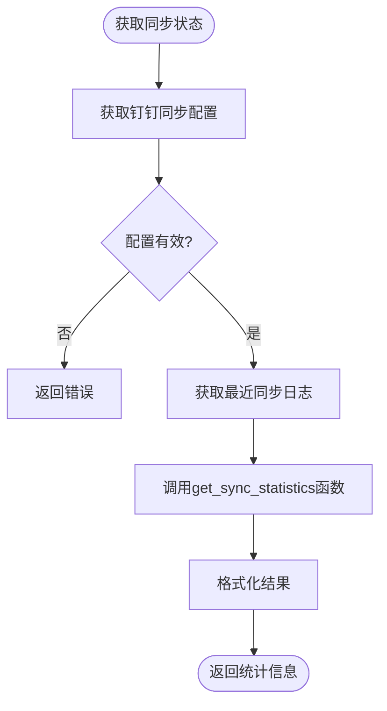

# 钉钉集成模型

<cite>
**本文档引用的文件**   
- [04-dingtalk-sync-tables.sql](file://database/init/04-dingtalk-sync-tables.sql)
- [00009_create_dingtalk_integration_tables.sql](file://supabase/migrations/00009_create_dingtalk_integration_tables.sql)
- [00010_create_dingtalk_sync_tables.sql](file://supabase/migrations/00010_create_dingtalk_sync_tables.sql)
- [00011_update_dingtalk_sync_tables.sql](file://supabase/migrations/00011_update_dingtalk_sync_tables.sql)
- [database.ts](file://src/db/database.ts)
- [connection.ts](file://src/db/connection.ts)
- [dataSync.ts](file://src/services/dataSync.ts)
- [dingtalk.ts](file://src/utils/dingtalk.ts)
- [DingTalkSyncPanel.tsx](file://src/components/dingtalk/DingTalkSyncPanel.tsx)
- [DingTalkConfigDialog.tsx](file://src/components/dingtalk/DingTalkConfigDialog.tsx)
- [index.ts](file://supabase/functions/dingtalk-sync/index.ts)
- [types.ts](file://src/types/types.ts)
- [钉钉同步toString错误修复.md](file://钉钉同步toString错误修复.md)
- [DINGTALK_IMPLEMENTATION_STATUS.md](file://DINGTALK_IMPLEMENTATION_STATUS.md)
</cite>

## 目录
1. [引言](#引言)
2. [核心数据表结构](#核心数据表结构)
3. [钉钉同步配置](#钉钉同步配置)
4. [钉钉同步日志](#钉钉同步日志)
5. [钉钉部门映射](#钉钉部门映射)
6. [用户映射与权限继承](#用户映射与权限继承)
7. [数据同步机制](#数据同步机制)
8. [安全与认证](#安全与认证)
9. [数据访问层实现](#数据访问层实现)
10. [已知问题解决方案](#已知问题解决方案)
11. [总结](#总结)

## 引言

钉钉集成模型是Bio-Appointment系统的核心功能之一，旨在实现与钉钉企业通讯录的无缝对接。该模型通过一系列数据库表和同步机制，确保系统用户与钉钉组织架构保持一致，同时提供安全的登录认证和消息通知功能。本文档详细描述了钉钉集成的数据模型，包括`dingtalk_contacts`、`dingtalk_departments`、`dingtalk_sync_logs`等表的结构设计，数据同步机制，索引策略，以及相关的安全措施和问题解决方案。

**Section sources**
- [DINGTALK_IMPLEMENTATION_STATUS.md](file://DINGTALK_IMPLEMENTATION_STATUS.md)

## 核心数据表结构

钉钉集成模型包含多个核心数据表，每个表都有特定的用途和结构。这些表通过外键和索引相互关联，确保数据的一致性和查询效率。



**Diagram sources **
- [04-dingtalk-sync-tables.sql](file://database/init/04-dingtalk-sync-tables.sql)
- [00009_create_dingtalk_integration_tables.sql](file://supabase/migrations/00009_create_dingtalk_integration_tables.sql)
- [types.ts](file://src/types/types.ts)

## 钉钉同步配置

`dingtalk_sync_config`表存储了钉钉应用的配置信息，是整个同步过程的起点。该表包含了连接钉钉API所需的所有凭证和同步策略。

### 字段含义

| 字段名 | 类型 | 是否必填 | 默认值 | 说明 |
|--------|------|----------|--------|------|
| `id` | UUID | 是 | uuid_generate_v4() | 主键，唯一标识配置记录 |
| `app_key` | TEXT | 是 | 无 | 钉钉应用的AppKey，用于API认证 |
| `app_secret` | TEXT | 是 | 无 | 钉钉应用的AppSecret，用于API认证 |
| `agent_id` | TEXT | 是 | 无 | 钉钉应用的AgentId，标识应用 |
| `corp_id` | TEXT | 是 | 无 | 企业CorpId，标识企业 |
| `sync_enabled` | BOOLEAN | 否 | true | 是否启用同步功能 |
| `auto_sync_enabled` | BOOLEAN | 否 | false | 是否启用自动同步 |
| `sync_schedule` | TEXT | 否 | 'daily' | 同步计划（daily, hourly, weekly） |
| `sync_time` | TIME | 否 | '02:00:00' | 同步执行时间 |
| `conflict_strategy` | conflict_strategy | 否 | 'dingtalk_first' | 冲突解决策略 |
| `selected_departments` | JSONB | 否 | '[]'::jsonb | 选择同步的部门列表 |
| `last_sync_at` | TIMESTAMP WITH TIME ZONE | 否 | 无 | 最后同步时间 |
| `created_at` | TIMESTAMP WITH TIME ZONE | 否 | CURRENT_TIMESTAMP | 创建时间 |
| `updated_at` | TIMESTAMP WITH TIME ZONE | 否 | CURRENT_TIMESTAMP | 更新时间 |

### 冲突解决策略

冲突策略枚举（`conflict_strategy`）定义了当本地用户与钉钉用户信息冲突时的处理方式：

- `dingtalk_first`：以钉钉数据为准，更新本地数据
- `local_first`：保留本地数据，跳过更新
- `manual`：手动处理，需要管理员干预

### 索引策略

该表通过触发器自动维护`updated_at`字段，确保每次更新时时间戳都会被刷新。虽然该表本身没有额外的索引，但其主键`id`提供了高效的查询性能。

**Section sources**
- [04-dingtalk-sync-tables.sql](file://database/init/04-dingtalk-sync-tables.sql)
- [00010_create_dingtalk_sync_tables.sql](file://supabase/migrations/00010_create_dingtalk_sync_tables.sql)

## 钉钉同步日志

`dingtalk_sync_logs`表记录了所有同步操作的详细信息，是监控和排查同步问题的关键。

### 字段含义

| 字段名 | 类型 | 是否必填 | 默认值 | 说明 |
|--------|------|----------|--------|------|
| `id` | UUID | 是 | uuid_generate_v4() | 主键，唯一标识日志记录 |
| `sync_type` | sync_type | 是 | 无 | 同步类型（manual, auto, incremental） |
| `status` | sync_status | 否 | 'pending' | 同步状态 |
| `total_users` | INTEGER | 否 | 0 | 总用户数 |
| `success_count` | INTEGER | 否 | 0 | 成功同步的用户数 |
| `failed_count` | INTEGER | 否 | 0 | 同步失败的用户数 |
| `skipped_count` | INTEGER | 否 | 0 | 跳过的用户数 |
| `error_message` | TEXT | 否 | 无 | 错误信息 |
| `details` | JSONB | 否 | '{}'::jsonb | 详细信息，包含失败详情等 |
| `started_at` | TIMESTAMP WITH TIME ZONE | 否 | CURRENT_TIMESTAMP | 同步开始时间 |
| `completed_at` | TIMESTAMP WITH TIME ZONE | 否 | 无 | 同步完成时间 |
| `created_by` | UUID | 否 | 无 | 操作人，关联profiles表 |
| `created_at` | TIMESTAMP WITH TIME ZONE | 否 | CURRENT_TIMESTAMP | 创建时间 |

### 同步状态与类型

- **同步状态**（`sync_status`）：`pending`（待处理）、`running`（进行中）、`success`（成功）、`failed`（失败）、`partial`（部分成功）
- **同步类型**（`sync_type`）：`manual`（手动）、`auto`（自动）、`incremental`（增量）

### 索引策略

该表创建了多个索引以优化查询性能：

- `idx_sync_logs_status`：按状态索引，用于快速查找特定状态的同步记录
- `idx_sync_logs_created_at`：按创建时间降序索引，用于按时间顺序查看日志
- `idx_sync_logs_created_by`：按创建人索引，用于查找特定用户的操作记录

这些索引确保了在大量日志数据中能够快速检索到所需信息。

**Section sources**
- [04-dingtalk-sync-tables.sql](file://database/init/04-dingtalk-sync-tables.sql)
- [00010_create_dingtalk_sync_tables.sql](file://supabase/migrations/00010_create_dingtalk_sync_tables.sql)

## 钉钉部门映射

`dingtalk_department_mapping`表存储了钉钉部门与本地部门的映射关系，是实现组织架构同步的基础。

### 字段含义

| 字段名 | 类型 | 是否必填 | 默认值 | 说明 |
|--------|------|----------|--------|------|
| `id` | UUID | 是 | uuid_generate_v4() | 主键，唯一标识映射记录 |
| `dingtalk_dept_id` | TEXT | 是 | 无 | 钉钉部门ID，唯一 |
| `dingtalk_dept_name` | TEXT | 是 | 无 | 钉钉部门名称 |
| `local_department` | TEXT | 否 | 无 | 本地部门名称 |
| `parent_id` | TEXT | 否 | 无 | 父部门ID，用于构建树形结构 |
| `order_num` | INTEGER | 否 | 0 | 排序号 |
| `enabled` | BOOLEAN | 否 | true | 是否启用 |
| `created_at` | TIMESTAMP WITH TIME ZONE | 否 | CURRENT_TIMESTAMP | 创建时间 |
| `updated_at` | TIMESTAMP WITH TIME ZONE | 否 | CURRENT_TIMESTAMP | 更新时间 |

### 组织架构同步

该表通过`parent_id`字段构建了部门的树形结构，能够完整地反映钉钉组织架构。`local_department`字段允许将钉钉部门映射到本地系统中的部门，实现灵活的组织管理。

### 索引策略

- `idx_dept_mapping_dingtalk_id`：按钉钉部门ID索引，确保快速查找特定部门
- `idx_dept_mapping_enabled`：按启用状态索引，用于过滤启用的部门

**Section sources**
- [04-dingtalk-sync-tables.sql](file://database/init/04-dingtalk-sync-tables.sql)
- [00010_create_dingtalk_sync_tables.sql](file://supabase/migrations/00010_create_dingtalk_sync_tables.sql)

## 用户映射与权限继承

钉钉集成模型通过`profiles`表与钉钉用户建立映射关系，实现用户数据的双向同步和权限继承。

### 映射关系

系统通过`profiles`表中的`dingtalk_userid`字段与钉钉用户建立一对一映射。当用户首次通过钉钉登录时，系统会自动创建对应的`profiles`记录，并填充`dingtalk_userid`。

### 权限继承

权限继承通过以下机制实现：

1. **角色继承**：新创建的用户默认角色为`sales`，管理员可以后续修改。
2. **部门继承**：用户的部门信息从钉钉同步，确保组织架构的一致性。
3. **状态继承**：用户的激活状态与钉钉保持一致。



**Diagram sources **
- [index.ts](file://supabase/functions/dingtalk-sync/index.ts)
- [types.ts](file://src/types/types.ts)

## 数据同步机制

数据同步机制是钉钉集成的核心，确保了系统与钉钉之间的数据一致性。

### 同步流程



**Diagram sources **
- [index.ts](file://supabase/functions/dingtalk-sync/index.ts)
- [DingTalkSyncPanel.tsx](file://src/components/dingtalk/DingTalkSyncPanel.tsx)

### 数据一致性保障

为确保数据一致性，系统采用了以下措施：

1. **事务处理**：关键操作使用数据库事务，确保原子性。
2. **冲突解决**：提供多种冲突解决策略，避免数据覆盖。
3. **日志记录**：详细记录同步过程，便于问题排查。
4. **幂等性**：同步操作设计为幂等，可安全重试。

## 安全与认证

安全与认证机制确保了钉钉集成的安全性，包括登录认证和数据安全。

### 钉钉登录二维码

钉钉登录通过免登认证实现，用户在钉钉客户端中打开应用即可自动登录。系统不直接处理登录二维码，而是依赖钉钉JSAPI获取授权码。

### 免登认证

免登认证流程如下：

1. 前端调用钉钉JSAPI获取授权码（authCode）。
2. 前端将authCode发送到后端。
3. 后端使用authCode和AppSecret换取用户信息。
4. 后端创建或更新用户会话。

### 数据存储与生命周期

- **敏感数据**：`app_secret`等敏感信息仅存储在后端环境变量中，前端不接触。
- **生命周期**：同步日志保留30天，过期自动清理。
- **访问控制**：通过RLS（Row Level Security）策略，确保只有管理员可查看同步日志。

**Section sources**
- [dingtalk.ts](file://src/utils/dingtalk.ts)
- [index.ts](file://supabase/functions/dingtalk-sync/index.ts)

## 数据访问层实现

数据访问层实现了对钉钉集成数据的CRUD操作，提供了统一的接口。

### 查询同步状态



**Diagram sources **
- [database.ts](file://src/db/database.ts)
- [connection.ts](file://src/db/connection.ts)

### 处理同步失败记录

处理同步失败记录的流程包括：

1. 查询状态为`failed`或`partial`的同步日志。
2. 从`details`字段中提取失败详情。
3. 根据失败原因进行重试或手动处理。

### 权限继承实现

基于钉钉组织架构的权限继承通过以下方式实现：

1. 同步时，用户的部门信息从钉钉继承。
2. 系统根据部门分配默认权限。
3. 管理员可对特定用户进行权限调整。

**Section sources**
- [dataSync.ts](file://src/services/dataSync.ts)
- [connection.ts](file://src/db/connection.ts)

## 已知问题解决方案

针对钉钉集成中的已知问题，系统提供了相应的数据库层面解决方案。

### 钉钉用户列表不全

**问题**：同步时只获取了部分用户，未获取完整列表。

**解决方案**：
- 实现分页获取：钉钉API返回`has_more`和`next_cursor`，需循环调用直到获取所有用户。
- 在`dingtalk-sync/index.ts`中，使用`cursor`参数进行分页查询。

```typescript
let cursor = 0;
let hasMore = true;
while (hasMore) {
  const userResponse = await fetch(
    `https://oapi.dingtalk.com/topapi/v2/user/list?access_token=${accessToken}`,
    {
      method: "POST",
      body: JSON.stringify({
        dept_id: parseInt(deptId),
        cursor,
        size: 100,
      }),
    }
  );
  const userData: DingTalkUserListResponse = await userResponse.json();
  hasMore = userData.result.has_more;
  cursor = userData.result.next_cursor || 0;
}
```

### 同步toString错误

**问题**：同步时出现`Cannot read properties of undefined (reading 'toString')`错误。

**原因**：根部门（dept_id=1）没有`parent_id`，代码尝试对`undefined`调用`toString()`。

**解决方案**：
- 添加空值检查，安全处理`parent_id`和`order`字段。
- 将`parent_id`设置为`null`而不是调用`toString()`。
- 为`order`字段提供默认值。

```typescript
const parentId = dept.parent_id ? dept.parent_id.toString() : null;
const orderNum = dept.order !== undefined ? dept.order : 0;
await supabase
  .from("dingtalk_department_mapping")
  .upsert({
    dingtalk_dept_id: dept.dept_id.toString(),
    dingtalk_dept_name: dept.name,
    parent_id: parentId,
    order_num: orderNum,
    enabled: true,
  });
```

**Section sources**
- [钉钉同步toString错误修复.md](file://钉钉同步toString错误修复.md)
- [index.ts](file://supabase/functions/dingtalk-sync/index.ts)

## 总结

钉钉集成模型通过精心设计的数据表结构和同步机制，实现了与钉钉企业通讯录的高效对接。该模型不仅确保了用户数据的一致性，还提供了灵活的权限管理和安全的认证机制。通过解决已知问题，如用户列表不全和同步错误，系统变得更加稳定可靠。未来可进一步优化同步性能，增加增量同步功能，减少不必要的API调用。