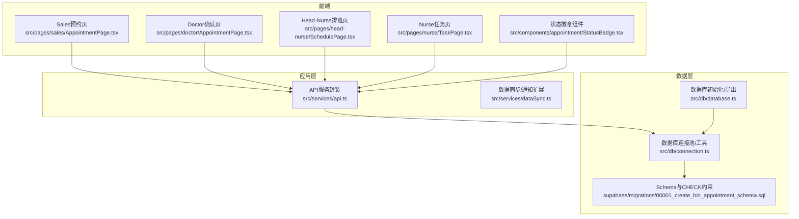
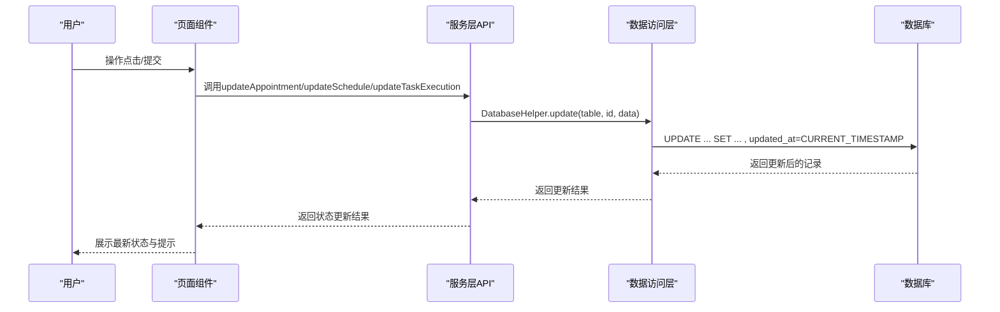
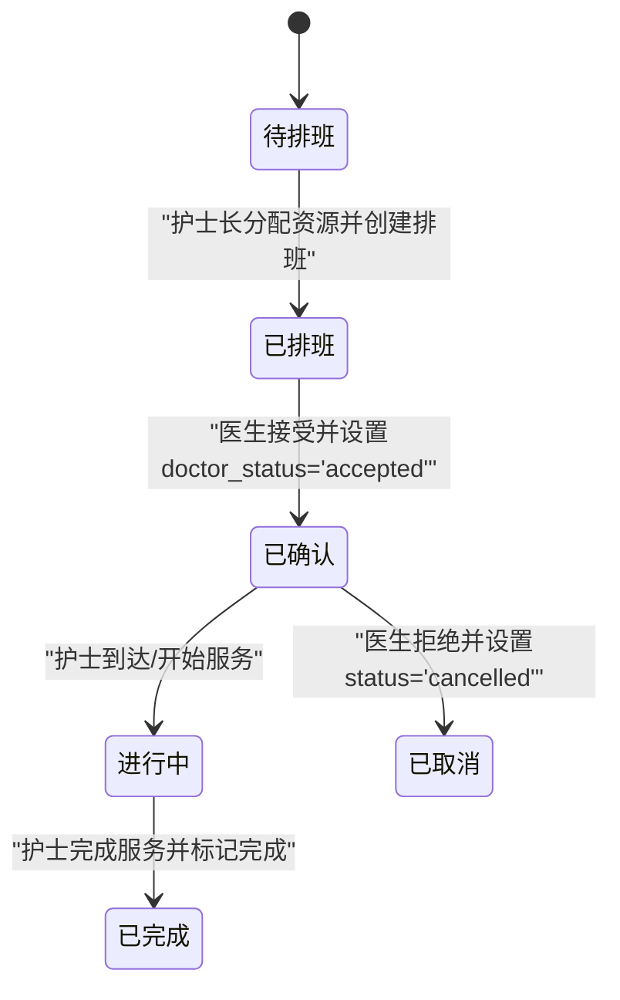
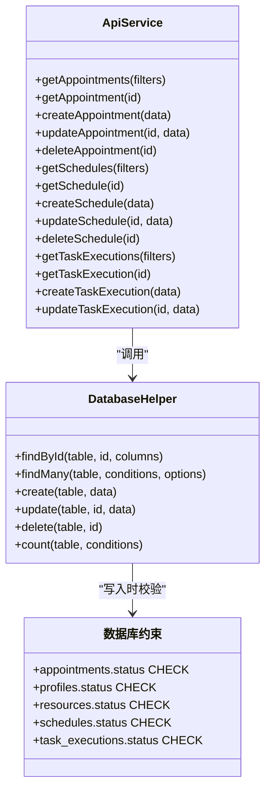
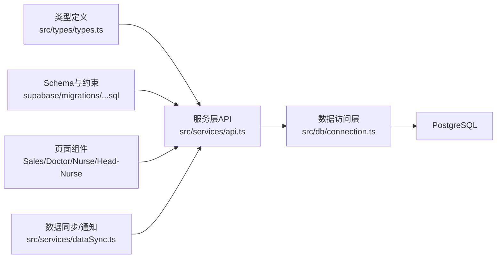

# 状态流转机制

<cite>
**本文引用的文件**
- [src/db/database.ts](file://src/db/database.ts)
- [src/db/connection.ts](file://src/db/connection.ts)
- [src/services/api.ts](file://src/services/api.ts)
- [src/types/types.ts](file://src/types/types.ts)
- [supabase/migrations/00001_create_bio_appointment_schema.sql](file://supabase/migrations/00001_create_bio_appointment_schema.sql)
- [src/pages/doctor/AppointmentPage.tsx](file://src/pages/doctor/AppointmentPage.tsx)
- [src/pages/head-nurse/SchedulePage.tsx](file://src/pages/head-nurse/SchedulePage.tsx)
- [src/pages/nurse/TaskPage.tsx](file://src/pages/nurse/TaskPage.tsx)
- [src/components/appointment/StatusBadge.tsx](file://src/components/appointment/StatusBadge.tsx)
- [src/services/dataSync.ts](file://src/services/dataSync.ts)
</cite>

## 目录
1. [简介](#简介)
2. [项目结构](#项目结构)
3. [核心组件](#核心组件)
4. [架构总览](#架构总览)
5. [详细组件分析](#详细组件分析)
6. [依赖关系分析](#依赖关系分析)
7. [性能考量](#性能考量)
8. [故障排查指南](#故障排查指南)
9. [结论](#结论)

## 简介
本文件聚焦于Bio-Appointment系统中“预约记录”的状态机实现，围绕从“待排班”到“已完成”的完整状态流转路径（pending → scheduled → confirmed → in_progress → completed），系统性梳理：
- 状态定义与数据库约束
- 应用层状态变更的触发点与调用链
- 不同用户角色（销售、护士长、医生、护士）在各阶段的操作权限与行为影响
- 数据访问层对状态更新的实现方式
- 异常处理策略与一致性保障

## 项目结构
与状态机直接相关的关键模块包括：
- 类型与枚举定义：统一约束状态取值范围
- 数据库迁移：定义CHECK约束与默认值
- 服务层API：封装状态更新的业务入口
- 页面组件：触发状态变更的UI交互
- 数据访问层：提供通用的CRUD与事务能力

图表来源
- [src/db/database.ts](file://src/db/database.ts#L1-L43)
- [src/db/connection.ts](file://src/db/connection.ts#L1-L120)
- [src/services/api.ts](file://src/services/api.ts#L150-L237)
- [supabase/migrations/00001_create_bio_appointment_schema.sql](file://supabase/migrations/00001_create_bio_appointment_schema.sql#L137-L158)

章节来源
- [src/db/database.ts](file://src/db/database.ts#L1-L43)
- [src/db/connection.ts](file://src/db/connection.ts#L1-L120)
- [src/services/api.ts](file://src/services/api.ts#L150-L237)
- [supabase/migrations/00001_create_bio_appointment_schema.sql](file://supabase/migrations/00001_create_bio_appointment_schema.sql#L137-L158)

## 核心组件
- 状态枚举与类型
  - 预约状态：pending、scheduled、confirmed、in_progress、completed、cancelled
  - 医生确认状态：pending、accepted、rejected
  - 排班状态：draft、published、locked
  - 任务执行状态：pending、checked_in、in_progress、completed
- 数据库约束
  - appointments.status 默认值与CHECK约束限定合法取值
  - profiles.status、resources.status、schedules.status、task_executions.status均有对应CHECK约束
- 数据访问层
  - 提供通用的findById/findMany/create/update/delete
  - 统一注入updated_at时间戳，便于审计与排序
- 服务层API
  - 封装create/update等操作，作为页面组件的唯一入口
  - 在部分场景下提供带通知的增强更新（如任务执行）

章节来源
- [src/types/types.ts](file://src/types/types.ts#L13-L20)
- [supabase/migrations/00001_create_bio_appointment_schema.sql](file://supabase/migrations/00001_create_bio_appointment_schema.sql#L137-L158)
- [src/db/connection.ts](file://src/db/connection.ts#L170-L321)
- [src/services/api.ts](file://src/services/api.ts#L150-L237)
- [src/services/dataSync.ts](file://src/services/dataSync.ts#L199-L236)

## 架构总览
状态机由“前端页面组件 → 服务层API → 数据访问层 → 数据库约束”构成闭环。前端通过按钮点击或表单提交触发状态变更；服务层负责参数清洗与业务规则；数据访问层执行SQL并返回结果；数据库通过CHECK约束与默认值保证状态取值合法。

图表来源
- [src/services/api.ts](file://src/services/api.ts#L229-L232)
- [src/db/connection.ts](file://src/db/connection.ts#L262-L279)
- [supabase/migrations/00001_create_bio_appointment_schema.sql](file://supabase/migrations/00001_create_bio_appointment_schema.sql#L137-L158)

## 详细组件分析

### 预约状态机：pending → scheduled → confirmed → in_progress → completed
- 状态定义与默认值
  - appointments.status 默认值为“pending”，并通过CHECK约束限制取值集合
- 关键转换路径与触发条件
  - pending → scheduled：护士长在排班页创建/更新排班，同时将预约状态更新为“scheduled”
  - scheduled → confirmed：医生确认预约，设置doctor_status为“accepted”，并将预约状态更新为“confirmed”
  - confirmed/in_progress → completed：护士在任务页完成服务，将排班状态更新为“completed”

图表来源
- [src/pages/head-nurse/SchedulePage.tsx](file://src/pages/head-nurse/SchedulePage.tsx#L211-L238)
- [src/pages/doctor/AppointmentPage.tsx](file://src/pages/doctor/AppointmentPage.tsx#L55-L67)
- [src/pages/nurse/TaskPage.tsx](file://src/pages/nurse/TaskPage.tsx#L54-L108)
- [supabase/migrations/00001_create_bio_appointment_schema.sql](file://supabase/migrations/00001_create_bio_appointment_schema.sql#L137-L158)

章节来源
- [src/pages/head-nurse/SchedulePage.tsx](file://src/pages/head-nurse/SchedulePage.tsx#L211-L238)
- [src/pages/doctor/AppointmentPage.tsx](file://src/pages/doctor/AppointmentPage.tsx#L55-L67)
- [src/pages/nurse/TaskPage.tsx](file://src/pages/nurse/TaskPage.tsx#L54-L108)
- [supabase/migrations/00001_create_bio_appointment_schema.sql](file://supabase/migrations/00001_create_bio_appointment_schema.sql#L137-L158)

### 数据库层面的合法性校验
- CHECK约束
  - appointments.status 限定为“pending、scheduled、confirmed、in_progress、completed、cancelled”
  - profiles.status 限定为“active、unavailable”
  - resources.status 限定为“available、unavailable”
  - schedules.status 限定为“draft、published、locked”
  - task_executions.status 限定为“pending、checked_in、in_progress、completed”
- 默认值
  - appointments.status 默认“pending”
  - schedules.status 默认“draft”
  - task_executions.status 默认“pending”
- 触发器
  - 自动更新updated_at列，便于审计与排序

章节来源
- [supabase/migrations/00001_create_bio_appointment_schema.sql](file://supabase/migrations/00001_create_bio_appointment_schema.sql#L137-L158)
- [supabase/migrations/00001_create_bio_appointment_schema.sql](file://supabase/migrations/00001_create_bio_appointment_schema.sql#L199-L219)

### 应用层逻辑与调用链
- 状态更新入口
  - 更新预约状态：ApiService.updateAppointment
  - 更新排班状态：ApiService.updateSchedule
  - 更新任务执行状态：ApiService.updateTaskExecution
- 数据访问实现
  - DatabaseHelper.update(table, id, data) 自动注入updated_at
  - query与transaction提供底层执行与事务支持
- 通知增强
  - dataSync.updateTaskExecutionWithNotification在状态变更时触发实时通知

图表来源
- [src/services/api.ts](file://src/services/api.ts#L150-L237)
- [src/db/connection.ts](file://src/db/connection.ts#L170-L321)
- [supabase/migrations/00001_create_bio_appointment_schema.sql](file://supabase/migrations/00001_create_bio_appointment_schema.sql#L137-L158)

章节来源
- [src/services/api.ts](file://src/services/api.ts#L150-L237)
- [src/db/connection.ts](file://src/db/connection.ts#L262-L279)
- [src/services/dataSync.ts](file://src/services/dataSync.ts#L199-L236)

### 用户角色与权限影响
- 销售
  - 发起预约时设置默认状态为“pending”
  - 无法直接修改预约状态，需经医生确认与护士长排班
- 护士长
  - 创建/更新排班，将预约状态推进到“scheduled”
  - 可能基于资源冲突进行强制更新（界面提示）
- 医生
  - 接受预约时将doctor_status设为“accepted”，并把预约状态更新为“confirmed”
  - 拒绝预约时将doctor_status设为“rejected”，并把预约状态更新为“cancelled”
- 护士
  - 到达/开始服务时将排班状态更新为“in_progress”
  - 完成服务时将排班状态更新为“completed”

章节来源
- [src/pages/sales/AppointmentPage.tsx](file://src/pages/sales/AppointmentPage.tsx#L191-L203)
- [src/pages/head-nurse/SchedulePage.tsx](file://src/pages/head-nurse/SchedulePage.tsx#L211-L238)
- [src/pages/doctor/AppointmentPage.tsx](file://src/pages/doctor/AppointmentPage.tsx#L55-L67)
- [src/pages/doctor/AppointmentPage.tsx](file://src/pages/doctor/AppointmentPage.tsx#L75-L99)
- [src/pages/nurse/TaskPage.tsx](file://src/pages/nurse/TaskPage.tsx#L54-L108)

### 状态展示与徽章
- StatusBadge组件根据状态渲染不同颜色与标签，便于用户识别当前阶段
- 预约状态：待排班、已排班、已确认、进行中、已完成、已取消
- 排班状态：草稿、已发布、已锁定
- 任务执行状态：待执行、已到达、进行中、已完成
- 医生状态：已接受、已拒绝

章节来源
- [src/components/appointment/StatusBadge.tsx](file://src/components/appointment/StatusBadge.tsx#L1-L29)

### 状态更新的代码实现方式
- 预约状态更新
  - ApiService.updateAppointment：用于更新预约状态与医生确认状态
  - 示例调用路径：页面组件 → ApiService.updateAppointment → DatabaseHelper.update → 数据库
- 排班状态更新
  - ApiService.updateSchedule：用于更新排班状态（如in_progress/completed）
  - 示例调用路径：页面组件 → ApiService.updateSchedule → DatabaseHelper.update → 数据库
- 任务执行状态更新
  - ApiService.updateTaskExecution：用于更新任务执行状态
  - 增强版本：dataSync.updateTaskExecutionWithNotification在状态变更时触发通知

章节来源
- [src/services/api.ts](file://src/services/api.ts#L229-L232)
- [src/db/connection.ts](file://src/db/connection.ts#L262-L279)
- [src/services/dataSync.ts](file://src/services/dataSync.ts#L199-L236)

## 依赖关系分析
- 类型与约束
  - src/types/types.ts 定义状态枚举，确保前端与后端一致
  - supabase/migrations/00001_create_bio_appointment_schema.sql 定义CHECK约束与默认值
- 服务层与数据访问层
  - ApiService依赖DatabaseHelper，统一CRUD与updated_at注入
  - DatabaseHelper依赖query/transaction，提供事务与健康检查
- 页面组件与服务层
  - 各角色页面组件通过ApiService暴露的方法进行状态更新
- 通知与一致性
  - dataSync在任务执行状态变更时触发通知，提升可观测性

图表来源
- [src/types/types.ts](file://src/types/types.ts#L13-L20)
- [supabase/migrations/00001_create_bio_appointment_schema.sql](file://supabase/migrations/00001_create_bio_appointment_schema.sql#L137-L158)
- [src/services/api.ts](file://src/services/api.ts#L150-L237)
- [src/db/connection.ts](file://src/db/connection.ts#L1-L120)
- [src/services/dataSync.ts](file://src/services/dataSync.ts#L199-L236)

章节来源
- [src/types/types.ts](file://src/types/types.ts#L13-L20)
- [supabase/migrations/00001_create_bio_appointment_schema.sql](file://supabase/migrations/00001_create_bio_appointment_schema.sql#L137-L158)
- [src/services/api.ts](file://src/services/api.ts#L150-L237)
- [src/db/connection.ts](file://src/db/connection.ts#L1-L120)
- [src/services/dataSync.ts](file://src/services/dataSync.ts#L199-L236)

## 性能考量
- 查询与索引
  - appointments按requested_date与status建立复合索引，有利于筛选当日待处理项
  - schedules按scheduled_date与scheduled_time_start建立索引，有利于排班检索
  - resources按type与status建立索引，有利于资源可用性查询
- 事务与一致性
  - 数据访问层提供transaction封装，确保批量更新的一致性
  - updated_at自动更新，便于后续统计与审计
- 通知开销
  - dataSync在状态变更时触发通知，建议按需启用，避免高频变更导致的通知风暴

章节来源
- [supabase/migrations/00001_create_bio_appointment_schema.sql](file://supabase/migrations/00001_create_bio_appointment_schema.sql#L192-L196)
- [src/db/connection.ts](file://src/db/connection.ts#L99-L114)
- [src/services/dataSync.ts](file://src/services/dataSync.ts#L199-L236)

## 故障排查指南
- 状态更新失败
  - 检查前端是否传入了合法状态值（CHECK约束会拒绝非法值）
  - 查看服务层API返回的错误信息，定位是参数问题还是数据库约束冲突
- 并发更新冲突
  - 使用ApiService.update系列方法，确保updated_at被正确更新
  - 如需强一致，使用transaction包裹相关更新
- 通知未触发
  - 确认dataSync.updateTaskExecutionWithNotification是否被调用
  - 检查Redis连接与健康状态
- 资源冲突导致排班失败
  - 护士长页面支持“强制覆盖”提示，确认是否选择了该选项并重新保存

章节来源
- [src/services/api.ts](file://src/services/api.ts#L229-L232)
- [src/db/connection.ts](file://src/db/connection.ts#L99-L114)
- [src/services/dataSync.ts](file://src/services/dataSync.ts#L199-L236)
- [src/pages/head-nurse/SchedulePage.tsx](file://src/pages/head-nurse/SchedulePage.tsx#L240-L250)

## 结论
本系统通过“类型枚举 + 数据库CHECK约束 + 服务层API + 页面组件”的分层设计，实现了从“待排班”到“已完成”的稳定状态流转。数据库层面的约束确保了状态取值的合法性，应用层通过统一的数据访问接口保证了更新的一致性与可观测性。不同角色在各自职责范围内进行状态推进，最终形成闭环的协作流程。建议在生产环境中持续关注索引与通知策略，以平衡性能与可观测性。