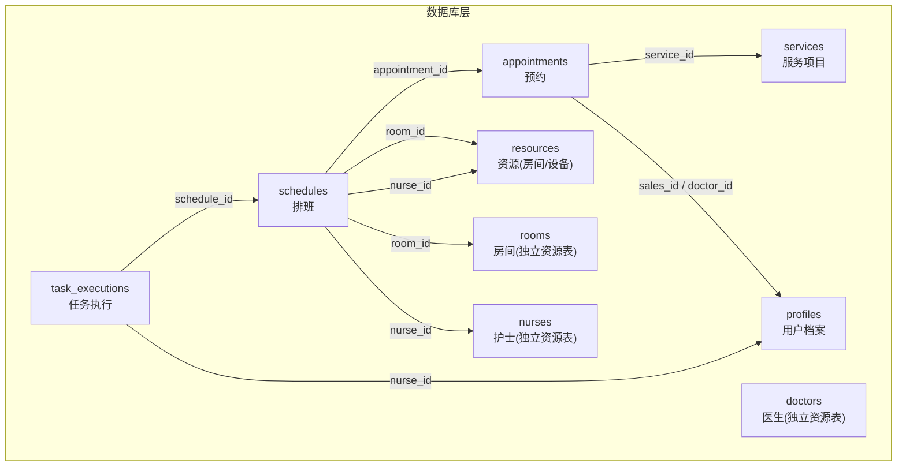
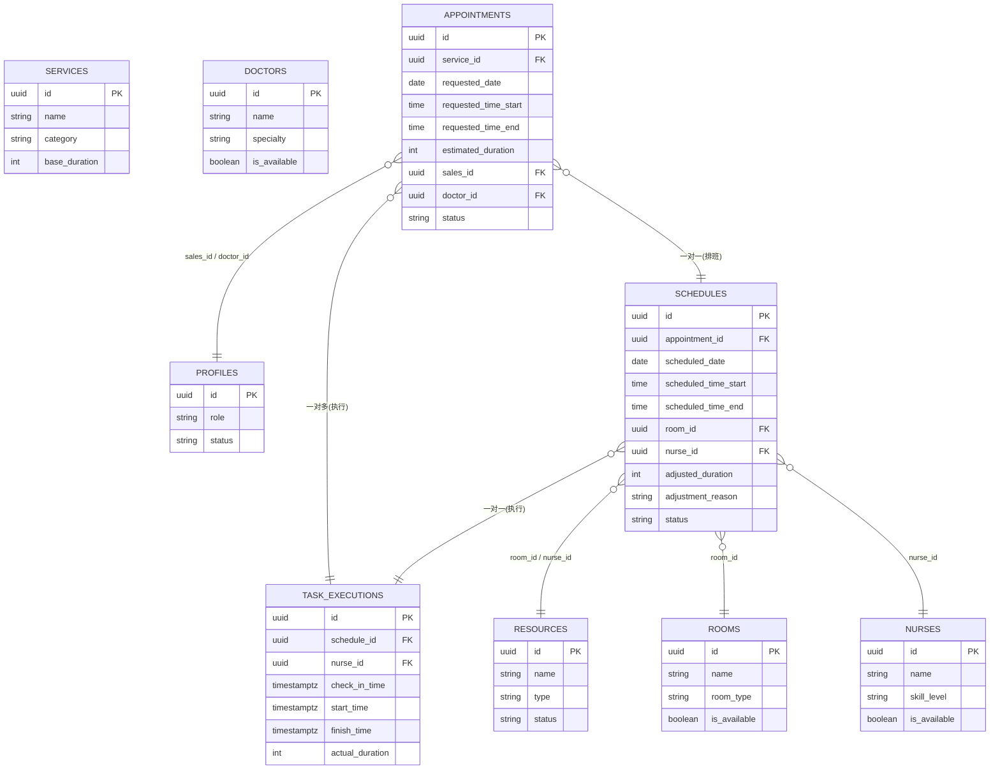
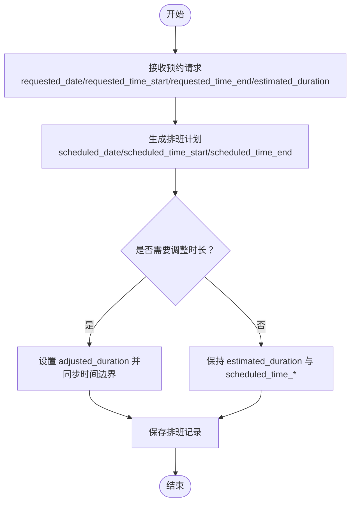
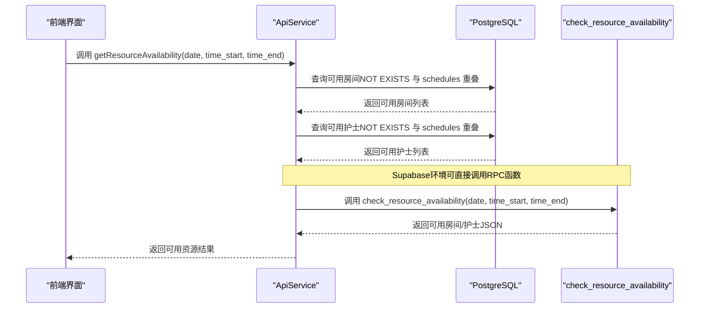
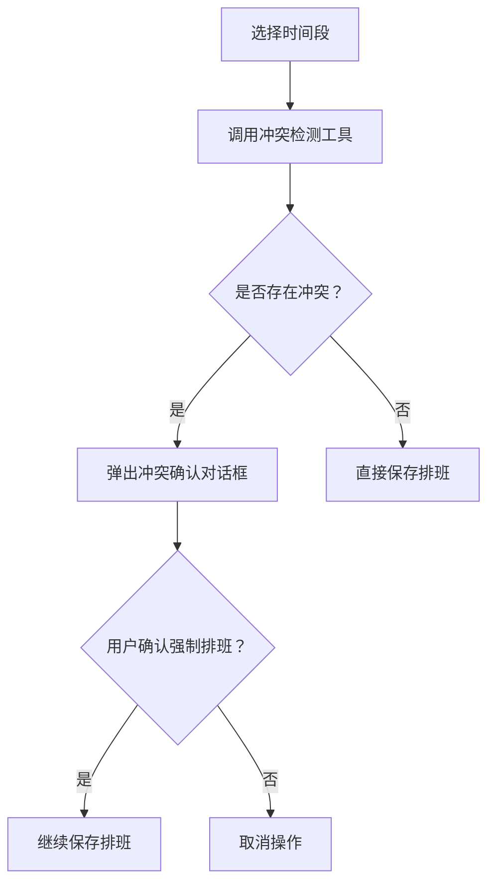
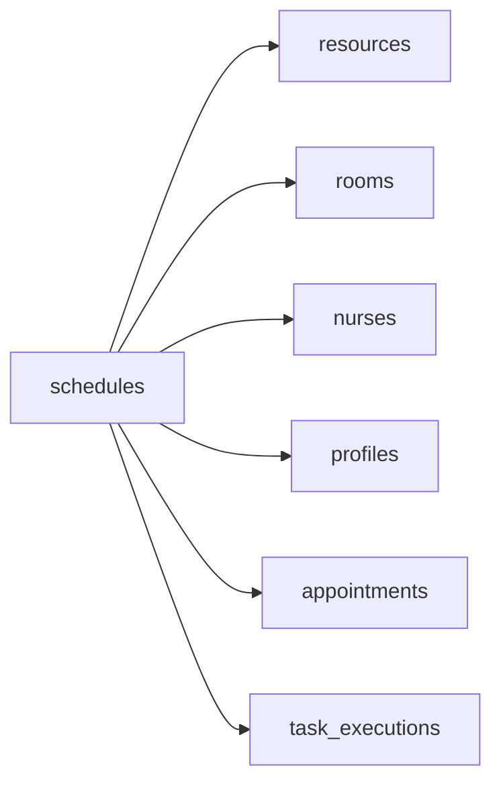

# 资源关联设计

<cite>
**本文引用的文件**
- [supabase/migrations/00001_create_bio_appointment_schema.sql](file://supabase/migrations/00001_create_bio_appointment_schema.sql)
- [supabase/migrations/00002_create_resource_tables.sql](file://supabase/migrations/00002_create_resource_tables.sql)
- [supabase/migrations/00003_fix_schedules_foreign_keys.sql](file://supabase/migrations/00003_fix_schedules_foreign_keys.sql)
- [database/init/02-create-tables.sql](file://database/init/02-create-tables.sql)
- [database/init/03-seed-data.sql](file://database/init/03-seed-data.sql)
- [src/services/api.ts](file://src/services/api.ts)
- [src/db/connection.ts](file://src/db/connection.ts)
- [src/components/appointment/ResourceConflictDialog.tsx](file://src/components/appointment/ResourceConflictDialog.tsx)
- [src/pages/head-nurse/SchedulePage.tsx](file://src/pages/head-nurse/SchedulePage.tsx)
- [src/utils/scheduleUtils.ts](file://src/utils/scheduleUtils.ts)
- [FEATURE_SYSTEM_CONFIG.md](file://FEATURE_SYSTEM_CONFIG.md)
- [BUGFIX_FOREIGN_KEY_CONSTRAINT.md](file://BUGFIX_FOREIGN_KEY_CONSTRAINT.md)
- [BUGFIX_SCHEDULE_PAGE_LOADING.md](file://BUGFIX_SCHEDULE_PAGE_LOADING.md)
- [BUGFIX_DURATION_INPUT.md](file://BUGFIX_DURATION_INPUT.md)
- [FINAL_VERIFICATION.md](file://FINAL_VERIFICATION.md)
</cite>

## 目录
1. [简介](#简介)
2. [项目结构](#项目结构)
3. [核心组件](#核心组件)
4. [架构总览](#架构总览)
5. [详细组件分析](#详细组件分析)
6. [依赖分析](#依赖分析)
7. [性能考量](#性能考量)
8. [故障排查指南](#故障排查指南)
9. [结论](#结论)
10. [附录](#附录)

## 简介
本文件围绕 appointments 表与相关资源表之间的关联设计进行全面文档化，重点说明：
- appointments 如何通过外键与 schedules、resources、profiles 等表建立关系，实现预约与房间、护士、医生等资源的绑定；
- schedules 表中 scheduled_time_start/scheduled_time_end 与 appointments 表中 requested_time_start/requested_time_end 的时间映射逻辑；
- adjusted_duration 字段在排班调整中的作用；
- 结合 check_resource_availability 函数，阐述系统如何在数据库层面确保资源分配的唯一性和时间不冲突；
- 提供 ER 图示例与典型查询语句，展示跨表关联的数据访问模式。

## 项目结构
本项目采用前后端分离架构，数据库层包含两套初始化脚本：
- Supabase 迁移脚本：定义核心业务表、资源表、外键约束与安全策略，并提供 check_resource_availability RPC；
- 本地 PostgreSQL 初始化脚本：提供 profiles、services、resources、appointments、schedules、task_executions 等表的完整定义与索引。

图表来源
- [supabase/migrations/00001_create_bio_appointment_schema.sql](file://supabase/migrations/00001_create_bio_appointment_schema.sql#L138-L190)
- [supabase/migrations/00002_create_resource_tables.sql](file://supabase/migrations/00002_create_resource_tables.sql#L1-L182)
- [database/init/02-create-tables.sql](file://database/init/02-create-tables.sql#L54-L112)

章节来源
- [supabase/migrations/00001_create_bio_appointment_schema.sql](file://supabase/migrations/00001_create_bio_appointment_schema.sql#L138-L190)
- [supabase/migrations/00002_create_resource_tables.sql](file://supabase/migrations/00002_create_resource_tables.sql#L1-L182)
- [database/init/02-create-tables.sql](file://database/init/02-create-tables.sql#L54-L112)

## 核心组件
- appointments 表：承载预约请求与状态，包含 requested_date/requested_time_start/requested_time_end/estimated_duration 等字段，用于表达“请求”的时间范围与预估时长。
- schedules 表：承载最终排班结果，包含 scheduled_date/scheduled_time_start/scheduled_time_end/room_id/nurse_id/adjusted_duration 等字段，用于表达“已安排”的时间与资源。
- resources 表：通用资源（房间/设备）；同时存在独立的 rooms、nurses、doctors 表，用于更细粒度的资源管理与权限控制。
- profiles 表：用户档案，支撑销售、护士、医生等角色与权限。
- check_resource_availability RPC：在数据库层面进行资源可用性校验，避免时间冲突与重复占用。

章节来源
- [supabase/migrations/00001_create_bio_appointment_schema.sql](file://supabase/migrations/00001_create_bio_appointment_schema.sql#L37-L190)
- [supabase/migrations/00002_create_resource_tables.sql](file://supabase/migrations/00002_create_resource_tables.sql#L1-L182)
- [database/init/02-create-tables.sql](file://database/init/02-create-tables.sql#L54-L112)

## 架构总览
下图展示了 appointments 与 schedules、resources、profiles 的关联关系，以及资源可用性校验的调用路径。

图表来源
- [supabase/migrations/00001_create_bio_appointment_schema.sql](file://supabase/migrations/00001_create_bio_appointment_schema.sql#L138-L190)
- [supabase/migrations/00002_create_resource_tables.sql](file://supabase/migrations/00002_create_resource_tables.sql#L1-L182)
- [database/init/02-create-tables.sql](file://database/init/02-create-tables.sql#L54-L112)

## 详细组件分析

### 1) 外键关系与资源绑定
- appointments 与 profiles：通过 sales_id、doctor_id 关联，实现销售与医生角色的绑定。
- appointments 与 services：通过 service_id 关联，确定服务类型与预估时长。
- appointments 与 schedules：一对一关系，由 schedules.appointment_id 指向 appointments.id。
- schedules 与 resources：通过 room_id、nurse_id 指向 resources；在独立资源表场景下，应指向 rooms、nurses。
- schedules 与 profiles：通过 created_by 指向 profiles，记录创建者。
- schedules 与 task_executions：一对一关系，由 task_executions.schedule_id 指向 schedules.id。

章节来源
- [supabase/migrations/00001_create_bio_appointment_schema.sql](file://supabase/migrations/00001_create_bio_appointment_schema.sql#L138-L190)
- [supabase/migrations/00002_create_resource_tables.sql](file://supabase/migrations/00002_create_resource_tables.sql#L1-L182)
- [database/init/02-create-tables.sql](file://database/init/02-create-tables.sql#L54-L112)
- [BUGFIX_FOREIGN_KEY_CONSTRAINT.md](file://BUGFIX_FOREIGN_KEY_CONSTRAINT.md#L204-L257)
- [supabase/migrations/00003_fix_schedules_foreign_keys.sql](file://supabase/migrations/00003_fix_schedules_foreign_keys.sql#L43-L66)

### 2) 时间映射与调整逻辑
- requested_time_start/requested_time_end：来源于预约请求，表达客户希望的服务时间段。
- scheduled_time_start/scheduled_time_end：来源于排班结果，表达实际安排的时间段。
- adjusted_duration：由护士长在排班时进行调整，表示对原预估时长的修正，通常与 scheduled_time_start/scheduled_time_end 协同使用以确保时间边界一致。

图表来源
- [supabase/migrations/00001_create_bio_appointment_schema.sql](file://supabase/migrations/00001_create_bio_appointment_schema.sql#L138-L190)
- [database/init/02-create-tables.sql](file://database/init/02-create-tables.sql#L54-L112)
- [BUGFIX_DURATION_INPUT.md](file://BUGFIX_DURATION_INPUT.md#L1-L144)
- [FINAL_VERIFICATION.md](file://FINAL_VERIFICATION.md#L1-L173)

章节来源
- [supabase/migrations/00001_create_bio_appointment_schema.sql](file://supabase/migrations/00001_create_bio_appointment_schema.sql#L138-L190)
- [database/init/02-create-tables.sql](file://database/init/02-create-tables.sql#L54-L112)
- [BUGFIX_DURATION_INPUT.md](file://BUGFIX_DURATION_INPUT.md#L1-L144)
- [FINAL_VERIFICATION.md](file://FINAL_VERIFICATION.md#L1-L173)

### 3) 资源可用性校验与冲突避免
- check_resource_availability（Supabase）：在给定日期与时间段内，返回可用房间与可用护士集合，排除草稿状态且与给定时间段重叠的排班。
- 客户端查询（本地PostgreSQL）：同样基于 scheduled_date 与 scheduled_time_start/scheduled_time_end 的重叠判断，筛选 published/locked 状态的排班，确保资源唯一性与时间不冲突。

图表来源
- [src/services/api.ts](file://src/services/api.ts#L400-L452)
- [supabase/migrations/00001_create_bio_appointment_schema.sql](file://supabase/migrations/00001_create_bio_appointment_schema.sql#L238-L281)

章节来源
- [src/services/api.ts](file://src/services/api.ts#L400-L452)
- [supabase/migrations/00001_create_bio_appointment_schema.sql](file://supabase/migrations/00001_create_bio_appointment_schema.sql#L238-L281)

### 4) 冲突检测与二次确认（前端）
- 前端通过工具函数与对话框组件实现资源冲突的二次确认，避免用户误操作导致的资源重复占用。
- 冲突检测算法基于时间重叠判断，支持房间与护士的双重冲突检测。

图表来源
- [src/utils/scheduleUtils.ts](file://src/utils/scheduleUtils.ts)
- [src/components/appointment/ResourceConflictDialog.tsx](file://src/components/appointment/ResourceConflictDialog.tsx#L1-L50)
- [src/pages/head-nurse/SchedulePage.tsx](file://src/pages/head-nurse/SchedulePage.tsx#L26-L35)

章节来源
- [src/utils/scheduleUtils.ts](file://src/utils/scheduleUtils.ts)
- [src/components/appointment/ResourceConflictDialog.tsx](file://src/components/appointment/ResourceConflictDialog.tsx#L1-L50)
- [src/pages/head-nurse/SchedulePage.tsx](file://src/pages/head-nurse/SchedulePage.tsx#L26-L35)

### 5) 典型查询语句与跨表关联模式
- 获取排班列表并关联预约、房间、护士信息：
  - SQL 路径：[src/services/api.ts](file://src/services/api.ts#L288-L303)
- 获取任务执行列表并关联排班、预约、护士信息：
  - SQL 路径：[src/services/api.ts](file://src/services/api.ts#L362-L374)
- 获取可用房间与护士（客户端查询）：
  - SQL 路径：[src/services/api.ts](file://src/services/api.ts#L405-L441)
- 获取可用房间与护士（Supabase RPC）：
  - SQL 路径：[supabase/migrations/00001_create_bio_appointment_schema.sql](file://supabase/migrations/00001_create_bio_appointment_schema.sql#L238-L281)

章节来源
- [src/services/api.ts](file://src/services/api.ts#L288-L303)
- [src/services/api.ts](file://src/services/api.ts#L362-L374)
- [src/services/api.ts](file://src/services/api.ts#L405-L441)
- [supabase/migrations/00001_create_bio_appointment_schema.sql](file://supabase/migrations/00001_create_bio_appointment_schema.sql#L238-L281)

## 依赖分析
- 外键约束演进：
  - 初始阶段：schedules.room_id、nurse_id 指向 resources；
  - 修复后：schedules.room_id 指向 rooms，nurse_id 指向 nurses；
  - 该修复确保了资源表的独立性与权限控制的一致性。
- JOIN 关联规则：
  - 当多个外键指向同一表时，需使用外键约束名区分，避免字段名歧义。

图表来源
- [supabase/migrations/00003_fix_schedules_foreign_keys.sql](file://supabase/migrations/00003_fix_schedules_foreign_keys.sql#L43-L66)
- [BUGFIX_FOREIGN_KEY_CONSTRAINT.md](file://BUGFIX_FOREIGN_KEY_CONSTRAINT.md#L204-L257)
- [BUGFIX_SCHEDULE_PAGE_LOADING.md](file://BUGFIX_SCHEDULE_PAGE_LOADING.md#L56-L134)

章节来源
- [supabase/migrations/00003_fix_schedules_foreign_keys.sql](file://supabase/migrations/00003_fix_schedules_foreign_keys.sql#L43-L66)
- [BUGFIX_FOREIGN_KEY_CONSTRAINT.md](file://BUGFIX_FOREIGN_KEY_CONSTRAINT.md#L204-L257)
- [BUGFIX_SCHEDULE_PAGE_LOADING.md](file://BUGFIX_SCHEDULE_PAGE_LOADING.md#L56-L134)

## 性能考量
- 索引优化：
  - appointments：按 requested_date、status 索引；
  - schedules：按 scheduled_date、scheduled_time_start 索引；
  - resources：按 type、status 索引；
  - profiles：按 role 索引。
- 时间重叠查询：
  - 使用重叠区间运算符或显式重叠条件，建议配合索引与分区策略提升查询效率。
- 缓存与连接池：
  - 使用连接池与可选 Redis 缓存，降低频繁查询开销。

章节来源
- [supabase/migrations/00001_create_bio_appointment_schema.sql](file://supabase/migrations/00001_create_bio_appointment_schema.sql#L192-L197)
- [database/init/02-create-tables.sql](file://database/init/02-create-tables.sql#L185-L231)
- [src/db/connection.ts](file://src/db/connection.ts#L1-L165)

## 故障排查指南
- 外键约束错误（指向 resources）：
  - 现象：创建排班时报外键约束错误；
  - 解决：将 schedules.room_id、nurse_id 的外键分别指向 rooms、nurses。
  - 参考：[BUGFIX_FOREIGN_KEY_CONSTRAINT.md](file://BUGFIX_FOREIGN_KEY_CONSTRAINT.md#L204-L257)、[supabase/migrations/00003_fix_schedules_foreign_keys.sql](file://supabase/migrations/00003_fix_schedules_foreign_keys.sql#L43-L66)
- JOIN 关联语法错误：
  - 现象：Supabase 查询失败；
  - 解决：使用外键约束名区分多外键指向同一表的情况。
  - 参考：[BUGFIX_SCHEDULE_PAGE_LOADING.md](file://BUGFIX_SCHEDULE_PAGE_LOADING.md#L56-L134)
- 修正时长输入报错（类型不匹配）：
  - 现象：输入数字后提示“期望字符串，收到数字”；
  - 解决：调整表单 Schema 与 onChange 处理，使 adjusted_duration 为数字类型。
  - 参考：[BUGFIX_DURATION_INPUT.md](file://BUGFIX_DURATION_INPUT.md#L1-L144)、[FINAL_VERIFICATION.md](file://FINAL_VERIFICATION.md#L1-L173)

章节来源
- [BUGFIX_FOREIGN_KEY_CONSTRAINT.md](file://BUGFIX_FOREIGN_KEY_CONSTRAINT.md#L204-L257)
- [supabase/migrations/00003_fix_schedules_foreign_keys.sql](file://supabase/migrations/00003_fix_schedules_foreign_keys.sql#L43-L66)
- [BUGFIX_SCHEDULE_PAGE_LOADING.md](file://BUGFIX_SCHEDULE_PAGE_LOADING.md#L56-L134)
- [BUGFIX_DURATION_INPUT.md](file://BUGFIX_DURATION_INPUT.md#L1-L144)
- [FINAL_VERIFICATION.md](file://FINAL_VERIFICATION.md#L1-L173)

## 结论
本设计通过明确的外键关系与时间维度映射，实现了预约与资源的强绑定；通过 check_resource_availability 与前端冲突检测，有效避免了资源冲突与重复占用；通过 adjusted_duration 与 scheduled_time_* 的协同，确保排班时间边界的一致性。外键约束的修复与 JOIN 语法的规范化进一步提升了数据完整性与查询稳定性。

## 附录
- 资源可用性校验的 SQL 示例（路径参考）：
  - [src/services/api.ts](file://src/services/api.ts#L405-L441)
  - [supabase/migrations/00001_create_bio_appointment_schema.sql](file://supabase/migrations/00001_create_bio_appointment_schema.sql#L238-L281)
- 排班列表关联查询（路径参考）：
  - [src/services/api.ts](file://src/services/api.ts#L288-L303)
- 任务执行列表关联查询（路径参考）：
  - [src/services/api.ts](file://src/services/api.ts#L362-L374)
- 初始数据与角色配置（路径参考）：
  - [database/init/03-seed-data.sql](file://database/init/03-seed-data.sql#L1-L77)
  - [FEATURE_SYSTEM_CONFIG.md](file://FEATURE_SYSTEM_CONFIG.md#L399-L456)