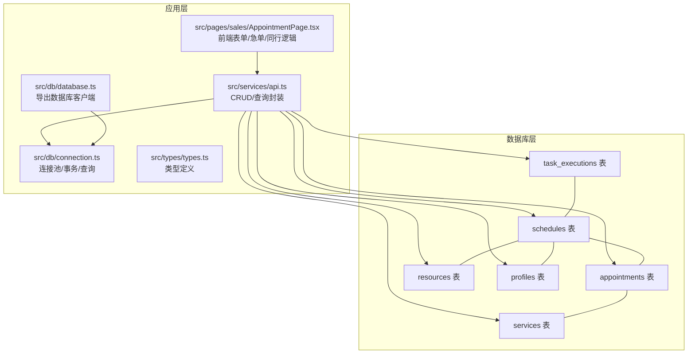
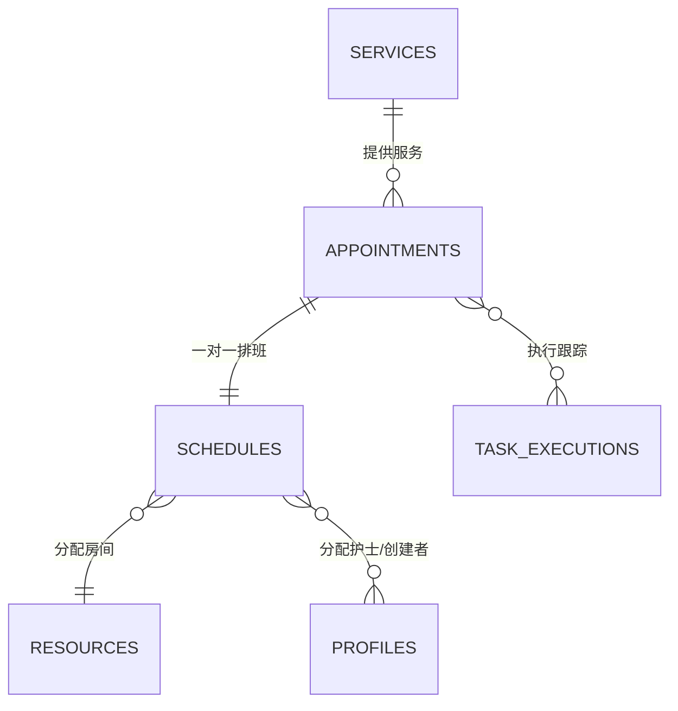
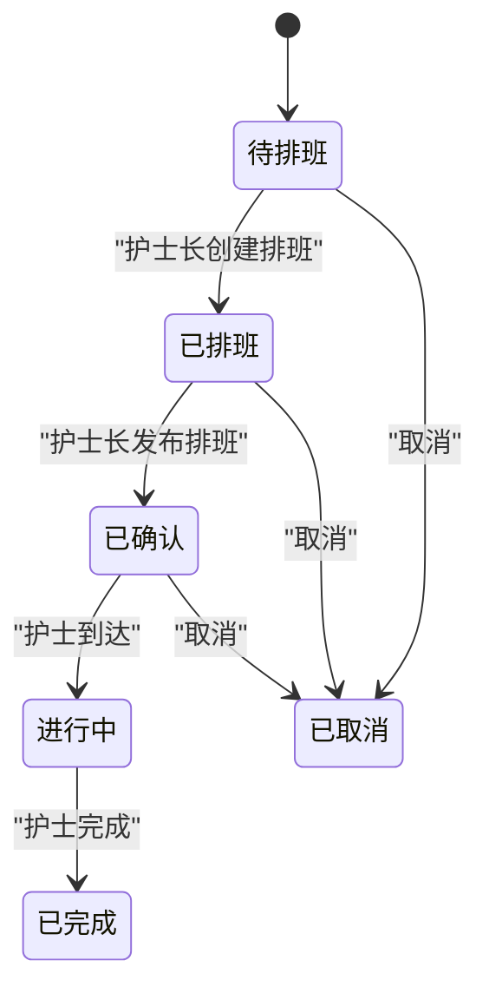
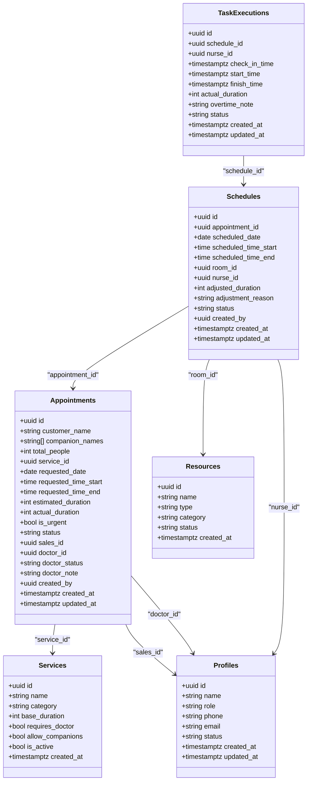
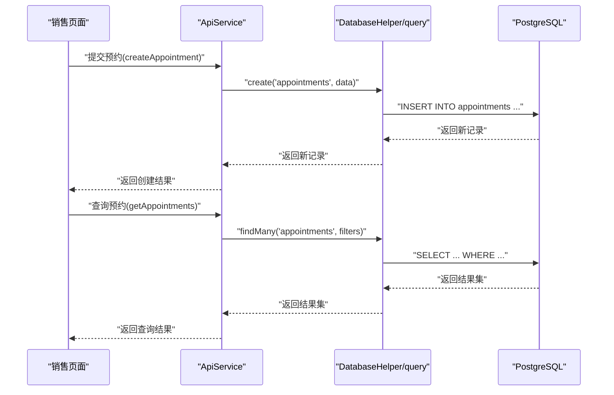
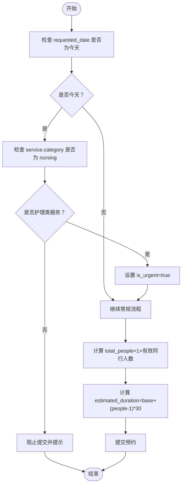
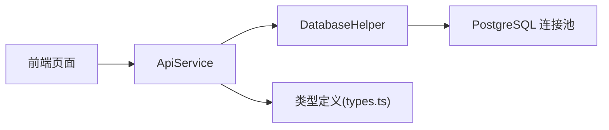

# 预约模型

<cite>
**本文引用的文件**
- [supabase/migrations/00001_create_bio_appointment_schema.sql](file://supabase/migrations/00001_create_bio_appointment_schema.sql)
- [database/init/02-create-tables.sql](file://database/init/02-create-tables.sql)
- [src/db/connection.ts](file://src/db/connection.ts)
- [src/db/database.ts](file://src/db/database.ts)
- [src/services/api.ts](file://src/services/api.ts)
- [src/types/types.ts](file://src/types/types.ts)
- [src/pages/sales/AppointmentPage.tsx](file://src/pages/sales/AppointmentPage.tsx)
- [SYSTEM_GUIDE.md](file://SYSTEM_GUIDE.md)
- [docs/prd.md](file://docs/prd.md)
- [supabase/migrations/00003_fix_schedules_foreign_keys.sql](file://supabase/migrations/00003_fix_schedules_foreign_keys.sql)
</cite>

## 目录
1. [简介](#简介)
2. [项目结构](#项目结构)
3. [核心组件](#核心组件)
4. [架构总览](#架构总览)
5. [详细组件分析](#详细组件分析)
6. [依赖分析](#依赖分析)
7. [性能考量](#性能考量)
8. [故障排查指南](#故障排查指南)
9. [结论](#结论)
10. [附录](#附录)

## 简介
本文件为 Bio-Appointment 预约数据模型的权威文档，聚焦 appointments 表的完整结构、字段语义与约束、状态机在数据库层面的实现、与 schedules、resources、users/profiles 的外键关系，以及基于 database.ts 中数据访问方法的创建、查询与更新标准流程。同时，结合前端页面与产品文档，说明急单、同行客户等特殊场景的数据库侧处理要点。

## 项目结构
围绕预约模型的关键文件分布如下：
- 数据库迁移与初始化：supabase/migrations/00001_create_bio_appointment_schema.sql、database/init/02-create-tables.sql
- 数据访问层：src/db/connection.ts、src/db/database.ts
- 业务 API 封装：src/services/api.ts
- 类型定义：src/types/types.ts
- 前端交互示例：src/pages/sales/AppointmentPage.tsx
- 业务流程与状态说明：SYSTEM_GUIDE.md、docs/prd.md
- 外键修复迁移：supabase/migrations/00003_fix_schedules_foreign_keys.sql

图表来源
- [supabase/migrations/00001_create_bio_appointment_schema.sql](file://supabase/migrations/00001_create_bio_appointment_schema.sql#L137-L190)
- [database/init/02-create-tables.sql](file://database/init/02-create-tables.sql#L53-L112)
- [src/db/connection.ts](file://src/db/connection.ts#L1-L120)
- [src/db/database.ts](file://src/db/database.ts#L1-L43)
- [src/services/api.ts](file://src/services/api.ts#L1-L120)
- [src/types/types.ts](file://src/types/types.ts#L1-L120)
- [src/pages/sales/AppointmentPage.tsx](file://src/pages/sales/AppointmentPage.tsx#L1-L120)

章节来源
- [supabase/migrations/00001_create_bio_appointment_schema.sql](file://supabase/migrations/00001_create_bio_appointment_schema.sql#L1-L120)
- [database/init/02-create-tables.sql](file://database/init/02-create-tables.sql#L1-L120)
- [src/db/connection.ts](file://src/db/connection.ts#L1-L120)
- [src/db/database.ts](file://src/db/database.ts#L1-L43)
- [src/services/api.ts](file://src/services/api.ts#L1-L120)
- [src/types/types.ts](file://src/types/types.ts#L1-L120)
- [src/pages/sales/AppointmentPage.tsx](file://src/pages/sales/AppointmentPage.tsx#L1-L120)

## 核心组件
- appointments 表：存储预约主数据，包含客户信息、服务、时间范围、状态、急单标志、医生确认状态等。
- schedules 表：存储排班详情，一对一绑定某条预约，记录资源分配与护士长调整。
- resources 表：资源清单（房间/护士），用于排班时的可用性校验。
- profiles 表：用户档案，作为销售、医生、护士、护士长的身份来源。
- services 表：服务项目定义，决定预估时长、是否需要医生、是否允许同行等。
- task_executions 表：任务执行跟踪，记录到达、开始、完成等节点与实际耗时。

章节来源
- [supabase/migrations/00001_create_bio_appointment_schema.sql](file://supabase/migrations/00001_create_bio_appointment_schema.sql#L137-L190)
- [database/init/02-create-tables.sql](file://database/init/02-create-tables.sql#L53-L112)
- [src/types/types.ts](file://src/types/types.ts#L97-L189)

## 架构总览
预约模型采用“预约-排班-执行”三层结构，通过一对一/一对多外键关联，确保业务闭环。前端通过 API 层调用数据库，应用层负责参数校验、状态机推进与资源可用性检查。

图表来源
- [supabase/migrations/00001_create_bio_appointment_schema.sql](file://supabase/migrations/00001_create_bio_appointment_schema.sql#L137-L190)
- [database/init/02-create-tables.sql](file://database/init/02-create-tables.sql#L53-L112)

## 详细组件分析

### appointments 表结构与约束
- 字段概览（核心字段与类型）
  - id：uuid，主键
  - customer_name：文本，非空
  - companion_names：文本数组，支持同行客户姓名
  - total_people：整数，非空，>0
  - service_id：uuid，外键至 services
  - requested_date：日期，非空
  - requested_time_start/requested_time_end：时间，可空
  - estimated_duration：整数，非空，>0
  - actual_duration：整数，可空
  - is_urgent：布尔，默认 false
  - status：文本，默认 pending，取值集合包含 pending/scheduled/confirmed/in_progress/completed/cancelled
  - sales_id：uuid，外键至 profiles（销售）
  - doctor_id：uuid，外键至 profiles（医生）
  - doctor_status：文本，取值集合包含 pending/accepted/rejected
  - doctor_note：文本
  - created_by：uuid，外键至 profiles（创建人）
  - created_at/updated_at：时间戳，默认 now()

- 约束与索引
  - CHECK 约束：total_people > 0；estimated_duration > 0；status 在合法集合内；doctor_status 在合法集合内
  - 索引：按 requested_date 和 status 建立复合索引，便于查询与报表统计

- 业务含义
  - is_urgent 用于急单场景，数据库层面与前端交互共同保证“今日+护理类”的限制
  - companion_names 与 total_people 共同表达“同行客户”数量，影响预估时长计算
  - doctor_status 与 doctor_id 用于需要医生确认的服务流程

章节来源
- [supabase/migrations/00001_create_bio_appointment_schema.sql](file://supabase/migrations/00001_create_bio_appointment_schema.sql#L137-L158)
- [database/init/02-create-tables.sql](file://database/init/02-create-tables.sql#L53-L77)
- [src/types/types.ts](file://src/types/types.ts#L117-L137)

### 预约状态机（数据库层面）
- 状态集合：pending → scheduled → confirmed → in_progress → completed；或 cancelled
- 状态流转路径
  - 待排班（pending）：销售提交预约默认状态
  - 已排班（scheduled）：护士长创建排班并与预约建立一对一关系
  - 已确认（confirmed）：护士长发布排班，进入可执行阶段
  - 进行中（in_progress）：护士端执行任务到达后推进
  - 已完成（completed）：护士端完成服务后推进
  - 已取消（cancelled）：可由销售或系统触发

- 数据库实现要点
  - status 字段的 CHECK 约束限定合法值
  - schedules.appointment_id 与 appointments 建立一对一约束（unique），确保同一预约仅有一份排班
  - updated_at 触发器自动维护更新时间

图表来源
- [supabase/migrations/00001_create_bio_appointment_schema.sql](file://supabase/migrations/00001_create_bio_appointment_schema.sql#L137-L158)
- [SYSTEM_GUIDE.md](file://SYSTEM_GUIDE.md#L184-L217)

章节来源
- [SYSTEM_GUIDE.md](file://SYSTEM_GUIDE.md#L184-L217)
- [supabase/migrations/00001_create_bio_appointment_schema.sql](file://supabase/migrations/00001_create_bio_appointment_schema.sql#L137-L158)

### appointments 与相关表的外键关系
- appointments ←→ services：service_id 引用 services(id)
- appointments ←→ profiles（sales）：sales_id 引用 profiles(id)
- appointments ←→ profiles（doctor）：doctor_id 引用 profiles(id)
- appointments ←→ schedules：一对一，schedules.appointment_id 引用 appointments(id)，且唯一
- schedules ←→ resources（room）：room_id 引用 resources(id)
- schedules ←→ profiles（nurse/creator）：nurse_id 与 created_by 引用 profiles(id)
- task_executions ←→ schedules：schedule_id 引用 schedules(id)

图表来源
- [supabase/migrations/00001_create_bio_appointment_schema.sql](file://supabase/migrations/00001_create_bio_appointment_schema.sql#L137-L190)
- [database/init/02-create-tables.sql](file://database/init/02-create-tables.sql#L53-L112)

章节来源
- [supabase/migrations/00001_create_bio_appointment_schema.sql](file://supabase/migrations/00001_create_bio_appointment_schema.sql#L137-L190)
- [database/init/02-create-tables.sql](file://database/init/02-create-tables.sql#L53-L112)

### 数据访问方法与标准流程（基于 database.ts 与 api.ts）
- 初始化与连接
  - initializeDatabase()：根据配置初始化本地 PostgreSQL 连接池
  - getDatabase()：返回 query 与 DatabaseHelper，供上层使用
- 基础 CRUD
  - DatabaseHelper.create/findById/findMany/update/delete/count
  - ApiService 封装常用查询与创建，例如 createAppointment、updateAppointment、getAppointments、getSchedules、getResourceAvailability 等
- 标准操作流程
  - 创建预约：ApiService.createAppointment(...)，传入 customer_name、service_id、requested_date、requested_time_start/end、total_people、estimated_duration、is_urgent、created_by 等
  - 查询预约：ApiService.getAppointments(...)，支持按 customer_name、status、sales_id、doctor_id、requested_date 等过滤
  - 更新预约：ApiService.updateAppointment(...)，允许更新除 created_at/updated_at 外的字段
  - 资源可用性：ApiService.getResourceAvailability(...) 或直接使用 query 执行 SQL，返回可用房间与护士列表
  - 排班与执行：ApiService.createSchedule(...)、updateSchedule(...)、getSchedules(...)、createTaskExecution(...)、updateTaskExecution(...)

图表来源
- [src/db/database.ts](file://src/db/database.ts#L1-L43)
- [src/db/connection.ts](file://src/db/connection.ts#L170-L293)
- [src/services/api.ts](file://src/services/api.ts#L150-L238)

章节来源
- [src/db/database.ts](file://src/db/database.ts#L1-L43)
- [src/db/connection.ts](file://src/db/connection.ts#L170-L293)
- [src/services/api.ts](file://src/services/api.ts#L150-L238)

### 急单与同行客户的数据库侧处理
- 急单（is_urgent）
  - 前端逻辑：当 requested_date 为当天时，标记 isUrgent=true，且仅允许护理类服务
  - 数据库侧：appointments.is_urgent 默认 false，由前端在提交时传入 true/false
  - 业务约束：急单仅限当日、仅限护理类服务，避免跨服务与跨日期的误用
- 同行客户（companion_names、total_people）
  - 前端动态计算 total_people = 1 + 合法同行人数
  - 预估时长估算：estimated_duration = base_duration + (total_people - 1) × 30 分钟
  - 数据库侧：companion_names 为文本数组，total_people 为整数约束 > 0

图表来源
- [src/pages/sales/AppointmentPage.tsx](file://src/pages/sales/AppointmentPage.tsx#L164-L209)
- [supabase/migrations/00001_create_bio_appointment_schema.sql](file://supabase/migrations/00001_create_bio_appointment_schema.sql#L137-L158)

章节来源
- [src/pages/sales/AppointmentPage.tsx](file://src/pages/sales/AppointmentPage.tsx#L164-L209)
- [docs/prd.md](file://docs/prd.md#L231-L236)

### 医生确认状态（doctor_status）与流程
- doctor_status 取值：pending/accepted/rejected
- 业务流程：某些服务（如面诊/报告）需要医生确认后才可进入后续排班流程
- 数据库约束：doctor_status 在合法集合内

章节来源
- [supabase/migrations/00001_create_bio_appointment_schema.sql](file://supabase/migrations/00001_create_bio_appointment_schema.sql#L137-L158)
- [docs/prd.md](file://docs/prd.md#L258-L319)

### schedules 与资源分配
- schedules 与 appointments 一对一，确保同一预约仅有一份排班
- schedules 与 resources（room）及 profiles（nurse/creator）建立外键
- 资源可用性检查：通过 SQL 或 RPC 函数检查 room/nurse 在指定时间段内的冲突情况
- 外键修复：迁移将 schedules 的外键从 resources 修正为 rooms/nurses，需注意数据清空风险

章节来源
- [supabase/migrations/00001_create_bio_appointment_schema.sql](file://supabase/migrations/00001_create_bio_appointment_schema.sql#L160-L190)
- [supabase/migrations/00003_fix_schedules_foreign_keys.sql](file://supabase/migrations/00003_fix_schedules_foreign_keys.sql#L28-L67)
- [src/services/api.ts](file://src/services/api.ts#L400-L453)

## 依赖分析
- 组件耦合
  - ApiService 依赖 DatabaseHelper 与 query，向上提供稳定的 CRUD 接口
  - DatabaseHelper 依赖连接池，向下封装 SQL 执行与事务
  - 前端页面依赖 ApiService 进行数据交互
- 外部依赖
  - PostgreSQL：提供表结构、索引、触发器、函数
  - Redis（可选）：用于会话与缓存（连接初始化时可降级）

图表来源
- [src/services/api.ts](file://src/services/api.ts#L1-L120)
- [src/db/connection.ts](file://src/db/connection.ts#L1-L120)
- [src/types/types.ts](file://src/types/types.ts#L1-L120)

章节来源
- [src/services/api.ts](file://src/services/api.ts#L1-L120)
- [src/db/connection.ts](file://src/db/connection.ts#L1-L120)
- [src/types/types.ts](file://src/types/types.ts#L1-L120)

## 性能考量
- 索引策略
  - appointments：按 requested_date、status 建立复合索引，提升筛选与统计效率
  - schedules：按 scheduled_date、scheduled_time_start 建立索引，加速排班查询
  - resources：按 type、status 建立索引，加速可用性查询
- 触发器
  - update_updated_at_column() 触发器自动维护 updated_at，减少应用层冗余逻辑
- 查询优化建议
  - 对高频过滤字段（status、requested_date、scheduled_date）使用索引
  - 资源可用性查询尽量使用原生 SQL 并结合时间段重叠判断，避免 N+1 查询

章节来源
- [supabase/migrations/00001_create_bio_appointment_schema.sql](file://supabase/migrations/00001_create_bio_appointment_schema.sql#L192-L219)
- [database/init/02-create-tables.sql](file://database/init/02-create-tables.sql#L184-L231)

## 故障排查指南
- 连接与健康检查
  - initializeConnections() 初始化连接池并进行健康检查
  - healthCheck() 返回 PostgreSQL 与 Redis 的连通性状态
- 事务与回滚
  - transaction() 封装 BEGIN/COMMIT/ROLLBACK，确保批量操作一致性
- 常见问题定位
  - 状态非法：检查 status/doctor_status 的 CHECK 约束是否被违反
  - 外键冲突：确认 schedules 的外键已正确指向 rooms/nurses（参考迁移）
  - 资源冲突：核对时间段重叠判断逻辑与索引是否生效

章节来源
- [src/db/connection.ts](file://src/db/connection.ts#L32-L165)
- [supabase/migrations/00003_fix_schedules_foreign_keys.sql](file://supabase/migrations/00003_fix_schedules_foreign_keys.sql#L28-L67)

## 结论
appointments 表承载了预约主数据与状态机核心，配合 schedules、resources、profiles、services、task_executions 形成完整的预约调度闭环。数据库通过约束、索引与触发器保障数据一致性与性能；应用层通过 ApiService 提供稳定的数据访问接口；前端页面则将急单与同行客户等业务规则落地到交互与提交流程中。遵循本文档的结构与流程，可安全地扩展与维护预约模型。

## 附录
- 关键字段与类型对照（摘自类型定义）
  - Appointment：id、customer_name、companion_names、total_people、service_id、requested_date、requested_time_start、requested_time_end、estimated_duration、actual_duration、is_urgent、status、sales_id、doctor_id、doctor_status、doctor_note、created_by、created_at、updated_at
  - Schedule：id、appointment_id、scheduled_date、scheduled_time_start、scheduled_time_end、room_id、nurse_id、adjusted_duration、adjustment_reason、status、created_by、created_at、updated_at
  - Resource：id、name、type、category、status、created_at
  - Profile：id、username、full_name、role、department、status、created_at、updated_at
  - Service：id、name、category、base_duration、requires_doctor、allow_companions、is_active、created_at

章节来源
- [src/types/types.ts](file://src/types/types.ts#L97-L189)