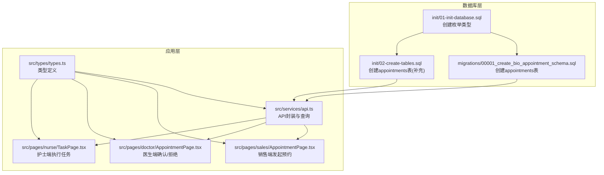
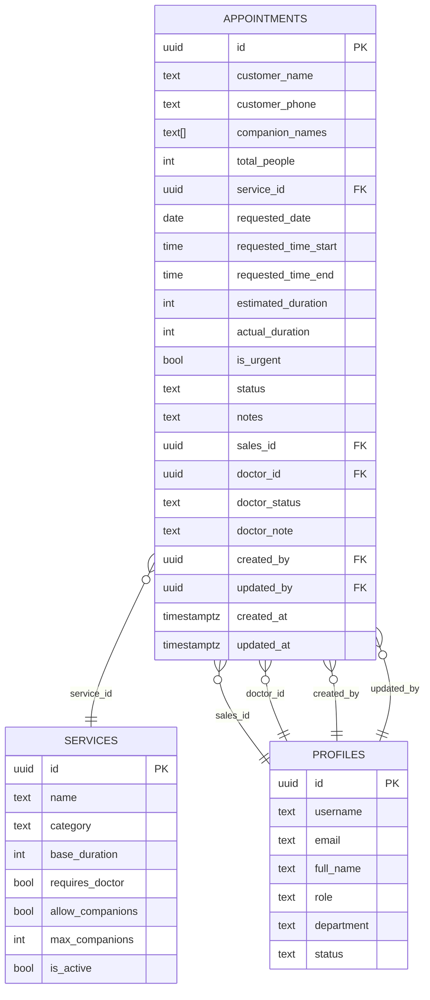
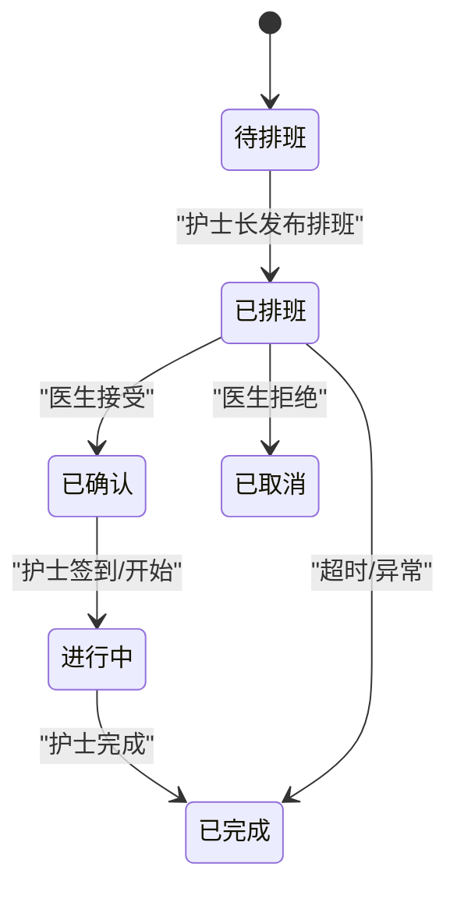
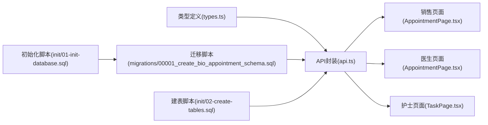
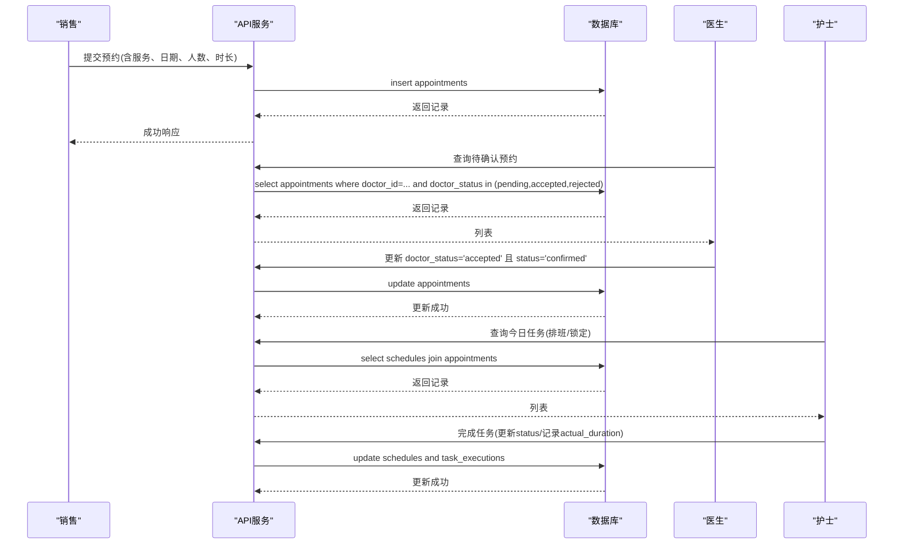

# 预约表结构

<cite>
**本文引用的文件**
- [database/init/02-create-tables.sql](file://database/init/02-create-tables.sql)
- [database/init/01-init-database.sql](file://database/init/01-init-database.sql)
- [supabase/migrations/00001_create_bio_appointment_schema.sql](file://supabase/migrations/00001_create_bio_appointment_schema.sql)
- [src/services/api.ts](file://src/services/api.ts)
- [src/types/types.ts](file://src/types/types.ts)
- [src/pages/sales/AppointmentPage.tsx](file://src/pages/sales/AppointmentPage.tsx)
- [src/pages/doctor/AppointmentPage.tsx](file://src/pages/doctor/AppointmentPage.tsx)
- [src/pages/nurse/TaskPage.tsx](file://src/pages/nurse/TaskPage.tsx)
- [SYSTEM_GUIDE.md](file://SYSTEM_GUIDE.md)
</cite>

## 目录
1. [简介](#简介)
2. [项目结构](#项目结构)
3. [核心组件](#核心组件)
4. [架构概览](#架构概览)
5. [详细组件分析](#详细组件分析)
6. [依赖分析](#依赖分析)
7. [性能考虑](#性能考虑)
8. [故障排除指南](#故障排除指南)
9. [结论](#结论)
10. [附录](#附录)

## 简介
本文件是 Bio-Appointment 系统中 appointments 表的权威文档，面向开发与产品团队，系统化梳理字段定义、数据类型、约束条件、业务含义、角色协作与状态流转，并结合实际建表语句与前后端实现，说明字段设计如何支撑多角色协同流程与状态机运行。文档同时提供典型数据示例，帮助理解数据结构与使用方式。

## 项目结构
appointments 表位于数据库初始化与迁移脚本中，其字段与约束在多个位置被声明与使用：
- 初始化脚本中定义了自定义枚举类型与表结构
- 迁移脚本中提供了更详细的字段说明与约束
- 前端页面与服务层对字段进行读取、过滤与更新，体现业务使用路径

图表来源
- [database/init/01-init-database.sql](file://database/init/01-init-database.sql#L18-L51)
- [supabase/migrations/00001_create_bio_appointment_schema.sql](file://supabase/migrations/00001_create_bio_appointment_schema.sql#L137-L158)
- [database/init/02-create-tables.sql](file://database/init/02-create-tables.sql#L53-L77)
- [src/services/api.ts](file://src/services/api.ts#L150-L237)
- [src/types/types.ts](file://src/types/types.ts#L117-L137)
- [src/pages/sales/AppointmentPage.tsx](file://src/pages/sales/AppointmentPage.tsx#L164-L219)
- [src/pages/doctor/AppointmentPage.tsx](file://src/pages/doctor/AppointmentPage.tsx#L55-L99)
- [src/pages/nurse/TaskPage.tsx](file://src/pages/nurse/TaskPage.tsx#L110-L144)

章节来源
- [database/init/01-init-database.sql](file://database/init/01-init-database.sql#L18-L51)
- [supabase/migrations/00001_create_bio_appointment_schema.sql](file://supabase/migrations/00001_create_bio_appointment_schema.sql#L37-L158)
- [database/init/02-create-tables.sql](file://database/init/02-create-tables.sql#L53-L77)
- [src/services/api.ts](file://src/services/api.ts#L150-L237)
- [src/types/types.ts](file://src/types/types.ts#L117-L137)
- [src/pages/sales/AppointmentPage.tsx](file://src/pages/sales/AppointmentPage.tsx#L164-L219)
- [src/pages/doctor/AppointmentPage.tsx](file://src/pages/doctor/AppointmentPage.tsx#L55-L99)
- [src/pages/nurse/TaskPage.tsx](file://src/pages/nurse/TaskPage.tsx#L110-L144)

## 核心组件
本节聚焦 appointments 表的字段定义、数据类型、约束与业务含义，结合前后端实现说明字段如何支撑业务流程。

- 字段与类型
  - id: 主键，UUID，默认生成
  - customer_name: 主客户姓名，文本，必填
  - customer_phone: 客户电话，文本，可空
  - companion_names: 同行客户姓名数组，文本数组，可空
  - total_people: 总人数，整数，必填，约束大于0
  - service_id: 服务项目ID，UUID，外键 references services(id)，必填
  - requested_date: 预约日期，日期，必填
  - requested_time_start: 请求开始时间，时间，可空
  - requested_time_end: 请求结束时间，时间，可空
  - estimated_duration: 预估时长（分钟），整数，必填，约束大于0
  - actual_duration: 实际时长（分钟），整数，可空
  - is_urgent: 是否急单，布尔，默认false
  - status: 预约状态，文本，默认pending，枚举约束：pending、scheduled、confirmed、in_progress、completed、cancelled
  - notes: 备注，文本，可空
  - sales_id: 销售ID，UUID，外键 references profiles(id)，可空
  - doctor_id: 医生ID，UUID，外键 references profiles(id)，可空
  - doctor_status: 医生确认状态，文本，可空，枚举约束：pending、accepted、rejected
  - doctor_note: 医生备注，文本，可空
  - created_by/updated_by: 创建人/更新人ID，UUID，外键 references profiles(id)，可空
  - created_at/updated_at: 创建/更新时间戳，带时区，默认当前时间

- 关键约束与枚举
  - 枚举类型 appointment_status、doctor_status 在初始化脚本中创建
  - 字段 total_people、estimated_duration 的数值约束均大于0
  - 外键约束：service_id 引用 services；sales_id/doctor_id 引用 profiles；created_by/updated_by 引用 profiles
  - 索引：针对 customer_name、requested_date、status、sales_id、doctor_id、service_id、is_urgent 等建立索引，提升查询性能

- 业务含义与角色协作
  - 销售端：发起预约时设置 customer_name、service_id、requested_date/requested_time、total_people、estimated_duration、is_urgent 等；可选 sales_id
  - 医生端：接收 doctor_id 关联的预约，更新 doctor_status（pending/accepted/rejected），并联动 status（如 accepted 时置为 confirmed，rejected 时置为 cancelled）
  - 护士端：基于 schedules 与 task_executions 将预约推进到执行阶段，最终完成并记录 actual_duration

章节来源
- [database/init/01-init-database.sql](file://database/init/01-init-database.sql#L18-L51)
- [supabase/migrations/00001_create_bio_appointment_schema.sql](file://supabase/migrations/00001_create_bio_appointment_schema.sql#L137-L158)
- [database/init/02-create-tables.sql](file://database/init/02-create-tables.sql#L53-L77)
- [src/services/api.ts](file://src/services/api.ts#L150-L237)
- [src/types/types.ts](file://src/types/types.ts#L117-L137)

## 架构概览
下图展示 appointments 表与相关表及角色之间的交互关系，突出外键约束与状态流转的关键节点。

图表来源
- [database/init/02-create-tables.sql](file://database/init/02-create-tables.sql#L24-L36)
- [database/init/02-create-tables.sql](file://database/init/02-create-tables.sql#L53-L77)
- [database/init/01-init-database.sql](file://database/init/01-init-database.sql#L18-L51)

## 详细组件分析

### 字段定义与约束详解
- id
  - 类型：UUID
  - 约束：主键
  - 用途：唯一标识每条预约记录
- customer_name
  - 类型：文本
  - 约束：非空
  - 用途：主客户姓名，用于展示与搜索
- customer_phone
  - 类型：文本
  - 约束：可空
  - 用途：联系方式，便于通知与回访
- companion_names
  - 类型：文本数组
  - 约束：可空
  - 用途：记录同行客户姓名，配合 total_people 计算总时长
- total_people
  - 类型：整数
  - 约束：非空，>0
  - 用途：总人数，影响预估时长与资源占用
- service_id
  - 类型：UUID
  - 约束：非空，外键 references services(id)
  - 用途：关联服务项目，决定基础时长与是否需要医生
- requested_date
  - 类型：日期
  - 约束：非空
  - 用途：预约日期，用于筛选与甘特图展示
- requested_time_start/requested_time_end
  - 类型：时间
  - 约束：可空
  - 用途：期望时间段，与 estimated_duration 共同决定资源占用
- estimated_duration
  - 类型：整数（分钟）
  - 约束：非空，>0
  - 用途：预估时长，销售端根据服务与人数计算
- actual_duration
  - 类型：整数（分钟）
  - 约束：可空
  - 用途：实际执行时长，护士端完成任务时记录
- is_urgent
  - 类型：布尔
  - 约束：默认false
  - 用途：急单标记，驱动特殊流程（仅护理类服务、优先显示等）
- status
  - 类型：文本
  - 约束：默认pending，枚举：pending、scheduled、confirmed、in_progress、completed、cancelled
  - 用途：预约生命周期状态，贯穿销售、医生、护士各环节
- notes
  - 类型：文本
  - 约束：可空
  - 用途：通用备注，记录特殊需求或说明
- sales_id
  - 类型：UUID
  - 约束：可空，外键 references profiles(id)
  - 用途：归属销售，支持销售看板与统计
- doctor_id
  - 类型：UUID
  - 约束：可空，外键 references profiles(id)
  - 用途：负责医生，驱动医生端确认流程
- doctor_status
  - 类型：文本
  - 约束：可空，枚举：pending、accepted、rejected
  - 用途：医生确认状态，决定预约是否进入确认阶段
- doctor_note
  - 类型：文本
  - 约束：可空
  - 用途：医生拒绝/建议改期等说明
- created_by/updated_by
  - 类型：UUID
  - 约束：可空，外键 references profiles(id)
  - 用途：审计追踪，记录操作人
- created_at/updated_at
  - 类型：带时区时间戳
  - 约束：默认当前时间
  - 用途：审计与排序

章节来源
- [database/init/01-init-database.sql](file://database/init/01-init-database.sql#L18-L51)
- [supabase/migrations/00001_create_bio_appointment_schema.sql](file://supabase/migrations/00001_create_bio_appointment_schema.sql#L137-L158)
- [database/init/02-create-tables.sql](file://database/init/02-create-tables.sql#L53-L77)

### 字段间关联关系与数据完整性
- 外键关系
  - service_id -> services(id)：确保服务存在且有效
  - sales_id/doctor_id/created_by/updated_by -> profiles(id)：确保用户存在且状态正常
- 枚举约束
  - status、doctor_status：保证状态值合法，避免脏数据
  - total_people、estimated_duration：保证人数与时长为正数
- 索引
  - 针对 requested_date、status、sales_id、doctor_id、service_id、is_urgent 建立索引，提升查询与筛选效率

章节来源
- [database/init/02-create-tables.sql](file://database/init/02-create-tables.sql#L198-L205)
- [database/init/01-init-database.sql](file://database/init/01-init-database.sql#L18-L51)

### 状态流转机制与多角色协同
- 销售端
  - 发起预约：设置 customer_name、service_id、requested_date、requested_time_start、total_people、estimated_duration、is_urgent 等
  - 依据服务类别与同行人数动态计算预估时长
- 医生端
  - 接收 doctor_id 关联的预约，更新 doctor_status
  - 接受：doctor_status='accepted'，status='confirmed'
  - 拒绝：doctor_status='rejected'，status='cancelled'，并记录 doctor_note
- 护士端
  - 基于 schedules 与 task_executions 推进预约执行，最终完成并记录 actual_duration

图表来源
- [src/pages/doctor/AppointmentPage.tsx](file://src/pages/doctor/AppointmentPage.tsx#L55-L99)
- [src/pages/nurse/TaskPage.tsx](file://src/pages/nurse/TaskPage.tsx#L110-L144)
- [supabase/migrations/00001_create_bio_appointment_schema.sql](file://supabase/migrations/00001_create_bio_appointment_schema.sql#L137-L158)

章节来源
- [src/pages/doctor/AppointmentPage.tsx](file://src/pages/doctor/AppointmentPage.tsx#L55-L99)
- [src/pages/nurse/TaskPage.tsx](file://src/pages/nurse/TaskPage.tsx#L110-L144)
- [src/pages/sales/AppointmentPage.tsx](file://src/pages/sales/AppointmentPage.tsx#L164-L219)

### 典型数据示例
以下示例描述不同业务场景下的字段取值与状态变化，帮助理解字段设计与流程：

- 场景一：普通预约（护理类服务）
  - customer_name: "张三"
  - companion_names: ["李四","王五"]
  - total_people: 3
  - service_id: 对应“抽血服务”
  - requested_date: 2025-06-15
  - requested_time_start: "09:00:00"
  - requested_time_end: "09:30:00"
  - estimated_duration: 60（基础时长）+（3-1）× 30 = 120
  - is_urgent: false
  - status: pending
  - sales_id: 销售用户ID
  - doctor_id: 可为空（护理类服务无需医生）
  - doctor_status: 可为空
  - doctor_note: 可为空

- 场景二：急单（仅护理类服务）
  - requested_date: 2025-06-12（当天）
  - is_urgent: true
  - service_id: “抽血服务”（急单仅允许护理类）
  - status: pending
  - sales_id: 销售用户ID
  - doctor_id: 可为空

- 场景三：医生确认
  - doctor_id: 医生用户ID
  - doctor_status: accepted
  - status: confirmed

- 场景四：医生拒绝
  - doctor_status: rejected
  - status: cancelled
  - doctor_note: “时间冲突，建议改期至6月16日”

- 场景五：执行完成
  - status: in_progress -> completed
  - actual_duration: 实际执行时长（分钟）

章节来源
- [src/pages/sales/AppointmentPage.tsx](file://src/pages/sales/AppointmentPage.tsx#L164-L219)
- [src/pages/doctor/AppointmentPage.tsx](file://src/pages/doctor/AppointmentPage.tsx#L55-L99)
- [src/pages/nurse/TaskPage.tsx](file://src/pages/nurse/TaskPage.tsx#L110-L144)
- [SYSTEM_GUIDE.md](file://SYSTEM_GUIDE.md#L208-L223)

## 依赖分析
- 数据库层
  - 枚举类型 appointment_status、doctor_status 在初始化脚本中创建，供表结构与查询使用
  - 索引分布在初始化与建表脚本中，覆盖常用查询字段
- 应用层
  - API 层提供 getAppointments、createAppointment、updateAppointment 等方法，统一处理字段过滤与更新
  - 类型定义文件明确字段类型与可空性，保障前后端一致性
  - 页面组件根据角色调用 API 并更新状态，形成闭环

图表来源
- [src/types/types.ts](file://src/types/types.ts#L117-L137)
- [src/services/api.ts](file://src/services/api.ts#L150-L237)
- [src/pages/sales/AppointmentPage.tsx](file://src/pages/sales/AppointmentPage.tsx#L164-L219)
- [src/pages/doctor/AppointmentPage.tsx](file://src/pages/doctor/AppointmentPage.tsx#L55-L99)
- [src/pages/nurse/TaskPage.tsx](file://src/pages/nurse/TaskPage.tsx#L110-L144)
- [database/init/01-init-database.sql](file://database/init/01-init-database.sql#L18-L51)
- [supabase/migrations/00001_create_bio_appointment_schema.sql](file://supabase/migrations/00001_create_bio_appointment_schema.sql#L137-L158)
- [database/init/02-create-tables.sql](file://database/init/02-create-tables.sql#L53-L77)

章节来源
- [src/types/types.ts](file://src/types/types.ts#L117-L137)
- [src/services/api.ts](file://src/services/api.ts#L150-L237)
- [database/init/01-init-database.sql](file://database/init/01-init-database.sql#L18-L51)
- [supabase/migrations/00001_create_bio_appointment_schema.sql](file://supabase/migrations/00001_create_bio_appointment_schema.sql#L137-L158)
- [database/init/02-create-tables.sql](file://database/init/02-create-tables.sql#L53-L77)

## 性能考虑
- 索引优化
  - 针对 requested_date、status、sales_id、doctor_id、service_id、is_urgent 建立索引，提升筛选与排序性能
- 查询路径
  - API 层提供按日期范围、状态、销售/医生ID等条件的动态 WHERE 子句，结合索引减少全表扫描
- 时长计算
  - 前端根据服务基础时长与同行人数计算预估时长，避免重复计算与存储冗余

章节来源
- [database/init/02-create-tables.sql](file://database/init/02-create-tables.sql#L198-L205)
- [src/services/api.ts](file://src/services/api.ts#L150-L215)
- [src/pages/sales/AppointmentPage.tsx](file://src/pages/sales/AppointmentPage.tsx#L164-L219)

## 故障排除指南
- 常见约束错误
  - total_people 或 estimated_duration ≤ 0：违反数值约束
  - status/doctor_status 不在枚举集合内：违反枚举约束
  - service_id 不存在：违反外键约束
- 解决建议
  - 在前端校验输入并在提交前修正
  - 在 API 层捕获数据库约束错误并返回清晰提示
  - 确保 profiles 中用户存在且状态正常（如 active）

章节来源
- [database/init/01-init-database.sql](file://database/init/01-init-database.sql#L18-L51)
- [supabase/migrations/00001_create_bio_appointment_schema.sql](file://supabase/migrations/00001_create_bio_appointment_schema.sql#L137-L158)
- [database/init/02-create-tables.sql](file://database/init/02-create-tables.sql#L53-L77)

## 结论
appointments 表通过严谨的字段设计、枚举约束与外键关系，为销售、医生、护士三角色协同提供了稳定的数据基础。结合前端的动态时长计算与状态机流转，系统实现了从预约发起到执行完成的完整闭环。建议在生产环境中持续关注索引命中率与查询路径优化，并完善错误处理与审计日志。

## 附录
- 关键流程时序（销售发起 -> 医生确认 -> 护士执行）

图表来源
- [src/pages/sales/AppointmentPage.tsx](file://src/pages/sales/AppointmentPage.tsx#L164-L219)
- [src/pages/doctor/AppointmentPage.tsx](file://src/pages/doctor/AppointmentPage.tsx#L55-L99)
- [src/pages/nurse/TaskPage.tsx](file://src/pages/nurse/TaskPage.tsx#L110-L144)
- [src/services/api.ts](file://src/services/api.ts#L150-L237)