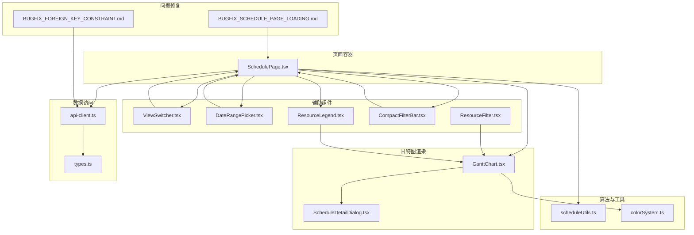
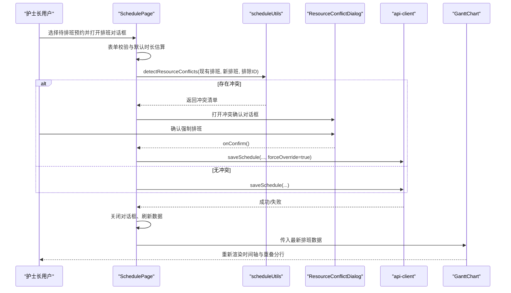
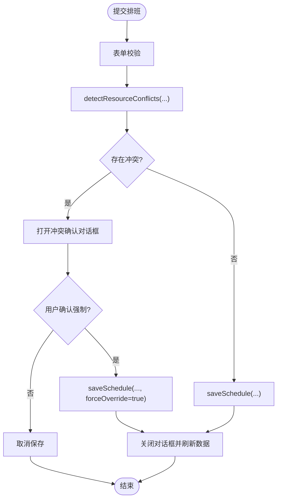
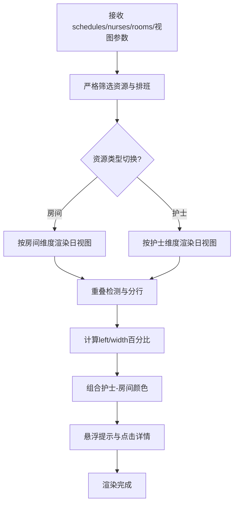
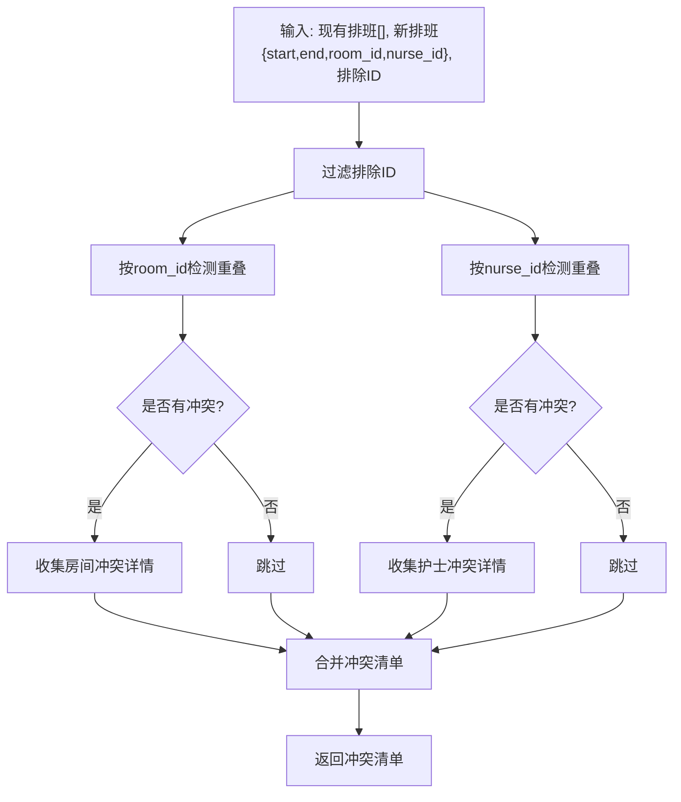
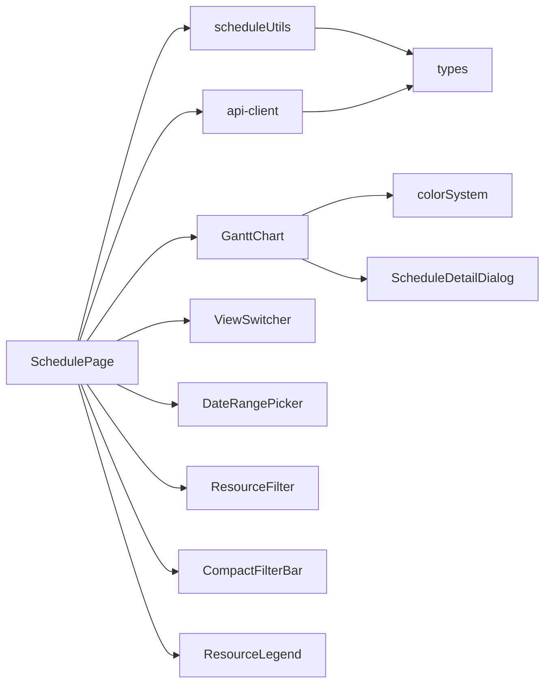

# 可视化排班

<cite>
**本文引用的文件**
- [SchedulePage.tsx](file://src/pages/head-nurse/SchedulePage.tsx)
- [GanttChart.tsx](file://src/components/appointment/GanttChart.tsx)
- [scheduleUtils.ts](file://src/utils/scheduleUtils.ts)
- [ResourceConflictDialog.tsx](file://src/components/appointment/ResourceConflictDialog.tsx)
- [ViewSwitcher.tsx](file://src/components/appointment/ViewSwitcher.tsx)
- [ResourceFilter.tsx](file://src/components/appointment/ResourceFilter.tsx)
- [CompactFilterBar.tsx](file://src/components/appointment/CompactFilterBar.tsx)
- [ResourceLegend.tsx](file://src/components/appointment/ResourceLegend.tsx)
- [DateRangePicker.tsx](file://src/components/appointment/DateRangePicker.tsx)
- [ScheduleDetailDialog.tsx](file://src/components/appointment/ScheduleDetailDialog.tsx)
- [api-client.ts](file://src/services/api-client.ts)
- [types.ts](file://src/types/types.ts)
- [colorSystem.ts](file://src/utils/colorSystem.ts)
- [BUGFIX_SCHEDULE_PAGE_LOADING.md](file://BUGFIX_SCHEDULE_PAGE_LOADING.md)
- [BUGFIX_FOREIGN_KEY_CONSTRAINT.md](file://BUGFIX_FOREIGN_KEY_CONSTRAINT.md)
</cite>

## 目录
1. [简介](#简介)
2. [项目结构](#项目结构)
3. [核心组件](#核心组件)
4. [架构总览](#架构总览)
5. [详细组件分析](#详细组件分析)
6. [依赖关系分析](#依赖关系分析)
7. [性能考量](#性能考量)
8. [故障排查指南](#故障排查指南)
9. [结论](#结论)

## 简介
本文件面向护士长端“可视化排班”能力，围绕 SchedulePage 与 GanttChart 组件，系统阐述甘特图如何渲染资源占用时间轴、scheduleUtils 中的冲突检测与智能时长调整机制、拖拽式排班的事件处理流程（前端拖拽 → 冲突检测 → 弹窗确认 → 调用 API 更新），以及视图切换、资源筛选与图例说明等辅助功能。同时给出页面加载性能优化建议与后端数据一致性校验说明。

## 项目结构
可视化排班由“页面容器 + 甘特图 + 辅助组件 + 工具函数 + API 客户端 + 类型定义 + 颜色系统 + 问题修复文档”构成，采用“页面容器驱动数据加载与交互，甘特图负责渲染与交互，工具函数提供算法支持”的分层设计。

图表来源
- [SchedulePage.tsx](file://src/pages/head-nurse/SchedulePage.tsx#L1-L200)
- [GanttChart.tsx](file://src/components/appointment/GanttChart.tsx#L1-L200)
- [scheduleUtils.ts](file://src/utils/scheduleUtils.ts#L1-L112)
- [api-client.ts](file://src/services/api-client.ts#L1-L120)
- [types.ts](file://src/types/types.ts#L139-L188)
- [colorSystem.ts](file://src/utils/colorSystem.ts#L1-L80)
- [BUGFIX_SCHEDULE_PAGE_LOADING.md](file://BUGFIX_SCHEDULE_PAGE_LOADING.md#L1-L120)
- [BUGFIX_FOREIGN_KEY_CONSTRAINT.md](file://BUGFIX_FOREIGN_KEY_CONSTRAINT.md#L1-L120)

章节来源
- [SchedulePage.tsx](file://src/pages/head-nurse/SchedulePage.tsx#L1-L120)
- [GanttChart.tsx](file://src/components/appointment/GanttChart.tsx#L1-L120)

## 核心组件
- SchedulePage：护士长端排班看板页面，负责加载数据、表单校验、冲突检测、对话框控制、调用 API、刷新视图。
- GanttChart：资源占用时间轴渲染器，支持日/周/月视图，按房间/护士维度展示排班，自动分行显示重叠排班，支持点击查看详情。
- scheduleUtils：提供时间重叠检测与资源冲突检测算法，返回冲突清单供前端弹窗确认。
- ResourceConflictDialog：资源冲突确认对话框，展示冲突详情并允许强制排班。
- ViewSwitcher/DateRangePicker/ResourceFilter/CompactFilterBar/ResourceLegend：视图切换、日期导航、资源筛选、紧凑筛选栏、图例说明等辅助功能。

章节来源
- [SchedulePage.tsx](file://src/pages/head-nurse/SchedulePage.tsx#L1-L120)
- [GanttChart.tsx](file://src/components/appointment/GanttChart.tsx#L1-L120)
- [scheduleUtils.ts](file://src/utils/scheduleUtils.ts#L1-L112)
- [ResourceConflictDialog.tsx](file://src/components/appointment/ResourceConflictDialog.tsx#L1-L93)
- [ViewSwitcher.tsx](file://src/components/appointment/ViewSwitcher.tsx#L1-L39)
- [DateRangePicker.tsx](file://src/components/appointment/DateRangePicker.tsx#L1-L223)
- [ResourceFilter.tsx](file://src/components/appointment/ResourceFilter.tsx#L1-L94)
- [CompactFilterBar.tsx](file://src/components/appointment/CompactFilterBar.tsx#L1-L260)
- [ResourceLegend.tsx](file://src/components/appointment/ResourceLegend.tsx#L1-L189)

## 架构总览
可视化排班采用“页面容器 + 组件化渲染 + 工具函数 + API 客户端”的分层架构。页面容器负责状态管理与数据加载；甘特图负责渲染与交互；工具函数提供冲突检测与时间计算；API 客户端封装后端接口；类型定义统一数据结构；颜色系统提供视觉编码；问题修复文档指导加载与外键约束问题。

图表来源
- [SchedulePage.tsx](file://src/pages/head-nurse/SchedulePage.tsx#L167-L238)
- [scheduleUtils.ts](file://src/utils/scheduleUtils.ts#L36-L112)
- [ResourceConflictDialog.tsx](file://src/components/appointment/ResourceConflictDialog.tsx#L1-L93)
- [api-client.ts](file://src/services/api-client.ts#L294-L320)
- [GanttChart.tsx](file://src/components/appointment/GanttChart.tsx#L735-L917)

## 详细组件分析

### SchedulePage：护士长端排班看板
- 数据加载与视图联动：根据视图模式（日/周/月）计算日期范围，批量并发加载预约、排班、护士、房间数据，支持统计卡片与待排班列表。
- 表单与默认值：创建排班时基于预约的预估时长与开始时间推导结束时间，提供可编辑的修正时长与调整原因。
- 冲突检测与对话框：提交前调用工具函数检测房间/护士冲突，若存在冲突弹出 ResourceConflictDialog，用户确认后强制保存。
- API 调用：创建/更新排班并同步更新预约状态；拒绝预约时更新状态并延迟刷新。
- 刷新策略：保存成功后关闭对话框并重新加载数据，确保 UI 与后端一致。

图表来源
- [SchedulePage.tsx](file://src/pages/head-nurse/SchedulePage.tsx#L167-L238)
- [scheduleUtils.ts](file://src/utils/scheduleUtils.ts#L36-L112)
- [ResourceConflictDialog.tsx](file://src/components/appointment/ResourceConflictDialog.tsx#L1-L93)

章节来源
- [SchedulePage.tsx](file://src/pages/head-nurse/SchedulePage.tsx#L1-L238)
- [api-client.ts](file://src/services/api-client.ts#L294-L320)
- [types.ts](file://src/types/types.ts#L139-L188)

### GanttChart：资源占用时间轴渲染
- 视图模式：支持日/周/月三种视图，日视图按房间维度绘制时间槽，自动分行显示重叠排班；周/月视图按房间/护士维度聚合展示。
- 严格筛选：支持按护士ID与房间ID集合进行严格筛选，仅显示匹配的资源与排班；支持资源类型切换（房间/护士）。
- 时间槽与位置计算：将 08:00-18:00 的时间区间映射为百分比 left/width，计算排班卡片的位置与宽度。
- 冲突与分行：对同一资源的排班进行重叠检测，逐个尝试放入现有行，若无重叠则放入，否则新建行，从而实现分行显示。
- 颜色编码：使用护士与房间颜色组合生成渐变背景，急单与锁定状态分别添加边框标识；支持点击进入详情对话框。
- 交互细节：日视图支持横向滚动，周/月视图支持点击单元格查看当天/当周/当月排班详情。

图表来源
- [GanttChart.tsx](file://src/components/appointment/GanttChart.tsx#L1-L200)
- [GanttChart.tsx](file://src/components/appointment/GanttChart.tsx#L271-L318)
- [GanttChart.tsx](file://src/components/appointment/GanttChart.tsx#L145-L157)
- [colorSystem.ts](file://src/utils/colorSystem.ts#L60-L80)

章节来源
- [GanttChart.tsx](file://src/components/appointment/GanttChart.tsx#L1-L200)
- [GanttChart.tsx](file://src/components/appointment/GanttChart.tsx#L271-L318)
- [GanttChart.tsx](file://src/components/appointment/GanttChart.tsx#L735-L917)
- [colorSystem.ts](file://src/utils/colorSystem.ts#L1-L80)

### scheduleUtils：冲突检测与时间重叠算法
- 时间重叠检测：将 HH:mm:ss 字符串转换为分钟数，判断区间是否相交，用于检测资源占用冲突。
- 资源冲突检测：过滤掉当前编辑的排班（排除ID），分别检测房间与护士的冲突，返回冲突清单，包含资源名称与冲突排班列表（客户名、服务名、起止时间）。

图表来源
- [scheduleUtils.ts](file://src/utils/scheduleUtils.ts#L16-L34)
- [scheduleUtils.ts](file://src/utils/scheduleUtils.ts#L36-L112)

章节来源
- [scheduleUtils.ts](file://src/utils/scheduleUtils.ts#L1-L112)

### ResourceConflictDialog：资源冲突确认
- 展示冲突类型（房间/护士）、资源名称与冲突排班列表（客户名、服务名、时间区间）。
- 提供“取消排班”与“强制排班”两种操作，强制排班将触发保存流程。

章节来源
- [ResourceConflictDialog.tsx](file://src/components/appointment/ResourceConflictDialog.tsx#L1-L93)

### 视图切换与日期导航
- ViewSwitcher：提供日/周/月三视图切换按钮，当前视图高亮。
- DateRangePicker：根据视图模式显示不同日期选择器（日历、周选择、年月选择），支持上一/下一时间段与“回到今天”。

章节来源
- [ViewSwitcher.tsx](file://src/components/appointment/ViewSwitcher.tsx#L1-L39)
- [DateRangePicker.tsx](file://src/components/appointment/DateRangePicker.tsx#L1-L223)

### 资源筛选与紧凑筛选栏
- ResourceFilter：按资源类型（房间/护士）切换显示范围，支持“已筛选”提示。
- CompactFilterBar：横向紧凑筛选栏，支持护士/房间多选、清除筛选、资源类型切换、严格筛选模式说明。

章节来源
- [ResourceFilter.tsx](file://src/components/appointment/ResourceFilter.tsx#L1-L94)
- [CompactFilterBar.tsx](file://src/components/appointment/CompactFilterBar.tsx#L1-L260)

### 图例说明（ResourceLegend）
- 展示护士与房间的颜色编码，支持折叠/展开，仅显示有预约的资源，便于快速识别。

章节来源
- [ResourceLegend.tsx](file://src/components/appointment/ResourceLegend.tsx#L1-L189)

### API 客户端与类型定义
- api-client：封装 getAppointments/getSchedules/createSchedule/updateSchedule/deleteSchedule 等接口，统一错误处理与鉴权头。
- types：定义 Schedule/ScheduleWithDetails/Appointment/AppointmentWithDetails 等类型，确保前后端数据结构一致。

章节来源
- [api-client.ts](file://src/services/api-client.ts#L147-L320)
- [types.ts](file://src/types/types.ts#L139-L188)

## 依赖关系分析
- SchedulePage 依赖 scheduleUtils 进行冲突检测，依赖 api-client 进行数据持久化，依赖 GanttChart 进行渲染，依赖 ViewSwitcher/DateRangePicker/ResourceFilter/CompactFilterBar/ResourceLegend 提升交互与可读性。
- GanttChart 依赖 colorSystem 进行颜色编码，依赖 ScheduleDetailDialog 展示详情。
- scheduleUtils 与 types 为纯算法与类型模块，无副作用。
- api-client 与 types 为数据访问层与类型定义层，耦合度低，便于替换与扩展。

图表来源
- [SchedulePage.tsx](file://src/pages/head-nurse/SchedulePage.tsx#L1-L120)
- [GanttChart.tsx](file://src/components/appointment/GanttChart.tsx#L1-L120)
- [scheduleUtils.ts](file://src/utils/scheduleUtils.ts#L1-L112)
- [api-client.ts](file://src/services/api-client.ts#L147-L320)
- [types.ts](file://src/types/types.ts#L139-L188)
- [colorSystem.ts](file://src/utils/colorSystem.ts#L1-L80)

章节来源
- [SchedulePage.tsx](file://src/pages/head-nurse/SchedulePage.tsx#L1-L120)
- [GanttChart.tsx](file://src/components/appointment/GanttChart.tsx#L1-L120)

## 性能考量
- 页面加载性能（参考已知问题）：
  - 问题：智能排班页面曾出现“加载数据失败”，影响预约与排班数据查询。
  - 根因：Supabase 查询 JOIN 语法错误导致查询失败，后端外键约束指向旧表导致保存失败。
  - 优化建议（基于修复文档）：
    - 使用 React Query 或类似库进行数据缓存与重试，减少重复请求与网络波动影响。
    - 在页面加载时显示骨架屏或加载指示器，改善感知性能。
    - 对高频查询添加分页与字段裁剪，避免一次性加载过多数据。
    - 对日期范围与筛选条件进行去抖与节流，降低并发请求压力。
    - 对 GanttChart 的日视图渲染进行虚拟滚动或按需渲染，减少 DOM 节点数量。
- 后端数据一致性：
  - 保存排班前应进行资源可用性检查（房间/护士在时间段内是否被占用），并在 API 层捕获并转换外键约束错误为友好提示。
  - 建议引入事务处理，确保创建排班与更新预约状态的原子性，避免数据不一致。

章节来源
- [BUGFIX_SCHEDULE_PAGE_LOADING.md](file://BUGFIX_SCHEDULE_PAGE_LOADING.md#L1-L120)
- [BUGFIX_FOREIGN_KEY_CONSTRAINT.md](file://BUGFIX_FOREIGN_KEY_CONSTRAINT.md#L1-L120)

## 故障排查指南
- 页面加载失败：
  - 现象：提示“加载数据失败”，无法查看待排班与排班记录。
  - 排查：检查 Supabase JOIN 语法是否使用外键约束名区分多外键指向同一表的情况；确认 api-client 请求是否携带鉴权头；查看控制台错误日志。
  - 参考修复：将 JOIN 别名与外键约束名对应，改进错误处理输出具体错误信息。
- 保存排班失败（外键约束）：
  - 现象：提交排班时报“违反外键约束”。
  - 排查：确认 schedules 表的 room_id/nurse_id 外键已指向 rooms/nurses 表，而非旧的 resources 表；前端传递的 ID 来自新表。
  - 参考修复：执行数据库迁移，删除旧外键约束并添加新约束，必要时清空历史数据以保证一致性。
- 冲突检测不生效：
  - 现象：提交排班未弹出冲突对话框。
  - 排查：确认 schedules 数据已正确加载；检查时间格式（HH:mm:ss）；确认排除 ID 逻辑正确。
- 分行显示异常：
  - 现象：重叠排班未分行或分行数量异常。
  - 排查：确认 isTimeOverlap 与 arrangeSchedulesInRows 的逻辑；检查行高与绝对定位 top 计算。
- 视图切换无响应：
  - 现象：点击视图切换按钮无反应。
  - 排查：确认 viewMode 状态更新；确认 GanttChart 接收到新的 viewMode 参数。

章节来源
- [BUGFIX_SCHEDULE_PAGE_LOADING.md](file://BUGFIX_SCHEDULE_PAGE_LOADING.md#L252-L410)
- [BUGFIX_FOREIGN_KEY_CONSTRAINT.md](file://BUGFIX_FOREIGN_KEY_CONSTRAINT.md#L142-L325)

## 结论
可视化排班通过“页面容器 + 甘特图 + 工具函数 + API 客户端”的清晰分层，实现了护士长端对资源占用时间轴的直观呈现与高效排班操作。scheduleUtils 的冲突检测与 GanttChart 的分行渲染共同保障了资源使用的合理性与可视性。配合视图切换、日期导航、资源筛选与图例说明，形成了完整的排班工作流。针对已知问题，建议在前端引入缓存与重试、在后端完善外键约束与事务处理，以进一步提升稳定性与用户体验。