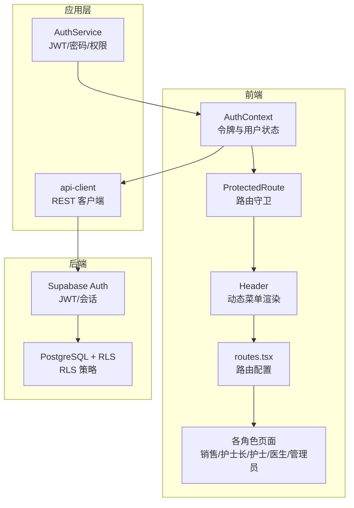
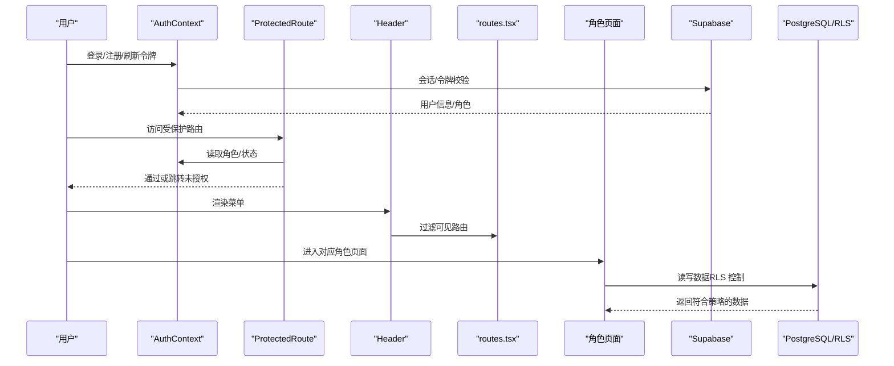
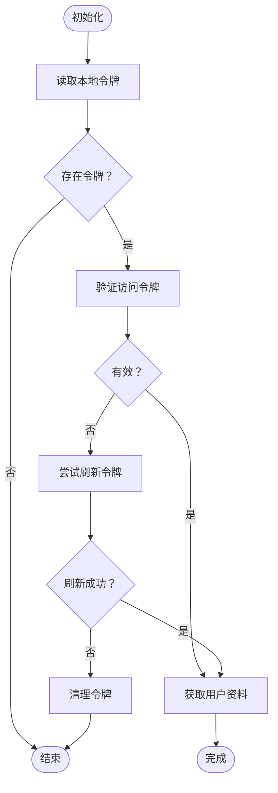
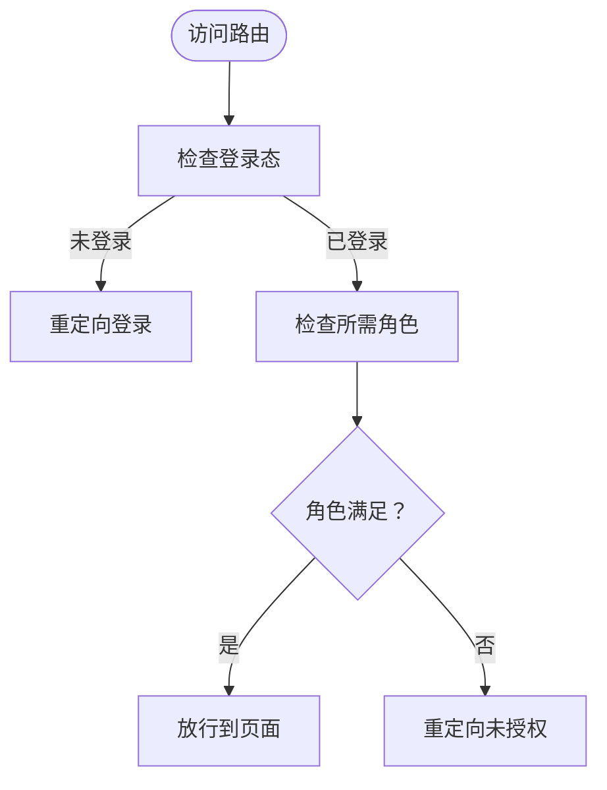
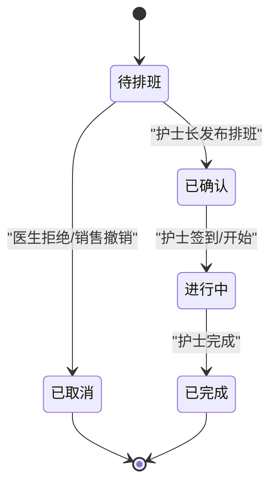
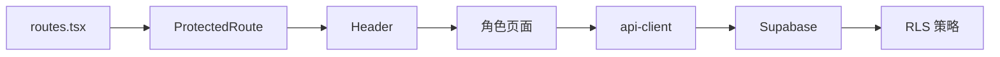

# 多角色协同

<cite>
**本文引用的文件**
- [AGENTS.md](file://openspec/AGENTS.md)
- [AUTH_IMPLEMENTATION_SUMMARY.md](file://AUTH_IMPLEMENTATION_SUMMARY.md)
- [auth.ts](file://src/services/auth.ts)
- [ProtectedRoute.tsx](file://src/components/auth/ProtectedRoute.tsx)
- [UserManagementPage.tsx](file://src/pages/admin/UserManagementPage.tsx)
- [routes.tsx](file://src/routes.tsx)
- [Header.tsx](file://src/components/common/Header.tsx)
- [AuthService.ts](file://src/services/auth-client.ts)
- [AuthContext.tsx](file://src/contexts/AuthContext.tsx)
- [00008_add_rls_policies_for_role_based_access.sql](file://supabase/migrations/00008_add_rls_policies_for_role_based_access.sql)
- [types.ts](file://src/types/types.ts)
- [api-client.ts](file://src/services/api-client.ts)
- [AppointmentPage.tsx（销售）](file://src/pages/sales/AppointmentPage.tsx)
- [SchedulePage.tsx（护士长）](file://src/pages/head-nurse/SchedulePage.tsx)
- [TaskPage.tsx（护士）](file://src/pages/nurse/TaskPage.tsx)
- [AppointmentPage.tsx（医生）](file://src/pages/doctor/AppointmentPage.tsx)
- [PROJECT_STATUS.md](file://PROJECT_STATUS.md)
</cite>

## 目录
1. [引言](#引言)
2. [项目结构](#项目结构)
3. [核心组件](#核心组件)
4. [架构总览](#架构总览)
5. [详细组件分析](#详细组件分析)
6. [依赖关系分析](#依赖关系分析)
7. [性能考虑](#性能考虑)
8. [故障排除指南](#故障排除指南)
9. [结论](#结论)
10. [附录](#附录)

## 引言
本文件系统化阐述 Bio-Appointment 多角色协同工作流的设计与实现，覆盖销售、护士长、护士、医生、管理员五类角色的权限边界与操作流程。文档基于 AGENTS.md 中的角色职责，结合 UserManagementPage 与 RLS 策略（见 supabase 迁移文件），说明细粒度权限控制的落地方式；并通过状态机模型描述预约从“待排班”到“已完成”的完整生命周期，解释各角色在不同状态下的可执行操作。同时，文档涵盖认证流程（auth.ts）、动态路由控制（ProtectedRoute）与菜单渲染逻辑，并引用 AUTH_IMPLEMENTATION_SUMMARY.md 中的权限验证机制，最后提供新增角色或调整权限的扩展指南。

## 项目结构
系统采用前后端分离架构，前端使用 React + TypeScript，后端通过 Supabase 提供认证与数据库服务。权限控制贯穿三层：
- 前端：路由守卫与菜单渲染，依据角色过滤可见路由与按钮
- 应用层：认证上下文与客户端服务，负责令牌管理与会话刷新
- 数据层：PostgreSQL + RLS，按角色限定数据访问范围

图表来源
- [AuthContext.tsx](file://src/contexts/AuthContext.tsx#L1-L308)
- [ProtectedRoute.tsx](file://src/components/auth/ProtectedRoute.tsx#L1-L49)
- [Header.tsx](file://src/components/common/Header.tsx#L1-L196)
- [routes.tsx](file://src/routes.tsx#L1-L135)
- [AuthService.ts](file://src/services/auth-client.ts)
- [api-client.ts](file://src/services/api-client.ts#L1-L381)
- [00008_add_rls_policies_for_role_based_access.sql](file://supabase/migrations/00008_add_rls_policies_for_role_based_access.sql#L1-L180)

章节来源
- [routes.tsx](file://src/routes.tsx#L1-L135)
- [Header.tsx](file://src/components/common/Header.tsx#L1-L196)
- [AuthContext.tsx](file://src/contexts/AuthContext.tsx#L1-L308)
- [AuthService.ts](file://src/services/auth-client.ts)
- [api-client.ts](file://src/services/api-client.ts#L1-L381)
- [00008_add_rls_policies_for_role_based_access.sql](file://supabase/migrations/00008_add_rls_policies_for_role_based_access.sql#L1-L180)

## 核心组件
- 认证上下文与客户端服务：负责令牌存储、刷新、用户信息获取与变更
- 路由守卫：统一校验登录态与角色权限
- 动态菜单：根据角色过滤可见路由
- 用户管理页面：管理员分配角色与状态
- RLS 策略：数据库级行级安全控制

章节来源
- [AuthContext.tsx](file://src/contexts/AuthContext.tsx#L1-L308)
- [ProtectedRoute.tsx](file://src/components/auth/ProtectedRoute.tsx#L1-L49)
- [Header.tsx](file://src/components/common/Header.tsx#L1-L196)
- [UserManagementPage.tsx](file://src/pages/admin/UserManagementPage.tsx#L1-L608)
- [00008_add_rls_policies_for_role_based_access.sql](file://supabase/migrations/00008_add_rls_policies_for_role_based_access.sql#L1-L180)

## 架构总览
多角色协同的权限体系由“前端路由守卫 + 动态菜单 + 应用层权限 + 数据库 RLS”四层构成，形成“模块级、操作级、数据级”的细粒度控制闭环。

图表来源
- [AuthContext.tsx](file://src/contexts/AuthContext.tsx#L1-L308)
- [ProtectedRoute.tsx](file://src/components/auth/ProtectedRoute.tsx#L1-L49)
- [Header.tsx](file://src/components/common/Header.tsx#L1-L196)
- [routes.tsx](file://src/routes.tsx#L1-L135)
- [00008_add_rls_policies_for_role_based_access.sql](file://supabase/migrations/00008_add_rls_policies_for_role_based_access.sql#L1-L180)

## 详细组件分析

### 认证与会话管理（auth.ts 与 AuthContext）
- 令牌管理：本地存储访问令牌与刷新令牌，自动刷新与过期检测
- 用户状态：初始化时尝试使用访问令牌恢复会话，失败则尝试刷新令牌
- 登出：清理本地令牌并调用后端登出接口
- 密码与角色权限：提供密码变更、角色权限矩阵查询等能力

图表来源
- [AuthContext.tsx](file://src/contexts/AuthContext.tsx#L1-L308)

章节来源
- [AuthContext.tsx](file://src/contexts/AuthContext.tsx#L1-L308)
- [auth.ts](file://src/services/auth.ts#L1-L341)

### 路由守卫与菜单渲染（ProtectedRoute 与 Header）
- 路由守卫：未登录重定向登录；角色不满足重定向未授权；超级管理员放行
- 菜单渲染：根据角色过滤可见路由，移动端与桌面端一致

图表来源
- [ProtectedRoute.tsx](file://src/components/auth/ProtectedRoute.tsx#L1-L49)
- [Header.tsx](file://src/components/common/Header.tsx#L1-L196)
- [routes.tsx](file://src/routes.tsx#L1-L135)

章节来源
- [ProtectedRoute.tsx](file://src/components/auth/ProtectedRoute.tsx#L1-L49)
- [Header.tsx](file://src/components/common/Header.tsx#L1-L196)
- [routes.tsx](file://src/routes.tsx#L1-L135)

### 用户管理与角色分配（UserManagementPage）
- 管理员可创建/编辑/删除用户，分配角色与部门，禁用/启用账户
- 前端表单校验与后端 API 调用，配合权限矩阵与 RLS 策略

章节来源
- [UserManagementPage.tsx](file://src/pages/admin/UserManagementPage.tsx#L1-L608)
- [AUTH_IMPLEMENTATION_SUMMARY.md](file://AUTH_IMPLEMENTATION_SUMMARY.md#L1-L350)

### 数据权限与 RLS 策略
- appointments 表：超级管理员与护士长可查看全部；销售仅能查看自己创建；医生仅能查看分配给自己的；护士可查看全部
- schedules 表：超级管理员与护士长可查看全部；护士仅能查看分配给自己的；销售可查看与自己创建的预约相关的排班
- 更新权限：销售仅能在特定状态下更新；护士长可更新所有；医生仅能更新分配给自己的字段；护士仅能更新自己的排班状态字段

章节来源
- [00008_add_rls_policies_for_role_based_access.sql](file://supabase/migrations/00008_add_rls_policies_for_role_based_access.sql#L1-L180)

### 角色职责与页面能力（基于 AGENTS.md 与实现）
- 超级管理员：工作台、用户管理、系统配置、所有功能
- 销售：工作台、预约发起、查看自己创建的预约
- 护士长：工作台、智能排班、查看所有预约与排班、管理护士任务
- 护士：工作台、我的任务、查看分配给自己的任务
- 医生：工作台、预约待办、查看分配给自己的预约

章节来源
- [AUTH_IMPLEMENTATION_SUMMARY.md](file://AUTH_IMPLEMENTATION_SUMMARY.md#L1-L350)
- [routes.tsx](file://src/routes.tsx#L1-L135)

### 预约生命周期与状态机
预约从“待排班”到“已完成”的状态流转如下：

图表来源
- [PROJECT_STATUS.md](file://PROJECT_STATUS.md#L203-L332)
- [types.ts](file://src/types/types.ts#L1-L200)

各角色在不同状态下的可执行操作：
- 销售：提交预约（待排班）、查看自己创建的预约
- 护士长：查看待排班、发布排班（已确认）、查看所有排班
- 护士：查看分配给自己的任务、签到/开始/完成
- 医生：查看分配给自己的预约、接受/拒绝/改期
- 管理员：用户管理、系统配置

章节来源
- [AppointmentPage.tsx（销售）](file://src/pages/sales/AppointmentPage.tsx#L1-L451)
- [SchedulePage.tsx（护士长）](file://src/pages/head-nurse/SchedulePage.tsx#L1-L695)
- [TaskPage.tsx（护士）](file://src/pages/nurse/TaskPage.tsx#L1-L389)
- [AppointmentPage.tsx（医生）](file://src/pages/doctor/AppointmentPage.tsx#L1-L395)
- [PROJECT_STATUS.md](file://PROJECT_STATUS.md#L203-L332)

## 依赖关系分析
- 路由配置与角色权限耦合：routes.tsx 中的 requiredRole 决定页面可见性与访问控制
- 菜单渲染依赖角色：Header.tsx 根据角色过滤可见路由
- 页面能力依赖类型与状态：各角色页面使用 api-client 与类型定义进行数据交互
- 数据访问依赖 RLS：RLS 策略保证不同角色只能访问授权数据

图表来源
- [routes.tsx](file://src/routes.tsx#L1-L135)
- [ProtectedRoute.tsx](file://src/components/auth/ProtectedRoute.tsx#L1-L49)
- [Header.tsx](file://src/components/common/Header.tsx#L1-L196)
- [api-client.ts](file://src/services/api-client.ts#L1-L381)
- [00008_add_rls_policies_for_role_based_access.sql](file://supabase/migrations/00008_add_rls_policies_for_role_based_access.sql#L1-L180)

章节来源
- [routes.tsx](file://src/routes.tsx#L1-L135)
- [Header.tsx](file://src/components/common/Header.tsx#L1-L196)
- [api-client.ts](file://src/services/api-client.ts#L1-L381)
- [00008_add_rls_policies_for_role_based_access.sql](file://supabase/migrations/00008_add_rls_policies_for_role_based_access.sql#L1-L180)

## 性能考虑
- 前端令牌刷新：定时检查令牌有效期，提前刷新避免频繁失败
- 路由守卫与菜单渲染：基于内存状态判断，避免重复网络请求
- 数据访问：RLS 在数据库层过滤，减少前端复杂逻辑与网络传输

[本节为通用指导，无需列出具体文件来源]

## 故障排除指南
- 登录失败：检查用户名/密码与账户状态；确认令牌存储与刷新流程
- 无权限访问：确认 requiredRole 配置与当前角色；检查 RLS 策略是否生效
- 数据越权：确认 RLS 策略与后端权限校验是否一致
- 菜单不显示：检查 Header 中角色过滤逻辑与路由 visible 字段

章节来源
- [AuthContext.tsx](file://src/contexts/AuthContext.tsx#L1-L308)
- [ProtectedRoute.tsx](file://src/components/auth/ProtectedRoute.tsx#L1-L49)
- [Header.tsx](file://src/components/common/Header.tsx#L1-L196)
- [00008_add_rls_policies_for_role_based_access.sql](file://supabase/migrations/00008_add_rls_policies_for_role_based_access.sql#L1-L180)

## 结论
本系统通过“前端路由守卫 + 动态菜单 + 应用层权限 + 数据库 RLS”的多层权限控制，实现了销售、护士长、护士、医生、管理员五类角色的细粒度权限边界与协作流程。状态机模型清晰描述了预约生命周期，各角色在不同状态下的可执行操作明确。结合 AUTH_IMPLEMENTATION_SUMMARY.md 的权限验证机制与 AGENTS.md 的角色职责，系统具备良好的可维护性与扩展性。

[本节为总结性内容，无需列出具体文件来源]

## 附录

### 新增角色或调整权限的扩展指南
- 新增角色
  - 在类型定义中增加角色枚举与权限矩阵
  - 在路由配置中为新角色页面设置 requiredRole
  - 在 Header 中补充角色标签与颜色映射
  - 在 RLS 策略中为新角色添加数据访问规则
- 调整权限
  - 修改 AuthService 的权限矩阵或引入新的权限检查函数
  - 在 UserManagementPage 中调整角色分配与权限说明
  - 在页面中增加条件渲染与按钮禁用逻辑
  - 在 RLS 策略中调整 SELECT/INSERT/UPDATE 条件

章节来源
- [types.ts](file://src/types/types.ts#L1-L120)
- [routes.tsx](file://src/routes.tsx#L1-L135)
- [Header.tsx](file://src/components/common/Header.tsx#L1-L196)
- [UserManagementPage.tsx](file://src/pages/admin/UserManagementPage.tsx#L1-L608)
- [auth.ts](file://src/services/auth.ts#L300-L341)
- [00008_add_rls_policies_for_role_based_access.sql](file://supabase/migrations/00008_add_rls_policies_for_role_based_access.sql#L1-L180)