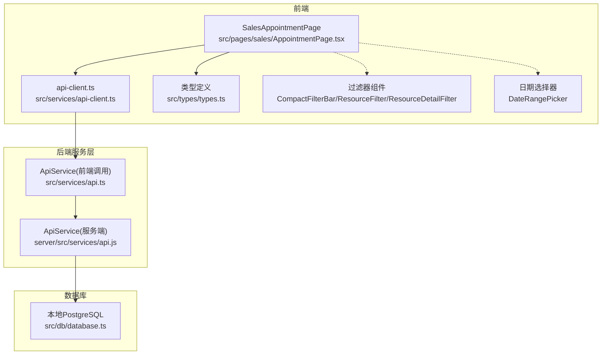
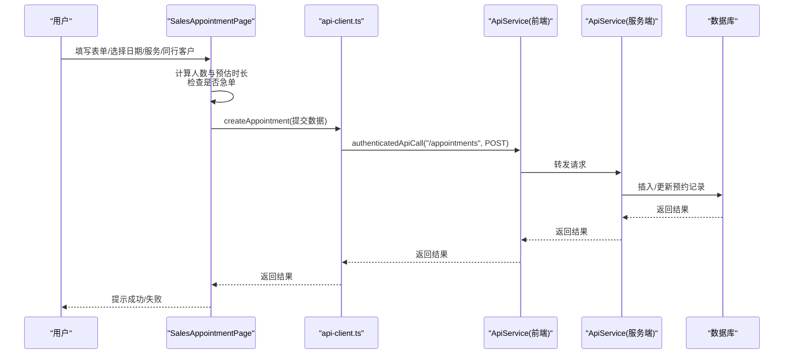
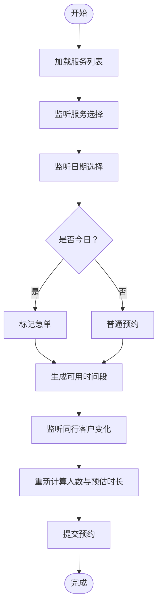
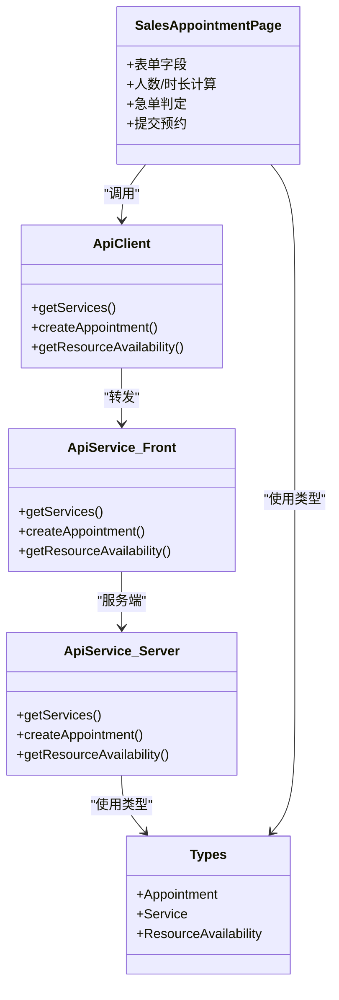

# 智能预约管理

<cite>
**本文引用的文件**
- [src/pages/sales/AppointmentPage.tsx](file://src/pages/sales/AppointmentPage.tsx)
- [src/services/api-client.ts](file://src/services/api-client.ts)
- [src/components/appointment/CompactFilterBar.tsx](file://src/components/appointment/CompactFilterBar.tsx)
- [src/components/appointment/DateRangePicker.tsx](file://src/components/appointment/DateRangePicker.tsx)
- [src/components/appointment/ResourceFilter.tsx](file://src/components/appointment/ResourceFilter.tsx)
- [src/components/appointment/ResourceDetailFilter.tsx](file://src/components/appointment/ResourceDetailFilter.tsx)
- [src/services/api.ts](file://src/services/api.ts)
- [src/types/types.ts](file://src/types/types.ts)
- [src/db/database.ts](file://src/db/database.ts)
- [server/src/services/api.js](file://server/src/services/api.js)
- [docs/prd.md](file://docs/prd.md)
- [BUGFIX_DATE_PICKER.md](file://BUGFIX_DATE_PICKER.md)
- [BUGFIX_DURATION_INPUT.md](file://BUGFIX_DURATION_INPUT.md)
- [FEATURE_TIME_SELECTION.md](file://FEATURE_TIME_SELECTION.md)
</cite>

## 目录
1. [简介](#简介)
2. [项目结构](#项目结构)
3. [核心组件](#核心组件)
4. [架构总览](#架构总览)
5. [详细组件分析](#详细组件分析)
6. [依赖关系分析](#依赖关系分析)
7. [性能考量](#性能考量)
8. [故障排除指南](#故障排除指南)
9. [结论](#结论)
10. [附录](#附录)

## 简介
本文件围绕“智能预约管理”功能，聚焦销售角色在 AppointmentPage 中的预约发起流程，系统性阐述以下内容：
- 前端表单与组件交互（如 CompactFilterBar、DateRangePicker）的状态管理与联动
- 表单数据经由 api-client.ts 提交至后端 API 的完整链路
- 业务规则实现：自动计算人数、预估时长、急单处理、同行客户支持
- 数据库持久化与后端服务层对接
- 常见问题与修复方案（日期选择异常、时长输入错误）

## 项目结构
该功能主要分布在前端页面、服务层与类型定义中，后端服务层负责数据库访问与资源可用性校验。

图表来源
- [src/pages/sales/AppointmentPage.tsx](file://src/pages/sales/AppointmentPage.tsx#L1-L451)
- [src/services/api-client.ts](file://src/services/api-client.ts#L1-L381)
- [src/services/api.ts](file://src/services/api.ts#L1-L483)
- [server/src/services/api.js](file://server/src/services/api.js#L1-L374)
- [src/db/database.ts](file://src/db/database.ts#L1-L43)
- [src/types/types.ts](file://src/types/types.ts#L1-L487)

章节来源
- [src/pages/sales/AppointmentPage.tsx](file://src/pages/sales/AppointmentPage.tsx#L1-L451)
- [src/services/api-client.ts](file://src/services/api-client.ts#L1-L381)
- [src/services/api.ts](file://src/services/api.ts#L1-L483)
- [server/src/services/api.js](file://server/src/services/api.js#L1-L374)
- [src/db/database.ts](file://src/db/database.ts#L1-L43)
- [src/types/types.ts](file://src/types/types.ts#L1-L487)

## 核心组件
- SalesAppointmentPage：销售端预约发起页面，负责表单渲染、字段联动、业务规则计算与提交。
- api-client.ts：统一的前端 API 客户端，封装认证、请求头、错误处理与各领域 API 方法。
- 服务层 ApiService：提供 getServices、createAppointment、getResourceAvailability 等方法，供前端调用。
- 类型定义 types.ts：定义 Appointment、Service、ResourceAvailability 等核心类型。
- 过滤器组件：用于资源筛选（护士/房间），配合资源可用性查询。
- 日期选择器：支持日/周/月视图切换与快速导航。

章节来源
- [src/pages/sales/AppointmentPage.tsx](file://src/pages/sales/AppointmentPage.tsx#L1-L451)
- [src/services/api-client.ts](file://src/services/api-client.ts#L1-L381)
- [src/services/api.ts](file://src/services/api.ts#L1-L483)
- [src/types/types.ts](file://src/types/types.ts#L1-L487)
- [src/components/appointment/CompactFilterBar.tsx](file://src/components/appointment/CompactFilterBar.tsx#L1-L260)
- [src/components/appointment/DateRangePicker.tsx](file://src/components/appointment/DateRangePicker.tsx#L1-L223)

## 架构总览
从前端到后端的数据流如下：

图表来源
- [src/pages/sales/AppointmentPage.tsx](file://src/pages/sales/AppointmentPage.tsx#L164-L219)
- [src/services/api-client.ts](file://src/services/api-client.ts#L147-L210)
- [src/services/api.ts](file://src/services/api.ts#L221-L237)
- [server/src/services/api.js](file://server/src/services/api.js#L150-L164)

## 详细组件分析

### SalesAppointmentPage（预约发起页面）
- 表单字段与验证
  - 字段：主客户姓名、同行客户（可选）、服务项目、预约日期、服务开始时间
  - 验证：使用 Zod schema，必填校验与日期必填校验
- 业务规则
  - 自动计算总人数：主客户 + 非空同行客户
  - 预估时长：基于服务基础时长与同行人数计算（同行支持时生效）
  - 急单处理：当日选择且服务类别为护理类才允许；急单模式下跳过资源校验
  - 同行客户支持：提交时将同行名单写入 companion_names，并生成备注
- 资源可用性与时间段生成
  - 依据服务基础时长与总人数推导结束时间
  - 生成08:00-18:00每30分钟一个时间段
  - 调用 getResourceAvailability 校验房间与护士是否冲突
  - 急单模式下即使不可用也允许选择
- 提交流程
  - 格式化日期与时间
  - 计算结束时间
  - 调用 createAppointment 提交
  - 成功后清空表单并提示

图表来源
- [src/pages/sales/AppointmentPage.tsx](file://src/pages/sales/AppointmentPage.tsx#L99-L139)
- [src/pages/sales/AppointmentPage.tsx](file://src/pages/sales/AppointmentPage.tsx#L141-L148)
- [src/pages/sales/AppointmentPage.tsx](file://src/pages/sales/AppointmentPage.tsx#L164-L219)

章节来源
- [src/pages/sales/AppointmentPage.tsx](file://src/pages/sales/AppointmentPage.tsx#L37-L45)
- [src/pages/sales/AppointmentPage.tsx](file://src/pages/sales/AppointmentPage.tsx#L99-L139)
- [src/pages/sales/AppointmentPage.tsx](file://src/pages/sales/AppointmentPage.tsx#L141-L148)
- [src/pages/sales/AppointmentPage.tsx](file://src/pages/sales/AppointmentPage.tsx#L164-L219)

### api-client.ts（前端 API 客户端）
- 统一请求封装：apiCall、authenticatedApiCall
- 认证：从本地存储读取令牌，自动附加 Authorization 头
- 领域 API：
  - 预约：getAppointments、createAppointment、updateAppointment、deleteAppointment
  - 服务：getServices
  - 资源：getResources、getSchedules、getTaskExecutions
  - 资源可用性：getResourceAvailability
  - 排班：createSchedule、updateSchedule、deleteSchedule
  - 仪表盘：getDashboardStats
- 类型：定义 Appointment、Service、Resource、Schedule、TaskExecution、Profile 等类型

章节来源
- [src/services/api-client.ts](file://src/services/api-client.ts#L1-L381)
- [src/types/types.ts](file://src/types/types.ts#L60-L131)
- [src/types/types.ts](file://src/types/types.ts#L170-L189)
- [src/types/types.ts](file://src/types/types.ts#L235-L247)

### 服务层 ApiService（前后端）
- 前端 ApiService（src/services/api.ts）：封装数据库访问，提供 getServices、createAppointment、getResourceAvailability 等方法
- 服务端 ApiService（server/src/services/api.js）：与数据库交互，提供相同接口，用于服务端路由转发
- 资源可用性查询：同时查询可用房间与可用护士，避免时间段冲突

章节来源
- [src/services/api.ts](file://src/services/api.ts#L77-L112)
- [src/services/api.ts](file://src/services/api.ts#L221-L237)
- [src/services/api.ts](file://src/services/api.ts#L400-L452)
- [server/src/services/api.js](file://server/src/services/api.js#L50-L71)
- [server/src/services/api.js](file://server/src/services/api.js#L150-L164)
- [server/src/services/api.js](file://server/src/services/api.js#L305-L351)

### 类型定义（types.ts）
- Appointment：包含客户信息、服务、请求时间、总人数、预估时长、是否急单、状态等
- Service：包含基础时长、是否允许同行、是否需要医生确认等
- ResourceAvailability：返回可用房间与可用护士列表
- 其他类型：Profile、Schedule、TaskExecution 等

章节来源
- [src/types/types.ts](file://src/types/types.ts#L117-L137)
- [src/types/types.ts](file://src/types/types.ts#L97-L106)
- [src/types/types.ts](file://src/types/types.ts#L235-L247)

### 组件交互与状态管理

#### CompactFilterBar（紧凑筛选栏）
- 功能：按护士/房间/资源类型进行筛选，支持清除筛选
- 交互：Popover 弹出选择面板，滚动区域展示资源列表，复选框切换选中状态
- 与 AppointmentPage 的关系：用于资源看板上方的筛选，便于查看资源占用与可用性

章节来源
- [src/components/appointment/CompactFilterBar.tsx](file://src/components/appointment/CompactFilterBar.tsx#L1-L260)

#### DateRangePicker（日期范围选择器）
- 功能：支持日/周/月视图，快速导航到上一个/下一个时间段，回到今天
- 交互：根据视图模式渲染不同的选择器（日历、周选择、年月选择）
- 与 AppointmentPage 的关系：用于资源看板的时间维度切换，非预约发起直接交互

章节来源
- [src/components/appointment/DateRangePicker.tsx](file://src/components/appointment/DateRangePicker.tsx#L1-L223)

#### ResourceFilter 与 ResourceDetailFilter
- 功能：资源筛选（护士/房间）与详细筛选（多选、清除、说明）
- 交互：复选框切换、滚动区域展示、筛选说明提示
- 与 AppointmentPage 的关系：用于资源看板的筛选，辅助判断时间段可用性

章节来源
- [src/components/appointment/ResourceFilter.tsx](file://src/components/appointment/ResourceFilter.tsx#L1-L94)
- [src/components/appointment/ResourceDetailFilter.tsx](file://src/components/appointment/ResourceDetailFilter.tsx#L1-L217)

### 业务规则实现

#### 自动计算人数与预估时长
- 人数：主客户 + 非空同行客户
- 预估时长：基础时长 + (人数-1) × 30 分钟（仅当服务允许同行时生效）
- 结束时间：开始时间 + 预估时长，确保不超过18:00

章节来源
- [src/pages/sales/AppointmentPage.tsx](file://src/pages/sales/AppointmentPage.tsx#L102-L139)
- [src/pages/sales/AppointmentPage.tsx](file://src/pages/sales/AppointmentPage.tsx#L178-L189)

#### 急单处理
- 条件：当日选择且服务类别为护理类
- 行为：跳过资源校验，直接显示所有时间段，提交后标记 is_urgent 并提示急单流程

章节来源
- [src/pages/sales/AppointmentPage.tsx](file://src/pages/sales/AppointmentPage.tsx#L169-L173)
- [src/pages/sales/AppointmentPage.tsx](file://src/pages/sales/AppointmentPage.tsx#L178-L189)
- [docs/prd.md](file://docs/prd.md#L207-L324)

#### 同行客户支持
- 表单：支持添加多个同行客户，输入为空则不计入总人数
- 提交：将非空同行名单写入 companion_names，并生成备注

章节来源
- [src/pages/sales/AppointmentPage.tsx](file://src/pages/sales/AppointmentPage.tsx#L150-L163)
- [src/pages/sales/AppointmentPage.tsx](file://src/pages/sales/AppointmentPage.tsx#L191-L203)

### 数据库持久化
- 初始化：本地 PostgreSQL，通过 initializeDatabase 与 DatabaseHelper 进行查询与插入
- 预约创建：createAppointment 插入预约记录，状态初始为 pending
- 资源可用性：getResourceAvailability 查询可用房间与护士，避免时间段冲突

章节来源
- [src/db/database.ts](file://src/db/database.ts#L1-L43)
- [src/services/api.ts](file://src/services/api.ts#L221-L237)
- [src/services/api.ts](file://src/services/api.ts#L400-L452)
- [server/src/services/api.js](file://server/src/services/api.js#L150-L164)
- [server/src/services/api.js](file://server/src/services/api.js#L305-L351)

## 依赖关系分析

图表来源
- [src/pages/sales/AppointmentPage.tsx](file://src/pages/sales/AppointmentPage.tsx#L1-L451)
- [src/services/api-client.ts](file://src/services/api-client.ts#L147-L210)
- [src/services/api.ts](file://src/services/api.ts#L77-L112)
- [src/services/api.ts](file://src/services/api.ts#L221-L237)
- [src/services/api.ts](file://src/services/api.ts#L400-L452)
- [server/src/services/api.js](file://server/src/services/api.js#L50-L71)
- [server/src/services/api.js](file://server/src/services/api.js#L150-L164)
- [server/src/services/api.js](file://server/src/services/api.js#L305-L351)
- [src/types/types.ts](file://src/types/types.ts#L97-L137)
- [src/types/types.ts](file://src/types/types.ts#L235-L247)

## 性能考量
- 前端计算：时间段生成与资源可用性查询在客户端进行，减少网络往返
- 资源查询：并发查询可用房间与护士，缩短等待时间
- 服务列表缓存：首次加载后可复用，避免重复请求
- 优化建议：
  - 时间段生成可按服务类别与日期动态裁剪，减少无效循环
  - 资源可用性查询结果可做短期缓存，避免频繁重复请求
  - 对大列表的筛选组件采用虚拟滚动提升渲染性能

[本节为通用指导，无需具体文件引用]

## 故障排除指南

### 日期选择器无法弹出（参考 BUGFIX_DATE_PICKER.md）
- 症状：点击“选择日期”按钮无响应
- 根因：PopoverTrigger 内部错误嵌套 FormControl，阻断事件传递
- 修复：将 Button 直接作为 PopoverTrigger 的子元素，保持 asChild 属性
- 验证：点击按钮后日历控件正常弹出，选择日期后按钮文本更新，表单验证正常

章节来源
- [BUGFIX_DATE_PICKER.md](file://BUGFIX_DATE_PICKER.md#L1-L186)
- [src/pages/sales/AppointmentPage.tsx](file://src/pages/sales/AppointmentPage.tsx#L341-L374)

### 时长输入错误（参考 BUGFIX_DURATION_INPUT.md）
- 症状：输入数字后出现“期望字符串，收到数字”的验证错误
- 根因：Zod Schema 定义与 Input 组件类型不一致（字符串 vs 数字）
- 修复：
  - 将 adjusted_duration 的 Schema 从 z.string() 改为 z.number()
  - 表单初始化与提交时直接使用数字，避免多余转换
  - Input 组件显式处理空值与类型转换
- 验证：输入数字后验证通过，排班保存成功

章节来源
- [BUGFIX_DURATION_INPUT.md](file://BUGFIX_DURATION_INPUT.md#L1-L490)
- [src/pages/head-nurse/SchedulePage.tsx](file://src/pages/head-nurse/SchedulePage.tsx#L1-L483)

### 其他常见问题
- 服务列表加载失败：检查 getServices 请求与网络连接
- 资源可用性查询失败：检查 getResourceAvailability 参数与后端服务端实现
- 急单模式限制：仅当日且护理类服务允许，否则提示选择未来日期或更换服务

章节来源
- [src/services/api-client.ts](file://src/services/api-client.ts#L213-L216)
- [src/services/api-client.ts](file://src/services/api-client.ts#L287-L291)
- [src/pages/sales/AppointmentPage.tsx](file://src/pages/sales/AppointmentPage.tsx#L169-L173)

## 结论
SalesAppointmentPage 通过完善的表单验证、智能的人数与时长计算、急单与同行客户支持，以及与 api-client.ts、服务层与数据库的清晰链路，实现了销售端高效、可靠的预约发起体验。配套的过滤器组件与日期选择器提升了资源可视化的可操作性。针对已知问题的修复与优化建议进一步保障了稳定性与可维护性。

[本节为总结，无需具体文件引用]

## 附录

### API 调用与数据流（代码路径）
- 预约创建：SalesAppointmentPage -> api-client.ts -> ApiService(前端) -> ApiService(服务端) -> 数据库
- 资源可用性：SalesAppointmentPage -> api-client.ts -> getResourceAvailability -> 数据库

章节来源
- [src/pages/sales/AppointmentPage.tsx](file://src/pages/sales/AppointmentPage.tsx#L164-L219)
- [src/services/api-client.ts](file://src/services/api-client.ts#L192-L209)
- [src/services/api.ts](file://src/services/api.ts#L221-L237)
- [server/src/services/api.js](file://server/src/services/api.js#L150-L164)

### 业务规则与产品说明（PRD）
- 急单流程：当日仅限抽血服务，跳过资源校验，护士长强提醒
- 同行客户：支持多人同行，自动计算总人数与预估时长
- 医生确认：面诊/报告类服务需医生确认后完成流程

章节来源
- [docs/prd.md](file://docs/prd.md#L207-L324)