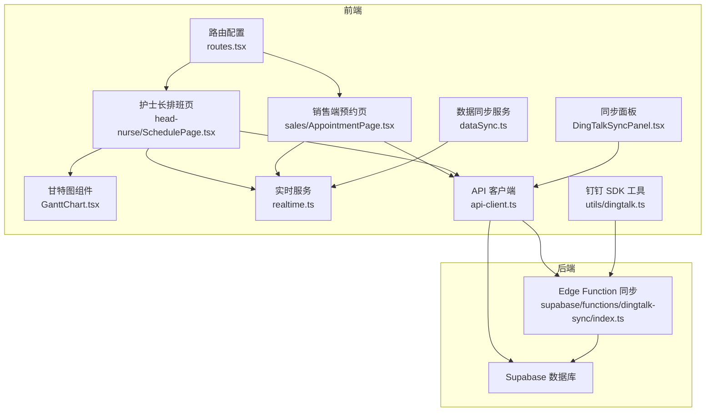
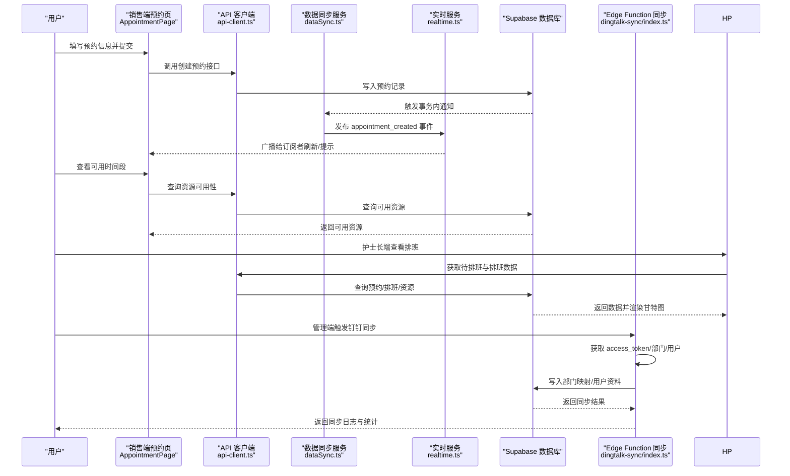
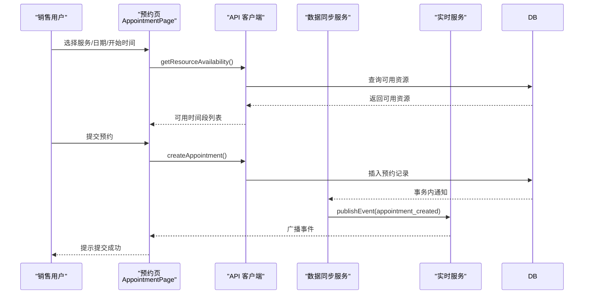
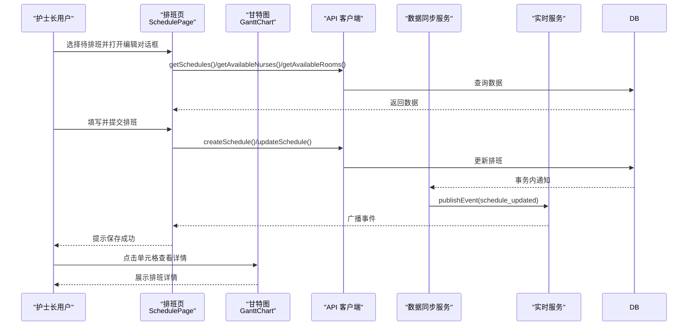
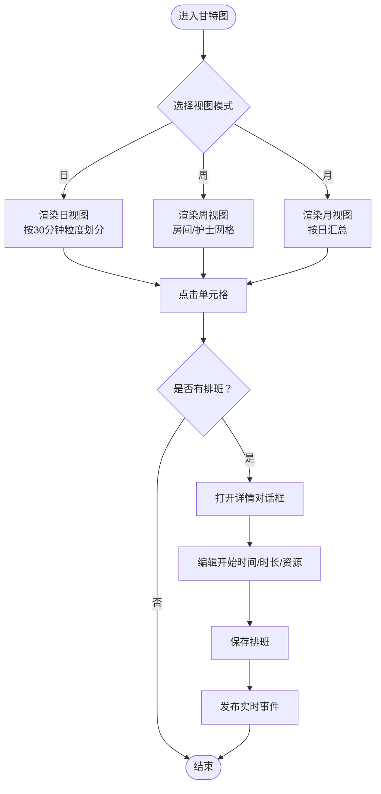
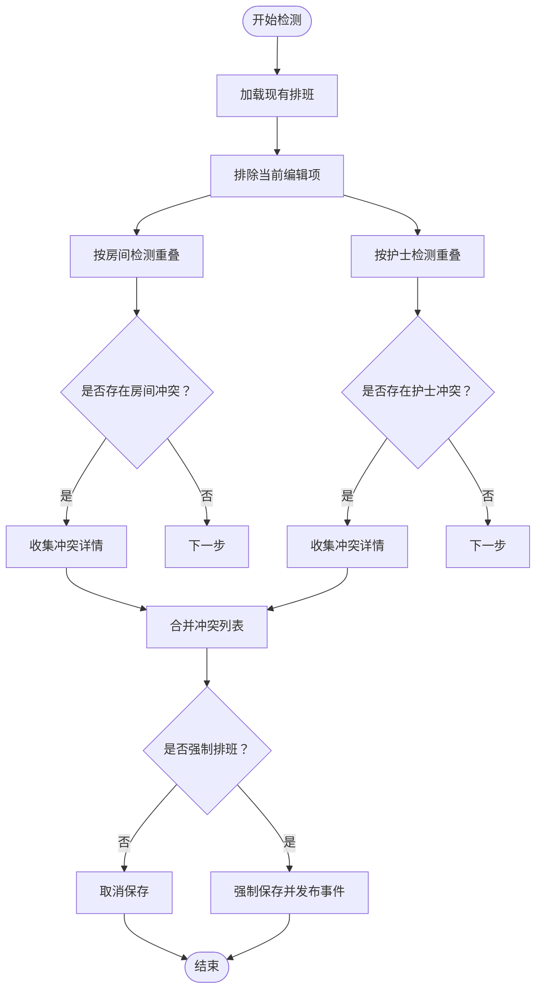
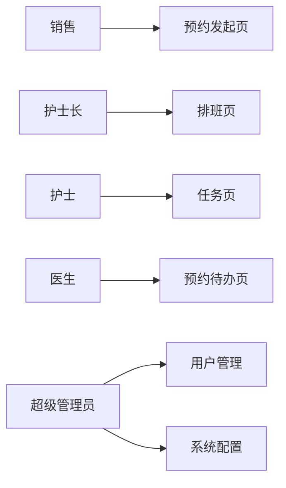
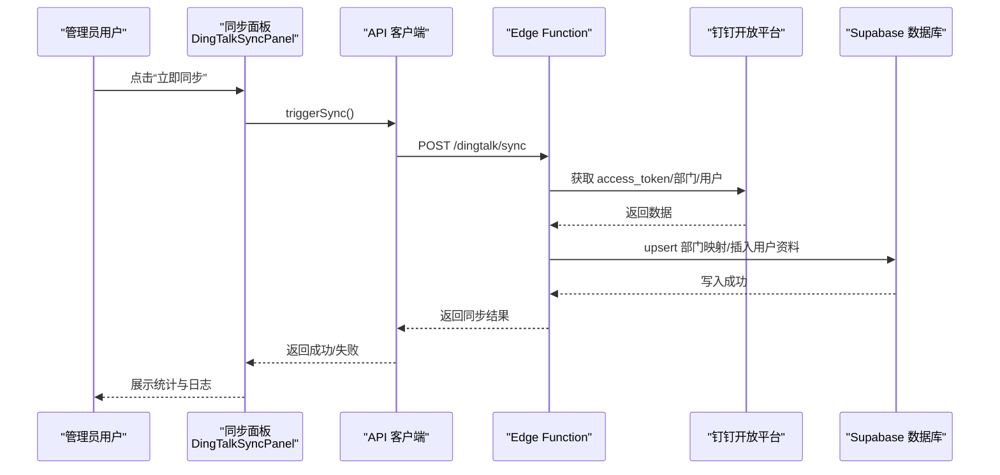
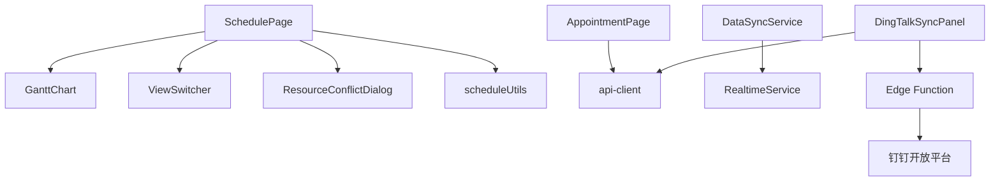

# 核心功能

<cite>
**本文引用的文件**
- [src/pages/sales/AppointmentPage.tsx](file://src/pages/sales/AppointmentPage.tsx)
- [src/pages/head-nurse/SchedulePage.tsx](file://src/pages/head-nurse/SchedulePage.tsx)
- [src/components/appointment/GanttChart.tsx](file://src/components/appointment/GanttChart.tsx)
- [src/utils/scheduleUtils.ts](file://src/utils/scheduleUtils.ts)
- [src/services/dataSync.ts](file://src/services/dataSync.ts)
- [src/services/realtime.ts](file://src/services/realtime.ts)
- [src/services/api-client.ts](file://src/services/api-client.ts)
- [src/utils/dingtalk.ts](file://src/utils/dingtalk.ts)
- [supabase/functions/dingtalk-sync/index.ts](file://supabase/functions/dingtalk-sync/index.ts)
- [src/components/appointment/ResourceConflictDialog.tsx](file://src/components/appointment/ResourceConflictDialog.tsx)
- [src/components/appointment/ViewSwitcher.tsx](file://src/components/appointment/ViewSwitcher.tsx)
- [src/components/dingtalk/DingTalkSyncPanel.tsx](file://src/components/dingtalk/DingTalkSyncPanel.tsx)
- [src/routes.tsx](file://src/routes.tsx)
- [src/types/types.ts](file://src/types/types.ts)
</cite>

## 目录
1. [引言](#引言)
2. [项目结构](#项目结构)
3. [核心组件](#核心组件)
4. [架构总览](#架构总览)
5. [详细组件分析](#详细组件分析)
6. [依赖关系分析](#依赖关系分析)
7. [性能考量](#性能考量)
8. [故障排除指南](#故障排除指南)
9. [结论](#结论)

## 引言
本文件围绕 Bio-Appointment 的四大支柱功能进行系统化说明：智能预约管理（销售端发起）、可视化排班（护士长端调度）、多角色协同工作流、以及钉钉深度集成。文档从用户操作到后端处理的完整链路出发，结合实际代码路径，帮助产品经理与开发者建立统一的功能视图，并提供可操作的优化建议与排障指引。

## 项目结构
系统采用前端 React + TypeScript + Tailwind 架构，配合 Supabase 后端与 Edge Functions 实现数据与业务逻辑；实时能力通过自研实时服务与 Redis 回退机制实现；钉钉集成通过 JSAPI 与 Edge Function 完成。

图表来源
- [src/routes.tsx](file://src/routes.tsx#L1-L135)
- [src/pages/sales/AppointmentPage.tsx](file://src/pages/sales/AppointmentPage.tsx#L1-L451)
- [src/pages/head-nurse/SchedulePage.tsx](file://src/pages/head-nurse/SchedulePage.tsx#L1-L695)
- [src/components/appointment/GanttChart.tsx](file://src/components/appointment/GanttChart.tsx#L1-L917)
- [src/services/realtime.ts](file://src/services/realtime.ts#L1-L345)
- [src/services/dataSync.ts](file://src/services/dataSync.ts#L1-L309)
- [src/services/api-client.ts](file://src/services/api-client.ts#L1-L381)
- [src/utils/dingtalk.ts](file://src/utils/dingtalk.ts#L1-L329)
- [supabase/functions/dingtalk-sync/index.ts](file://supabase/functions/dingtalk-sync/index.ts#L1-L384)
- [src/components/dingtalk/DingTalkSyncPanel.tsx](file://src/components/dingtalk/DingTalkSyncPanel.tsx#L1-L237)

章节来源
- [src/routes.tsx](file://src/routes.tsx#L1-L135)

## 核心组件
- 智能预约管理（销售端）：负责客户信息录入、服务选择、同行客户与人数联动、动态时长计算、急单限制与可用性检查、提交预约并触发实时通知。
- 可视化排班（护士长端）：负责待排班预约列表、资源筛选、甘特图视图（日/周/月）、排班编辑对话框、资源冲突检测与强制确认、拒绝预约等。
- 多角色协同工作流：基于路由与角色权限控制，实现销售、护士长、护士、医生、超级管理员的职责边界与页面访问控制。
- 钉钉深度集成：前端通过 JSAPI 提供原生体验，后端通过 Edge Function 与钉钉开放平台交互，实现通讯录同步、冲突策略与日志记录。

章节来源
- [src/pages/sales/AppointmentPage.tsx](file://src/pages/sales/AppointmentPage.tsx#L1-L451)
- [src/pages/head-nurse/SchedulePage.tsx](file://src/pages/head-nurse/SchedulePage.tsx#L1-L695)
- [src/components/appointment/GanttChart.tsx](file://src/components/appointment/GanttChart.tsx#L1-L917)
- [src/utils/scheduleUtils.ts](file://src/utils/scheduleUtils.ts#L1-L112)
- [src/services/realtime.ts](file://src/services/realtime.ts#L1-L345)
- [src/services/dataSync.ts](file://src/services/dataSync.ts#L1-L309)
- [src/services/api-client.ts](file://src/services/api-client.ts#L1-L381)
- [src/utils/dingtalk.ts](file://src/utils/dingtalk.ts#L1-L329)
- [supabase/functions/dingtalk-sync/index.ts](file://supabase/functions/dingtalk-sync/index.ts#L1-L384)
- [src/components/dingtalk/DingTalkSyncPanel.tsx](file://src/components/dingtalk/DingTalkSyncPanel.tsx#L1-L237)
- [src/routes.tsx](file://src/routes.tsx#L1-L135)

## 架构总览
系统采用“前端页面 + API 客户端 + 后端服务”的分层设计。前端页面通过 API 客户端与 Supabase 交互；实时事件通过 DataSyncService 与 RealtimeService 发布/订阅；钉钉集成通过 Edge Function 与开放平台对接。

图表来源
- [src/pages/sales/AppointmentPage.tsx](file://src/pages/sales/AppointmentPage.tsx#L1-L451)
- [src/pages/head-nurse/SchedulePage.tsx](file://src/pages/head-nurse/SchedulePage.tsx#L1-L695)
- [src/services/api-client.ts](file://src/services/api-client.ts#L1-L381)
- [src/services/dataSync.ts](file://src/services/dataSync.ts#L1-L309)
- [src/services/realtime.ts](file://src/services/realtime.ts#L1-L345)
- [supabase/functions/dingtalk-sync/index.ts](file://supabase/functions/dingtalk-sync/index.ts#L1-L384)

## 详细组件分析

### 智能预约管理（销售端发起）
- 用户界面与交互
  - 表单字段：主客户姓名、同行客户（可选）、服务项目、预约日期、服务开始时间。
  - 动态时长计算：基于服务基础时长与同行人数，同行每增加一人增加固定时长。
  - 急单限制：仅允许“抽血”类服务，且仅限当天。
  - 可用时间段生成：按 30 分钟粒度遍历工作时间，调用资源可用性接口过滤不可用时段。
  - 提交流程：构造请求体，调用创建预约接口，成功后清空表单并提示。
- 关键服务调用
  - 获取服务列表、查询资源可用性、创建预约。
- 实时通知
  - 通过 DataSyncService 在事务内发布 appointment_created 事件，RealtimeService 广播给订阅者。

图表来源
- [src/pages/sales/AppointmentPage.tsx](file://src/pages/sales/AppointmentPage.tsx#L1-L451)
- [src/services/api-client.ts](file://src/services/api-client.ts#L1-L381)
- [src/services/dataSync.ts](file://src/services/dataSync.ts#L1-L309)
- [src/services/realtime.ts](file://src/services/realtime.ts#L1-L345)

章节来源
- [src/pages/sales/AppointmentPage.tsx](file://src/pages/sales/AppointmentPage.tsx#L1-L451)
- [src/services/api-client.ts](file://src/services/api-client.ts#L1-L381)
- [src/services/dataSync.ts](file://src/services/dataSync.ts#L1-L309)
- [src/services/realtime.ts](file://src/services/realtime.ts#L1-L345)

### 可视化排班（护士长端调度）
- 用户界面与交互
  - 待排班列表：区分急单与普通预约，支持一键分配资源。
  - 视图切换：日/周/月三种视图，时间轴按 30 分钟粒度划分。
  - 甘特图渲染：房间与护士双维度，重叠排班按行排列，支持点击单元格查看详情。
  - 排班编辑对话框：设置开始时间、修正时长、分配房间与护士、调整原因。
  - 资源冲突检测：基于时间段重叠规则，检测房间与护士冲突，支持强制排班。
- 关键服务调用
  - 获取待排班、排班、可用护士与房间；创建/更新排班；更新预约状态；拒绝预约。
- 数据同步与实时
  - 创建/更新排班后，通过 DataSyncService 发布 schedule_updated 事件，RealtimeService 广播。

图表来源
- [src/pages/head-nurse/SchedulePage.tsx](file://src/pages/head-nurse/SchedulePage.tsx#L1-L695)
- [src/components/appointment/GanttChart.tsx](file://src/components/appointment/GanttChart.tsx#L1-L917)
- [src/utils/scheduleUtils.ts](file://src/utils/scheduleUtils.ts#L1-L112)
- [src/services/api-client.ts](file://src/services/api-client.ts#L1-L381)
- [src/services/dataSync.ts](file://src/services/dataSync.ts#L1-L309)
- [src/services/realtime.ts](file://src/services/realtime.ts#L1-L345)

章节来源
- [src/pages/head-nurse/SchedulePage.tsx](file://src/pages/head-nurse/SchedulePage.tsx#L1-L695)
- [src/components/appointment/GanttChart.tsx](file://src/components/appointment/GanttChart.tsx#L1-L917)
- [src/utils/scheduleUtils.ts](file://src/utils/scheduleUtils.ts#L1-L112)
- [src/services/api-client.ts](file://src/services/api-client.ts#L1-L381)
- [src/services/dataSync.ts](file://src/services/dataSync.ts#L1-L309)
- [src/services/realtime.ts](file://src/services/realtime.ts#L1-L345)

### 甘特图实现原理与拖拽式排班体验
- 视图模式与时间轴
  - 日视图：按小时与 30 分钟刻度绘制时间槽，房间维度横向排列，重叠排班按行展开。
  - 周/月视图：房间与护士分别以网格形式展示，支持点击单元格查看当天/当周/当月排班汇总。
- 位置计算与样式
  - 通过起止时间换算为百分比定位，使用渐变色叠加护士与房间颜色，急单与锁定状态以边框标识。
- 交互细节
  - 单元格点击弹出详情对话框；支持资源筛选（房间/护士维度）与严格筛选模式。
- 拖拽式排班体验
  - 当前实现为点击编辑对话框进行时间与资源修改，未见拖拽式时间轴调整逻辑。若需拖拽，可在甘特图内部引入拖拽事件与时间槽对齐算法，并在保存时调用更新接口。

图表来源
- [src/components/appointment/GanttChart.tsx](file://src/components/appointment/GanttChart.tsx#L1-L917)
- [src/components/appointment/ViewSwitcher.tsx](file://src/components/appointment/ViewSwitcher.tsx#L1-L39)

章节来源
- [src/components/appointment/GanttChart.tsx](file://src/components/appointment/GanttChart.tsx#L1-L917)
- [src/components/appointment/ViewSwitcher.tsx](file://src/components/appointment/ViewSwitcher.tsx#L1-L39)

### 资源冲突检测算法
- 时间段重叠判断
  - 将 HH:mm:ss 解析为分钟数，判断 start1 < end2 且 start2 < end1。
- 冲突类型
  - 房间冲突：同一房间在同一时间段已有排班。
  - 护士冲突：同一护士在同一时间段已有排班。
- 处理流程
  - 若存在冲突，弹出确认对话框；用户确认后强制保存，否则取消。

图表来源
- [src/utils/scheduleUtils.ts](file://src/utils/scheduleUtils.ts#L1-L112)
- [src/components/appointment/ResourceConflictDialog.tsx](file://src/components/appointment/ResourceConflictDialog.tsx#L1-L93)

章节来源
- [src/utils/scheduleUtils.ts](file://src/utils/scheduleUtils.ts#L1-L112)
- [src/components/appointment/ResourceConflictDialog.tsx](file://src/components/appointment/ResourceConflictDialog.tsx#L1-L93)

### 多角色协同工作流
- 路由与权限
  - 不同角色访问不同页面：销售、护士长、护士、医生、超级管理员。
- 页面职责
  - 销售：发起预约、查看服务与可用性。
  - 护士长：查看待排班、创建/编辑排班、拒绝预约、查看资源看板。
  - 护士：查看个人任务。
  - 医生：查看待办预约。
  - 管理员：用户管理与系统配置。

图表来源
- [src/routes.tsx](file://src/routes.tsx#L1-L135)

章节来源
- [src/routes.tsx](file://src/routes.tsx#L1-L135)

### 钉钉深度集成
- 前端 JSAPI
  - 提供 setTitle、setRight、scan、showToast、showAlert、showConfirm、share、getLocation、previewImage、openLink、getNetworkType 等能力封装。
- 后端 Edge Function
  - 获取 access_token、拉取部门列表、拉取用户列表、写入部门映射与用户资料、记录同步日志、支持冲突策略（钉钉优先/本地优先/手动）。
- 前端同步面板
  - 展示同步统计、配置开关、立即同步、查看日志、触发同步并刷新用户列表。

图表来源
- [src/components/dingtalk/DingTalkSyncPanel.tsx](file://src/components/dingtalk/DingTalkSyncPanel.tsx#L1-L237)
- [src/utils/dingtalk.ts](file://src/utils/dingtalk.ts#L1-L329)
- [supabase/functions/dingtalk-sync/index.ts](file://supabase/functions/dingtalk-sync/index.ts#L1-L384)
- [src/services/api-client.ts](file://src/services/api-client.ts#L1-L381)

章节来源
- [src/utils/dingtalk.ts](file://src/utils/dingtalk.ts#L1-L329)
- [supabase/functions/dingtalk-sync/index.ts](file://supabase/functions/dingtalk-sync/index.ts#L1-L384)
- [src/components/dingtalk/DingTalkSyncPanel.tsx](file://src/components/dingtalk/DingTalkSyncPanel.tsx#L1-L237)
- [src/services/api-client.ts](file://src/services/api-client.ts#L1-L381)

## 依赖关系分析
- 组件耦合
  - SchedulePage 依赖 GanttChart、ViewSwitcher、ResourceConflictDialog、scheduleUtils。
  - AppointmentPage 依赖 api-client、date-fns、react-hook-form。
  - DataSyncService 与 RealtimeService 协作，前者负责事件发布，后者负责订阅与广播。
  - 钉钉同步涉及前端 SyncPanel 与后端 Edge Function。
- 外部依赖
  - Supabase 数据库与 Edge Functions。
  - 钉钉开放平台 API。
  - Redis（实时回退存储）。

图表来源
- [src/pages/head-nurse/SchedulePage.tsx](file://src/pages/head-nurse/SchedulePage.tsx#L1-L695)
- [src/components/appointment/GanttChart.tsx](file://src/components/appointment/GanttChart.tsx#L1-L917)
- [src/components/appointment/ViewSwitcher.tsx](file://src/components/appointment/ViewSwitcher.tsx#L1-L39)
- [src/components/appointment/ResourceConflictDialog.tsx](file://src/components/appointment/ResourceConflictDialog.tsx#L1-L93)
- [src/utils/scheduleUtils.ts](file://src/utils/scheduleUtils.ts#L1-L112)
- [src/pages/sales/AppointmentPage.tsx](file://src/pages/sales/AppointmentPage.tsx#L1-L451)
- [src/services/api-client.ts](file://src/services/api-client.ts#L1-L381)
- [src/services/dataSync.ts](file://src/services/dataSync.ts#L1-L309)
- [src/services/realtime.ts](file://src/services/realtime.ts#L1-L345)
- [src/components/dingtalk/DingTalkSyncPanel.tsx](file://src/components/dingtalk/DingTalkSyncPanel.tsx#L1-L237)
- [supabase/functions/dingtalk-sync/index.ts](file://supabase/functions/dingtalk-sync/index.ts#L1-L384)

章节来源
- [src/pages/head-nurse/SchedulePage.tsx](file://src/pages/head-nurse/SchedulePage.tsx#L1-L695)
- [src/pages/sales/AppointmentPage.tsx](file://src/pages/sales/AppointmentPage.tsx#L1-L451)
- [src/services/dataSync.ts](file://src/services/dataSync.ts#L1-L309)
- [src/services/realtime.ts](file://src/services/realtime.ts#L1-L345)
- [src/services/api-client.ts](file://src/services/api-client.ts#L1-L381)
- [src/components/dingtalk/DingTalkSyncPanel.tsx](file://src/components/dingtalk/DingTalkSyncPanel.tsx#L1-L237)
- [supabase/functions/dingtalk-sync/index.ts](file://supabase/functions/dingtalk-sync/index.ts#L1-L384)

## 性能考量
- 甘特图渲染
  - 日视图重叠排班按行展开，建议对大规模数据进行虚拟滚动与懒加载，减少 DOM 节点数量。
  - 时间槽计算与百分比定位为 O(n)，n 为排班数量，建议缓存计算结果并在数据变更时增量更新。
- 资源冲突检测
  - 冲突检测复杂度 O(m×n)，m 为编辑项数量，n 为现有排班数量；建议在编辑对话框中先做本地过滤，再进行冲突检测。
- 实时同步
  - WebSocket 断线重连与指数退避，避免频繁重连；Redis 回退轮询间隔默认 5 秒，可根据场景调整。
- 钉钉同步
  - 分页拉取用户列表，逐条处理并批量 upsert，建议在 Edge Function 中使用事务与批量写入，降低失败率。

[本节为通用指导，无需特定文件引用]

## 故障排除指南
- 预约提交失败
  - 检查服务与可用性接口返回；确认急单限制与同行人数计算；查看 DataSyncService 是否成功发布 appointment_created 事件。
- 排班保存失败或冲突
  - 使用 ResourceConflictDialog 确认是否强制保存；检查 scheduleUtils 的重叠判断逻辑；确认 RealtimeService 是否正确订阅。
- 钉钉同步异常
  - 检查 Edge Function 的 access_token 获取与部门/用户拉取；查看同步日志与失败详情；确认冲突策略配置。
- 实时事件未到达
  - 检查 RealtimeService 的 WebSocket 连接状态与订阅列表；确认 Redis 事件队列是否正常；必要时清理旧事件。

章节来源
- [src/services/dataSync.ts](file://src/services/dataSync.ts#L1-L309)
- [src/services/realtime.ts](file://src/services/realtime.ts#L1-L345)
- [src/utils/scheduleUtils.ts](file://src/utils/scheduleUtils.ts#L1-L112)
- [supabase/functions/dingtalk-sync/index.ts](file://supabase/functions/dingtalk-sync/index.ts#L1-L384)

## 结论
Bio-Appointment 通过“智能预约管理 + 可视化排班 + 多角色协同 + 钉钉集成”的组合，构建了从销售到护士长再到执行层的闭环工作流。前端以组件化方式实现交互与视图，后端通过 Supabase 与 Edge Functions 提供稳定的数据与集成能力，实时服务保障多端一致。建议后续在甘特图拖拽、冲突检测优化与同步策略上持续迭代，提升用户体验与系统稳定性。