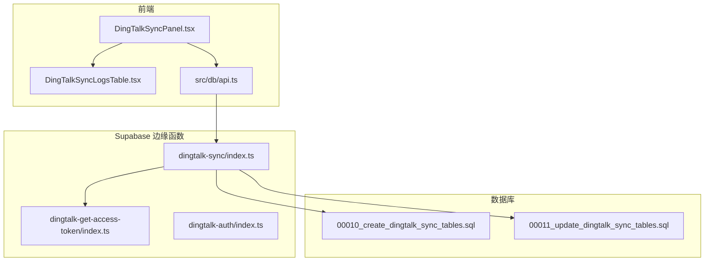
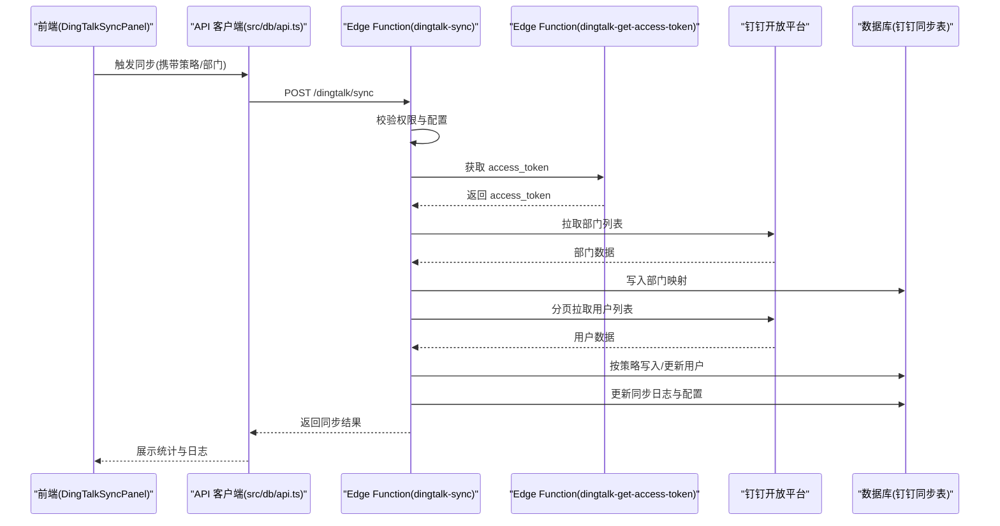
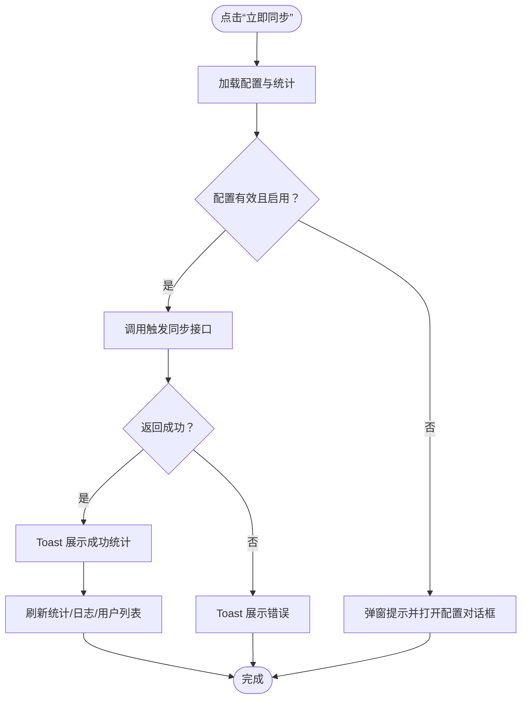
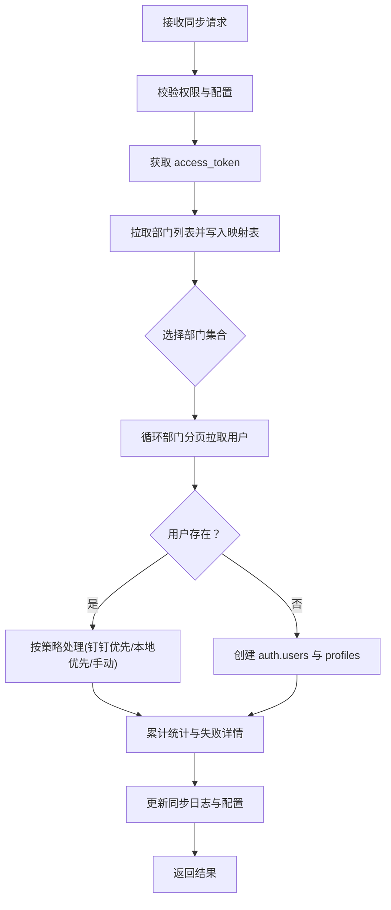
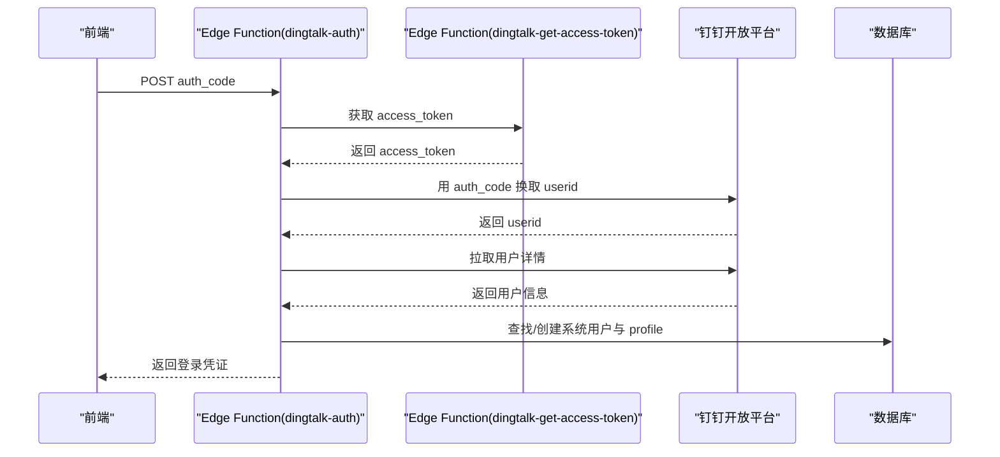
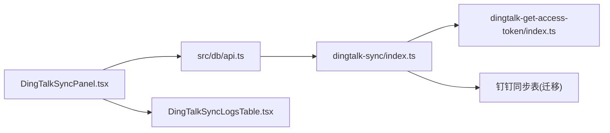

# 钉钉集成

<cite>
**本文引用的文件**
- [src/services/dataSync.ts](file://src/services/dataSync.ts)
- [supabase/functions/dingtalk-sync/index.ts](file://supabase/functions/dingtalk-sync/index.ts)
- [supabase/functions/dingtalk-auth/index.ts](file://supabase/functions/dingtalk-auth/index.ts)
- [supabase/functions/dingtalk-get-access-token/index.ts](file://supabase/functions/dingtalk-get-access-token/index.ts)
- [src/components/dingtalk/DingTalkSyncPanel.tsx](file://src/components/dingtalk/DingTalkSyncPanel.tsx)
- [src/components/dingtalk/DingTalkSyncLogsTable.tsx](file://src/components/dingtalk/DingTalkSyncLogsTable.tsx)
- [src/db/api.ts](file://src/db/api.ts)
- [DINGTALK_SYNC_IMPLEMENTATION.md](file://DINGTALK_SYNC_IMPLEMENTATION.md)
- [钉钉同步toString错误修复.md](file://钉钉同步toString错误修复.md)
- [钉钉同步人数不全问题修复.md](file://钉钉同步人数不全问题修复.md)
- [钉钉同步用户列表显示问题修复说明.md](file://钉钉同步用户列表显示问题修复说明.md)
- [supabase/migrations/00010_create_dingtalk_sync_tables.sql](file://supabase/migrations/00010_create_dingtalk_sync_tables.sql)
- [supabase/migrations/00011_update_dingtalk_sync_tables.sql](file://supabase/migrations/00011_update_dingtalk_sync_tables.sql)
- [#U9489#U9489#U96c6#U6210#U914d#U7f6e#U603b#U7ed3.md](file://#U9489#U9489#U96c6#U6210#U914d#U7f6e#U603b#U7ed3.md)
</cite>

## 目录
1. [简介](#简介)
2. [项目结构](#项目结构)
3. [核心组件](#核心组件)
4. [架构总览](#架构总览)
5. [详细组件分析](#详细组件分析)
6. [依赖分析](#依赖分析)
7. [性能考虑](#性能考虑)
8. [故障排查指南](#故障排查指南)
9. [结论](#结论)
10. [附录](#附录)

## 简介
本文件系统性梳理钉钉集成功能的实现细节，覆盖登录认证、通讯录同步、消息通知三大核心能力。重点说明前端如何通过数据服务触发同步任务，并由 Supabase Edge Functions 实现后端同步逻辑；解释 DingTalkSyncPanel 中的同步进度与日志展示（DingTalkSyncLogsTable）；阐述钉钉免登流程、部门与人员映射规则、冲突策略与失败重试机制；并结合设计文档与修复说明，给出配置清单与常见问题的修复方案。

## 项目结构
- 前端组件位于 src/components/dingtalk，负责配置、触发同步与展示日志。
- 同步与免登相关的后端逻辑位于 supabase/functions，采用 Edge Functions。
- 数据同步服务位于 src/services/dataSync.ts，提供通用的实时事件与离线同步能力（与钉钉集成可复用）。
- 数据库迁移文件定义了钉钉同步相关的表结构与策略。

图表来源
- [src/components/dingtalk/DingTalkSyncPanel.tsx](file://src/components/dingtalk/DingTalkSyncPanel.tsx#L1-L237)
- [src/components/dingtalk/DingTalkSyncLogsTable.tsx](file://src/components/dingtalk/DingTalkSyncLogsTable.tsx#L1-L91)
- [src/db/api.ts](file://src/db/api.ts#L1366-L1531)
- [supabase/functions/dingtalk-sync/index.ts](file://supabase/functions/dingtalk-sync/index.ts#L1-L384)
- [supabase/functions/dingtalk-get-access-token/index.ts](file://supabase/functions/dingtalk-get-access-token/index.ts#L1-L121)
- [supabase/migrations/00010_create_dingtalk_sync_tables.sql](file://supabase/migrations/00010_create_dingtalk_sync_tables.sql#L1-L189)
- [supabase/migrations/00011_update_dingtalk_sync_tables.sql](file://supabase/migrations/00011_update_dingtalk_sync_tables.sql#L1-L95)

章节来源
- [src/components/dingtalk/DingTalkSyncPanel.tsx](file://src/components/dingtalk/DingTalkSyncPanel.tsx#L1-L237)
- [src/components/dingtalk/DingTalkSyncLogsTable.tsx](file://src/components/dingtalk/DingTalkSyncLogsTable.tsx#L1-L91)
- [src/db/api.ts](file://src/db/api.ts#L1366-L1531)
- [supabase/functions/dingtalk-sync/index.ts](file://supabase/functions/dingtalk-sync/index.ts#L1-L384)
- [supabase/functions/dingtalk-get-access-token/index.ts](file://supabase/functions/dingtalk-get-access-token/index.ts#L1-L121)
- [supabase/migrations/00010_create_dingtalk_sync_tables.sql](file://supabase/migrations/00010_create_dingtalk_sync_tables.sql#L1-L189)
- [supabase/migrations/00011_update_dingtalk_sync_tables.sql](file://supabase/migrations/00011_update_dingtalk_sync_tables.sql#L1-L95)

## 核心组件
- 前端同步面板与日志表格：负责配置、触发同步、展示统计与日志。
- 同步边缘函数：负责校验权限、获取钉钉 access_token、拉取部门与用户、写入数据库、记录日志。
- 免登边缘函数：负责免登流程，换取用户信息并建立系统用户映射。
- 访问令牌边缘函数：负责安全获取与缓存钉钉 access_token。
- 数据同步服务：提供通用的实时事件与离线同步能力，可与钉钉集成协同使用。

章节来源
- [src/components/dingtalk/DingTalkSyncPanel.tsx](file://src/components/dingtalk/DingTalkSyncPanel.tsx#L1-L237)
- [src/components/dingtalk/DingTalkSyncLogsTable.tsx](file://src/components/dingtalk/DingTalkSyncLogsTable.tsx#L1-L91)
- [supabase/functions/dingtalk-sync/index.ts](file://supabase/functions/dingtalk-sync/index.ts#L1-L384)
- [supabase/functions/dingtalk-auth/index.ts](file://supabase/functions/dingtalk-auth/index.ts#L1-L248)
- [supabase/functions/dingtalk-get-access-token/index.ts](file://supabase/functions/dingtalk-get-access-token/index.ts#L1-L121)
- [src/services/dataSync.ts](file://src/services/dataSync.ts#L1-L309)

## 架构总览
钉钉同步的整体流程如下：
- 前端通过 API 客户端触发同步请求；
- 后端 Edge Function 校验用户权限与配置有效性；
- 获取钉钉 access_token；
- 拉取部门列表并写入部门映射表；
- 按部门分页拉取用户列表，依据冲突策略处理；
- 记录同步日志并更新配置的最后同步时间；
- 前端刷新统计与日志，必要时刷新用户列表。

图表来源
- [src/components/dingtalk/DingTalkSyncPanel.tsx](file://src/components/dingtalk/DingTalkSyncPanel.tsx#L66-L103)
- [src/db/api.ts](file://src/db/api.ts#L1366-L1407)
- [supabase/functions/dingtalk-sync/index.ts](file://supabase/functions/dingtalk-sync/index.ts#L91-L120)
- [supabase/functions/dingtalk-get-access-token/index.ts](file://supabase/functions/dingtalk-get-access-token/index.ts#L54-L104)

章节来源
- [DINGTALK_SYNC_IMPLEMENTATION.md](file://DINGTALK_SYNC_IMPLEMENTATION.md#L105-L130)
- [supabase/functions/dingtalk-sync/index.ts](file://supabase/functions/dingtalk-sync/index.ts#L126-L335)

## 详细组件分析

### 前端触发与同步面板（DingTalkSyncPanel）
- 负责加载配置、统计与日志，触发同步请求并处理结果。
- 通过 API 客户端调用后端同步接口，携带同步类型、部门集合与冲突策略。
- 同步完成后刷新统计与日志，并可触发父组件的用户列表刷新回调。

图表来源
- [src/components/dingtalk/DingTalkSyncPanel.tsx](file://src/components/dingtalk/DingTalkSyncPanel.tsx#L66-L103)
- [src/db/api.ts](file://src/db/api.ts#L1366-L1407)

章节来源
- [src/components/dingtalk/DingTalkSyncPanel.tsx](file://src/components/dingtalk/DingTalkSyncPanel.tsx#L1-L237)
- [src/db/api.ts](file://src/db/api.ts#L1366-L1407)

### 同步日志表格（DingTalkSyncLogsTable）
- 负责展示最近同步记录，支持刷新与状态徽章渲染。
- 通过 API 客户端获取日志列表，按状态分类展示。

章节来源
- [src/components/dingtalk/DingTalkSyncLogsTable.tsx](file://src/components/dingtalk/DingTalkSyncLogsTable.tsx#L1-L91)
- [src/db/api.ts](file://src/db/api.ts#L1383-L1407)

### 后端同步逻辑（dingtalk-sync/index.ts）
- 权限校验：要求调用者为超级管理员，并读取钉钉配置。
- 获取 access_token：调用钉钉开放平台获取令牌。
- 同步部门：拉取部门树并写入部门映射表。
- 同步用户：按部门分页拉取用户，依据冲突策略处理：
  - 钉钉优先：以钉钉数据为准更新本地。
  - 本地优先：保留本地数据。
  - 手动策略：记录冲突，跳过更新。
- 记录日志：创建运行中日志，最终更新状态、计数与失败详情。
- 更新配置：记录最后同步时间。

图表来源
- [supabase/functions/dingtalk-sync/index.ts](file://supabase/functions/dingtalk-sync/index.ts#L91-L335)

章节来源
- [supabase/functions/dingtalk-sync/index.ts](file://supabase/functions/dingtalk-sync/index.ts#L1-L384)
- [DINGTALK_SYNC_IMPLEMENTATION.md](file://DINGTALK_SYNC_IMPLEMENTATION.md#L131-L147)

### 钉钉免登流程（dingtalk-auth/index.ts）
- 使用 auth_code 换取钉钉 userid；
- 获取用户详细信息；
- 查找或创建系统用户与 profile；
- 生成登录凭证返回前端。

图表来源
- [supabase/functions/dingtalk-auth/index.ts](file://supabase/functions/dingtalk-auth/index.ts#L54-L121)
- [supabase/functions/dingtalk-get-access-token/index.ts](file://supabase/functions/dingtalk-get-access-token/index.ts#L54-L104)

章节来源
- [supabase/functions/dingtalk-auth/index.ts](file://supabase/functions/dingtalk-auth/index.ts#L1-L248)
- [supabase/functions/dingtalk-get-access-token/index.ts](file://supabase/functions/dingtalk-get-access-token/index.ts#L1-L121)

### 访问令牌缓存（dingtalk-get-access-token/index.ts）
- 从环境变量读取 AppKey/AppSecret；
- 调用钉钉 API 获取 access_token；
- 简单内存缓存，提前过期时间避免失效；
- 返回缓存命中状态与剩余有效期。

章节来源
- [supabase/functions/dingtalk-get-access-token/index.ts](file://supabase/functions/dingtalk-get-access-token/index.ts#L1-L121)

### 数据同步服务（src/services/dataSync.ts）
- 提供预约、排班、任务、用户变更的实时事件通知；
- 提供离线变更同步与批量通知；
- 提供清理旧事件的能力（注释中预留 Redis 清理逻辑）。

章节来源
- [src/services/dataSync.ts](file://src/services/dataSync.ts#L1-L309)

## 依赖分析
- 前端依赖 src/db/api.ts 提供的同步接口与日志查询；
- 同步边缘函数依赖 Supabase 客户端与钉钉开放平台 API；
- 访问令牌边缘函数依赖 Supabase Secrets 与钉钉开放平台；
- 数据库层面依赖钉钉同步相关表与 RLS 策略。

图表来源
- [src/components/dingtalk/DingTalkSyncPanel.tsx](file://src/components/dingtalk/DingTalkSyncPanel.tsx#L1-L237)
- [src/components/dingtalk/DingTalkSyncLogsTable.tsx](file://src/components/dingtalk/DingTalkSyncLogsTable.tsx#L1-L91)
- [src/db/api.ts](file://src/db/api.ts#L1366-L1531)
- [supabase/functions/dingtalk-sync/index.ts](file://supabase/functions/dingtalk-sync/index.ts#L1-L384)
- [supabase/functions/dingtalk-get-access-token/index.ts](file://supabase/functions/dingtalk-get-access-token/index.ts#L1-L121)
- [supabase/migrations/00010_create_dingtalk_sync_tables.sql](file://supabase/migrations/00010_create_dingtalk_sync_tables.sql#L1-L189)

章节来源
- [src/db/api.ts](file://src/db/api.ts#L1366-L1531)
- [supabase/functions/dingtalk-sync/index.ts](file://supabase/functions/dingtalk-sync/index.ts#L1-L384)
- [supabase/migrations/00010_create_dingtalk_sync_tables.sql](file://supabase/migrations/00010_create_dingtalk_sync_tables.sql#L1-L189)

## 性能考虑
- 分页拉取用户：钉钉用户列表采用游标分页，避免一次性请求过多数据。
- 部门递归获取：建议在后端实现递归拉取所有层级部门，确保同步完整性。
- 缓存 access_token：边缘函数内置缓存，减少频繁请求。
- 并发与事务：后端同步应使用事务保证一致性，避免中间态数据。
- 日志与统计：日志表带索引，便于查询与筛选。

章节来源
- [supabase/functions/dingtalk-sync/index.ts](file://supabase/functions/dingtalk-sync/index.ts#L194-L305)
- [钉钉同步人数不全问题修复.md](file://钉钉同步人数不全问题修复.md#L48-L101)
- [supabase/migrations/00010_create_dingtalk_sync_tables.sql](file://supabase/migrations/00010_create_dingtalk_sync_tables.sql#L114-L120)

## 故障排查指南
- 同步按钮禁用：检查配置是否启用与存在。
- access_token 获取失败：检查 AppKey/AppSecret 是否正确，边缘函数是否部署。
- 用户同步失败：查看同步日志 details 字段，定位失败用户与错误信息。
- 部门/用户不完整：确认是否递归获取所有层级部门与分页游标处理。
- toString 错误：根部门 parent_id 可能为 undefined，需做空值处理。
- 用户列表不显示：确认同步完成后是否触发父组件刷新回调，或使用本地 API 获取用户列表。

章节来源
- [DINGTALK_SYNC_IMPLEMENTATION.md](file://DINGTALK_SYNC_IMPLEMENTATION.md#L168-L186)
- [钉钉同步toString错误修复.md](file://钉钉同步toString错误修复.md#L18-L34)
- [钉钉同步人数不全问题修复.md](file://钉钉同步人数不全问题修复.md#L10-L24)
- [钉钉同步用户列表显示问题修复说明.md](file://钉钉同步用户列表显示问题修复说明.md#L1-L317)

## 结论
本钉钉集成功能通过前端面板触发、边缘函数执行、数据库持久化与日志追踪，形成了完整的同步闭环。免登流程保障了用户无缝接入。设计文档明确了配置、策略与流程，修复文档则提供了针对常见问题的解决方案。建议在生产环境中进一步完善自动同步、增量同步与失败重试机制，持续提升稳定性与可观测性。

## 附录

### 配置清单（来自配置总结文档）
- 环境变量：VITE_DINGTALK_APP_KEY、VITE_DINGTALK_AGENT_ID、VITE_DINGTALK_CORP_ID。
- Supabase Secrets：AppKey、AppSecret、AgentId。
- 钉钉开放平台应用权限：通讯录只读、身份验证、消息通知。
- 回调域名与首页地址：需在开放平台正确配置。

章节来源
- [#U9489#U9489#U96c6#U6210#U914d#U7f6e#U603b#U7ed3.md](file://#U9489#U9489#U96c6#U6210#U914d#U7f6e#U603b#U7ed3.md#L1-L233)

### 数据库表结构与策略
- 钉钉同步配置表：存储 AppKey、AppSecret、AgentId、CorpId、同步开关、策略、部门集合、最后同步时间等。
- 钉钉同步日志表：记录同步类型、状态、计数、错误信息、详情、起止时间、创建人。
- 钉钉部门映射表：存储钉钉部门 ID、名称、父 ID、排序、启用状态等。
- RLS 策略：超级管理员可管理与查看，普通用户仅可查看日志与映射。

章节来源
- [supabase/migrations/00010_create_dingtalk_sync_tables.sql](file://supabase/migrations/00010_create_dingtalk_sync_tables.sql#L1-L189)
- [supabase/migrations/00011_update_dingtalk_sync_tables.sql](file://supabase/migrations/00011_update_dingtalk_sync_tables.sql#L1-L95)

### 设计决策与实现说明
- 同步流程：权限校验 → 获取 access_token → 拉取部门 → 拉取用户 → 写入数据库 → 记录日志 → 更新配置。
- 冲突策略：钉钉优先、本地优先、手动三种策略，满足不同数据治理需求。
- 免登流程：auth_code → userid → 用户详情 → 创建/映射系统用户 → 生成登录凭证。
- 日志与统计：RPC 函数提供近 30 天统计，便于监控与审计。

章节来源
- [DINGTALK_SYNC_IMPLEMENTATION.md](file://DINGTALK_SYNC_IMPLEMENTATION.md#L105-L167)
- [supabase/migrations/00010_create_dingtalk_sync_tables.sql](file://supabase/migrations/00010_create_dingtalk_sync_tables.sql#L168-L189)