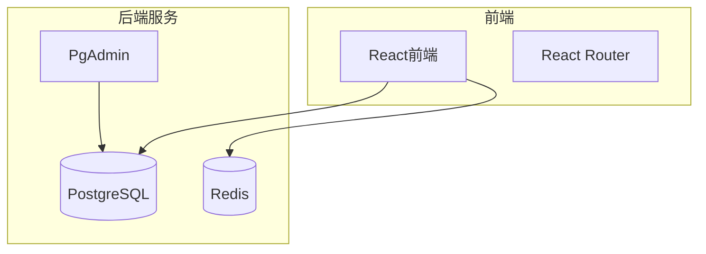
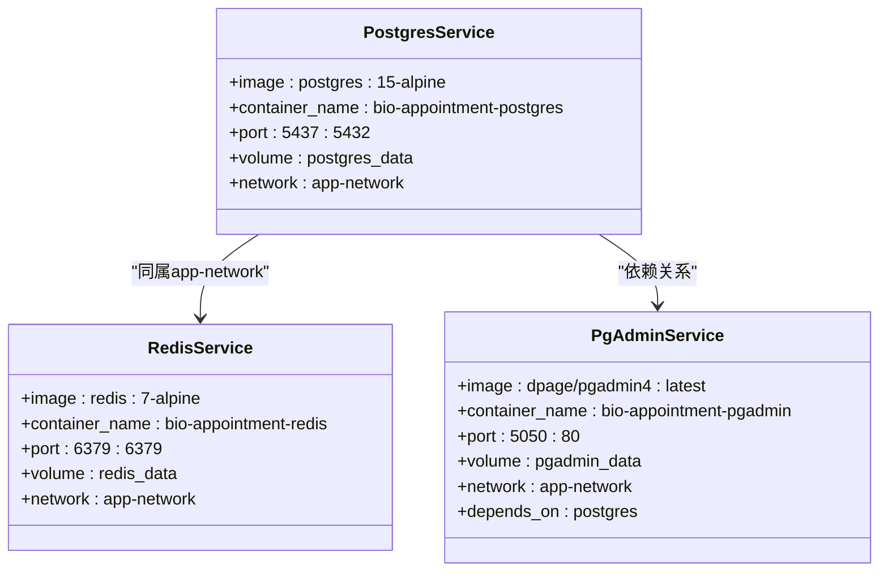
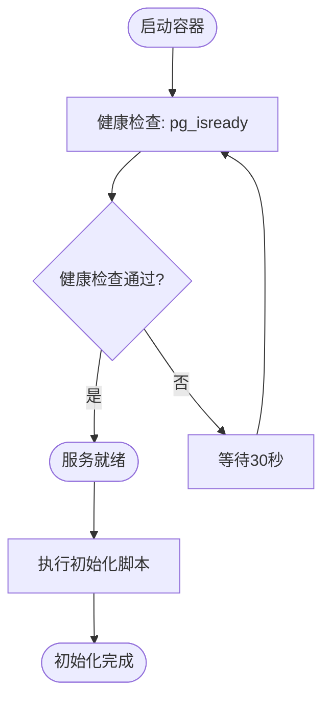
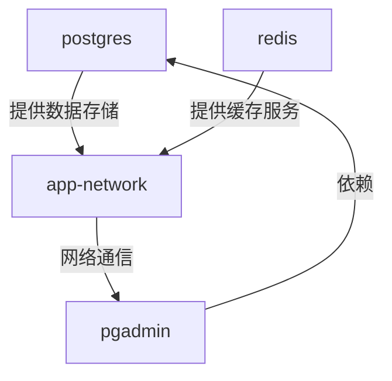

# Docker部署

<cite>
**本文档引用文件**  
- [docker-compose.yml](file://docker-compose.yml)
- [DEPLOYMENT_GUIDE.md](file://DEPLOYMENT_GUIDE.md)
- [database/migrate.sh](file://database/migrate.sh)
- [.env.example](file://.env.example)
- [README.md](file://README.md)
</cite>

## 目录

1. [简介](#简介)
2. [项目结构](#项目结构)
3. [核心组件](#核心组件)
4. [架构概述](#架构概述)
5. [详细组件分析](#详细组件分析)
6. [依赖分析](#依赖分析)
7. [性能考虑](#性能考虑)
8. [故障排除指南](#故障排除指南)
9. [结论](#结论)

## 简介

Bio-Appointment系统是一个基于React和TypeScript的智能预约调度系统，支持通过Docker容器化部署。本指南详细说明了如何使用Docker Compose部署该系统，包括数据库、缓存和管理工具的配置。系统采用本地PostgreSQL数据库和Redis缓存，确保数据完全可控。通过Docker Compose编排，可以轻松管理多个服务的生命周期和网络配置。

## 项目结构

项目采用模块化设计，前端使用React 18和TypeScript构建，后端依赖PostgreSQL 15作为主数据库，Redis 7作为缓存和会话存储。Docker Compose配置文件定义了所有服务的部署参数，包括端口映射、数据卷和网络设置。数据库初始化脚本位于`database/init/`目录，包含创建表结构、插入初始数据和配置审计日志的SQL脚本。

**图示来源**  
- [docker-compose.yml](file://docker-compose.yml#L2-L75)
- [README.md](file://README.md#L18-L27)

**本节来源**  
- [docker-compose.yml](file://docker-compose.yml#L2-L75)
- [README.md](file://README.md#L18-L27)

## 核心组件

系统核心组件包括PostgreSQL数据库、Redis缓存和可选的PgAdmin管理界面。PostgreSQL服务使用`postgres:15-alpine`镜像，配置了健康检查和数据持久化。Redis服务使用`redis:7-alpine`镜像，启用了AOF持久化以确保数据安全。所有服务通过名为`app-network`的自定义桥接网络进行通信，确保服务间的安全连接。

**本节来源**  
- [docker-compose.yml](file://docker-compose.yml#L2-L75)
- [DEPLOYMENT_GUIDE.md](file://DEPLOYMENT_GUIDE.md#L15-L339)

## 架构概述

系统架构采用微服务设计理念，通过Docker Compose编排多个独立服务。前端应用与后端服务通过API进行通信，所有服务部署在同一Docker网络中，确保低延迟和高安全性。PostgreSQL数据库负责持久化存储业务数据，Redis缓存用于会话管理和实时数据缓存。PgAdmin作为可选的数据库管理工具，通过Docker Compose的profiles功能按需启动。

**图示来源**  
- [docker-compose.yml](file://docker-compose.yml#L2-L75)

**本节来源**  
- [docker-compose.yml](file://docker-compose.yml#L2-L75)
- [DEPLOYMENT_GUIDE.md](file://DEPLOYMENT_GUIDE.md#L15-L339)

## 详细组件分析

### 数据库服务分析

PostgreSQL服务配置了详细的环境变量，包括数据库名称、用户和密码。通过`${POSTGRES_PASSWORD:-secure_password_123}`语法，允许通过环境变量覆盖默认密码，增强了安全性。数据卷`postgres_data`确保数据库数据持久化，即使容器重启也不会丢失。健康检查配置确保服务在启动前完成初始化，避免了因数据库未就绪导致的应用启动失败。

#### 服务配置流程图

**图示来源**  
- [docker-compose.yml](file://docker-compose.yml#L19-L24)
- [database/init](file://database/init)

**本节来源**  
- [docker-compose.yml](file://docker-compose.yml#L2-L75)
- [database/migrate.sh](file://database/migrate.sh#L1-L233)

### 缓存服务分析

Redis服务通过`command`指令配置了AOF持久化和密码认证。`--appendonly yes`确保所有写操作都被记录到磁盘，提高了数据可靠性。密码通过`${REDIS_PASSWORD:-redis_password_123}`语法配置，支持环境变量覆盖。数据卷`redis_data`将Redis数据持久化到主机，避免数据丢失。

**本节来源**  
- [docker-compose.yml](file://docker-compose.yml#L26-L42)
- [.env.example](file://.env.example#L20-L23)

### 管理工具分析

PgAdmin服务通过`depends_on`指令确保在PostgreSQL服务启动后才启动，避免了连接失败。`profiles: - admin`配置允许通过`--profile admin`参数按需启动该服务，适合生产环境的安全要求。端口映射`5050:80`将PgAdmin的Web界面暴露给主机，方便数据库管理。

**本节来源**  
- [docker-compose.yml](file://docker-compose.yml#L43-L61)
- [DEPLOYMENT_GUIDE.md](file://DEPLOYMENT_GUIDE.md#L200-L209)

## 依赖分析

服务间存在明确的依赖关系。PgAdmin服务依赖于PostgreSQL服务，通过`depends_on`指令确保启动顺序。所有服务共享`app-network`网络，通过Docker的内部DNS进行服务发现。数据卷`postgres_data`、`redis_data`和`pgadmin_data`使用本地驱动，确保数据持久化。环境变量通过`.env`文件或主机环境变量注入，实现了配置的灵活性。

**图示来源**  
- [docker-compose.yml](file://docker-compose.yml#L2-L75)

**本节来源**  
- [docker-compose.yml](file://docker-compose.yml#L2-L75)
- [DEPLOYMENT_GUIDE.md](file://DEPLOYMENT_GUIDE.md#L15-L339)

## 性能考虑

系统在性能方面进行了多项优化。PostgreSQL配置了UTF-8编码和C区域设置，确保字符处理的一致性。Redis启用了AOF持久化，平衡了性能和数据安全性。连接池配置建议最大连接数为20，空闲超时30秒，连接超时2秒，避免了资源浪费。生产环境建议调整PostgreSQL的`max_connections`参数以适应更高的并发需求。

**本节来源**  
- [DEPLOYMENT_GUIDE.md](file://DEPLOYMENT_GUIDE.md#L173-L180)
- [docker-compose.yml](file://docker-compose.yml#L304-L305)

## 故障排除指南

常见部署问题包括端口冲突、数据库连接失败和权限问题。端口冲突可通过`lsof -i :5437`命令检查，并在`docker-compose.yml`中修改端口映射解决。数据库连接失败应检查容器状态和网络配置，使用`docker-compose ps`和`docker network inspect`命令诊断。权限问题通常源于脚本文件缺少执行权限，可通过`chmod +x database/migrate.sh`解决。日志查看是故障排除的关键，PostgreSQL和Redis的日志可通过`docker logs`命令获取。

**本节来源**  
- [DEPLOYMENT_GUIDE.md](file://DEPLOYMENT_GUIDE.md#L234-L282)
- [database/migrate.sh](file://database/migrate.sh#L34-L54)

## 结论

Bio-Appointment系统的Docker部署方案提供了高效、可靠的容器化部署能力。通过精心设计的`docker-compose.yml`文件，实现了服务的自动化部署和管理。系统架构清晰，组件职责明确，便于维护和扩展。建议在生产环境中根据实际需求调整资源配置，并实施定期备份策略以确保数据安全。