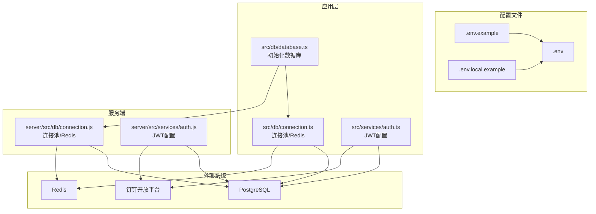
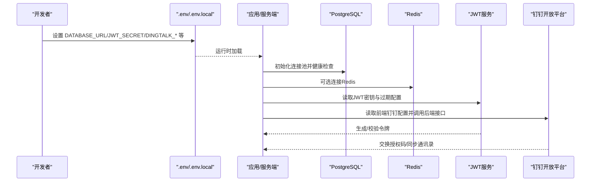
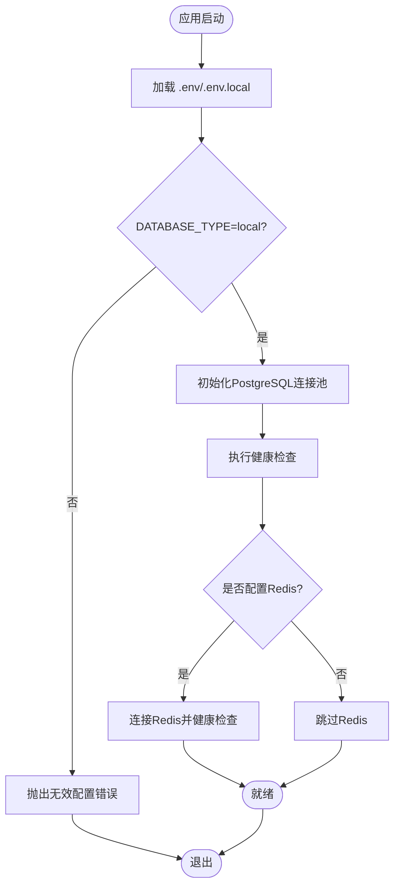
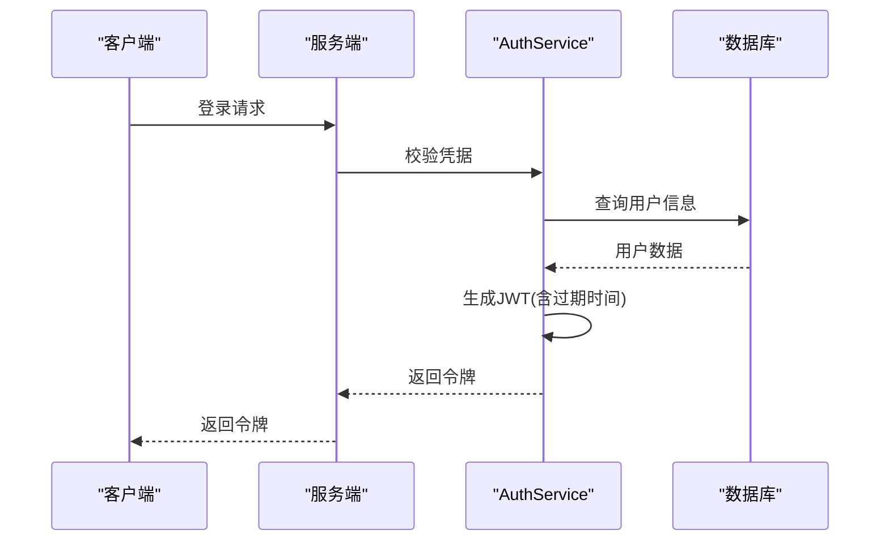
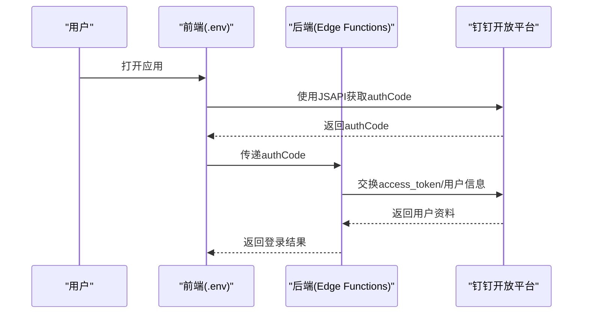
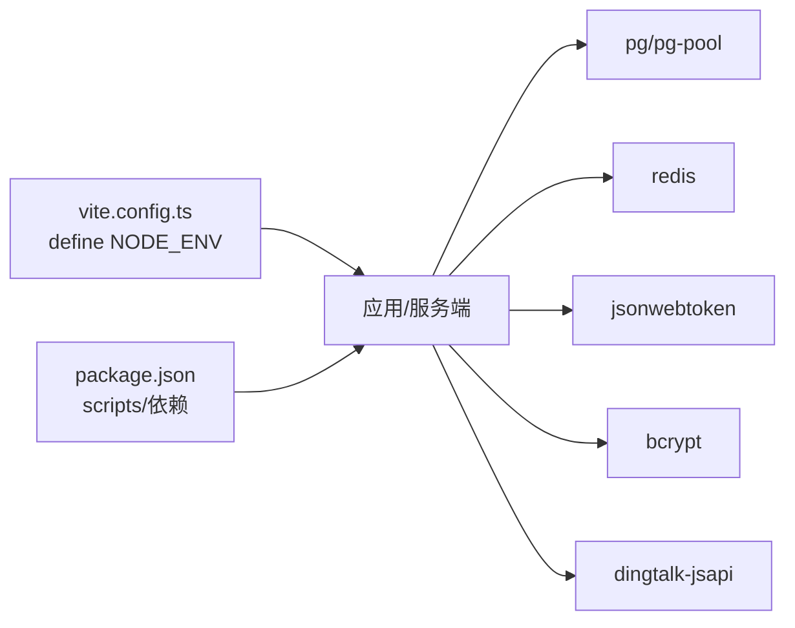

# 环境配置

<cite>
**本文引用的文件**
- [.env](file://.env)
- [.env.example](file://.env.example)
- [.env.local.example](file://.env.local.example)
- [DEPLOYMENT_GUIDE.md](file://DEPLOYMENT_GUIDE.md)
- [DINGTALK_SETUP_GUIDE.md](file://DINGTALK_SETUP_GUIDE.md)
- [supabase/secrets/required.json](file://supabase/secrets/required.json)
- [src/db/database.ts](file://src/db/database.ts)
- [src/db/connection.ts](file://src/db/connection.ts)
- [server/src/db/connection.js](file://server/src/db/connection.js)
- [src/services/auth.ts](file://src/services/auth.ts)
- [server/src/services/auth.js](file://server/src/services/auth.js)
- [scripts/migrate-from-supabase.ts](file://scripts/migrate-from-supabase.ts)
- [vite.config.ts](file://vite.config.ts)
- [package.json](file://package.json)
</cite>

## 目录
1. [简介](#简介)
2. [项目结构](#项目结构)
3. [核心组件](#核心组件)
4. [架构总览](#架构总览)
5. [详细组件分析](#详细组件分析)
6. [依赖分析](#依赖分析)
7. [性能考虑](#性能考虑)
8. [故障排查指南](#故障排查指南)
9. [结论](#结论)
10. [附录](#附录)

## 简介
本指南面向开发者，提供完整的环境变量配置说明，涵盖 DATABASE_URL、SECRET_KEY（JWT_SECRET）、DINGTALK_APP_KEY 等关键变量的用途、安全要求与最佳实践。文档同时说明开发、测试、生产三类环境的差异，给出 .env 文件的完整示例与验证方法，帮助避免常见配置错误，确保应用的安全性与稳定性。

## 项目结构
围绕环境配置的关键文件与职责如下：
- 示例与本地配置文件：.env、.env.example、.env.local.example
- 部署与运维指南：DEPLOYMENT_GUIDE.md
- 钉钉集成配置：DINGTALK_SETUP_GUIDE.md
- 钉钉密钥清单：supabase/secrets/required.json
- 数据库初始化与连接：src/db/database.ts、src/db/connection.ts、server/src/db/connection.js
- 认证与JWT：src/services/auth.ts、server/src/services/auth.js
- 数据迁移脚本：scripts/migrate-from-supabase.ts
- 构建与运行：vite.config.ts、package.json

图表来源
- [src/db/database.ts](file://src/db/database.ts#L1-L43)
- [src/db/connection.ts](file://src/db/connection.ts#L23-L166)
- [server/src/db/connection.js](file://server/src/db/connection.js#L25-L119)
- [src/services/auth.ts](file://src/services/auth.ts#L1-L47)
- [server/src/services/auth.js](file://server/src/services/auth.js#L1-L37)

章节来源
- [DEPLOYMENT_GUIDE.md](file://DEPLOYMENT_GUIDE.md#L1-L120)
- [.env.example](file://.env.example#L1-L42)
- [.env.local.example](file://.env.local.example#L1-L37)

## 核心组件
- 数据库连接与初始化
  - 本地PostgreSQL优先：src/db/database.ts 明确使用 local 数据库类型；连接池由 src/db/connection.ts 与 server/src/db/connection.js 统一管理。
  - 连接参数来源：.env.local.example 提供 POSTGRES_* 与 DATABASE_URL；.env.example 提供 DATABASE_TYPE 与 DATABASE_URL。
- 认证与JWT
  - JWT密钥与过期策略：src/services/auth.ts 与 server/src/services/auth.js 从 VITE_JWT_SECRET/VITE_JWT_EXPIRES_IN/VITE_JWT_REFRESH_EXPIRES_IN 或 JWT_* 环境变量读取。
- 钉钉集成
  - 前端配置：.env 中 VITE_DINGTALK_*；后端密钥：supabase/secrets/required.json 指定 DINGTALK_APP_KEY、DINGTALK_APP_SECRET、DINGTALK_AGENT_ID。
- 数据迁移
  - scripts/migrate-from-supabase.ts 读取 VITE_SUPABASE_URL 与 VITE_SUPABASE_ANON_KEY，用于从 Supabase 迁移到本地数据库。

章节来源
- [src/db/database.ts](file://src/db/database.ts#L1-L43)
- [src/db/connection.ts](file://src/db/connection.ts#L23-L166)
- [server/src/db/connection.js](file://server/src/db/connection.js#L25-L119)
- [src/services/auth.ts](file://src/services/auth.ts#L1-L47)
- [server/src/services/auth.js](file://server/src/services/auth.js#L1-L37)
- [supabase/secrets/required.json](file://supabase/secrets/required.json#L1-L1)
- [scripts/migrate-from-supabase.ts](file://scripts/migrate-from-supabase.ts#L1-L35)

## 架构总览
下图展示环境变量在系统中的流向与使用点，包括数据库、认证与钉钉集成。

图表来源
- [src/db/connection.ts](file://src/db/connection.ts#L23-L166)
- [server/src/db/connection.js](file://server/src/db/connection.js#L25-L119)
- [src/services/auth.ts](file://src/services/auth.ts#L1-L47)
- [server/src/services/auth.js](file://server/src/services/auth.js#L1-L37)
- [.env](file://.env#L1-L13)
- [.env.example](file://.env.example#L1-L42)
- [.env.local.example](file://.env.local.example#L1-L37)

## 详细组件分析

### 数据库连接与环境变量
- 关键变量
  - DATABASE_TYPE：决定使用本地数据库还是云数据库（示例中为 local）。
  - DATABASE_URL：统一的连接字符串，包含主机、端口、数据库名、用户名与密码。
  - POSTGRES_HOST/PORT/DB/USER/PASSWORD：当使用分项配置时，可组合为 DATABASE_URL。
  - REDIS_HOST/PORT/PASSWORD：可选缓存配置。
- 初始化流程
  - src/db/database.ts 选择 local 类型并调用 initializeConnections。
  - src/db/connection.ts 与 server/src/db/connection.js 建立连接池并进行健康检查。
- 验证方法
  - 启动应用后观察连接日志；必要时执行数据库健康检查函数。
  - 使用 DEPLOYMENT_GUIDE.md 中的命令检查服务状态与端口映射。

图表来源
- [src/db/database.ts](file://src/db/database.ts#L1-L43)
- [src/db/connection.ts](file://src/db/connection.ts#L23-L166)
- [server/src/db/connection.js](file://server/src/db/connection.js#L25-L119)
- [.env.example](file://.env.example#L1-L42)
- [.env.local.example](file://.env.local.example#L1-L37)

章节来源
- [src/db/database.ts](file://src/db/database.ts#L1-L43)
- [src/db/connection.ts](file://src/db/connection.ts#L23-L166)
- [server/src/db/connection.js](file://server/src/db/connection.js#L25-L119)
- [DEPLOYMENT_GUIDE.md](file://DEPLOYMENT_GUIDE.md#L1-L120)

### JWT与密钥安全（SECRET_KEY）
- 关键变量
  - VITE_JWT_SECRET 或 JWT_SECRET：JWT签名密钥。
  - VITE_JWT_EXPIRES_IN/VITE_JWT_REFRESH_EXPIRES_IN 或 JWT_EXPIRES_IN/JWT_REFRESH_EXPIRES_IN：访问令牌与刷新令牌过期时间。
- 读取顺序
  - 前端与服务端均支持 VITE_ 前缀与普通前缀，优先级按源码逻辑确定。
- 安全要求
  - 生产环境必须使用高强度随机密钥，定期轮换。
  - 刷新令牌过期时间应合理设置，避免长期有效。
  - 不要在客户端暴露任何后端敏感密钥。

图表来源
- [src/services/auth.ts](file://src/services/auth.ts#L1-L47)
- [server/src/services/auth.js](file://server/src/services/auth.js#L1-L37)

章节来源
- [src/services/auth.ts](file://src/services/auth.ts#L1-L47)
- [server/src/services/auth.js](file://server/src/services/auth.js#L1-L37)
- [DEPLOYMENT_GUIDE.md](file://DEPLOYMENT_GUIDE.md#L157-L170)

### 钉钉集成（DINGTALK_APP_KEY 等）
- 前端配置
  - .env 中包含 VITE_DINGTALK_APP_KEY、VITE_DINGTALK_AGENT_ID、VITE_DINGTALK_CORP_ID 等。
- 后端密钥
  - supabase/secrets/required.json 明确列出 DINGTALK_APP_KEY、DINGTALK_APP_SECRET、DINGTALK_AGENT_ID 为必需密钥。
- 功能范围
  - 登录免登、通讯录同步、消息通知等，详见 DINGTALK_SETUP_GUIDE.md。
- 安全要点
  - AppSecret 仅在后端使用，不得暴露于前端。
  - 回调域名与服务器出口IP需正确配置。

图表来源
- [.env](file://.env#L1-L13)
- [supabase/secrets/required.json](file://supabase/secrets/required.json#L1-L1)
- [DINGTALK_SETUP_GUIDE.md](file://DINGTALK_SETUP_GUIDE.md#L68-L100)

章节来源
- [.env](file://.env#L1-L13)
- [supabase/secrets/required.json](file://supabase/secrets/required.json#L1-L1)
- [DINGTALK_SETUP_GUIDE.md](file://DINGTALK_SETUP_GUIDE.md#L68-L100)

### 环境类型差异（开发/测试/生产）
- 开发环境
  - NODE_ENV=development；默认本地数据库；可启用 PgAdmin；前端调试友好。
- 测试环境
  - NODE_ENV=test；使用独立测试数据库；禁用或简化缓存；严格日志级别。
- 生产环境
  - NODE_ENV=production；使用强密码与随机密钥；启用SSL/TLS；限制网络访问；定期轮换密钥。

章节来源
- [.env.local.example](file://.env.local.example#L1-L37)
- [.env.example](file://.env.example#L1-L42)
- [DEPLOYMENT_GUIDE.md](file://DEPLOYMENT_GUIDE.md#L283-L316)

### .env 文件完整示例与验证方法
- 示例文件
  - .env.local.example：包含本地数据库、Redis、JWT、应用URL、钉钉配置与 DATABASE_URL。
  - .env.example：包含 DATABASE_TYPE、DATABASE_URL、JWT、应用URL、钉钉开关与开发服务器配置。
  - .env：当前仓库中的前端示例，包含 VITE_DINGTALK_* 与 Supabase 前端密钥。
- 验证方法
  - 启动应用后观察数据库连接日志与健康检查结果。
  - 使用 DEPLOYMENT_GUIDE.md 中的命令检查容器状态、端口映射与服务可用性。
  - 对于Supabase迁移，使用 scripts/migrate-from-supabase.ts 并检查迁移报告。

章节来源
- [.env.local.example](file://.env.local.example#L1-L37)
- [.env.example](file://.env.example#L1-L42)
- [.env](file://.env#L1-L13)
- [DEPLOYMENT_GUIDE.md](file://DEPLOYMENT_GUIDE.md#L1-L120)
- [scripts/migrate-from-supabase.ts](file://scripts/migrate-from-supabase.ts#L1-L35)

## 依赖分析
- 构建与运行
  - vite.config.ts 将 NODE_ENV 注入浏览器环境，define 配置确保在浏览器侧可用。
  - package.json 指定运行脚本与依赖，开发与生产行为由 NODE_ENV 控制。
- 外部依赖
  - 数据库：pg、pg-pool
  - 缓存：redis
  - 认证：bcrypt、jsonwebtoken
  - 钉钉SDK：dingtalk-jsapi

图表来源
- [vite.config.ts](file://vite.config.ts#L66-L70)
- [package.json](file://package.json#L1-L103)

章节来源
- [vite.config.ts](file://vite.config.ts#L66-L70)
- [package.json](file://package.json#L1-L103)

## 性能考虑
- 连接池与缓存
  - 合理设置连接池大小与超时；Redis 作为可选缓存提升会话与实时数据性能。
- 监控与日志
  - 使用 docker stats 与数据库内置查询监控连接数与活动；开启详细日志定位瓶颈。
- 生产优化
  - 调整 PostgreSQL 参数（如最大连接数），启用 WAL 归档与定期备份。

章节来源
- [DEPLOYMENT_GUIDE.md](file://DEPLOYMENT_GUIDE.md#L171-L196)

## 故障排查指南
- 数据库连接失败
  - 检查 docker-compose 状态与端口映射；确认 DATABASE_URL 与 POSTGRES_* 配置一致。
- 端口冲突
  - 修改 docker-compose 中的端口映射或释放宿主机端口。
- 权限问题
  - 确保迁移脚本与数据库脚本具备执行权限。
- 内存不足
  - 清理未使用资源，调整容器资源限制。
- JWT 令牌异常
  - 检查 JWT_SECRET 是否正确设置且未泄露；核对过期时间配置。
- 钉钉登录/同步失败
  - 确认 DINGTALK_APP_KEY/APP_SECRET/AGENT_ID 已在后端配置；回调域名与服务器出口IP正确。

章节来源
- [DEPLOYMENT_GUIDE.md](file://DEPLOYMENT_GUIDE.md#L234-L282)
- [DINGTALK_SETUP_GUIDE.md](file://DINGTALK_SETUP_GUIDE.md#L190-L207)

## 结论
通过规范化的环境变量管理、严格的密钥安全策略与完善的验证流程，可以显著降低配置错误与安全风险。建议在开发、测试、生产三类环境中分别采用差异化配置，并在上线前完成端到端验证与安全审计。

## 附录
- 关键变量一览
  - DATABASE_TYPE：数据库类型（local/云）
  - DATABASE_URL：统一连接字符串
  - POSTGRES_HOST/PORT/DB/USER/PASSWORD：分项配置
  - REDIS_HOST/PORT/PASSWORD：缓存配置
  - JWT_SECRET/JWT_EXPIRES_IN/JWT_REFRESH_EXPIRES_IN：JWT密钥与过期策略
  - VITE_DINGTALK_*：前端钉钉配置
  - DINGTALK_APP_KEY/APP_SECRET/AGENT_ID：后端钉钉密钥（必需）
- 参考路径
  - 示例与本地配置：.env、.env.example、.env.local.example
  - 部署与运维：DEPLOYMENT_GUIDE.md
  - 钉钉集成：DINGTALK_SETUP_GUIDE.md、supabase/secrets/required.json
  - 数据库与认证：src/db/database.ts、src/db/connection.ts、server/src/db/connection.js、src/services/auth.ts、server/src/services/auth.js
  - 迁移脚本：scripts/migrate-from-supabase.ts
  - 构建与运行：vite.config.ts、package.json