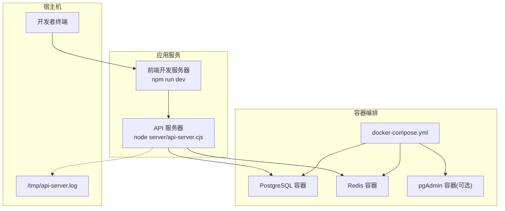
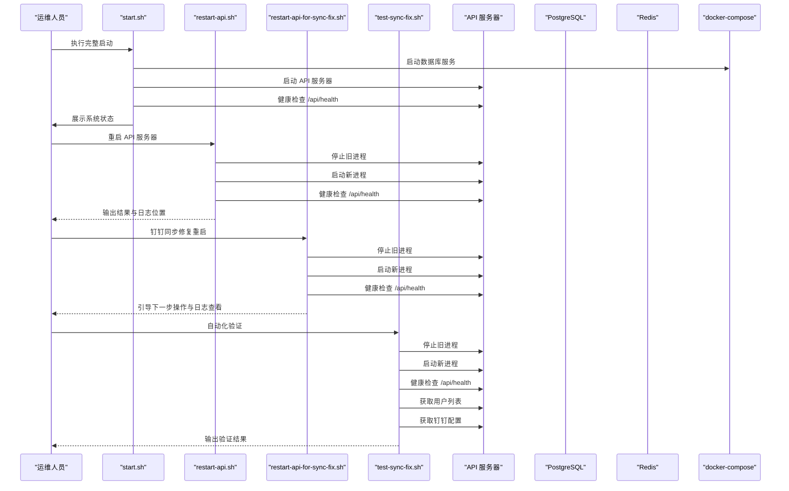
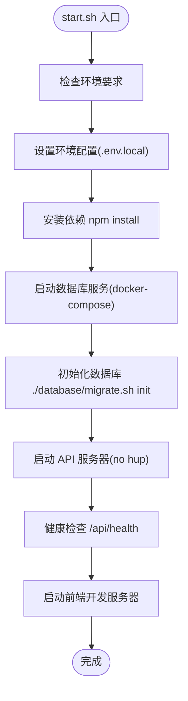
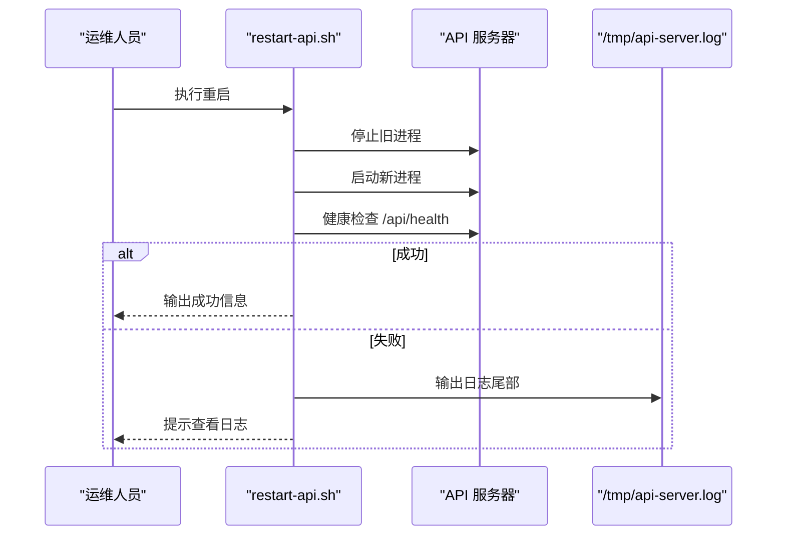
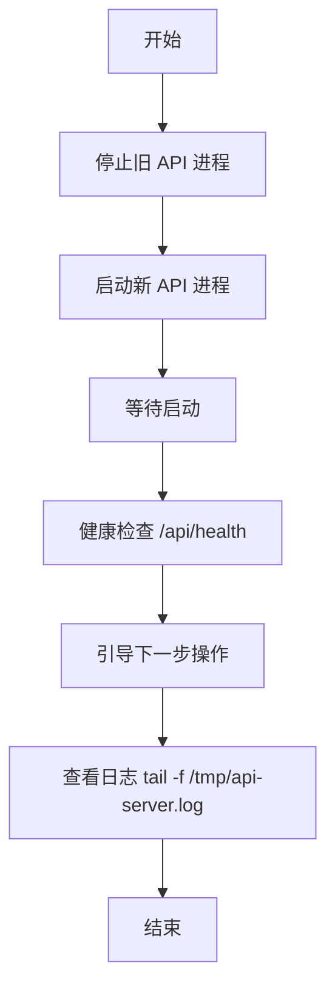
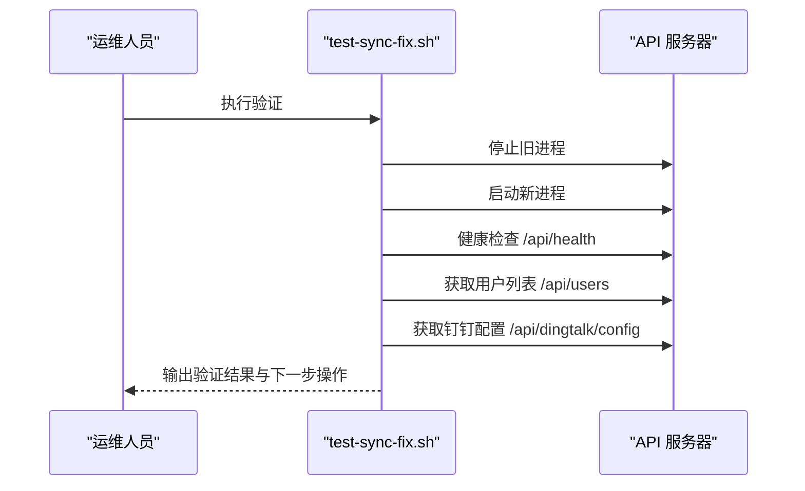
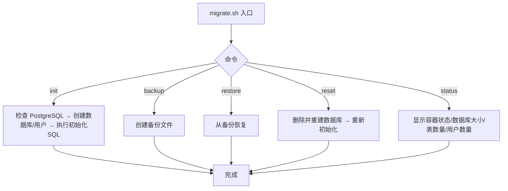
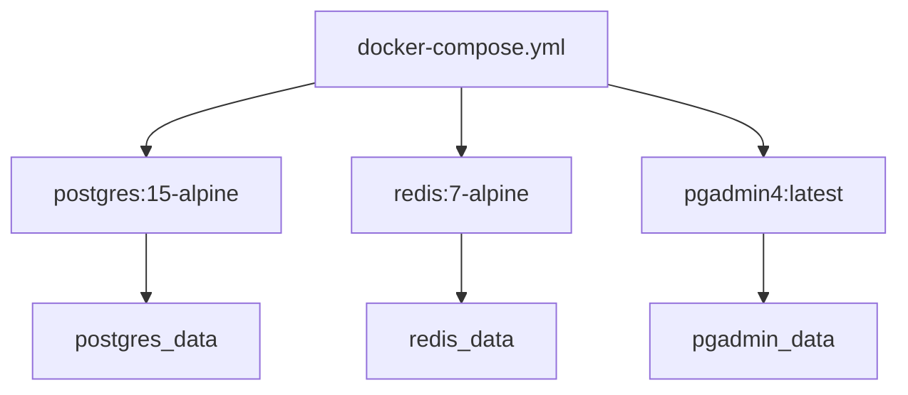
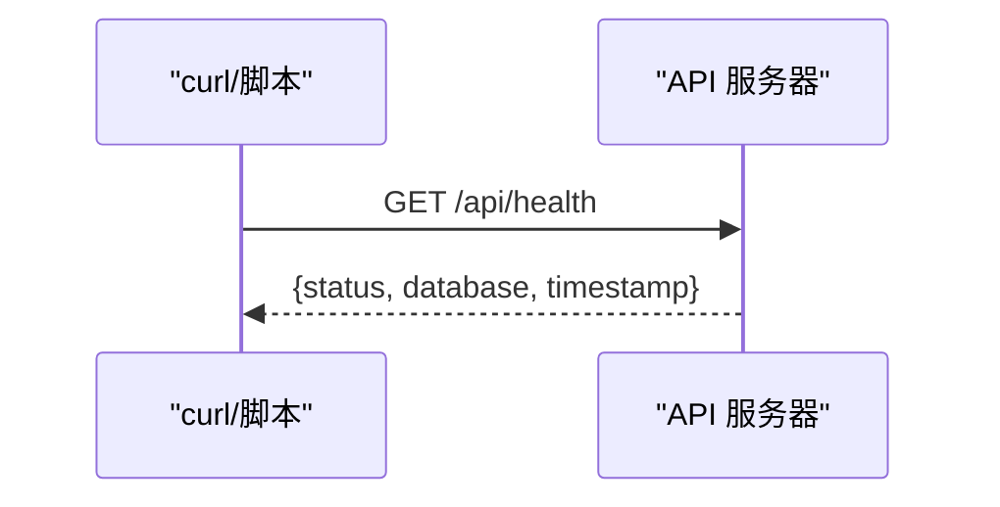
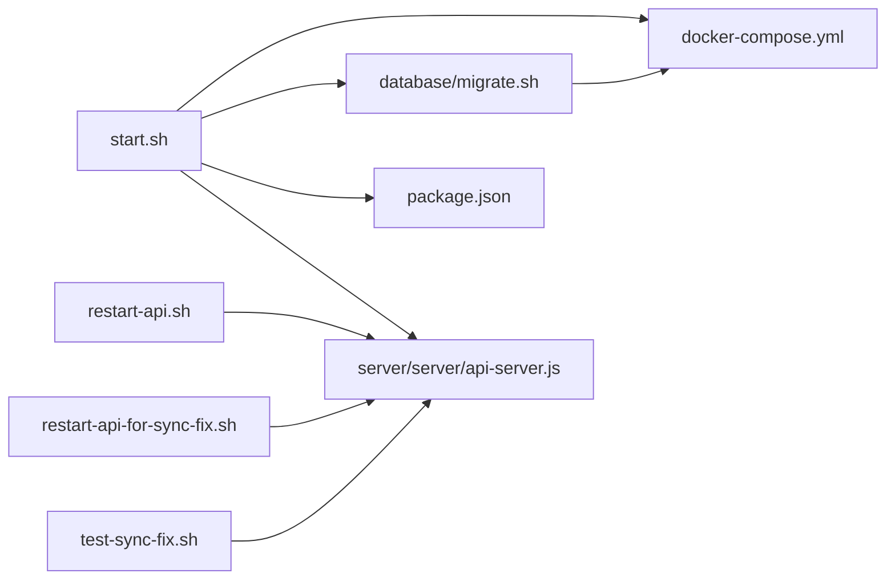

# 运维管理

<cite>
**本文引用的文件**
- [start.sh](file://start.sh)
- [restart-api.sh](file://restart-api.sh)
- [restart-api-for-sync-fix.sh](file://restart-api-for-sync-fix.sh)
- [test-sync-fix.sh](file://test-sync-fix.sh)
- [docker-compose.yml](file://docker-compose.yml)
- [database/migrate.sh](file://database/migrate.sh)
- [.env.example](file://.env.example)
- [package.json](file://package.json)
- [API服务器重启指南.md](file://API服务器重启指南.md)
- [启动脚本使用指南.md](file://启动脚本使用指南.md)
- [DEPLOYMENT_GUIDE.md](file://DEPLOYMENT_GUIDE.md)
- [server/server/api-server.js](file://server/server/api-server.js)
</cite>

## 目录
1. [简介](#简介)
2. [项目结构](#项目结构)
3. [核心组件](#核心组件)
4. [架构总览](#架构总览)
5. [详细组件分析](#详细组件分析)
6. [依赖关系分析](#依赖关系分析)
7. [性能与可用性](#性能与可用性)
8. [故障排查指南](#故障排查指南)
9. [结论](#结论)
10. [附录](#附录)

## 简介
本指南面向系统运维与开发团队，围绕仓库内的运维脚本与基础设施，提供启动、重启、监控、日志、故障恢复与生产最佳实践的完整操作手册。重点覆盖：
- start.sh 的启动流程与各阶段职责
- restart-api.sh 的重启机制与健康检查
- 针对钉钉同步修复的专用重启脚本与验证流程
- 服务监控、日志查看、数据库备份与恢复
- 生产环境的性能监控、备份策略与安全加固

## 项目结构
本项目采用前后端分离与容器化部署思路：
- 前端开发服务器由 npm 脚本启动
- 后端 API 服务器以 Node.js 进程方式运行，并通过健康检查端点对外暴露状态
- 数据层使用 PostgreSQL 与 Redis，通过 docker-compose 统一编排
- 数据库初始化与迁移通过 migrate.sh 脚本完成

图表来源
- [docker-compose.yml](file://docker-compose.yml#L1-L75)
- [start.sh](file://start.sh#L139-L173)
- [package.json](file://package.json#L1-L20)

章节来源
- [docker-compose.yml](file://docker-compose.yml#L1-L75)
- [package.json](file://package.json#L1-L20)

## 核心组件
- 启动脚本：start.sh
  - 负责环境检查、依赖安装、数据库启动与初始化、API 服务器启动、前端启动与健康检查
- 重启脚本：restart-api.sh
  - 停止旧进程、切换到新进程、健康检查与日志定位
- 钉钉同步修复脚本：restart-api-for-sync-fix.sh
  - 专门用于修复钉钉同步异常后的重启与验证流程
- 同步修复验证脚本：test-sync-fix.sh
  - 自动化验证 API 服务器健康、用户列表与钉钉配置
- 数据库管理：database/migrate.sh
  - 初始化、备份、恢复、重置、状态查询等数据库运维能力
- 容器编排：docker-compose.yml
  - PostgreSQL、Redis、pgAdmin 的服务定义与健康检查
- 环境配置：.env.example
  - 数据库、Redis、JWT、应用 URL 等关键配置项
- API 服务器：server/server/api-server.js
  - 提供 /api/health 健康检查端点与业务路由

章节来源
- [start.sh](file://start.sh#L139-L173)
- [restart-api.sh](file://restart-api.sh#L1-L25)
- [restart-api-for-sync-fix.sh](file://restart-api-for-sync-fix.sh#L1-L51)
- [test-sync-fix.sh](file://test-sync-fix.sh#L1-L61)
- [database/migrate.sh](file://database/migrate.sh#L1-L233)
- [docker-compose.yml](file://docker-compose.yml#L1-L75)
- [.env.example](file://.env.example#L1-L42)
- [server/server/api-server.js](file://server/server/api-server.js#L73-L119)

## 架构总览
下图展示了运维脚本与服务之间的交互关系，以及关键的健康检查与日志落点。

图表来源
- [start.sh](file://start.sh#L139-L173)
- [restart-api.sh](file://restart-api.sh#L1-L25)
- [restart-api-for-sync-fix.sh](file://restart-api-for-sync-fix.sh#L1-L51)
- [test-sync-fix.sh](file://test-sync-fix.sh#L1-L61)
- [server/server/api-server.js](file://server/server/api-server.js#L73-L119)

## 详细组件分析

### start.sh 启动流程
- 环境要求检查：Docker、Docker Compose、Node.js 20+、npm
- 环境配置：复制 .env.example 为 .env.local 并提示修改
- 依赖安装：npm install
- 数据库启动：docker-compose 启动 postgres 与 redis，并等待与健康检查
- 数据库初始化：./database/migrate.sh init
- API 服务器启动：后台运行 node server/api-server.cjs，日志输出至 /tmp/api-server.log
- 健康检查：curl http://localhost:3001/api/health
- 前端启动：npm run dev
- 状态查看：./start.sh status，包含容器、数据库、Redis、API 服务器、端口占用等
- 停止服务：./start.sh stop，停止 API 服务器与 docker-compose down
- 清理：./start.sh clean，删除容器、镜像与未使用资源

图表来源
- [start.sh](file://start.sh#L44-L113)
- [start.sh](file://start.sh#L115-L173)
- [start.sh](file://start.sh#L212-L291)

章节来源
- [start.sh](file://start.sh#L44-L113)
- [start.sh](file://start.sh#L115-L173)
- [start.sh](file://start.sh#L212-L291)

### restart-api.sh 重启机制
- 停止旧进程：pkill -f "node server/api-server.cjs"
- 启动新进程：cd 到项目目录，nohup node server/api-server.cjs > /tmp/api-server.log 2>&1 &
- 健康检查：curl -s http://localhost:3001/api/health
- 失败时输出日志尾部，便于定位问题

图表来源
- [restart-api.sh](file://restart-api.sh#L1-L25)

章节来源
- [restart-api.sh](file://restart-api.sh#L1-L25)

### restart-api-for-sync-fix.sh 针对钉钉同步修复的重启
- 严格顺序：停止旧进程 → 启动新进程 → 等待 → 健康检查
- 输出引导：打开浏览器、登录、进入“用户管理 → 钉钉同步”，点击“立即同步”
- 日志指引：tail -f /tmp/api-server.log

图表来源
- [restart-api-for-sync-fix.sh](file://restart-api-for-sync-fix.sh#L1-L51)

章节来源
- [restart-api-for-sync-fix.sh](file://restart-api-for-sync-fix.sh#L1-L51)

### test-sync-fix.sh 自动化验证
- 停止旧进程、启动新进程
- 健康检查：/api/health
- 用户列表：/api/users
- 钉钉配置：/api/dingtalk/config
- 输出验证结果与下一步操作指引

图表来源
- [test-sync-fix.sh](file://test-sync-fix.sh#L1-L61)

章节来源
- [test-sync-fix.sh](file://test-sync-fix.sh#L1-L61)

### database/migrate.sh 数据库运维
- init：检查 PostgreSQL、创建数据库与用户、执行初始化 SQL
- backup：创建备份文件，输出大小
- restore：从指定备份文件恢复
- reset：删除并重建数据库，重新初始化
- status：显示容器状态、数据库大小、表数量、用户数量
- help：命令与环境变量说明

图表来源
- [database/migrate.sh](file://database/migrate.sh#L1-L233)

章节来源
- [database/migrate.sh](file://database/migrate.sh#L1-L233)

### docker-compose.yml 服务编排
- postgres：端口映射 5437:5432，健康检查 pg_isready
- redis：端口映射 6379:6379，启用 AOF 与密码
- pgadmin：可选，端口映射 5050:80，依赖 postgres
- volumes/networks：本地卷与桥接网络

图表来源
- [docker-compose.yml](file://docker-compose.yml#L1-L75)

章节来源
- [docker-compose.yml](file://docker-compose.yml#L1-L75)

### API 服务器健康检查与路由
- 健康检查：/api/health 返回健康状态与时间戳
- 业务路由：/api/services、/api/resources、/api/appointments 等
- 重启脚本依赖 /api/health 进行健康验证

图表来源
- [server/server/api-server.js](file://server/server/api-server.js#L73-L119)

章节来源
- [server/server/api-server.js](file://server/server/api-server.js#L73-L119)

## 依赖关系分析
- start.sh 依赖 docker-compose.yml 启动数据库，依赖 database/migrate.sh 初始化数据库，依赖 package.json 中的 npm 脚本启动前端，依赖 API 服务器的 /api/health 健康检查
- restart-api.sh 与 restart-api-for-sync-fix.sh 依赖 API 服务器进程与 /api/health
- test-sync-fix.sh 串联 API 服务器重启与健康检查、用户列表与钉钉配置验证
- database/migrate.sh 依赖 docker-compose.yml 中的 postgres 容器

图表来源
- [start.sh](file://start.sh#L139-L173)
- [restart-api.sh](file://restart-api.sh#L1-L25)
- [restart-api-for-sync-fix.sh](file://restart-api-for-sync-fix.sh#L1-L51)
- [test-sync-fix.sh](file://test-sync-fix.sh#L1-L61)
- [database/migrate.sh](file://database/migrate.sh#L1-L233)
- [docker-compose.yml](file://docker-compose.yml#L1-L75)
- [server/server/api-server.js](file://server/server/api-server.js#L73-L119)

章节来源
- [start.sh](file://start.sh#L139-L173)
- [restart-api.sh](file://restart-api.sh#L1-L25)
- [restart-api-for-sync-fix.sh](file://restart-api-for-sync-fix.sh#L1-L51)
- [test-sync-fix.sh](file://test-sync-fix.sh#L1-L61)
- [database/migrate.sh](file://database/migrate.sh#L1-L233)
- [docker-compose.yml](file://docker-compose.yml#L1-L75)
- [server/server/api-server.js](file://server/server/api-server.js#L73-L119)

## 性能与可用性
- 性能监控
  - 使用 docker stats 查看容器资源使用
  - 使用 docker logs 查看数据库与 Redis 日志
  - 使用 ./database/migrate.sh status 查看数据库状态
- 备份策略
  - 定时备份：crontab 中添加每日凌晨 2 点执行 ./database/migrate.sh backup
  - 备份文件存放于 backups/ 目录
- 安全加固
  - 修改默认密码：POSTGRES_PASSWORD、REDIS_PASSWORD
  - 配置强 JWT_SECRET
  - 生产环境建议启用 SSL/TLS、限制网络访问、配置防火墙
- 可用性保障
  - 健康检查端点 /api/health 作为外部探针
  - docker-compose healthcheck 对数据库与 Redis 进行周期性检查
  - 前端与后端端口占用检查（5173、3001、5437、6379）

章节来源
- [DEPLOYMENT_GUIDE.md](file://DEPLOYMENT_GUIDE.md#L190-L233)
- [DEPLOYMENT_GUIDE.md](file://DEPLOYMENT_GUIDE.md#L307-L316)
- [docker-compose.yml](file://docker-compose.yml#L1-L75)
- [.env.example](file://.env.example#L1-L42)

## 故障排查指南
- API 服务器 404 问题
  - 执行 restart-api.sh 或 restart-api-for-sync-fix.sh 重启
  - 使用 curl http://localhost:3001/api/health 验证健康状态
  - 查看 /tmp/api-server.log 尾部日志
- 端口冲突
  - 检查 lsof -i :3001、:5173、:5437、:6379 占用情况
  - 修改 docker-compose.yml 端口映射或释放占用进程
- 数据库连接失败
  - 检查 docker-compose ps 与网络连接
  - 使用 docker logs bio-appointment-postgres 查看数据库日志
- 权限问题
  - 确保 database/migrate.sh 可执行：chmod +x database/migrate.sh
- 内存不足
  - 使用 docker system df 查看资源使用
  - 执行 docker system prune -a 清理未使用资源

章节来源
- [API服务器重启指南.md](file://API服务器重启指南.md#L1-L178)
- [DEPLOYMENT_GUIDE.md](file://DEPLOYMENT_GUIDE.md#L234-L283)

## 结论
本指南梳理了从启动、重启、监控到故障恢复的完整运维流程，并结合数据库管理脚本与容器编排配置，提供了生产环境可用性的基础保障。建议在生产环境中配合定时备份、健康检查与日志监控，持续优化性能与安全性。

## 附录
- 常用命令索引
  - 启动：./start.sh 或 npm run dev
  - 重启 API：./restart-api.sh
  - 钉钉同步修复重启：./restart-api-for-sync-fix.sh
  - 自动化验证：./test-sync-fix.sh
  - 数据库初始化：./database/migrate.sh init
  - 数据库备份：./database/migrate.sh backup
  - 数据库恢复：./database/migrate.sh restore backups/xxx.sql
  - 数据库重置：./database/migrate.sh reset
  - 数据库状态：./database/migrate.sh status
  - 容器状态：docker-compose ps
  - 容器日志：docker logs bio-appointment-postgres / bio-appointment-redis
  - 资源使用：docker stats
  - 端口占用：lsof -i :port
- 环境变量
  - DATABASE_TYPE、DATABASE_URL、POSTGRES_*、REDIS_*、JWT_SECRET、VITE_APP_URL、VITE_API_BASE_URL、DINGTALK_*、VITE_DEV_HOST

章节来源
- [package.json](file://package.json#L1-L20)
- [.env.example](file://.env.example#L1-L42)
- [DEPLOYMENT_GUIDE.md](file://DEPLOYMENT_GUIDE.md#L190-L233)