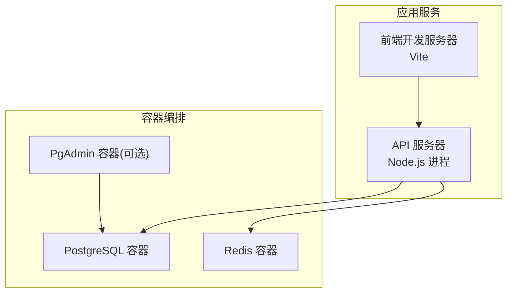
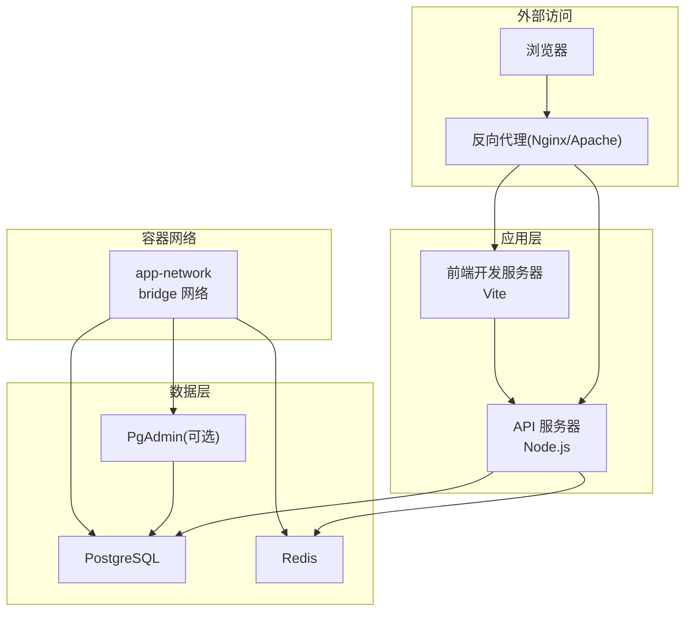
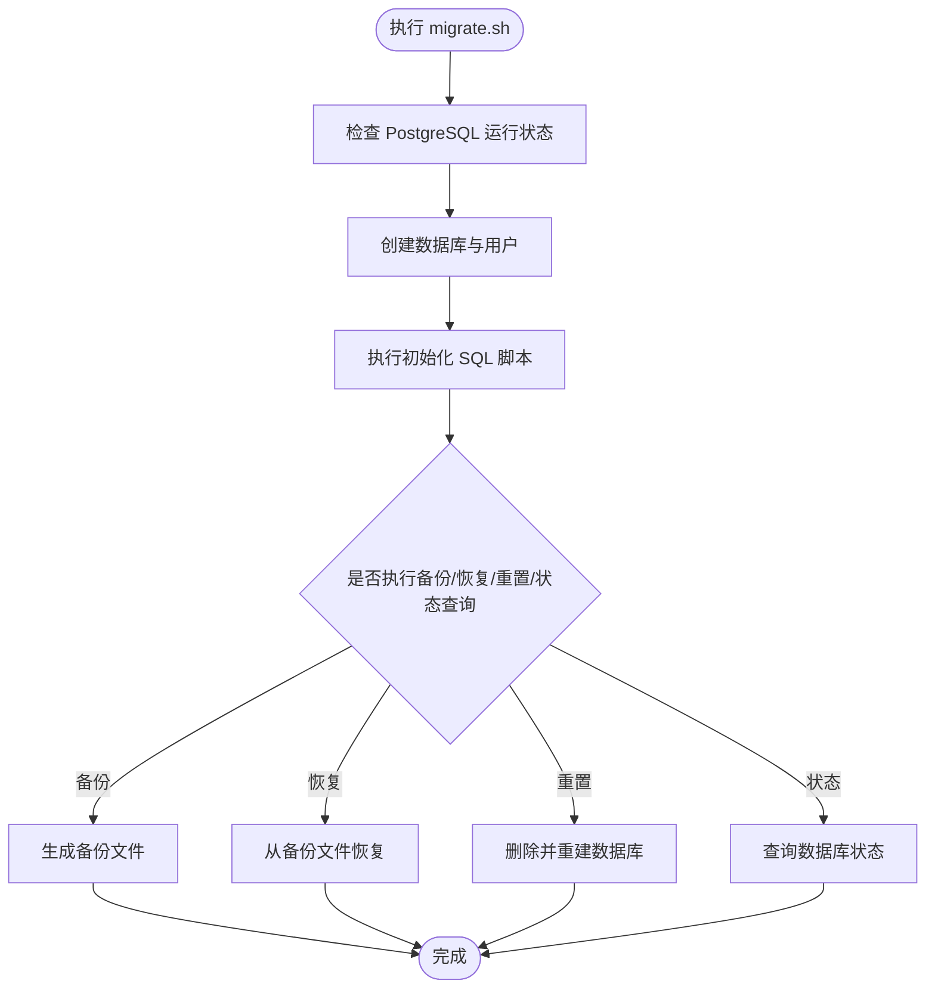
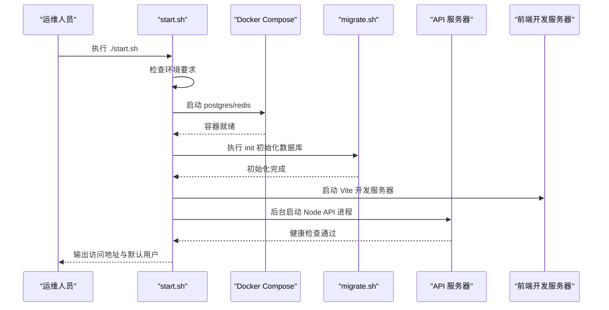
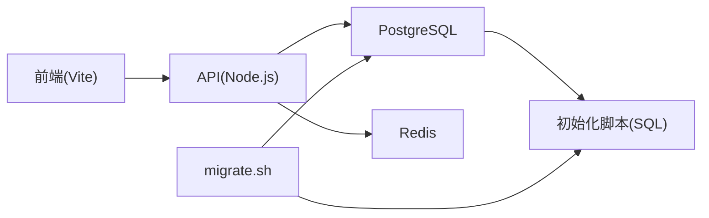

# 配置与部署

<cite>
**本文引用的文件**
- [.env](file://.env)
- [.env.example](file://.env.example)
- [docker-compose.yml](file://docker-compose.yml)
- [start.sh](file://start.sh)
- [restart-api.sh](file://restart-api.sh)
- [DEPLOYMENT_GUIDE.md](file://DEPLOYMENT_GUIDE.md)
- [database/migrate.sh](file://database/migrate.sh)
- [database/init/01-init-database.sql](file://database/init/01-init-database.sql)
- [database/init/02-create-tables.sql](file://database/init/02-create-tables.sql)
- [package.json](file://package.json)
- [supabase/config.toml](file://supabase/config.toml)
</cite>

## 目录
1. [简介](#简介)
2. [项目结构](#项目结构)
3. [核心组件](#核心组件)
4. [架构总览](#架构总览)
5. [详细组件分析](#详细组件分析)
6. [依赖关系分析](#依赖关系分析)
7. [性能考虑](#性能考虑)
8. [故障排除指南](#故障排除指南)
9. [结论](#结论)
10. [附录](#附录)

## 简介
本指南面向运维与开发团队，提供从环境变量配置、Docker容器化部署、生产环境最佳实践到运维脚本与故障恢复的全流程权威说明。内容覆盖：
- 环境变量（.env）用途、默认值与安全建议
- docker-compose.yml 中 web、api、db 等服务的配置与网络设置
- 生产环境部署最佳实践（反向代理、日志管理、备份策略）
- 运维脚本（start.sh、restart-api.sh）使用说明与故障恢复流程

## 项目结构
该仓库采用前后端分离与容器化部署模式：
- 前端为 React + TypeScript 应用，通过 Vite 开发服务器提供界面
- 后端为 Node.js API 服务，运行于独立进程并通过健康检查暴露 /api/health
- 数据层由 PostgreSQL 提供持久化，Redis 提供会话与缓存能力
- Supabase 作为历史迁移目标，保留迁移配置与脚本

图表来源
- [docker-compose.yml](file://docker-compose.yml#L1-L75)
- [start.sh](file://start.sh#L126-L190)

章节来源
- [docker-compose.yml](file://docker-compose.yml#L1-L75)
- [package.json](file://package.json#L1-L20)

## 核心组件
- 环境变量与配置
  - .env：用于前端构建时注入的 Vite 变量（如 Supabase 与钉钉配置）
  - .env.local：本地开发环境变量（推荐复制 .env.example 并按需修改）
  - .env.example：完整示例，包含数据库、Redis、JWT、应用 URL、钉钉开关等
- 容器编排
  - docker-compose.yml：定义 postgres、redis、pgadmin 服务及网络、卷、健康检查
- 数据库初始化与迁移
  - database/migrate.sh：封装初始化、备份、恢复、重置、状态查询
  - database/init/*.sql：初始化数据库扩展、类型、审计触发器与基础表结构
- 运维脚本
  - start.sh：一键启动（数据库、API、前端）、状态检查、清理
  - restart-api.sh：快速重启 API 服务器并进行健康检查

章节来源
- [.env](file://.env#L1-L13)
- [.env.example](file://.env.example#L1-L42)
- [docker-compose.yml](file://docker-compose.yml#L1-L75)
- [database/migrate.sh](file://database/migrate.sh#L1-L233)
- [database/init/01-init-database.sql](file://database/init/01-init-database.sql#L1-L112)
- [database/init/02-create-tables.sql](file://database/init/02-create-tables.sql#L1-L274)
- [start.sh](file://start.sh#L1-L380)
- [restart-api.sh](file://restart-api.sh#L1-L25)

## 架构总览
下图展示容器化部署下的系统交互：前端通过 API 服务器访问数据库与 Redis；可选 PgAdmin 用于数据库管理；Supabase 作为历史迁移目标。

图表来源
- [docker-compose.yml](file://docker-compose.yml#L1-L75)
- [package.json](file://package.json#L1-L20)
- [DEPLOYMENT_GUIDE.md](file://DEPLOYMENT_GUIDE.md#L130-L170)

## 详细组件分析

### 环境变量与安全建议
- 关键变量清单与用途
  - 数据库与连接
    - DATABASE_TYPE：选择本地数据库或 Supabase（示例中默认 local）
    - DATABASE_URL：PostgreSQL 连接字符串（示例中提供默认值）
    - POSTGRES_HOST/PORT/DB/USER/PASSWORD：本地数据库连接参数
  - Redis
    - REDIS_HOST/PORT/PASSWORD：缓存与会话存储
  - JWT
    - JWT_SECRET：签发令牌密钥（必须强密码）
    - JWT_EXPIRES_IN/REFRESH_EXPIRES_IN：过期时间配置
  - 应用
    - NODE_ENV：开发/生产环境标识
    - VITE_APP_URL/VITE_API_BASE_URL：前端访问地址与 API 基础路径
  - 钉钉集成
    - DINGTALK_ENABLED：是否启用
    - DINGTALK_APP_KEY/APP_SECRET/AGENT_ID/CORP_ID：钉钉应用配置
  - 前端构建
    - VITE_SUPABASE_URL/ANON_KEY：Supabase 配置（历史兼容）
    - VITE_APP_ID：应用标识
- 默认值与覆盖方式
  - 示例文件提供默认值，实际部署建议复制 .env.example 为 .env.local 并按需覆盖
  - docker-compose.yml 中使用环境变量占位符，便于在不同环境间切换
- 安全建议
  - 强制替换默认密码与密钥（DATABASE_URL、JWT_SECRET、REDIS_PASSWORD）
  - 生产环境使用只读数据库账号与最小权限策略
  - 严格控制 .env.local 文件权限，避免泄露
  - 使用 HTTPS 与反向代理，禁止明文传输敏感信息

章节来源
- [.env.example](file://.env.example#L1-L42)
- [.env](file://.env#L1-L13)
- [docker-compose.yml](file://docker-compose.yml#L1-L75)

### Docker 容器化部署
- 服务定义
  - postgres：PostgreSQL 15，挂载初始化脚本目录与数据卷，健康检查基于 pg_isready
  - redis：Redis 7，开启 AOF 与密码认证，健康检查基于 redis-cli
  - pgadmin：可选管理工具，仅在 admin profile 下启用
- 网络与卷
  - app-network：桥接网络，子网 172.24.0.0/16
  - 卷：postgres_data、redis_data、pgadmin_data，持久化数据
- 端口映射
  - PostgreSQL：5437:5432
  - Redis：6379:6379
  - PgAdmin：5050:80（可选）

章节来源
- [docker-compose.yml](file://docker-compose.yml#L1-L75)

### 数据库初始化与迁移
- 初始化流程
  - 通过 migrate.sh 执行：检查容器、创建数据库与用户、执行初始化 SQL 脚本
  - 初始化脚本包含扩展启用、自定义枚举类型、审计日志表与触发器、权限授予
- 备份与恢复
  - 备份：生成带时间戳的 SQL 文件至 backups/ 目录
  - 恢复：从指定备份文件恢复数据库
  - 重置：删除并重建数据库，重新执行初始化脚本
- 状态查询
  - 展示容器运行状态、数据库大小、表数量、用户数量等

图表来源
- [database/migrate.sh](file://database/migrate.sh#L1-L233)
- [database/init/01-init-database.sql](file://database/init/01-init-database.sql#L1-L112)
- [database/init/02-create-tables.sql](file://database/init/02-create-tables.sql#L1-L274)

章节来源
- [database/migrate.sh](file://database/migrate.sh#L1-L233)
- [database/init/01-init-database.sql](file://database/init/01-init-database.sql#L1-L112)
- [database/init/02-create-tables.sql](file://database/init/02-create-tables.sql#L1-L274)

### API 服务器与前端开发
- API 服务器
  - 通过 Node.js 进程运行，日志输出至 /tmp/api-server.log
  - 健康检查端点 /api/health，用于状态探测
- 前端开发服务器
  - Vite 开发服务器，默认监听 127.0.0.1:5173
  - 与 API 服务器通过本地回环通信

章节来源
- [start.sh](file://start.sh#L126-L190)
- [package.json](file://package.json#L1-L20)

### 运维脚本使用说明

#### start.sh
- 功能概览
  - 环境要求检查（Docker、Docker Compose、Node.js、npm）
  - 启动数据库服务（postgres、redis），等待并校验连接
  - 初始化数据库（执行 migrate.sh init）
  - 安装依赖（npm install）
  - 启动 API 服务器（后台运行，记录 PID 与日志）
  - 启动前端开发服务器（Vite）
  - 状态查询、停止服务、清理数据与容器
- 使用方式
  - 完整启动：./start.sh 或 ./start.sh start
  - 仅启动数据库：./start.sh database-only
  - 仅初始化数据库：./start.sh init-only
  - 仅安装依赖：./start.sh install-only
  - 查看状态：./start.sh status
  - 停止服务：./start.sh stop
  - 清理：./start.sh clean
  - 帮助：./start.sh help

图表来源
- [start.sh](file://start.sh#L44-L190)
- [database/migrate.sh](file://database/migrate.sh#L198-L204)

章节来源
- [start.sh](file://start.sh#L1-L380)

#### restart-api.sh
- 功能概览
  - 停止旧 API 进程，启动新进程，检查 /api/health
  - 成功则输出测试结果，失败则打印日志尾部以便诊断
- 使用方式
  - ./restart-api.sh

章节来源
- [restart-api.sh](file://restart-api.sh#L1-L25)

### 生产环境部署最佳实践
- 环境变量
  - 将 NODE_ENV 设为 production
  - 使用强密码替换默认值（POSTGRES_PASSWORD、JWT_SECRET、REDIS_PASSWORD）
  - 配置正确的 VITE_APP_URL 与 VITE_API_BASE_URL
- 反向代理
  - 前端静态资源与 API 通过反向代理统一入口，启用 HTTPS
  - 将 /api/* 转发至 API 服务器（例如 127.0.0.1:3001）
- 日志管理
  - 前端：Vite 开发日志；生产建议使用静态资源托管与统一日志采集
  - API：将进程日志输出到标准输出，结合 systemd/journald 或容器日志驱动收集
  - 数据库与缓存：通过 docker logs 或数据库内置日志查看
- 备份策略
  - 定时执行数据库备份（例如每日凌晨 2 点）
  - 备份文件归档与异地存放，定期验证恢复流程
- 性能与监控
  - 调整 PostgreSQL 连接池与参数（最大连接数、共享库等）
  - 使用 Prometheus + Grafana 监控数据库性能与资源使用
  - 设置磁盘空间与容器健康检查告警

章节来源
- [DEPLOYMENT_GUIDE.md](file://DEPLOYMENT_GUIDE.md#L283-L339)

## 依赖关系分析
- 组件耦合
  - API 服务器依赖 PostgreSQL 与 Redis；前端依赖 API 服务器
  - 数据库初始化脚本与容器内 psql/pg_dump 工具耦合
- 外部依赖
  - Docker 与 Docker Compose：容器编排
  - Node.js 与 npm：前端与 API 依赖安装与运行
  - PostgreSQL/Redis 官方镜像：数据与缓存服务
- 潜在风险
  - 端口冲突（5437、6379、5050）
  - 网络隔离不当导致服务不可达
  - 环境变量未正确覆盖导致默认弱密码

图表来源
- [package.json](file://package.json#L1-L20)
- [database/migrate.sh](file://database/migrate.sh#L1-L233)
- [database/init/01-init-database.sql](file://database/init/01-init-database.sql#L1-L112)
- [database/init/02-create-tables.sql](file://database/init/02-create-tables.sql#L1-L274)

章节来源
- [package.json](file://package.json#L1-L20)
- [database/migrate.sh](file://database/migrate.sh#L1-L233)

## 性能考虑
- 数据库连接池
  - 建议在应用侧配置最大连接数、空闲超时与连接超时，避免过度并发
- Redis 缓存
  - 会话存储、实时数据与查询结果缓存，合理设置过期策略
- 监控指标
  - 定期查看容器资源使用、数据库连接数与慢查询日志

章节来源
- [DEPLOYMENT_GUIDE.md](file://DEPLOYMENT_GUIDE.md#L171-L223)

## 故障排除指南
- 常见问题定位
  - 数据库连接失败：检查容器状态、网络连通性与端口映射
  - 端口冲突：确认宿主机端口占用并调整映射
  - 权限问题：赋予 migrate.sh 可执行权限
  - 内存不足：清理未使用资源，调整容器资源限制
- 错误日志位置
  - 应用日志：控制台输出与 /tmp/api-server.log
  - 数据库日志：docker logs bio-appointment-postgres
  - 缓存日志：docker logs bio-appointment-redis
- 快速恢复
  - 使用 migrate.sh backup 生成备份，必要时 restore 恢复
  - 使用 restart-api.sh 快速重启 API 服务并验证健康检查

章节来源
- [DEPLOYMENT_GUIDE.md](file://DEPLOYMENT_GUIDE.md#L234-L339)
- [restart-api.sh](file://restart-api.sh#L1-L25)
- [database/migrate.sh](file://database/migrate.sh#L81-L123)

## 结论
通过规范的环境变量管理、容器化部署与运维脚本，本系统可在开发与生产环境中稳定运行。建议在生产环境落实强密码、HTTPS、反向代理与完善的日志与备份策略，并持续监控系统健康状况以保障业务连续性。

## 附录

### 环境变量对照表（摘要）
- 数据库与连接
  - DATABASE_TYPE：本地或 Supabase（示例：local）
  - DATABASE_URL：PostgreSQL 连接串（示例默认值）
  - POSTGRES_HOST/PORT/DB/USER/PASSWORD：本地数据库参数
- Redis
  - REDIS_HOST/PORT/PASSWORD：缓存与会话
- JWT
  - JWT_SECRET：令牌密钥（必须强密码）
  - JWT_EXPIRES_IN/REFRESH_EXPIRES_IN：过期时间
- 应用
  - NODE_ENV：开发/生产
  - VITE_APP_URL/VITE_API_BASE_URL：前端与 API 地址
- 钉钉集成
  - DINGTALK_ENABLED：是否启用
  - DINGTALK_APP_KEY/APP_SECRET/AGENT_ID/CORP_ID：应用配置
- 前端构建
  - VITE_SUPABASE_URL/ANON_KEY：Supabase 兼容
  - VITE_APP_ID：应用标识

章节来源
- [.env.example](file://.env.example#L1-L42)
- [.env](file://.env#L1-L13)

### Supabase 迁移配置
- Supabase 配置文件（auth 行为）
  - auth.email.enable_confirmations：false
  - auth.phone.enable_confirmations：false

章节来源
- [supabase/config.toml](file://supabase/config.toml#L1-L6)