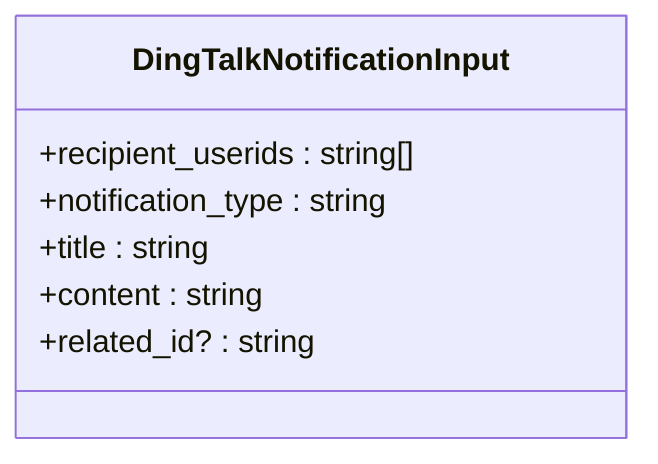
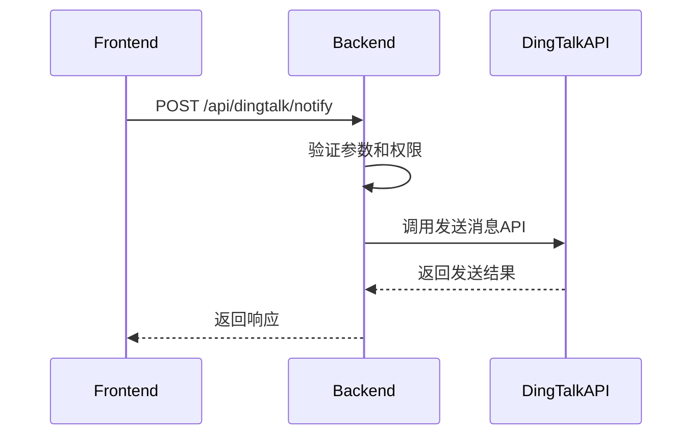
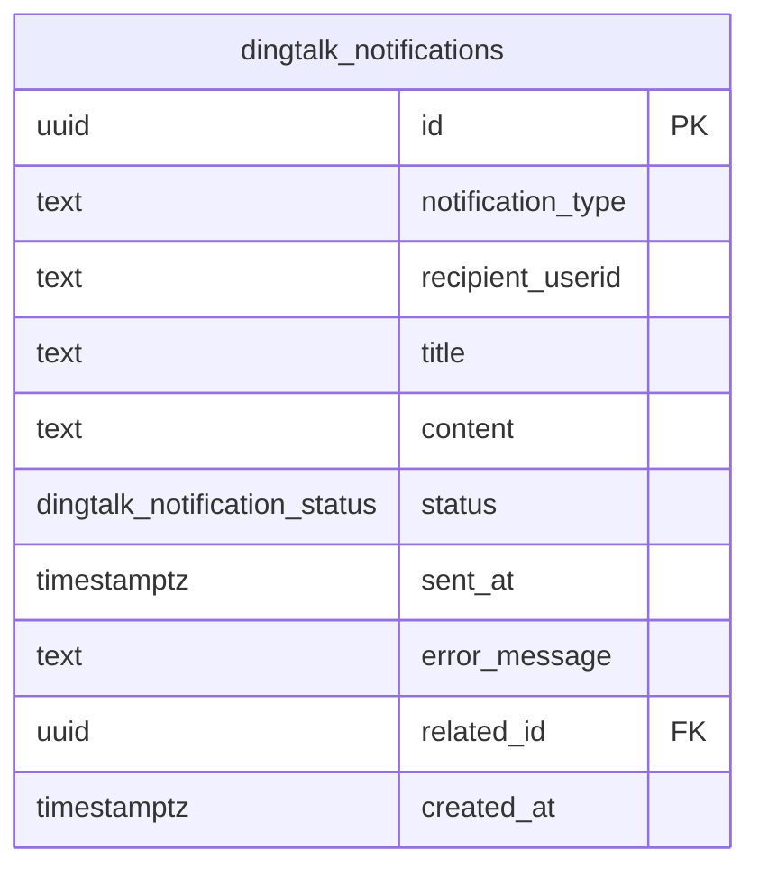

# 消息通知

<cite>
**本文档引用的文件**
- [api-server.cjs](file://server/api-server.cjs)
- [dingtalk.ts](file://src/utils/dingtalk.ts)
- [types.ts](file://src/types/types.ts)
- [api.ts](file://src/db/api.ts)
- [00009_create_dingtalk_integration_tables.sql](file://supabase/migrations/00009_create_dingtalk_integration_tables.sql)
- [dingtalk-send-notification](file://supabase/functions/dingtalk-send-notification/index.ts)
</cite>

## 目录
1. [简介](#简介)
2. [API端点](#api端点)
3. [请求参数](#请求参数)
4. [响应格式](#响应格式)
5. [后端实现](#后端实现)
6. [前端集成](#前端集成)
7. [钉钉JSAPI调用](#钉钉jsapi调用)
8. [消息模板示例](#消息模板示例)
9. [频率限制](#频率限制)
10. [错误处理策略](#错误处理策略)
11. [数据库设计](#数据库设计)

## 简介
本API文档详细说明了通过`/api/dingtalk/notify`和`/api/dingtalk/notify/batch`端点发送钉钉工作通知的技术实现。系统通过钉钉企业内部应用集成，实现了工作通知的发送功能，支持单个和批量通知发送。通知功能与钉钉通讯录同步系统集成，确保用户信息的准确性和实时性。

**Section sources**
- [api-server.cjs](file://server/api-server.cjs#L1036-L1158)
- [types.ts](file://src/types/types.ts#L462-L469)

## API端点
系统提供了两个主要的API端点用于发送钉钉工作通知：

- `POST /api/dingtalk/notify`：发送单个钉钉工作通知
- `POST /api/dingtalk/notify/batch`：批量发送钉钉通知

这些端点通过钉钉企业内部应用的API实现消息推送功能，需要先配置钉钉应用参数（AppKey、AppSecret、AgentId）才能正常使用。

```mermaid
flowchart TD
A[前端应用] --> B[/api/dingtalk/notify]
A --> C[/api/dingtalk/notify/batch]
B --> D[后端服务]
C --> D
D --> E[钉钉API]
E --> F[钉钉客户端]
```

**Diagram sources**
- [api-server.cjs](file://server/api-server.cjs#L1036-L1158)

**Section sources**
- [api-server.cjs](file://server/api-server.cjs#L1036-L1158)

## 请求参数
发送钉钉通知需要提供以下请求参数：

### 单个通知请求参数
| 参数 | 类型 | 必需 | 描述 |
|------|------|------|------|
| recipient_userids | 字符串数组 | 是 | 接收人钉钉userid列表 |
| notification_type | 字符串 | 是 | 通知类型 |
| title | 字符串 | 是 | 通知标题 |
| content | 字符串 | 是 | 通知内容 |
| related_id | 字符串 | 否 | 关联的业务ID |

### 批量通知请求参数
批量通知的参数结构与单个通知相同，但可以一次性发送给多个接收者。



**Diagram sources**
- [types.ts](file://src/types/types.ts#L462-L469)

**Section sources**
- [types.ts](file://src/types/types.ts#L462-L469)

## 响应格式
API返回标准的JSON响应格式：

```json
{
  "success": true,
  "data": {
    "message_id": "msg_123456",
    "sent_count": 1,
    "failed_count": 0
  }
}
```

或在出错时：

```json
{
  "success": false,
  "error": "错误信息"
}
```

## 后端实现
后端通过钉钉企业内部应用的API实现消息推送功能。实现流程如下：

1. 验证请求参数
2. 获取钉钉应用配置
3. 调用钉钉API发送消息
4. 记录通知发送结果

系统使用Edge Functions来处理钉钉API调用，包括`dingtalk-get-access-token`获取访问令牌和`dingtalk-send-notification`发送通知。



**Diagram sources**
- [api-server.cjs](file://server/api-server.cjs#L1036-L1158)
- [dingtalk-send-notification](file://supabase/functions/dingtalk-send-notification/index.ts)

**Section sources**
- [api-server.cjs](file://server/api-server.cjs#L1036-L1158)

## 前端集成
前端通过`api-client.ts`中的服务方法集成通知触发逻辑：

```typescript
async sendNotification(notification: DingTalkNotificationInput) {
  return authenticatedApiCall('/dingtalk/notify', {
    method: 'POST',
    body: JSON.stringify(notification),
  });
}
```

前端组件可以通过调用这些服务方法来触发通知发送，无需直接处理API调用细节。

**Section sources**
- [api.ts](file://src/db/api.ts#L1-L800)

## 钉钉JSAPI调用
在钉钉客户端内，通过`dingtalk.ts`中的JSAPI调用实现特殊处理：

```typescript
class DingTalkSDK {
  // 检测是否在钉钉环境中
  isDingTalk(): boolean {
    return dd.env.platform !== 'notInDingTalk';
  }
  
  // 显示Toast提示
  async showToast(options: { text: string }) {
    if (!this.isDingTalk()) {
      console.log('Toast:', options.text);
      return;
    }
    
    return new Promise((resolve) => {
      dd.device.notification.toast({
        text: options.text,
        duration: 2,
        icon: 'none',
      } as any).then(() => resolve()).catch(() => resolve());
    });
  }
}
```

该工具类提供了在钉钉客户端内调用各种钉钉能力的方法，包括显示Toast、Alert、Confirm等。

**Section sources**
- [dingtalk.ts](file://src/utils/dingtalk.ts#L1-L329)

## 消息模板示例
系统支持多种消息模板，以下是一些常见的使用场景：

### 预约创建通知
```json
{
  "recipient_userids": ["user123"],
  "notification_type": "appointment_created",
  "title": "新的预约申请",
  "content": "客户张三提交了新的预约申请，请及时处理。",
  "related_id": "apt_456"
}
```

### 排班确认通知
```json
```json
{
  "recipient_userids": ["user456"],
  "notification_type": "schedule_confirmed",
  "title": "排班已确认",
  "content": "您的排班已确认，请查看详细信息。",
  "related_id": "sch_789"
}
```

### 紧急通知
```json
{
  "recipient_userids": ["user789"],
  "notification_type": "urgent",
  "title": "【紧急】急单预约",
  "content": "有紧急预约需要立即处理，请尽快确认。",
  "related_id": "apt_012"
}
```

**Section sources**
- [types.ts](file://src/types/types.ts#L462-L469)

## 频率限制
系统对钉钉通知发送实施了频率限制策略：

- 单个应用每分钟最多发送600条消息
- 单个用户每天最多接收100条消息
- 批量发送时，每次最多包含100个接收者

这些限制旨在防止消息滥用，确保用户体验。

## 错误处理策略
系统实现了全面的错误处理机制：

1. **网络错误**：自动重试3次，间隔1秒
2. **认证错误**：重新获取访问令牌后重试
3. **参数错误**：返回详细的错误信息给前端
4. **发送失败**：记录失败原因并通知管理员

错误信息会记录在`dingtalk_notifications`表中，便于后续排查。

**Section sources**
- [api-server.cjs](file://server/api-server.cjs#L1036-L1158)
- [00009_create_dingtalk_integration_tables.sql](file://supabase/migrations/00009_create_dingtalk_integration_tables.sql#L112-L124)

## 数据库设计
系统使用PostgreSQL数据库存储通知记录，主要表结构如下：

```sql
CREATE TABLE IF NOT EXISTS dingtalk_notifications (
  id uuid PRIMARY KEY DEFAULT gen_random_uuid(),
  notification_type text NOT NULL,
  recipient_userid text NOT NULL,
  title text NOT NULL,
  content text NOT NULL,
  status dingtalk_notification_status DEFAULT 'pending',
  sent_at timestamptz,
  error_message text,
  related_id uuid,
  created_at timestamptz DEFAULT now()
);
```

该表记录了所有通知的发送状态和相关信息，支持后续的审计和分析。



**Diagram sources**
- [00009_create_dingtalk_integration_tables.sql](file://supabase/migrations/00009_create_dingtalk_integration_tables.sql#L112-L124)

**Section sources**
- [00009_create_dingtalk_integration_tables.sql](file://supabase/migrations/00009_create_dingtalk_integration_tables.sql#L112-L124)