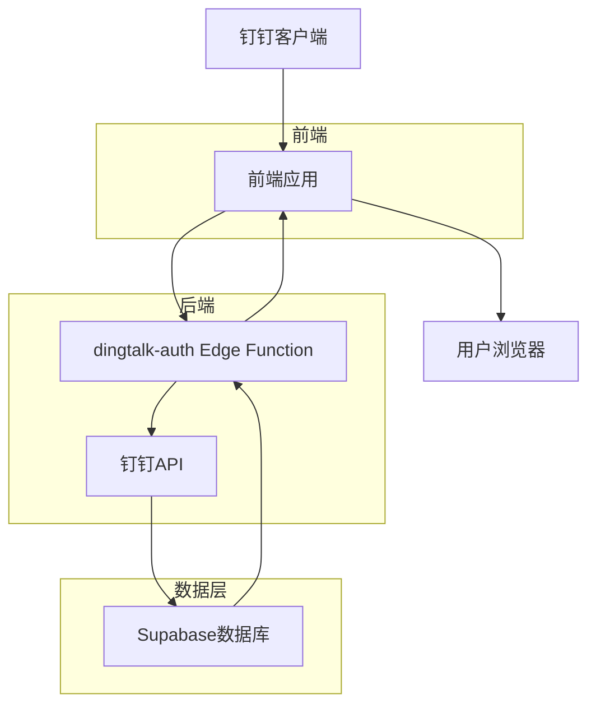
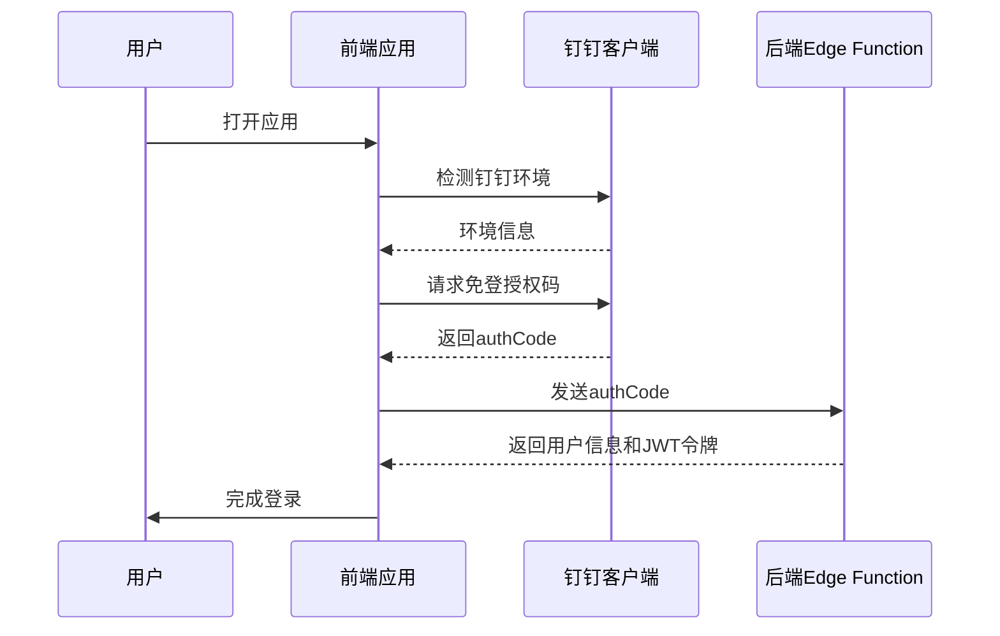
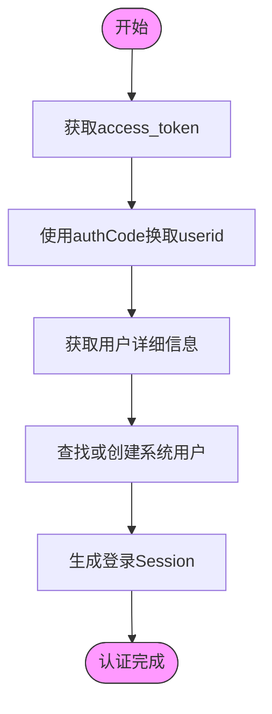
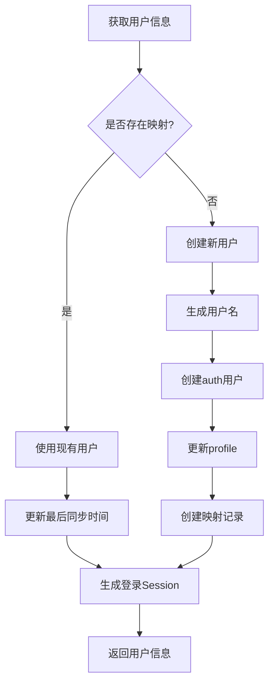
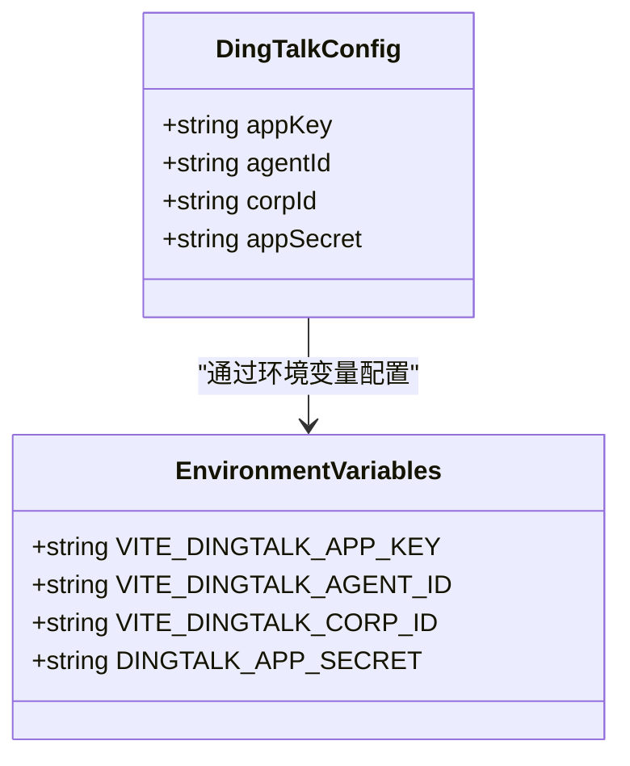
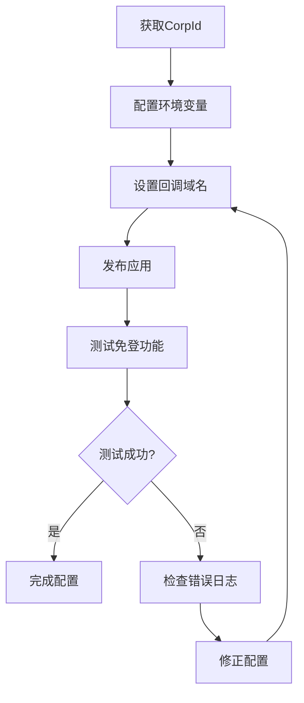
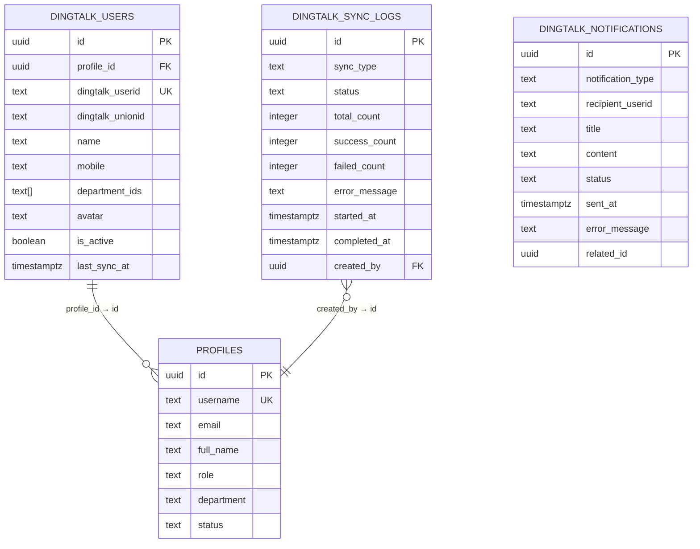

# 认证集成

<cite>
**本文档引用文件**   
- [auth.ts](file://src/services/auth.ts)
- [dingtalk.ts](file://src/utils/dingtalk.ts)
- [dingtalk-auth/index.ts](file://supabase/functions/dingtalk-auth/index.ts)
- [dingtalk-get-access-token/index.ts](file://supabase/functions/dingtalk-get-access-token/index.ts)
- [LoginPage.tsx](file://src/pages/auth/LoginPage.tsx)
- [AuthContext.tsx](file://src/contexts/AuthContext.tsx)
- [types.ts](file://src/types/types.ts)
- [00009_create_dingtalk_integration_tables.sql](file://supabase/migrations/00009_create_dingtalk_integration_tables.sql)
- [00010_create_dingtalk_sync_tables.sql](file://supabase/migrations/00010_create_dingtalk_sync_tables.sql)
</cite>

## 目录
1. [简介](#简介)
2. [钉钉认证架构](#钉钉认证架构)
3. [前端实现机制](#前端实现机制)
4. [后端Edge Function实现](#后端edge-function实现)
5. [账户绑定流程](#账户绑定流程)
6. [配置项说明](#配置项说明)
7. [配置验证步骤](#配置验证步骤)
8. [常见问题解决方案](#常见问题解决方案)
9. [数据库设计](#数据库设计)
10. [安全策略](#安全策略)

## 简介

钉钉认证集成是Bio-Appointment系统的重要组成部分，实现了钉钉免登认证和扫码登录功能。本系统通过钉钉JSAPI获取免登授权码，后端Edge Function通过钉钉API换取用户信息并完成JWT令牌签发。首次登录时，系统会自动将钉钉UserID与本地用户账户关联，实现无缝的单点登录体验。

系统采用前后端分离架构，前端通过钉钉JSAPI与钉钉客户端交互，后端通过Supabase Edge Function与钉钉API通信。整个认证流程安全可靠，符合企业级应用的安全要求。

**Section sources**
- [auth.ts](file://src/services/auth.ts#L1-L341)
- [dingtalk.ts](file://src/utils/dingtalk.ts#L1-L329)
- [dingtalk-auth/index.ts](file://supabase/functions/dingtalk-auth/index.ts#L1-L248)

## 钉钉认证架构

钉钉认证系统采用分层架构设计，包含前端、后端和数据库三个主要层次。前端负责与钉钉客户端交互，获取免登授权码；后端Edge Function负责与钉钉API通信，获取用户信息；数据库负责存储用户映射关系和认证数据。

整个认证流程遵循OAuth 2.0协议的安全原则，通过access_token机制确保API调用的安全性。系统还实现了token缓存机制，减少对钉钉API的频繁调用，提高系统性能。

**Diagram sources **
- [dingtalk-auth/index.ts](file://supabase/functions/dingtalk-auth/index.ts#L1-L248)
- [dingtalk-get-access-token/index.ts](file://supabase/functions/dingtalk-get-access-token/index.ts#L1-L121)

## 前端实现机制

前端通过钉钉JSAPI（dingTalkSDK）实现与钉钉客户端的交互。`dingtalk.ts`文件中的`DingTalkSDK`类封装了钉钉JSAPI的常用功能，包括环境检测、免登授权码获取、导航栏控制等。

在钉钉环境中，系统会自动检测并初始化钉钉JSAPI。通过`getAuthCode()`方法获取免登授权码，该方法调用钉钉的`requestAuthCode`接口，传入企业CorpId作为参数。获取到授权码后，前端将其发送到后端Edge Function进行验证。

**Diagram sources **
- [dingtalk.ts](file://src/utils/dingtalk.ts#L1-L329)
- [LoginPage.tsx](file://src/pages/auth/LoginPage.tsx#L1-L158)
- [AuthContext.tsx](file://src/contexts/AuthContext.tsx#L1-L308)

## 后端Edge Function实现

后端通过Supabase Edge Function实现钉钉认证逻辑。`dingtalk-auth/index.ts`是核心认证函数，处理从前端传来的authCode，通过钉钉API换取用户信息，并生成JWT令牌。

认证流程分为五个步骤：首先获取access_token，然后使用authCode换取userid，接着获取用户详细信息，查找或创建系统用户，最后生成登录Session。`dingtalk-get-access-token/index.ts`函数负责获取和缓存钉钉access_token，有效期为2小时，提前5分钟过期，避免token失效问题。

**Diagram sources **
- [dingtalk-auth/index.ts](file://supabase/functions/dingtalk-auth/index.ts#L1-L248)
- [dingtalk-get-access-token/index.ts](file://supabase/functions/dingtalk-get-access-token/index.ts#L1-L121)

## 账户绑定流程

首次登录时，系统会自动执行账户绑定流程。当后端通过钉钉API获取到用户信息后，会查询`dingtalk_users`表，检查是否存在该钉钉userid的映射记录。

如果不存在映射记录，系统会创建新用户：首先生成唯一的用户名（格式为dt_userid），然后创建auth用户并设置模拟邮箱，更新用户profile信息，最后创建钉钉用户映射记录。用户默认角色为"sales"，后续可由管理员调整。

如果已存在映射记录，系统会直接使用现有用户信息，并更新最后同步时间。这种设计确保了用户账户的唯一性和一致性，避免了重复创建用户的问题。

**Diagram sources **
- [dingtalk-auth/index.ts](file://supabase/functions/dingtalk-auth/index.ts#L125-L201)
- [00009_create_dingtalk_integration_tables.sql](file://supabase/migrations/00009_create_dingtalk_integration_tables.sql#L68-L82)

## 配置项说明

系统使用多个配置项来确保钉钉认证的正常运行。AppKey和AppSecret是钉钉应用的身份凭证，其中AppKey可用于前端，而AppSecret必须严格保密，仅在后端使用。

CorpId是企业钉钉的唯一标识，在钉钉开放平台的企业信息中可以找到。AgentId是钉钉应用的唯一标识，用于区分同一企业内的不同应用。这些配置项通过环境变量存储，确保了配置的安全性。

**Diagram sources **
- [.env](file://.env#L8-L11)
- [types.ts](file://src/types/types.ts#L472-L476)
- [DINGTALK_CONFIG_COMPLETE.md](file://DINGTALK_CONFIG_COMPLETE.md#L1-L210)

## 配置验证步骤

配置验证是确保钉钉认证正常工作的关键步骤。首先需要在钉钉开放平台完成应用配置，包括设置应用首页地址、回调域名和重定向URI。

验证步骤包括：检查CorpId是否正确配置，确认回调域名与实际部署地址匹配，测试免登功能是否正常工作。可以通过在钉钉客户端中打开应用来测试，系统应能自动完成登录流程。

**Diagram sources **
- [DINGTALK_QUICK_START.md](file://DINGTALK_QUICK_START.md#L1-L105)
- [DINGTALK_SETUP_GUIDE.md](file://DINGTALK_SETUP_GUIDE.md#L1-L248)
- [.env](file://.env#L8-L11)

## 常见问题解决方案

常见问题包括回调域名错误、权限不足、免登失败等。回调域名错误通常是由于域名格式不正确或未包含在钉钉开放平台的白名单中。解决方案是检查域名格式，确保不包含http://或https://前缀。

权限不足问题可能是由于应用未申请必要的API权限，或用户不在应用的可见范围内。解决方案是检查应用权限配置，确保已授予"身份验证"和"通讯录管理"权限。

免登失败可能由多种原因引起，包括CorpId配置错误、应用未发布、网络问题等。建议按照配置检查清单逐一排查，查看Edge Function日志获取详细错误信息。

**Section sources**
- [DINGTALK_CONFIG_COMPLETE.md](file://DINGTALK_CONFIG_COMPLETE.md#L130-L150)
- [DINGTALK_SETUP_GUIDE.md](file://DINGTALK_SETUP_GUIDE.md#L190-L206)
- [DINGTALK_IMPLEMENTATION_STATUS.md](file://DINGTALK_IMPLEMENTATION_STATUS.md#L190-L209)

## 数据库设计

系统设计了专门的数据库表来支持钉钉集成功能。`dingtalk_users`表存储钉钉用户与系统用户的映射关系，包含钉钉userid、unionid、姓名、手机号等信息。

`dingtalk_sync_logs`表记录通讯录同步操作日志，包括同步类型、状态、数量统计等。`dingtalk_notifications`表记录发送到钉钉的通知消息。所有表都启用了RLS（行级安全）策略，确保数据访问的安全性。

**Diagram sources **
- [00009_create_dingtalk_integration_tables.sql](file://supabase/migrations/00009_create_dingtalk_integration_tables.sql#L68-L124)
- [00010_create_dingtalk_sync_tables.sql](file://supabase/migrations/00010_create_dingtalk_sync_tables.sql#L67-L99)

## 安全策略

系统实施了多层次的安全策略。首先，AppSecret等敏感信息通过Supabase Secrets存储，确保不会暴露在代码中。其次，所有Edge Function都进行了身份验证，只有认证用户才能调用。

RLS策略确保了数据访问的安全性：超级管理员可以查看所有数据，普通用户只能查看自己的钉钉映射信息。系统还实现了JWT令牌的自动刷新机制，在令牌即将过期时自动获取新令牌，提高用户体验。

**Section sources**
- [dingtalk-auth/index.ts](file://supabase/functions/dingtalk-auth/index.ts#L48-L51)
- [00009_create_dingtalk_integration_tables.sql](file://supabase/migrations/00009_create_dingtalk_integration_tables.sql#L157-L204)
- [auth.ts](file://src/services/auth.ts#L5-L9)