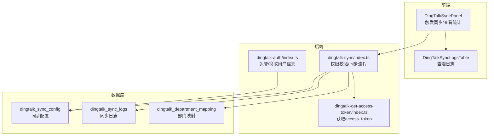
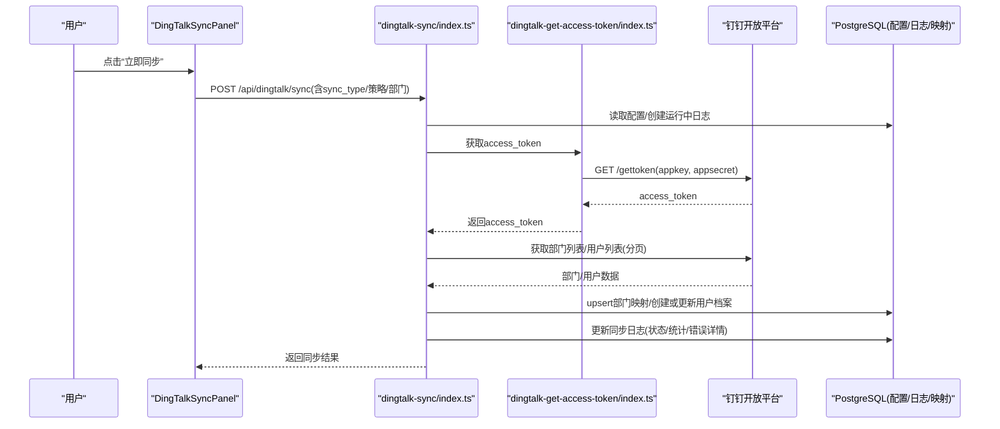
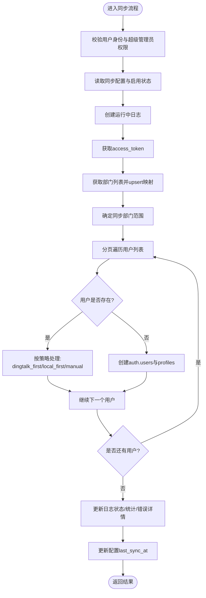
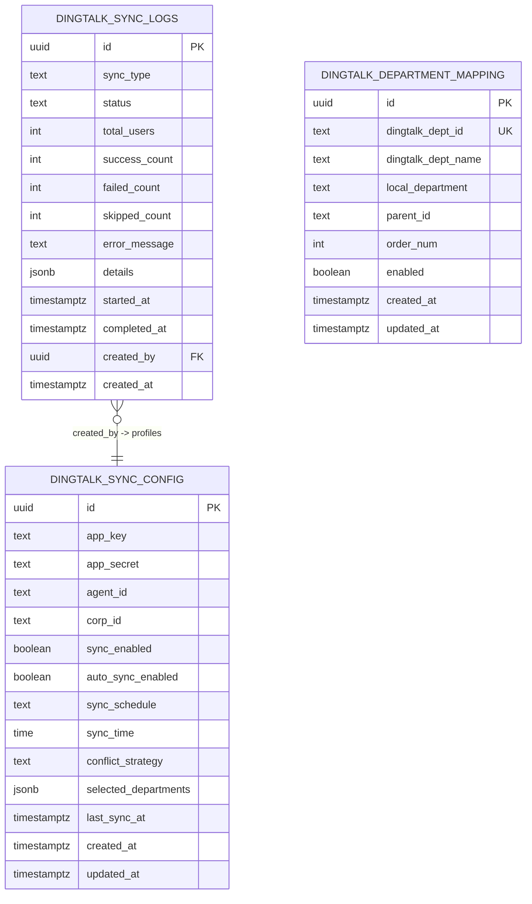
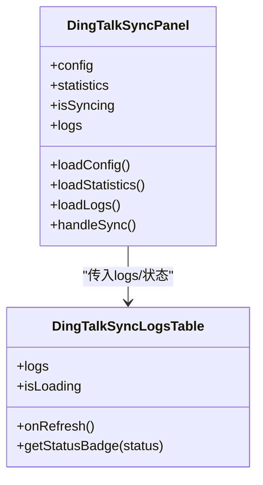
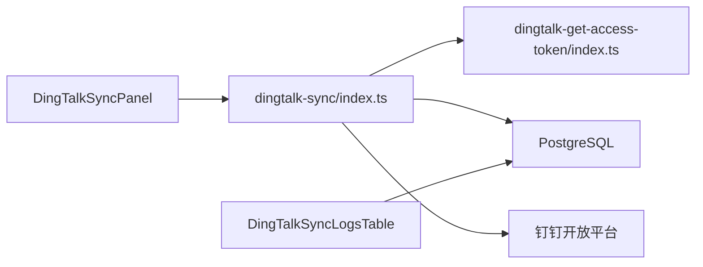

# 通讯录同步

<cite>
**本文引用的文件**
- [supabase/functions/dingtalk-sync/index.ts](file://supabase/functions/dingtalk-sync/index.ts)
- [supabase/functions/dingtalk-get-access-token/index.ts](file://supabase/functions/dingtalk-get-access-token/index.ts)
- [supabase/functions/dingtalk-auth/index.ts](file://supabase/functions/dingtalk-auth/index.ts)
- [supabase/migrations/00010_create_dingtalk_sync_tables.sql](file://supabase/migrations/00010_create_dingtalk_sync_tables.sql)
- [src/components/dingtalk/DingTalkSyncPanel.tsx](file://src/components/dingtalk/DingTalkSyncPanel.tsx)
- [src/components/dingtalk/DingTalkSyncLogsTable.tsx](file://src/components/dingtalk/DingTalkSyncLogsTable.tsx)
- [src/utils/dingtalk.ts](file://src/utils/dingtalk.ts)
- [DINGTALK_SYNC_IMPLEMENTATION.md](file://DINGTALK_SYNC_IMPLEMENTATION.md)
- [DINGTALK_CONFIG_COMPLETE.md](file://DINGTALK_CONFIG_COMPLETE.md)
</cite>

## 目录
1. [简介](#简介)
2. [项目结构](#项目结构)
3. [核心组件](#核心组件)
4. [架构总览](#架构总览)
5. [详细组件分析](#详细组件分析)
6. [依赖关系分析](#依赖关系分析)
7. [性能考量](#性能考量)
8. [故障排查指南](#故障排查指南)
9. [结论](#结论)
10. [附录](#附录)

## 简介
本文档围绕“钉钉通讯录同步”功能，系统性阐述从触发同步到最终落库的完整流程，涵盖权限校验、access_token 获取、部门与用户数据同步、三种冲突处理策略、同步日志结构与前端展示、事务与日志记录的实现要点、常见失败场景排查以及自动同步的配置与最佳实践。目标读者既包括一线工程师，也包括产品与运营人员，帮助大家快速理解并稳定运行该功能。

## 项目结构
该功能由三部分组成：
- 后端 Edge Function：负责权限校验、调用钉钉 API、同步部门与用户、记录同步日志与配置更新。
- 前端组件：提供“钉钉同步面板”，展示统计与日志，触发同步。
- 数据库表：存储同步配置、同步日志、部门映射等。

图表来源
- [supabase/functions/dingtalk-sync/index.ts](file://supabase/functions/dingtalk-sync/index.ts#L1-L384)
- [supabase/functions/dingtalk-get-access-token/index.ts](file://supabase/functions/dingtalk-get-access-token/index.ts#L1-L121)
- [supabase/functions/dingtalk-auth/index.ts](file://supabase/functions/dingtalk-auth/index.ts#L1-L248)
- [supabase/migrations/00010_create_dingtalk_sync_tables.sql](file://supabase/migrations/00010_create_dingtalk_sync_tables.sql#L1-L189)
- [src/components/dingtalk/DingTalkSyncPanel.tsx](file://src/components/dingtalk/DingTalkSyncPanel.tsx#L1-L237)
- [src/components/dingtalk/DingTalkSyncLogsTable.tsx](file://src/components/dingtalk/DingTalkSyncLogsTable.tsx#L1-L91)

章节来源
- [supabase/functions/dingtalk-sync/index.ts](file://supabase/functions/dingtalk-sync/index.ts#L1-L384)
- [supabase/migrations/00010_create_dingtalk_sync_tables.sql](file://supabase/migrations/00010_create_dingtalk_sync_tables.sql#L1-L189)
- [src/components/dingtalk/DingTalkSyncPanel.tsx](file://src/components/dingtalk/DingTalkSyncPanel.tsx#L1-L237)

## 核心组件
- 后端同步函数（POST /api/dingtalk/sync）
  - 权限校验：仅超级管理员可执行。
  - 配置读取：启用状态、冲突策略、部门范围等。
  - access_token 获取：通过独立 Edge Function 获取并缓存。
  - 部门同步：拉取子部门树并写入部门映射表。
  - 用户同步：分页拉取用户列表，逐条处理冲突策略，创建或更新本地用户档案。
  - 日志记录：创建运行中日志，结束后更新状态与统计。
- 前端同步面板
  - 展示统计卡片（总同步次数、成功次数、失败次数、已同步用户）。
  - 触发同步（手动同步）。
  - 查看同步日志表格。
- 数据库表
  - dingtalk_sync_config：同步配置与策略。
  - dingtalk_sync_logs：每次同步的统计与错误详情。
  - dingtalk_department_mapping：钉钉部门到本地映射。

章节来源
- [supabase/functions/dingtalk-sync/index.ts](file://supabase/functions/dingtalk-sync/index.ts#L1-L384)
- [supabase/migrations/00010_create_dingtalk_sync_tables.sql](file://supabase/migrations/00010_create_dingtalk_sync_tables.sql#L1-L189)
- [src/components/dingtalk/DingTalkSyncPanel.tsx](file://src/components/dingtalk/DingTalkSyncPanel.tsx#L1-L237)
- [src/components/dingtalk/DingTalkSyncLogsTable.tsx](file://src/components/dingtalk/DingTalkSyncLogsTable.tsx#L1-L91)

## 架构总览
下图展示了从前端触发到后端执行、再到数据库落库的整体流程。

图表来源
- [supabase/functions/dingtalk-sync/index.ts](file://supabase/functions/dingtalk-sync/index.ts#L1-L384)
- [supabase/functions/dingtalk-get-access-token/index.ts](file://supabase/functions/dingtalk-get-access-token/index.ts#L1-L121)

## 详细组件分析

### 后端同步函数（POST /api/dingtalk/sync）
- 权限验证
  - 通过 Supabase auth.getUser 校验 Bearer Token。
  - 读取 profiles 并校验角色为 super_admin。
- 配置读取与启用检查
  - 读取 dingtalk_sync_config，校验 sync_enabled。
- 创建同步日志
  - 插入 dingtalk_sync_logs，初始状态为 running。
- access_token 获取
  - 调用 dingtalk-get-access-token Edge Function 获取 token。
- 部门同步
  - 调用钉钉部门列表接口，遍历写入 dingtalk_department_mapping。
- 用户同步
  - 选择部门范围（若未指定则全量）。
  - 分页拉取用户列表，逐条处理：
    - 若用户已存在：按冲突策略决定更新或跳过。
    - 若用户不存在：创建 auth.users 与 profiles。
- 更新日志与配置
  - 结束后更新日志状态、统计与错误详情。
  - 更新配置 last_sync_at。

图表来源
- [supabase/functions/dingtalk-sync/index.ts](file://supabase/functions/dingtalk-sync/index.ts#L1-L384)

章节来源
- [supabase/functions/dingtalk-sync/index.ts](file://supabase/functions/dingtalk-sync/index.ts#L1-L384)

### 冲突处理策略
- dingtalk_first
  - 已存在：以钉钉数据为准更新本地。
  - 不存在：创建新用户。
  - 适用：钉钉为主数据源。
- local_first
  - 已存在：保留本地数据，跳过更新。
  - 不存在：创建新用户。
  - 适用：本地数据优先。
- manual
  - 已存在：跳过，记录冲突，等待人工处理。
  - 不存在：创建新用户。
  - 适用：需要人工审核。

章节来源
- [supabase/functions/dingtalk-sync/index.ts](file://supabase/functions/dingtalk-sync/index.ts#L227-L301)

### 同步日志结构与用途
- 字段概览
  - id、sync_type、status、total_users、success_count、failed_count、skipped_count、error_message、details、started_at、completed_at、created_by、created_at。
- 用途
  - 记录每次同步的统计与错误详情，便于回溯与审计。
  - 提供前端“同步日志”表格展示，支持刷新与状态徽章。
- 统计接口
  - 提供 get_sync_statistics RPC，聚合近30天的统计。

图表来源
- [supabase/migrations/00010_create_dingtalk_sync_tables.sql](file://supabase/migrations/00010_create_dingtalk_sync_tables.sql#L1-L189)

章节来源
- [supabase/migrations/00010_create_dingtalk_sync_tables.sql](file://supabase/migrations/00010_create_dingtalk_sync_tables.sql#L1-L189)

### 前端组件（DingTalkSyncPanel 与 DingTalkSyncLogsTable）
- DingTalkSyncPanel
  - 加载配置、统计与日志。
  - 触发同步（手动），根据结果更新统计与日志。
  - 状态徽章：成功/失败/进行中/部分成功/待处理。
- DingTalkSyncLogsTable
  - 展示最近同步记录，支持刷新。
  - 展示同步类型、状态、总数/成功/失败/跳过、操作人等。

图表来源
- [src/components/dingtalk/DingTalkSyncPanel.tsx](file://src/components/dingtalk/DingTalkSyncPanel.tsx#L1-L237)
- [src/components/dingtalk/DingTalkSyncLogsTable.tsx](file://src/components/dingtalk/DingTalkSyncLogsTable.tsx#L1-L91)

章节来源
- [src/components/dingtalk/DingTalkSyncPanel.tsx](file://src/components/dingtalk/DingTalkSyncPanel.tsx#L1-L237)
- [src/components/dingtalk/DingTalkSyncLogsTable.tsx](file://src/components/dingtalk/DingTalkSyncLogsTable.tsx#L1-L91)

### Edge Function：获取 access_token
- 功能：从钉钉开放平台获取 access_token，并做简单内存缓存（提前过期策略）。
- 调用方：同步函数通过调用该 Edge Function 获取 token。

章节来源
- [supabase/functions/dingtalk-get-access-token/index.ts](file://supabase/functions/dingtalk-get-access-token/index.ts#L1-L121)

### Edge Function：免登认证（与同步相关）
- 功能：使用 auth_code 换取钉钉 userid，获取用户信息，查找或创建系统用户，生成登录凭证。
- 与同步的关系：用于钉钉免登场景，保障用户身份可信；同步流程中用户创建基于钉钉数据。

章节来源
- [supabase/functions/dingtalk-auth/index.ts](file://supabase/functions/dingtalk-auth/index.ts#L1-L248)

## 依赖关系分析
- 同步函数依赖
  - 钉钉开放平台 API：获取 token、部门列表、用户列表。
  - Supabase 数据库：读取配置、写入部门映射、创建/更新用户档案、记录同步日志。
  - Edge Function：dingtalk-get-access-token。
- 前端依赖
  - 通过 API 调用后端同步端点，展示统计与日志。
- 安全与权限
  - 仅超级管理员可触发同步。
  - RLS 策略限制日志与配置访问。

图表来源
- [supabase/functions/dingtalk-sync/index.ts](file://supabase/functions/dingtalk-sync/index.ts#L1-L384)
- [supabase/functions/dingtalk-get-access-token/index.ts](file://supabase/functions/dingtalk-get-access-token/index.ts#L1-L121)
- [src/components/dingtalk/DingTalkSyncPanel.tsx](file://src/components/dingtalk/DingTalkSyncPanel.tsx#L1-L237)
- [src/components/dingtalk/DingTalkSyncLogsTable.tsx](file://src/components/dingtalk/DingTalkSyncLogsTable.tsx#L1-L91)

章节来源
- [supabase/functions/dingtalk-sync/index.ts](file://supabase/functions/dingtalk-sync/index.ts#L1-L384)
- [supabase/migrations/00010_create_dingtalk_sync_tables.sql](file://supabase/migrations/00010_create_dingtalk_sync_tables.sql#L1-L189)

## 性能考量
- 分页拉取用户：避免一次性请求过多数据，降低超时风险。
- access_token 缓存：减少重复获取 token 的开销。
- upsert 部门映射：批量写入，减少多次往返。
- 日志落库：结束时一次性更新统计与状态，避免频繁写入。
- 并发与限流：钉钉 API 有频率限制，建议在大规模同步时控制并发与速率。

[本节为通用指导，无需列出具体文件来源]

## 故障排查指南
- AppSecret 错误
  - 现象：获取 token 失败或同步失败。
  - 排查：确认钉钉应用信息（AppKey/AppSecret/AgentId/CorpId）正确，Edge Function 与数据库配置一致。
- 网络问题
  - 现象：调用钉钉 API 超时或返回错误。
  - 排查：检查服务器网络可达性、防火墙、DNS 解析；必要时在 Edge Function 日志中查看错误码。
- 权限不足
  - 现象：获取用户列表失败或无权限。
  - 排查：在钉钉开放平台检查应用权限（通讯录读取权限），确认用户在应用可见范围内。
- 同步失败
  - 现象：部分用户失败。
  - 排查：查看同步日志 details 字段中的 failed_details，定位失败用户与错误信息。
- 前端无法触发
  - 现象：立即同步按钮禁用。
  - 排查：确认配置已启用且已保存；检查前端控制台错误与后端日志。

章节来源
- [DINGTALK_SYNC_IMPLEMENTATION.md](file://DINGTALK_SYNC_IMPLEMENTATION.md#L148-L241)
- [supabase/functions/dingtalk-sync/index.ts](file://supabase/functions/dingtalk-sync/index.ts#L126-L383)

## 结论
该同步功能通过严格的权限控制、清晰的日志记录与灵活的冲突策略，实现了从钉钉到本地系统的稳定数据同步。配合前端可视化面板与统计接口，能够有效支撑日常运维与审计需求。建议在生产环境采用“manual”策略先行测试，确认无误后再切换为“dingtalk_first”以保证主数据一致性。

[本节为总结性内容，无需列出具体文件来源]

## 附录

### 自动同步配置与最佳实践
- 配置项
  - auto_sync_enabled：是否启用自动同步。
  - sync_schedule：同步周期（如 daily/hourly）。
  - sync_time：自动同步的具体时间。
  - conflict_strategy：冲突策略。
  - selected_departments：选择性同步的部门集合。
- 最佳实践
  - 首次同步建议使用 manual 策略，核对数据后再切换为 dingtalk_first。
  - 大规模同步时开启分页与限速，避免触发钉钉 API 限流。
  - 定期检查 access_token 缓存与过期时间，确保稳定性。
  - 为新同步用户设置强密码策略与首次登录修改密码提醒（建议在后续迭代中实现）。

章节来源
- [supabase/migrations/00010_create_dingtalk_sync_tables.sql](file://supabase/migrations/00010_create_dingtalk_sync_tables.sql#L66-L82)
- [DINGTALK_SYNC_IMPLEMENTATION.md](file://DINGTALK_SYNC_IMPLEMENTATION.md#L198-L241)

### 钉钉免登与 JSAPI 工具
- 钉钉 JSAPI 工具类：提供在钉钉环境中调用扫码、导航、位置、分享等能力的封装。
- 免登流程：在钉钉客户端中获取 auth_code，后端调用 dingtalk-auth 获取用户信息并创建/关联系统用户。

章节来源
- [src/utils/dingtalk.ts](file://src/utils/dingtalk.ts#L1-L329)
- [supabase/functions/dingtalk-auth/index.ts](file://supabase/functions/dingtalk-auth/index.ts#L1-L248)
- [DINGTALK_CONFIG_COMPLETE.md](file://DINGTALK_CONFIG_COMPLETE.md#L1-L210)