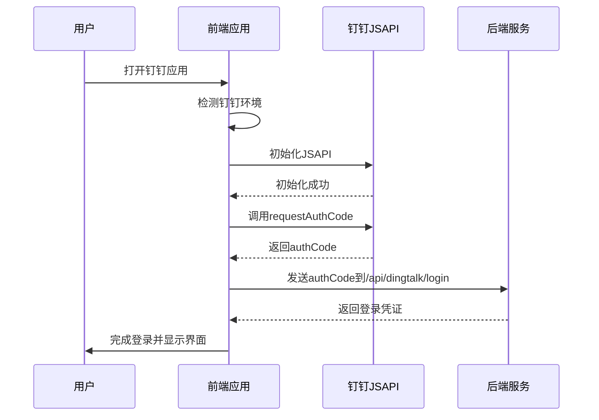
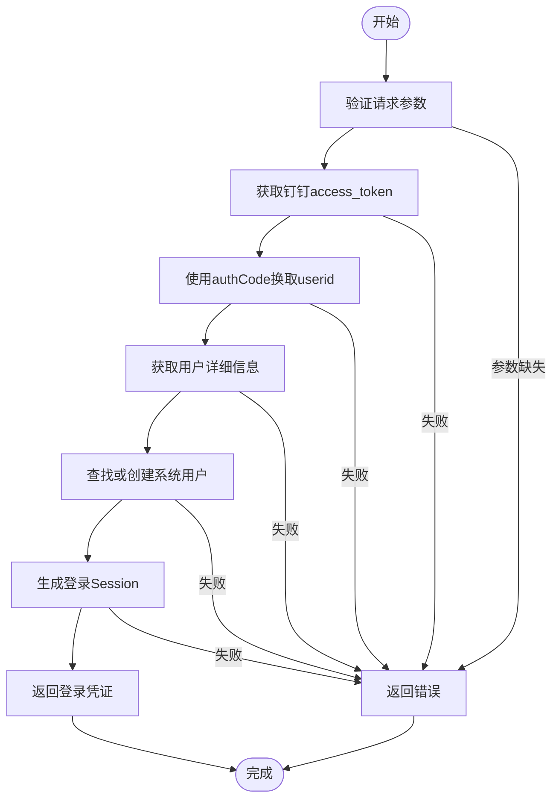
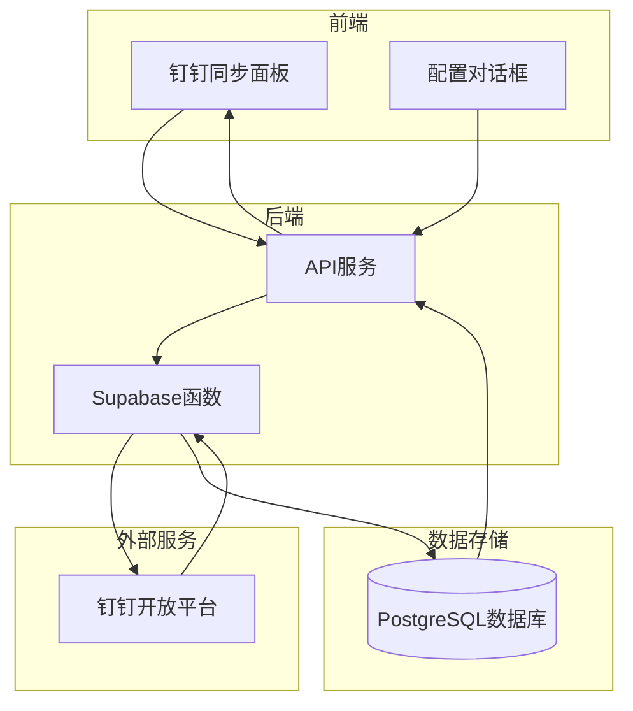
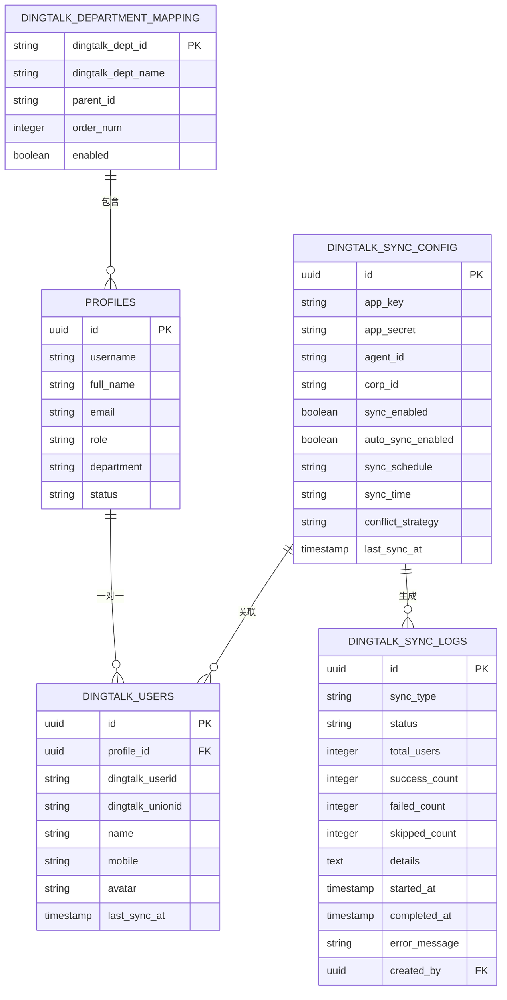
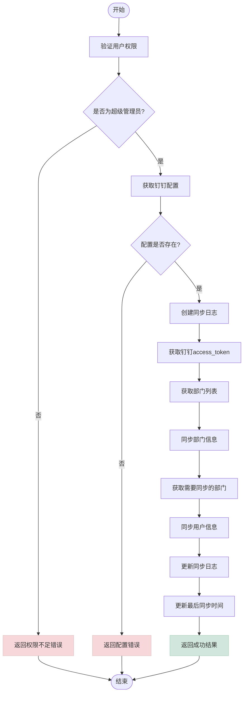
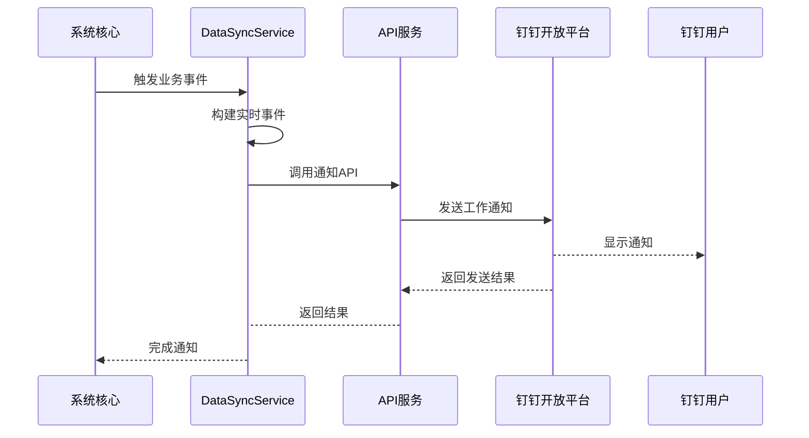
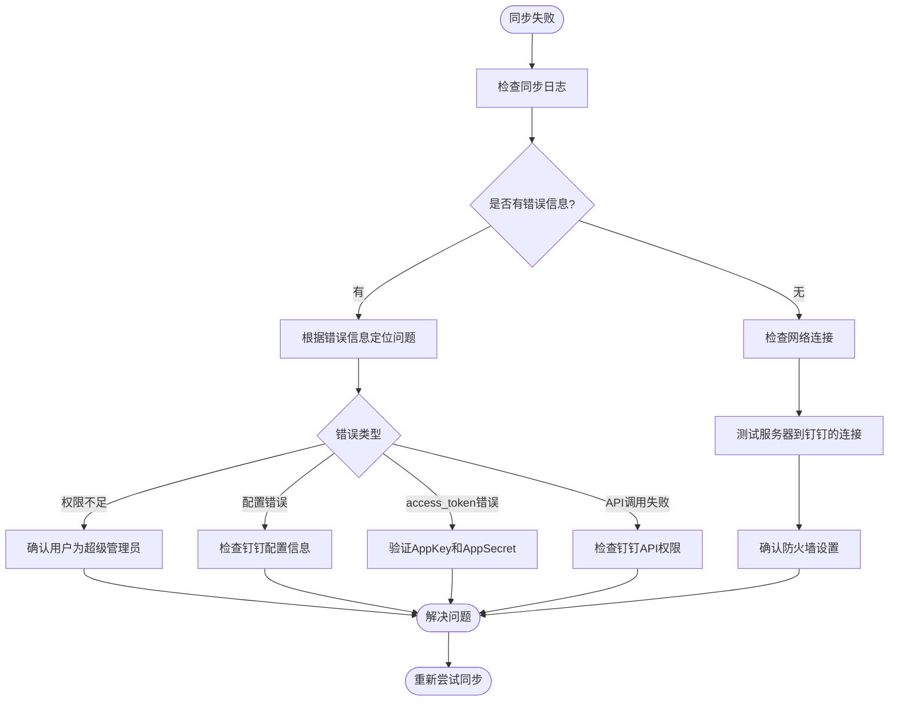
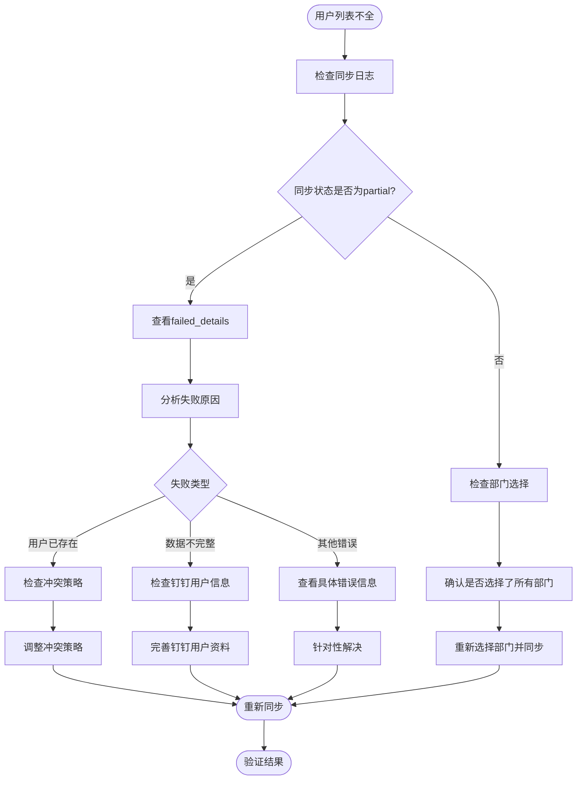

# 钉钉集成

<cite>
**本文档引用的文件**  
- [dingtalk-sync/index.ts](file://supabase/functions/dingtalk-sync/index.ts)
- [dingtalk-auth/index.ts](file://supabase/functions/dingtalk-auth/index.ts)
- [dingtalk-get-access-token/index.ts](file://supabase/functions/dingtalk-get-access-token/index.ts)
- [dataSync.ts](file://src/services/dataSync.ts)
- [dingtalk.ts](file://src/utils/dingtalk.ts)
- [DingTalkConfigDialog.tsx](file://src/components/dingtalk/DingTalkConfigDialog.tsx)
- [DingTalkSyncPanel.tsx](file://src/components/dingtalk/DingTalkSyncPanel.tsx)
- [DingTalkSyncLogsTable.tsx](file://src/components/dingtalk/DingTalkSyncLogsTable.tsx)
- [DINGTALK_SETUP_GUIDE.md](file://DINGTALK_SETUP_GUIDE.md)
- [DINGTALK_QUICK_START.md](file://DINGTALK_QUICK_START.md)
- [DINGTALK_SYNC_IMPLEMENTATION.md](file://DINGTALK_SYNC_IMPLEMENTATION.md)
</cite>

## 目录
1. [简介](#简介)
2. [免登认证流程](#免登认证流程)
3. [钉钉通讯录同步](#钉钉通讯录同步)
4. [工作通知发送](#工作通知发送)
5. [故障排查指南](#故障排查指南)
6. [配置参考](#配置参考)
7. [总结](#总结)

## 简介

本专项文档详细阐述了系统与钉钉开放平台的双向集成方案。文档深入说明了免登认证流程的实现细节，包括前端二维码生成和后端授权码验证。同时，详细描述了通过Supabase函数定时同步钉钉通讯录的技术架构和数据映射逻辑，以及通过API端点发送工作通知的机制。结合dataSync.ts和dingtalk.ts中的代码，提供了故障排查指南，并引用了钉钉配置指南文档。该文档是确保企业用户无缝接入的关键。

**文档来源**
- [DINGTALK_SETUP_GUIDE.md](file://DINGTALK_SETUP_GUIDE.md)
- [DINGTALK_QUICK_START.md](file://DINGTALK_QUICK_START.md)
- [DINGTALK_SYNC_IMPLEMENTATION.md](file://DINGTALK_SYNC_IMPLEMENTATION.md)

## 免登认证流程

系统实现了基于钉钉JSAPI的免登认证流程，通过`/api/dingtalk/login`端点完成用户身份验证。该流程分为前端和后端两个部分协同工作。

### 前端实现

前端通过`src/utils/dingtalk.ts`中的`DingTalkSDK`类实现免登功能。当用户在钉钉客户端中打开应用时，系统首先检测是否处于钉钉环境，然后初始化钉钉JSAPI。



**图表来源**
- [dingtalk.ts](file://src/utils/dingtalk.ts#L9-L77)
- [dingtalk-auth/index.ts](file://supabase/functions/dingtalk-auth/index.ts)

**本节来源**
- [dingtalk.ts](file://src/utils/dingtalk.ts#L9-L77)
- [dingtalk-auth/index.ts](file://supabase/functions/dingtalk-auth/index.ts)

### 后端验证

后端通过`supabase/functions/dingtalk-auth/index.ts`中的Edge Function处理免登认证请求。流程包括获取access_token、使用authCode换取userid、获取用户详细信息、查找或创建系统用户，最后生成登录凭证。



**图表来源**
- [dingtalk-auth/index.ts](file://supabase/functions/dingtalk-auth/index.ts)

**本节来源**
- [dingtalk-auth/index.ts](file://supabase/functions/dingtalk-auth/index.ts)

## 钉钉通讯录同步

系统通过Supabase函数`dingtalk-sync`实现定时同步钉钉通讯录的功能，包括部门和联系人信息。该功能由超级管理员触发，支持手动和自动两种模式。

### 技术架构

通讯录同步功能采用分层架构设计，从前端界面到后端函数再到数据库存储，形成完整的数据同步链路。



**图表来源**
- [DingTalkSyncPanel.tsx](file://src/components/dingtalk/DingTalkSyncPanel.tsx)
- [dingtalk-sync/index.ts](file://supabase/functions/dingtalk-sync/index.ts)
- [database.ts](file://src/db/database.ts)

**本节来源**
- [DingTalkSyncPanel.tsx](file://src/components/dingtalk/DingTalkSyncPanel.tsx)
- [dingtalk-sync/index.ts](file://supabase/functions/dingtalk-sync/index.ts)

### 数据映射逻辑

同步过程中的数据映射遵循特定的规则，将钉钉的部门和用户信息映射到本地数据库的相应字段。



**图表来源**
- [dingtalk-sync/index.ts](file://supabase/functions/dingtalk-sync/index.ts)
- [00009_create_dingtalk_integration_tables.sql](file://supabase/migrations/00009_create_dingtalk_integration_tables.sql)
- [00010_create_dingtalk_sync_tables.sql](file://supabase/migrations/00010_create_dingtalk_sync_tables.sql)

**本节来源**
- [dingtalk-sync/index.ts](file://supabase/functions/dingtalk-sync/index.ts)

### 同步流程

同步流程包含多个步骤，从权限验证到最终结果记录，确保数据同步的完整性和可靠性。



**图表来源**
- [dingtalk-sync/index.ts](file://supabase/functions/dingtalk-sync/index.ts)

**本节来源**
- [dingtalk-sync/index.ts](file://supabase/functions/dingtalk-sync/index.ts)

## 工作通知发送

系统通过`/api/dingtalk/notify`端点实现向钉钉用户发送工作通知的功能。该功能允许系统在关键业务事件发生时，及时通知相关人员。

### 通知机制

工作通知的发送机制与系统的实时事件系统集成，确保消息的及时传递。



**图表来源**
- [dataSync.ts](file://src/services/dataSync.ts)
- [dingtalk-sync/index.ts](file://supabase/functions/dingtalk-sync/index.ts)

**本节来源**
- [dataSync.ts](file://src/services/dataSync.ts)

## 故障排查指南

本节结合dataSync.ts和dingtalk.ts中的代码，提供常见的故障排查方法，帮助管理员解决同步失败、用户列表不全等问题。

### 同步失败排查

当钉钉通讯录同步失败时，应按照以下步骤进行排查：



**图表来源**
- [dingtalk-sync/index.ts](file://supabase/functions/dingtalk-sync/index.ts)
- [DINGTALK_SYNC_IMPLEMENTATION.md](file://DINGTALK_SYNC_IMPLEMENTATION.md)

**本节来源**
- [dingtalk-sync/index.ts](file://supabase/functions/dingtalk-sync/index.ts)
- [DINGTALK_SYNC_IMPLEMENTATION.md](file://DINGTALK_SYNC_IMPLEMENTATION.md)

### 用户列表不全问题

当同步的用户列表不完整时，可能由多种原因导致，应按以下流程排查：



**图表来源**
- [dingtalk-sync/index.ts](file://supabase/functions/dingtalk-sync/index.ts)
- [钉钉同步人数不全问题修复.md](file://钉钉同步人数不全问题修复.md)

**本节来源**
- [dingtalk-sync/index.ts](file://supabase/functions/dingtalk-sync/index.ts)
- [钉钉同步人数不全问题修复.md](file://钉钉同步人数不全问题修复.md)

## 配置参考

本节引用钉钉配置指南文档，提供完整的配置参考信息，确保管理员能够正确配置钉钉集成。

### 钉钉应用配置

根据`DINGTALK_SETUP_GUIDE.md`文档，钉钉应用配置需要完成以下步骤：

1. **创建企业内部应用**
   - 应用名称：Bio-Appointment智能预约调度系统
   - 开发方式：企业内部自主开发
   - 记录AppKey、AppSecret和AgentId

2. **配置应用权限**
   - 通讯录管理权限（Contact.User.Read, Contact.Department.Read）
   - 身份验证权限（Contact.User.mobile, Contact.User.userid）
   - 消息通知权限（Message.Notify, Message.Interactive）

3. **配置回调域名**
   - 应用首页地址：`https://your-domain.com`
   - 重定向URI：`https://your-domain.com/auth/dingtalk/callback`

4. **发布应用**
   - 创建新版本并提交审核
   - 审核通过后发布到企业

**本节来源**
- [DINGTALK_SETUP_GUIDE.md](file://DINGTALK_SETUP_GUIDE.md)

### 环境变量配置

系统需要在Supabase和前端分别配置环境变量：

**Supabase环境变量：**
```
# 钉钉应用配置
DINGTALK_APP_KEY=your_app_key_here
DINGTALK_APP_SECRET=your_app_secret_here
DINGTALK_AGENT_ID=your_agent_id_here

# 钉钉回调配置
DINGTALK_CALLBACK_URL=https://your-domain.com/auth/dingtalk/callback
```

**前端环境变量：**
```
# 钉钉配置
VITE_DINGTALK_APP_KEY=your_app_key_here
VITE_DINGTALK_AGENT_ID=your_agent_id_here
VITE_DINGTALK_CORP_ID=your_corp_id_here
```

**本节来源**
- [DINGTALK_SETUP_GUIDE.md](file://DINGTALK_SETUP_GUIDE.md)

## 总结

本文档全面阐述了系统与钉钉开放平台的双向集成方案。通过详细的免登认证流程说明、通讯录同步技术架构解析、工作通知发送机制解释，以及实用的故障排查指南，为管理员提供了完整的操作参考。文档引用了钉钉配置指南，确保配置过程的准确性和完整性。该集成方案确保了企业用户能够无缝接入系统，提升了用户体验和工作效率。

**本节来源**
- [DINGTALK_SETUP_GUIDE.md](file://DINGTALK_SETUP_GUIDE.md)
- [DINGTALK_QUICK_START.md](file://DINGTALK_QUICK_START.md)
- [DINGTALK_SYNC_IMPLEMENTATION.md](file://DINGTALK_SYNC_IMPLEMENTATION.md)