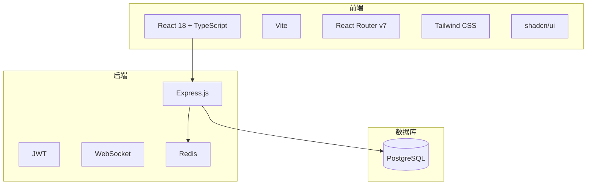
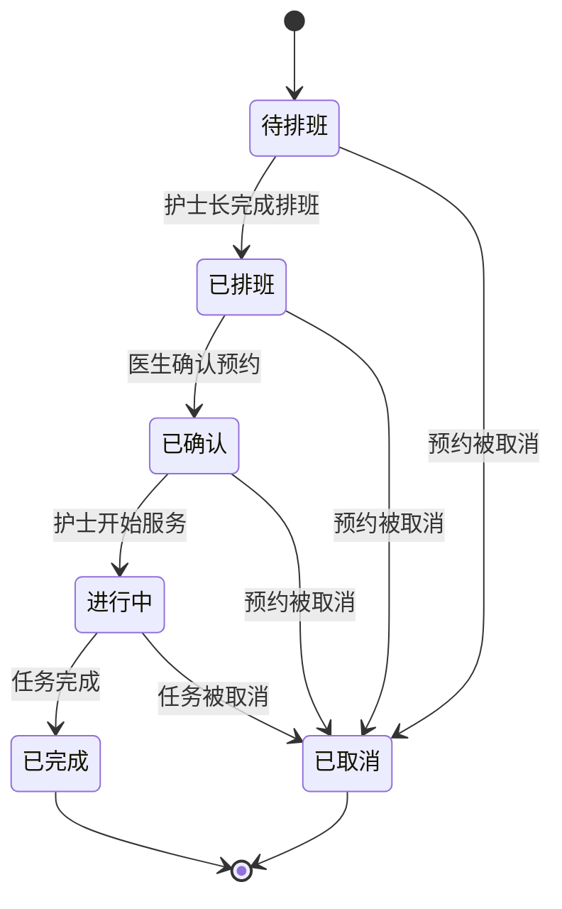
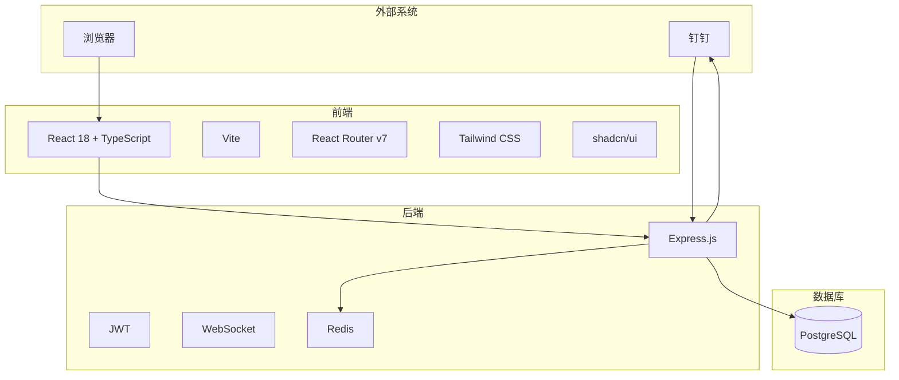

# 项目概述

<cite>
**本文档引用的文件**   
- [README.md](file://README.md)
- [package.json](file://package.json)
- [App.tsx](file://src/App.tsx)
- [routes.tsx](file://src/routes.tsx)
- [types.ts](file://src/types/types.ts)
- [AppointmentPage.tsx](file://src/pages/sales/AppointmentPage.tsx)
- [SchedulePage.tsx](file://src/pages/head-nurse/SchedulePage.tsx)
- [TaskPage.tsx](file://src/pages/nurse/TaskPage.tsx)
- [DoctorAppointmentPage.tsx](file://src/pages/doctor/AppointmentPage.tsx)
- [GanttChart.tsx](file://src/components/appointment/GanttChart.tsx)
- [01-init-database.sql](file://database/init/01-init-database.sql)
- [02-create-tables.sql](file://database/init/02-create-tables.sql)
- [api.ts](file://src/services/api.ts)
- [scheduleUtils.ts](file://src/utils/scheduleUtils.ts)
- [DingTalkSyncPanel.tsx](file://src/components/dingtalk/DingTalkSyncPanel.tsx)
</cite>

## 目录
1. [引言](#引言)
2. [系统架构](#系统架构)
3. [核心功能模块](#核心功能模块)
4. [多角色协同工作流程](#多角色协同工作流程)
5. [状态流转机制](#状态流转机制)
6. [关键技术特性](#关键技术特性)
7. [系统上下文图](#系统上下文图)

## 引言

Bio-Appointment 是一个专为医疗健康领域设计的智能预约调度系统，旨在通过数字化手段优化医疗资源的分配与管理。该系统采用现代化的全栈技术架构，从前端到后端再到数据库，实现了高效、安全和可扩展的解决方案。系统支持多角色协同工作，包括销售、护士长、护士、医生和管理员，每个角色都有其特定的职责和权限，确保了业务流程的顺畅和数据的安全。

系统的核心价值在于其智能排班和资源调度功能，能够自动分配房间和护士资源，减少人工干预，提高运营效率。此外，系统还集成了钉钉，支持钉钉登录、通讯录同步和消息推送，增强了用户体验和系统的实用性。通过基于角色的访问控制系统（RBAC），系统确保了不同角色的用户只能访问其权限范围内的数据和功能，保障了数据的安全性和隐私性。

对于初学者，本项目提供了一个高层次的理解，帮助他们快速上手和使用系统。对于高级开发者，项目详细介绍了系统边界、技术选型依据和扩展潜力，为后续的开发和维护提供了坚实的基础。无论是初学者还是高级开发者，都能从本项目中获得有价值的信息和指导。

**Section sources**
- [README.md](file://README.md#L1-L334)

## 系统架构

Bio-Appointment 系统采用了现代化的全栈技术架构，从前端到后端再到数据库，实现了高效、安全和可扩展的解决方案。该系统的核心组件包括前端、后端和数据库，每个组件都使用了先进的技术和框架，确保了系统的高性能和稳定性。

前端部分基于 React 18 和 TypeScript 构建，利用 Vite 作为构建工具，React Router v7 进行路由管理，Tailwind CSS 提供样式支持，shadcn/ui 作为 UI 组件库。这些技术的选择不仅提高了开发效率，还确保了用户界面的响应性和美观性。前端通过 RESTful API 与后端进行通信，实现了数据的实时更新和交互。

后端部分使用 Express.js 构建，提供了 RESTful API 接口，处理前端的请求并返回相应的数据。后端与 PostgreSQL 数据库进行交互，存储和管理系统的数据。为了提高性能，系统还使用了 Redis 作为缓存和会话存储。身份认证采用 JWT（JSON Web Token）技术，确保了用户数据的安全性。实时通信通过 WebSocket 实现，支持实时数据更新和通知。

数据库部分使用 PostgreSQL 15 作为主数据库，存储系统的核心数据，如用户信息、预约记录、排班信息等。PostgreSQL 的强大功能和高可靠性确保了数据的完整性和一致性。为了方便部署和管理，系统使用 Docker Compose 进行容器编排，实现了开发、测试和生产环境的一致性。

整个系统的设计理念是模块化和松耦合，每个组件都可以独立开发和部署，便于维护和扩展。通过这种架构，Bio-Appointment 系统不仅能够满足当前的业务需求，还具备了良好的扩展性和灵活性，能够适应未来的发展和变化。

**Diagram sources **
- [README.md](file://README.md#L18-L27)
- [package.json](file://package.json#L1-L103)

## 核心功能模块

Bio-Appointment 系统的核心功能模块涵盖了从预约发起、智能排班、任务执行到诊疗确认的完整业务流程。每个模块都设计得既独立又相互关联，确保了系统的高效运行和用户体验的优化。

### 预约发起模块

预约发起模块是系统的第一步，主要由销售人员使用。该模块允许销售人员填写客户信息并选择服务项目，系统会自动计算人数和预估时长。销售人员可以添加多位同行客户，并选择预约日期和时间。系统会根据填写的信息自动检测资源可用性，确保预约的可行性。如果客户是急单，系统会特别提示护士长，以便及时处理。

### 智能排班模块

智能排班模块由护士长使用，负责将待排班的预约分配给具体的房间和护士。该模块提供了丰富的筛选和排序功能，护士长可以根据不同的条件查看待排班的预约。系统会自动检测资源冲突，如果存在冲突，会提示护士长进行确认。护士长可以手动调整排班时间，并记录调整原因。排班完成后，系统会自动更新预约状态，通知相关人员。

### 任务执行模块

任务执行模块由护士使用，负责执行已排班的预约。护士可以在系统中查看自己的任务列表，包括待执行、进行中和已完成的任务。当客户到达时，护士可以点击“客户到达”按钮，系统会自动更新任务状态。任务完成后，护士可以点击“完成服务”按钮，记录实际执行时间和备注。系统会自动更新任务状态，并通知相关人员。

### 诊疗确认模块

诊疗确认模块由医生使用，负责确认需要医生参与的预约。医生可以在系统中查看待确认的预约，包括预约日期、时间、客户信息和服务项目。医生可以选择接受或拒绝预约，并记录拒绝原因或建议改期时间。如果医生接受预约，系统会自动更新预约状态，通知相关人员。如果医生拒绝预约，系统会通知销售人员，以便重新安排。

### 系统配置模块

系统配置模块由管理员使用，负责管理系统的各项配置。管理员可以管理用户账户，包括创建、编辑和删除用户，设置用户角色和权限。管理员还可以配置系统参数，如服务项目、房间类型和护士技能等级。此外，管理员可以查看系统日志和统计信息，监控系统的运行状态。

这些核心功能模块共同构成了 Bio-Appointment 系统的业务闭环，确保了从预约发起到最后诊疗确认的每一个环节都能高效、准确地完成。

**Section sources**
- [AppointmentPage.tsx](file://src/pages/sales/AppointmentPage.tsx#L1-L451)
- [SchedulePage.tsx](file://src/pages/head-nurse/SchedulePage.tsx#L1-L695)
- [TaskPage.tsx](file://src/pages/nurse/TaskPage.tsx#L1-L389)
- [DoctorAppointmentPage.tsx](file://src/pages/doctor/AppointmentPage.tsx#L1-L395)
- [SystemConfigPage.tsx](file://src/pages/admin/SystemConfigPage.tsx#L1-L100)

## 多角色协同工作流程

Bio-Appointment 系统通过多角色协同工作流程，实现了从预约发起、智能排班、任务执行到诊疗确认的完整业务闭环。每个角色在系统中都有明确的职责和权限，确保了业务流程的顺畅和数据的安全。

### 销售人员

销售人员是系统的第一接触点，负责发起预约。他们通过填写客户信息和选择服务项目来创建预约。系统会自动计算人数和预估时长，并检测资源可用性。如果客户是急单，系统会特别提示护士长，以便及时处理。销售人员还可以添加多位同行客户，并选择预约日期和时间。预约创建后，系统会自动更新预约状态为“待排班”，并通知护士长。

### 护士长

护士长负责智能排班，将待排班的预约分配给具体的房间和护士。护士长可以通过筛选和排序功能查看待排班的预约。系统会自动检测资源冲突，如果存在冲突，会提示护士长进行确认。护士长可以手动调整排班时间，并记录调整原因。排班完成后，系统会自动更新预约状态为“已排班”，并通知护士和医生。

### 护士

护士负责执行已排班的预约。他们可以在系统中查看自己的任务列表，包括待执行、进行中和已完成的任务。当客户到达时，护士可以点击“客户到达”按钮，系统会自动更新任务状态为“进行中”。任务完成后，护士可以点击“完成服务”按钮，记录实际执行时间和备注。系统会自动更新任务状态为“已完成”，并通知相关人员。

### 医生

医生负责确认需要医生参与的预约。他们可以在系统中查看待确认的预约，包括预约日期、时间、客户信息和服务项目。医生可以选择接受或拒绝预约，并记录拒绝原因或建议改期时间。如果医生接受预约，系统会自动更新预约状态为“已确认”，并通知护士。如果医生拒绝预约，系统会通知销售人员，以便重新安排。

### 管理员

管理员负责管理系统的各项配置。他们可以管理用户账户，包括创建、编辑和删除用户，设置用户角色和权限。管理员还可以配置系统参数，如服务项目、房间类型和护士技能等级。此外，管理员可以查看系统日志和统计信息，监控系统的运行状态。

通过这种多角色协同工作流程，Bio-Appointment 系统确保了每个环节都能高效、准确地完成，提高了整体运营效率和客户满意度。

**Section sources**
- [routes.tsx](file://src/routes.tsx#L1-L135)
- [types.ts](file://src/types/types.ts#L1-L487)
- [AppointmentPage.tsx](file://src/pages/sales/AppointmentPage.tsx#L1-L451)
- [SchedulePage.tsx](file://src/pages/head-nurse/SchedulePage.tsx#L1-L695)
- [TaskPage.tsx](file://src/pages/nurse/TaskPage.tsx#L1-L389)
- [DoctorAppointmentPage.tsx](file://src/pages/doctor/AppointmentPage.tsx#L1-L395)

## 状态流转机制

Bio-Appointment 系统通过详细的状态流转机制，确保了从预约发起、智能排班、任务执行到诊疗确认的每一个环节都能高效、准确地完成。每个状态都有明确的定义和转换规则，确保了业务流程的顺畅和数据的一致性。

### 预约状态

预约状态包括“待排班”、“已排班”、“已确认”、“进行中”、“已完成”和“已取消”。当销售人员创建预约后，预约状态为“待排班”。护士长完成排班后，预约状态变为“已排班”。医生确认预约后，预约状态变为“已确认”。护士开始服务后，预约状态变为“进行中”。任务完成后，预约状态变为“已完成”。如果预约被取消，状态变为“已取消”。

### 排班状态

排班状态包括“草稿”、“已发布”和“已锁定”。当护士长创建排班时，排班状态为“草稿”。排班完成后，状态变为“已发布”。如果排班需要锁定，状态变为“已锁定”。排班状态的变化会自动更新预约状态，确保数据的一致性。

### 任务执行状态

任务执行状态包括“待执行”、“已签到”、“进行中”和“已完成”。当排班完成后，任务状态为“待执行”。客户到达后，护士点击“客户到达”按钮，任务状态变为“已签到”。开始服务后，任务状态变为“进行中”。任务完成后，任务状态变为“已完成”。

### 状态流转图

**Diagram sources **
- [types.ts](file://src/types/types.ts#L13-L19)
- [AppointmentPage.tsx](file://src/pages/sales/AppointmentPage.tsx#L1-L451)
- [SchedulePage.tsx](file://src/pages/head-nurse/SchedulePage.tsx#L1-L695)
- [TaskPage.tsx](file://src/pages/nurse/TaskPage.tsx#L1-L389)

## 关键技术特性

Bio-Appointment 系统通过一系列关键技术特性，提升了运营效率和用户体验。这些特性包括可视化甘特图、资源冲突检测、钉钉集成等，确保了系统的高效、准确和安全。

### 可视化甘特图

系统通过可视化甘特图，直观地展示了资源的排班情况。甘特图支持日视图、周视图和月视图，用户可以根据需要切换不同的视图模式。甘特图不仅显示了每个排班的时间段，还通过颜色编码展示了护士和房间的组合，帮助用户快速识别资源的使用情况。如果存在资源冲突，甘特图会特别提示，确保排班的合理性。

### 资源冲突检测

系统在排班过程中自动检测资源冲突，确保每个时间段内每个房间和护士只能有一个排班。如果存在冲突，系统会提示护士长进行确认。护士长可以选择强制覆盖冲突，但需要记录调整原因。资源冲突检测机制有效避免了资源的重复使用，提高了排班的准确性和效率。

### 钉钉集成

系统集成了钉钉，支持钉钉登录、通讯录同步和消息推送。用户可以通过钉钉账号登录系统，简化了登录流程。系统会定期同步钉钉通讯录，确保用户信息的最新性。当有新的预约或排班时，系统会通过钉钉消息推送通知相关人员，提高了沟通效率。钉钉集成不仅增强了用户体验，还提高了系统的实用性和安全性。

### 实时数据同步

系统通过 WebSocket 实现了实时数据同步，确保了前端和后端数据的一致性。当有新的预约、排班或任务更新时，前端会立即收到通知，自动刷新页面，显示最新的数据。实时数据同步机制提高了系统的响应速度和用户体验。

### 基于角色的访问控制

系统采用了基于角色的访问控制系统（RBAC），确保了不同角色的用户只能访问其权限范围内的数据和功能。系统定义了多种角色，包括超级管理员、销售人员、护士长、护士和医生，每个角色都有明确的权限。通过 RBAC，系统保障了数据的安全性和隐私性。

这些关键技术特性共同构成了 Bio-Appointment 系统的核心优势，使其在医疗健康领域的智能预约调度中表现出色。

**Section sources**
- [GanttChart.tsx](file://src/components/appointment/GanttChart.tsx#L1-L800)
- [scheduleUtils.ts](file://src/utils/scheduleUtils.ts#L1-L112)
- [DingTalkSyncPanel.tsx](file://src/components/dingtalk/DingTalkSyncPanel.tsx#L1-L237)
- [realtime.ts](file://src/services/realtime.ts#L1-L100)
- [auth.ts](file://src/services/auth.ts#L1-L100)

## 系统上下文图

系统上下文图展示了 Bio-Appointment 系统的主要组件及其交互关系。通过这张图，可以清晰地了解系统的整体架构和各组件之间的数据流动。

**Diagram sources **
- [README.md](file://README.md#L18-L27)
- [package.json](file://package.json#L1-L103)
- [App.tsx](file://src/App.tsx#L1-L62)
- [api-server.js](file://server/server/server/api-server.js#L1-L100)