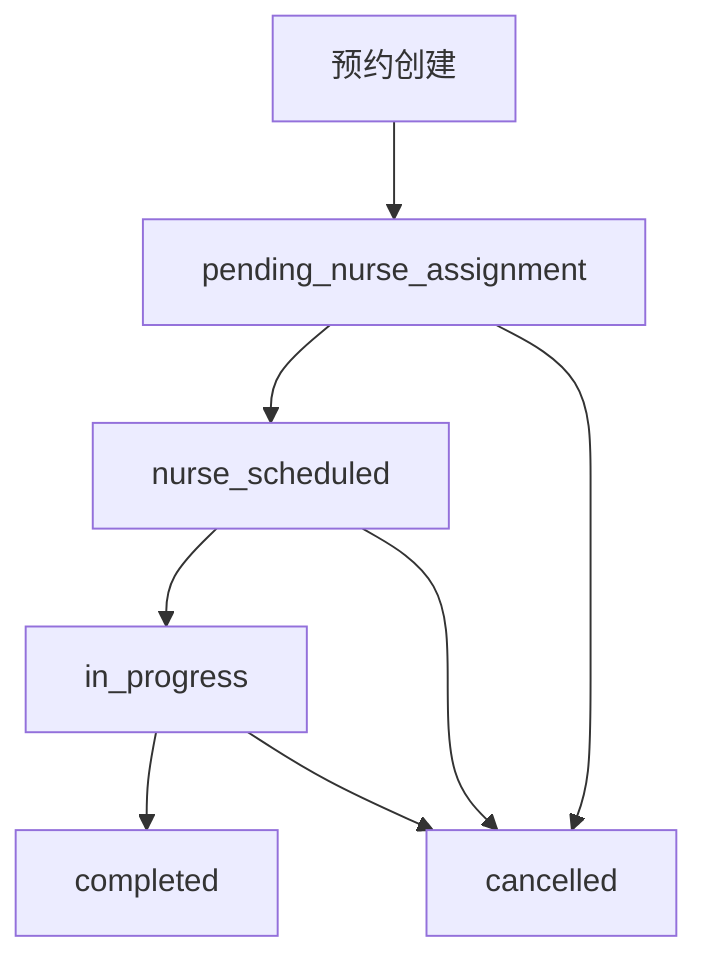
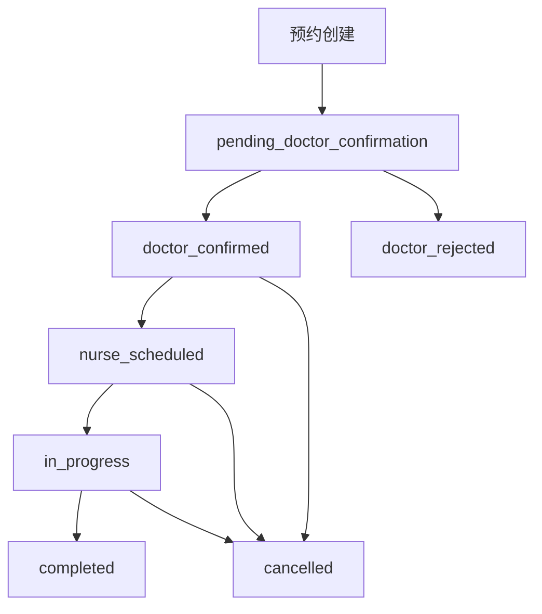

# 预约系统服务分类和流转优化技术方案

## 项目概述

本文档提供了预约系统服务分类和流转优化的完整技术方案，旨在解决当前系统中所有类型预约都会出现在护士长排班列表中的问题，实现基于服务类型的预约分流机制。

## 问题分析

### 当前系统问题

1. **缺乏服务分类流转**：所有类型的预约（包括医生服务）都会出现在护士长的排班列表中
2. **权限控制不精细**：缺少基于服务类型和角色的精细化权限控制
3. **状态流转不完整**：预约状态流转机制不清晰，缺少标识是否需要护士长排班的字段
4. **业务流程混乱**：护理服务和医生服务没有明确的区分和处理流程

### 业务需求

#### 服务分类
- **nursing类服务**：基础回输、静脉采血等护理服务
- **consultation类服务**：医生面诊、健康评估等咨询服务
- **report类服务**：报告解读等报告服务

#### 期望业务流程
1. **护理服务(nursing)**：预约创建后直接流转到所选门店的护士长进行智能排班
2. **医生服务(consultation/report)**：预约创建后先由所选医生处理确认，医生确认后再流转到护士长进行排班

## 技术方案设计

### 1. 数据库结构优化

#### 1.1 新增工作流状态枚举

```sql
CREATE TYPE appointment_workflow_status AS ENUM (
  'pending_nurse_assignment',    -- 待护士分配（护理服务）
  'pending_doctor_confirmation',  -- 待医生确认（医生服务）
  'doctor_confirmed',            -- 医生已确认
  'doctor_rejected',             -- 医生已拒绝
  'nurse_scheduled',             -- 护士已排班
  'in_progress',                 -- 进行中
  'completed',                   -- 已完成
  'cancelled'                    -- 已取消
);
```

#### 1.2 预约表字段扩展

```sql
ALTER TABLE appointments 
ADD COLUMN workflow_status appointment_workflow_status,
ADD COLUMN requires_nurse_scheduling BOOLEAN DEFAULT true,
ADD COLUMN doctor_confirmed_at TIMESTAMP WITH TIME ZONE,
ADD COLUMN forwarded_to_nurse_at TIMESTAMP WITH TIME ZONE;
```

#### 1.3 专用视图创建

- **护士长专用视图**：只显示待护士分配和医生已确认的预约
- **医生专用视图**：只显示待医生确认的预约

#### 1.4 索引优化

```sql
CREATE INDEX idx_appointments_workflow_status ON appointments(workflow_status);
CREATE INDEX idx_appointments_requires_nurse_scheduling ON appointments(requires_nurse_scheduling);
CREATE INDEX idx_appointments_doctor_confirmed_at ON appointments(doctor_confirmed_at);
```

### 2. 预约状态流转机制

#### 2.1 护理服务流转路径



#### 2.2 医生服务流转路径



#### 2.3 状态转换规则

- **护士长权限**：可以将 `pending_nurse_assignment` 或 `doctor_confirmed` 转换为 `nurse_scheduled`
- **医生权限**：可以将 `pending_doctor_confirmation` 转换为 `doctor_confirmed` 或 `doctor_rejected`
- **系统权限**：可以进行所有状态转换

### 3. API接口设计

#### 3.1 新增API接口

```typescript
// 获取护士长待处理预约
GET /api/appointments/nurse-pending

// 获取医生待处理预约
GET /api/appointments/doctor-pending

// 医生确认预约
PUT /api/appointments/:id/doctor-confirm

// 医生拒绝预约
PUT /api/appointments/:id/doctor-reject

// 更新工作流状态
PUT /api/appointments/:id/workflow
```

#### 3.2 请求/响应格式

```typescript
// 医生确认预约
interface DoctorConfirmRequest {
  doctor_id: string;
  doctor_note?: string;
}

// 更新工作流状态
interface UpdateWorkflowRequest {
  workflow_status: AppointmentWorkflowStatus;
  note?: string;
}

// 预约响应（包含工作流信息）
interface AppointmentResponse {
  id: string;
  customer_name: string;
  service: Service;
  workflow_status: AppointmentWorkflowStatus;
  requires_nurse_scheduling: boolean;
  doctor_confirmed_at?: string;
  forwarded_to_nurse_at?: string;
  // ... 其他字段
}
```

### 4. 前端页面优化

#### 4.1 护士长页面优化

**文件**：`src/pages/head-nurse/SchedulePage.tsx`

**主要变更**：
- 使用新的API端点 `getNursePendingAppointments`
- 根据工作流状态过滤预约
- 区分显示护理服务和医生已确认预约
- 添加工作流状态标识

```typescript
// 数据加载优化
const [pendingAppointments, setPendingAppointments] = useState<any[]>([]);

const loadData = async () => {
  const appointmentsData = await clientApi.getNursePendingAppointments({
    requested_date_from: startDate,
    requested_date_to: endDate,
    store_id: storeFilter
  });
  
  // 按工作流状态分组显示
  const pendingNurseAssignment = appointmentsData.filter(a => 
    a.workflow_status === 'pending_nurse_assignment');
  const doctorConfirmed = appointmentsData.filter(a => 
    a.workflow_status === 'doctor_confirmed');
  
  setPendingAppointments([...pendingNurseAssignment, ...doctorConfirmed]);
};
```

#### 4.2 医生页面优化

**文件**：`src/pages/doctor/AppointmentPage.tsx`

**主要变更**：
- 使用新的API端点 `getDoctorPendingAppointments`
- 只显示待医生确认的预约
- 添加确认/拒绝操作按钮
- 显示服务分类信息

```typescript
// 医生确认预约
const handleConfirmAppointment = async (appointment: any) => {
  try {
    await clientApi.doctorConfirmAppointment(appointment.id, {
      doctor_id: user.id,
      doctor_note: confirmNote
    });
    toast.success('预约已确认');
    loadData();
  } catch (error) {
    toast.error('确认失败');
  }
};

// 医生拒绝预约
const handleRejectAppointment = async (appointment: any) => {
  try {
    await clientApi.doctorRejectAppointment(appointment.id, {
      doctor_id: user.id,
      doctor_note: rejectNote
    });
    toast.success('预约已拒绝');
    loadData();
  } catch (error) {
    toast.error('拒绝失败');
  }
};
```

### 5. 权限控制优化

#### 5.1 权限检查函数

**文件**：`src/utils/permissions.ts`

**新增函数**：
```typescript
// 检查用户是否可以处理特定工作流状态的预约
export function canProcessAppointment(user: BaseUser | null, appointment: any): boolean

// 检查用户是否可以确认预约
export function canConfirmAppointment(user: BaseUser | null, appointment: any): boolean

// 检查用户是否可以拒绝预约
export function canRejectAppointment(user: BaseUser | null, appointment: any): boolean

// 检查用户是否可以排班预约
export function canScheduleAppointment(user: BaseUser | null, appointment: any): boolean

// 获取工作流状态显示名称
export function getWorkflowStatusDisplayName(status: string): string

// 获取下一个有效的工作流状态
export function getNextWorkflowStatuses(currentStatus: string, userRole: string): string[]
```

#### 5.2 服务分类辅助函数

```typescript
// 检查服务是否为护理类服务
export function isNursingService(serviceCategory: string): boolean

// 检查服务是否为医生类服务
export function isDoctorService(serviceCategory: string): boolean

// 检查服务是否需要医生确认
export function requiresDoctorConfirmation(serviceCategory: string): boolean

// 检查服务是否需要护士排班
export function requiresNurseScheduling(serviceCategory: string): boolean
```

### 6. 类型定义更新

#### 6.1 新增类型定义

**文件**：`src/types/types.ts`

```typescript
// 工作流状态类型
export type AppointmentWorkflowStatus = 
  | 'pending_nurse_assignment'
  | 'pending_doctor_confirmation'
  | 'doctor_confirmed'
  | 'doctor_rejected'
  | 'nurse_scheduled'
  | 'in_progress'
  | 'completed'
  | 'cancelled';

// 扩展预约接口
export interface Appointment {
  // ... 现有字段
  workflow_status?: AppointmentWorkflowStatus;
  requires_nurse_scheduling?: boolean;
  doctor_confirmed_at?: string;
  forwarded_to_nurse_at?: string;
}
```

#### 6.2 API客户端类型更新

**文件**：`src/services/api-client.ts`

```typescript
export interface Appointment {
  // ... 现有字段
  workflow_status?: AppointmentWorkflowStatus;
  requires_nurse_scheduling?: boolean;
  doctor_confirmed_at?: string;
  forwarded_to_nurse_at?: string;
}
```

### 7. 数据库迁移脚本

#### 7.1 迁移文件

**文件**：`database/migrations/06-add-appointment-workflow.sql`

**主要功能**：
- 创建工作流状态枚举类型
- 添加预约表新字段
- 数据迁移逻辑
- 创建专用视图
- 权限控制函数
- 审计日志记录
- 性能优化索引

#### 7.2 迁移指南

**文件**：`database/appointment-workflow-migration-guide.md`

**包含内容**：
- 迁移前准备步骤
- 执行迁移的详细步骤
- 迁移后验证方法
- 回滚方案和常见问题解决

## 实施步骤规划

### 阶段1：数据库结构更新（1-2天）

1. **备份数据库**
   ```bash
   pg_dump -h localhost -U postgres -d bio_appointment > backup_before_workflow_migration.sql
   ```

2. **执行迁移脚本**
   ```bash
   psql -h localhost -U postgres -d bio_appointment -f database/migrations/06-add-appointment-workflow.sql
   ```

3. **验证迁移结果**
   ```sql
   SELECT validate_workflow_data_integrity();
   SELECT get_workflow_statistics();
   ```

### 阶段2：后端API开发（2-3天）

1. **实现新的API端点**
   - `GET /api/appointments/nurse-pending`
   - `GET /api/appointments/doctor-pending`
   - `PUT /api/appointments/:id/doctor-confirm`
   - `PUT /api/appointments/:id/doctor-reject`
   - `PUT /api/appointments/:id/workflow`

2. **更新现有API**
   - 修改预约创建逻辑，根据服务类别设置工作流状态
   - 更新预约查询，包含工作流状态字段

3. **权限控制集成**
   - 实现基于角色的API访问控制
   - 添加工作流状态转换验证

### 阶段3：前端页面优化（3-4天）

1. **护士长页面更新**
   - 修改数据加载逻辑
   - 更新预约列表显示
   - 添加工作流状态标识

2. **医生页面更新**
   - 实现新的预约列表
   - 添加确认/拒绝操作
   - 集成权限控制

3. **通用组件更新**
   - 更新状态徽章组件
   - 修改预约详情对话框
   - 添加工作流状态显示

### 阶段4：测试和优化（1-2天）

1. **功能测试**
   - 测试护理服务流转
   - 测试医生服务流转
   - 验证权限控制

2. **性能测试**
   - 检查查询性能
   - 优化数据库索引
   - 监控API响应时间

3. **用户验收测试**
   - 护士长工作流程测试
   - 医生工作流程测试
   - 边界情况处理测试

### 阶段5：部署和监控（1天）

1. **生产环境部署**
   - 执行数据库迁移
   - 部署应用更新
   - 配置监控告警

2. **监控和优化**
   - 监控系统性能
   - 收集用户反馈
   - 持续优化改进

## 风险评估和缓解措施

### 1. 数据迁移风险

**风险**：数据迁移过程中可能出现数据丢失或损坏

**缓解措施**：
- 执行完整数据库备份
- 在测试环境先验证迁移脚本
- 准备详细的回滚方案
- 分步骤执行迁移，每步验证

### 2. 业务流程变更风险

**风险**：新的业务流程可能影响现有工作习惯

**缓解措施**：
- 提供详细的用户培训
- 制作操作手册和视频教程
- 设置过渡期，支持新旧流程并存
- 收集用户反馈，及时调整

### 3. 系统性能风险

**风险**：新的查询和字段可能影响系统性能

**缓解措施**：
- 添加适当的数据库索引
- 优化查询语句
- 实施性能监控
- 准备性能优化方案

## 监控和评估指标

### 1. 业务指标

- **预约处理效率**：平均处理时间
- **状态流转准确性**：正确流转的预约比例
- **用户满意度**：各角色用户的使用反馈
- **错误率**：工作流操作失败率

### 2. 技术指标

- **API响应时间**：各端点的平均响应时间
- **数据库查询性能**：关键查询的执行时间
- **系统可用性**：服务正常运行时间
- **错误日志**：系统错误和异常数量

### 3. 监控查询

```sql
-- 工作流处理效率统计
SELECT 
  s.category as service_category,
  a.workflow_status,
  COUNT(*) as appointment_count,
  AVG(EXTRACT(EPOCH FROM (a.updated_at - a.created_at))/60) as avg_processing_time_minutes
FROM appointments a
LEFT JOIN services s ON a.service_id = s.id
WHERE a.created_at >= NOW() - INTERVAL '30 days'
  AND a.workflow_status IN ('completed', 'cancelled')
GROUP BY s.category, a.workflow_status
ORDER BY s.category, a.workflow_status;

-- 长时间未处理的预约
SELECT 
  a.id,
  a.customer_name,
  a.workflow_status,
  a.created_at,
  EXTRACT(EPOCH FROM (NOW() - a.created_at))/3600 as hours_pending
FROM appointments a
WHERE a.workflow_status IN ('pending_nurse_assignment', 'pending_doctor_confirmation')
  AND a.created_at < NOW() - INTERVAL '24 hours'
ORDER BY a.created_at;
```

## 总结

本技术方案通过引入基于服务分类的预约分流机制，实现了以下目标：

1. **清晰的业务流程**：护理服务和医生服务有明确的处理路径
2. **明确的职责分工**：护士长和医生各司其职，避免混乱
3. **完善的状态管理**：8种工作流状态覆盖所有业务场景
4. **精细的权限控制**：基于角色和工作流状态的权限管理
5. **完整的审计追踪**：所有状态变更都有记录可查

通过最小化的结构调整，在保持现有系统稳定性的基础上，实现了预约系统的服务分类和流转优化，为后续的功能扩展奠定了良好的基础。

## 附录

### A. 相关文件清单

- `database/migrations/06-add-appointment-workflow.sql` - 数据库迁移脚本
- `database/appointment-workflow-migration-guide.md` - 迁移指南
- `src/types/types.ts` - 类型定义更新
- `src/services/api-client.ts` - API客户端更新
- `src/utils/permissions.ts` - 权限控制函数
- `src/pages/head-nurse/SchedulePage.tsx` - 护士长页面更新
- `src/pages/doctor/AppointmentPage.tsx` - 医生页面更新

### B. API接口文档

详细的API接口文档请参考：
- 护士长预约接口：`GET /api/appointments/nurse-pending`
- 医生预约接口：`GET /api/appointments/doctor-pending`
- 医生确认接口：`PUT /api/appointments/:id/doctor-confirm`
- 医生拒绝接口：`PUT /api/appointments/:id/doctor-reject`
- 工作流更新接口：`PUT /api/appointments/:id/workflow`

### C. 数据库视图说明

- `nurse_pending_appointments` - 护士长专用预约视图
- `doctor_pending_appointments` - 医生专用预约视图
- `appointment_workflow_history` - 工作流历史视图
- `workflow_performance_metrics` - 性能监控视图

---

**文档版本**：1.0  
**创建日期**：2025-12-07  
**最后更新**：2025-12-07  
**作者**：系统架构师