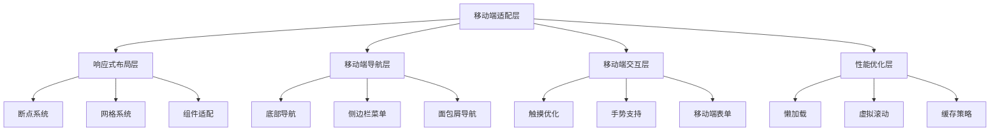
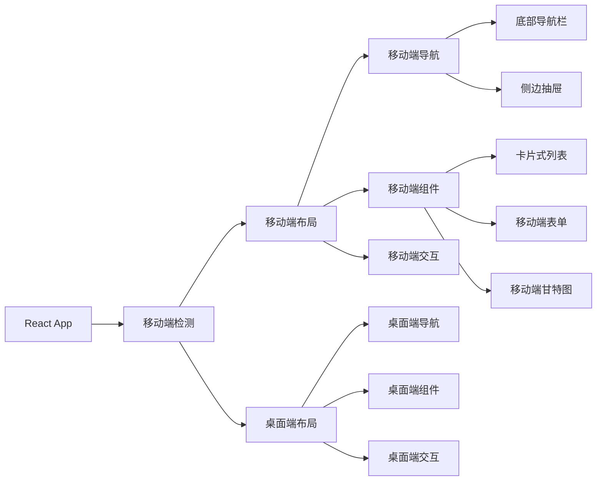
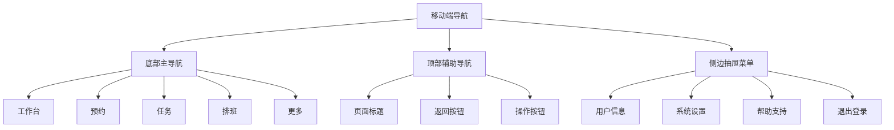

# Bio-Appointment 智能预约调度系统 - 移动端适配技术设计方案

## 1. 项目现状分析

### 1.1 当前技术栈
- **前端框架**: React 18 + TypeScript
- **UI组件库**: shadcn/ui + Radix UI
- **样式框架**: Tailwind CSS
- **构建工具**: Vite
- **状态管理**: React Context + Hooks
- **路由**: React Router v7

### 1.2 现有移动端适配基础
- ✅ 已有 `useIsMobile` Hook (768px 断点)
- ✅ Header 组件已有移动端导航 (Sheet 侧边栏)
- ✅ 基础响应式布局 (Tailwind 响应式类)
- ✅ 触摸友好的 UI 组件 (Button, Input, Select 等)

### 1.3 核心业务流程分析
基于代码分析，系统核心业务流程包括：
1. **销售端**: 预约发起 (`/sales/appointment`)
2. **护士长端**: 智能排班 (`/head-nurse/schedule`)
3. **护士端**: 任务执行 (`/nurse/tasks`)
4. **医生端**: 预约确认 (`/doctor/appointments`)

### 1.4 移动端适配需求
- 重点优化核心业务流程的移动端体验
- 保持现有桌面端功能完整性
- 最小化代码改动，最大化组件复用
- 确保数据一致性和业务逻辑统一

## 2. 整体架构设计

### 2.1 设计原则
1. **移动优先**: 针对移动端重新设计核心交互流程
2. **渐进增强**: 桌面端保持现有体验，移动端增强体验
3. **组件复用**: 最大化复用现有组件，减少重复代码
4. **性能优先**: 确保移动端加载速度和交互流畅性
5. **一致性**: 保持设计语言和交互模式的一致性

### 2.2 架构层次



### 2.3 技术架构



## 3. 核心组件适配策略

### 3.1 移动端检测增强

```typescript
// src/hooks/use-mobile.ts
export function useIsMobile() {
  const [isMobile, setIsMobile] = useState<boolean | undefined>(undefined);
  const [screenSize, setScreenSize] = useState<'sm' | 'md' | 'lg' | 'xl'>('lg');

  useEffect(() => {
    const updateScreenSize = () => {
      const width = window.innerWidth;
      setIsMobile(width < MOBILE_BREAKPOINT);
      
      if (width < 640) setScreenSize('sm');
      else if (width < 768) setScreenSize('md');
      else if (width < 1024) setScreenSize('lg');
      else setScreenSize('xl');
    };

    const mql = window.matchMedia(`(max-width: ${MOBILE_BREAKPOINT - 1}px)`);
    mql.addEventListener('change', updateScreenSize);
    updateScreenSize();
    
    return () => mql.removeEventListener('change', updateScreenSize);
  }, []);

  return { isMobile: !!isMobile, screenSize };
}
```

### 3.2 移动端导航组件

```typescript
// src/components/mobile/MobileNavigation.tsx
interface MobileNavigationProps {
  currentPath: string;
  userRole: UserRole;
}

export default function MobileNavigation({ currentPath, userRole }: MobileNavigationProps) {
  const { isMobile } = useIsMobile();
  
  if (!isMobile) return null;
  
  return (
    <div className="fixed bottom-0 left-0 right-0 bg-background border-t border-border z-50 md:hidden">
      <div className="grid grid-cols-5 h-16">
        {getVisibleNavigationItems(userRole).map((item) => (
          <Link
            key={item.path}
            to={item.path}
            className={`flex flex-col items-center justify-center space-y-1 text-xs ${
              currentPath === item.path
                ? 'text-primary'
                : 'text-muted-foreground'
            }`}
          >
            <item.icon className="h-5 w-5" />
            <span>{item.name}</span>
          </Link>
        ))}
      </div>
    </div>
  );
}
```

### 3.3 移动端布局容器

```typescript
// src/components/mobile/MobileLayout.tsx
interface MobileLayoutProps {
  children: React.ReactNode;
  title?: string;
  showBackButton?: boolean;
  rightAction?: React.ReactNode;
}

export default function MobileLayout({ 
  children, 
  title, 
  showBackButton, 
  rightAction 
}: MobileLayoutProps) {
  const { isMobile } = useIsMobile();
  
  if (!isMobile) {
    return <div>{children}</div>;
  }
  
  return (
    <div className="min-h-screen flex flex-col">
      {/* 顶部导航栏 */}
      <header className="sticky top-0 z-40 bg-background/95 backdrop-blur supports-[backdrop-filter]:bg-background/60 border-b">
        <div className="flex h-14 items-center px-4">
          {showBackButton && (
            <Button variant="ghost" size="icon" className="mr-2">
              <ArrowLeft className="h-4 w-4" />
            </Button>
          )}
          <h1 className="flex-1 text-lg font-semibold truncate">{title}</h1>
          {rightAction}
        </div>
      </header>
      
      {/* 主内容区域 */}
      <main className="flex-1 pb-16">
        {children}
      </main>
    </div>
  );
}
```

## 4. 核心业务流程移动端适配

### 4.1 销售端 - 预约发起

#### 4.1.1 移动端优化策略
- **表单布局**: 改为单列布局，优化输入体验
- **日期选择**: 使用原生日期选择器或优化的移动端日历
- **时间选择**: 使用滚轮式时间选择器
- **同行客户**: 简化添加/删除操作

#### 4.1.2 组件设计
```typescript
// src/components/mobile/MobileAppointmentForm.tsx
export default function MobileAppointmentForm() {
  return (
    <MobileLayout title="新建预约" showBackButton>
      <div className="p-4 space-y-6">
        {/* 门店选择 - 移动端优化 */}
        <FormField>
          <FormItem>
            <FormLabel>选择门店</FormLabel>
            <Select>
              <SelectTrigger className="h-12">
                <SelectValue placeholder="请选择门店" />
              </SelectTrigger>
              <SelectContent>
                {stores.map(store => (
                  <SelectItem key={store.id} value={store.id}>
                    <div className="flex items-center space-x-2">
                      <Store className="h-4 w-4" />
                      <div>
                        <div className="font-medium">{store.name}</div>
                        <div className="text-xs text-muted-foreground">{store.address}</div>
                      </div>
                    </div>
                  </SelectItem>
                ))}
              </SelectContent>
            </Select>
          </FormItem>
        </FormField>
        
        {/* 客户信息 - 移动端优化 */}
        <Card>
          <CardHeader>
            <CardTitle className="text-base">客户信息</CardTitle>
          </CardHeader>
          <CardContent className="space-y-4">
            <FormField>
              <FormItem>
                <FormLabel>主客户姓名</FormLabel>
                <Input placeholder="请输入客户姓名" className="h-12" />
              </FormItem>
            </FormField>
            
            {/* 同行客户 - 移动端简化 */}
            <div className="space-y-2">
              <FormLabel>同行客户</FormLabel>
              {companions.map((companion, index) => (
                <div key={index} className="flex gap-2">
                  <Input
                    placeholder={`同行客户 ${index + 1}`}
                    className="flex-1 h-12"
                  />
                  <Button
                    variant="outline"
                    size="icon"
                    onClick={() => removeCompanion(index)}
                  >
                    <X className="h-4 w-4" />
                  </Button>
                </div>
              ))}
              <Button
                variant="outline"
                className="w-full h-12"
                onClick={addCompanion}
              >
                <Plus className="h-4 w-4 mr-2" />
                添加同行客户
              </Button>
            </div>
          </CardContent>
        </Card>
        
        {/* 服务选择 - 移动端卡片式 */}
        <Card>
          <CardHeader>
            <CardTitle className="text-base">服务项目</CardTitle>
          </CardHeader>
          <CardContent>
            <div className="grid gap-3">
              {services.map(service => (
                <Button
                  key={service.id}
                  variant={selectedService?.id === service.id ? "default" : "outline"}
                  className="h-auto p-4 justify-start"
                  onClick={() => setSelectedService(service)}
                >
                  <div className="text-left">
                    <div className="font-medium">{service.name}</div>
                    <div className="text-sm text-muted-foreground">
                      {service.base_duration}分钟
                      {service.allow_companions && ' · 支持同行'}
                    </div>
                  </div>
                </Button>
              ))}
            </div>
          </CardContent>
        </Card>
        
        {/* 日期时间选择 - 移动端优化 */}
        <Card>
          <CardHeader>
            <CardTitle className="text-base">预约时间</CardTitle>
          </CardHeader>
          <CardContent className="space-y-4">
            <FormField>
              <FormItem>
                <FormLabel>预约日期</FormLabel>
                <Input
                  type="date"
                  className="h-12"
                  min={format(new Date(), 'yyyy-MM-dd')}
                />
              </FormItem>
            </FormField>
            
            <FormField>
              <FormItem>
                <FormLabel>开始时间</FormLabel>
                <Select>
                  <SelectTrigger className="h-12">
                    <SelectValue placeholder="选择开始时间" />
                  </SelectTrigger>
                  <SelectContent>
                    {availableSlots.map(slot => (
                      <SelectItem key={slot} value={slot}>
                        {slot.substring(0, 5)}
                      </SelectItem>
                    ))}
                  </SelectContent>
                </Select>
              </FormItem>
            </FormField>
          </CardContent>
        </Card>
        
        {/* 提交按钮 - 移动端固定底部 */}
        <div className="fixed bottom-16 left-0 right-0 p-4 bg-background border-t">
          <Button className="w-full h-12" size="lg">
            提交预约
          </Button>
        </div>
      </div>
    </MobileLayout>
  );
}
```

### 4.2 护士长端 - 智能排班

#### 4.2.1 移动端优化策略
- **甘特图**: 改为卡片式时间轴视图
- **排班操作**: 简化拖拽操作，改为点击编辑
- **筛选功能**: 优化为移动端友好的筛选器

#### 4.2.2 组件设计
```typescript
// src/components/mobile/MobileScheduleView.tsx
export default function MobileScheduleView() {
  return (
    <MobileLayout title="排班看板" rightAction={<FilterButton />}>
      <div className="p-4 space-y-6">
        {/* 统计卡片 - 移动端横向滚动 */}
        <div className="flex gap-3 overflow-x-auto pb-2">
          <Card className="min-w-[140px]">
            <CardContent className="p-4 text-center">
              <div className="text-2xl font-bold text-pending">{pendingCount}</div>
              <div className="text-xs text-muted-foreground">待排班</div>
            </CardContent>
          </Card>
          <Card className="min-w-[140px]">
            <CardContent className="p-4 text-center">
              <div className="text-2xl font-bold text-urgent">{urgentCount}</div>
              <div className="text-xs text-muted-foreground">急单</div>
            </CardContent>
          </Card>
          <Card className="min-w-[140px]">
            <CardContent className="p-4 text-center">
              <div className="text-2xl font-bold text-confirmed">{confirmedCount}</div>
              <div className="text-xs text-muted-foreground">已确认</div>
            </CardContent>
          </Card>
        </div>
        
        {/* 时间轴视图 - 移动端替代甘特图 */}
        <Card>
          <CardHeader>
            <CardTitle className="text-base">今日排班</CardTitle>
            <CardDescription>按时间顺序展示</CardDescription>
          </CardHeader>
          <CardContent>
            <div className="space-y-4">
              {timeSlots.map(slot => (
                <div key={slot.time} className="flex gap-3">
                  <div className="text-sm text-muted-foreground w-16">
                    {slot.time}
                  </div>
                  <div className="flex-1 space-y-2">
                    {slot.schedules.map(schedule => (
                      <ScheduleCard
                        key={schedule.id}
                        schedule={schedule}
                        onClick={() => handleScheduleClick(schedule)}
                      />
                    ))}
                    {slot.schedules.length === 0 && (
                      <div className="text-center text-muted-foreground py-4 border-2 border-dashed rounded-lg">
                        空闲时段
                      </div>
                    )}
                  </div>
                </div>
              ))}
            </div>
          </CardContent>
        </Card>
        
        {/* 待办列表 - 移动端卡片式 */}
        <Card>
          <CardHeader>
            <CardTitle className="text-base">待排班预约</CardTitle>
          </CardHeader>
          <CardContent>
            <div className="space-y-3">
              {pendingAppointments.map(appointment => (
                <AppointmentCard
                  key={appointment.id}
                  appointment={appointment}
                  onSchedule={() => handleSchedule(appointment)}
                />
              ))}
            </div>
          </CardContent>
        </Card>
      </div>
    </MobileLayout>
  );
}
```

### 4.3 护士端 - 任务执行

#### 4.3.1 移动端优化策略
- **任务列表**: 优化为卡片式布局，突出操作按钮
- **任务状态**: 使用颜色和图标直观展示状态
- **操作流程**: 简化为点击操作，减少步骤

#### 4.3.2 组件设计
```typescript
// src/components/mobile/MobileTaskCard.tsx
interface MobileTaskCardProps {
  task: Schedule;
  onCheckIn: () => void;
  onFinish: () => void;
}

export default function MobileTaskCard({ task, onCheckIn, onFinish }: MobileTaskCardProps) {
  const status = getTaskStatus(task);
  const timeRemaining = getTaskTimeRemaining(task);
  
  return (
    <Card className={`${status === 'in_progress' ? 'border-primary' : ''}`}>
      <CardContent className="p-4">
        <div className="flex items-start justify-between mb-3">
          <div className="flex-1">
            <h3 className="font-semibold text-lg">
              {task.appointment?.customer_name}
            </h3>
            <p className="text-sm text-muted-foreground">
              {task.room?.name} · {task.scheduled_time_start.substring(0, 5)}
            </p>
          </div>
          <StatusBadge status={status} />
        </div>
        
        <div className="space-y-3">
          {/* 时间信息 */}
          <div className="flex items-center gap-2">
            <Clock className="h-4 w-4 text-muted-foreground" />
            <span className="text-sm">
              {task.scheduled_time_start.substring(0, 5)} - {task.scheduled_time_end.substring(0, 5)}
            </span>
            {timeRemaining.isOverdue && (
              <Badge variant="destructive" className="text-xs">
                已超时
              </Badge>
            )}
          </div>
          
          {/* 客户信息 */}
          <div className="text-sm space-y-1">
            <div>
              <span className="text-muted-foreground">主客户：</span>
              <span className="font-medium">{task.appointment?.customer_name}</span>
            </div>
            {task.appointment?.companion_names && task.appointment.companion_names.length > 0 && (
              <div>
                <span className="text-muted-foreground">同行：</span>
                <span className="font-medium">
                  {task.appointment.companion_names.join(', ')}
                </span>
              </div>
            )}
          </div>
          
          {/* 操作按钮 - 移动端大按钮 */}
          <div className="pt-2">
            {status === 'scheduled' && (
              <Button
                className="w-full h-12 text-base"
                onClick={onCheckIn}
              >
                <UserCheck className="h-4 w-4 mr-2" />
                客户到达
              </Button>
            )}
            
            {status === 'in_progress' && (
              <Button
                className="w-full h-12 text-base"
                onClick={onFinish}
              >
                <CheckCircle className="h-4 w-4 mr-2" />
                完成服务
              </Button>
            )}
            
            {status === 'completed' && (
              <Button
                variant="outline"
                className="w-full h-12 text-base"
                disabled
              >
                已完成
              </Button>
            )}
          </div>
        </div>
      </CardContent>
    </Card>
  );
}
```

### 4.4 医生端 - 预约确认

#### 4.4.1 移动端优化策略
- **预约列表**: 优化为卡片式布局，突出关键信息
- **确认操作**: 简化为滑动确认或大按钮操作
- **时间选择**: 使用移动端友好的时间选择器

#### 4.4.2 组件设计
```typescript
// src/components/mobile/MobileDoctorAppointmentCard.tsx
interface MobileDoctorAppointmentCardProps {
  appointment: Appointment;
  onAccept: () => void;
  onReject: () => void;
}

export default function MobileDoctorAppointmentCard({ 
  appointment, 
  onAccept, 
  onReject 
}: MobileDoctorAppointmentCardProps) {
  return (
    <Card className="mb-4">
      <CardContent className="p-4">
        <div className="space-y-4">
          {/* 客户信息 */}
          <div>
            <h3 className="font-semibold text-lg">{appointment.customer_name}</h3>
            <p className="text-sm text-muted-foreground">{appointment.service?.name}</p>
          </div>
          
          {/* 时间信息 */}
          <div className="grid grid-cols-2 gap-4 text-sm">
            <div>
              <span className="text-muted-foreground">日期：</span>
              <span className="font-medium">
                {format(new Date(appointment.requested_date), 'MM-dd')}
              </span>
            </div>
            <div>
              <span className="text-muted-foreground">时间：</span>
              <span className="font-medium">
                {appointment.requested_time_start?.substring(0, 5)}
              </span>
            </div>
          </div>
          
          {/* 操作按钮 - 移动端滑动确认 */}
          <div className="space-y-3">
            <Button
              className="w-full h-12 text-base bg-green-600 hover:bg-green-700"
              onClick={onAccept}
            >
              <CheckCircle className="h-4 w-4 mr-2" />
              确认预约
            </Button>
            
            <Button
              variant="outline"
              className="w-full h-12 text-base border-red-200 text-red-600 hover:bg-red-50"
              onClick={onReject}
            >
              <XCircle className="h-4 w-4 mr-2" />
              拒绝预约
            </Button>
          </div>
        </div>
      </CardContent>
    </Card>
  );
}
```

## 5. 移动端布局和导航方案

### 5.1 响应式断点系统

```typescript
// src/tailwind/mobile-breakpoints.js
module.exports = {
  theme: {
    extend: {
      screens: {
        'xs': '475px',    // 超小屏手机
        'sm': '640px',    // 小屏手机
        'md': '768px',    // 平板
        'lg': '1024px',   // 小屏桌面
        'xl': '1280px',   // 桌面
        '2xl': '1536px',  // 大屏桌面
      },
    },
  },
}
```

### 5.2 移动端导航架构



### 5.3 页面布局适配

```typescript
// src/components/mobile/MobilePageLayout.tsx
interface MobilePageLayoutProps {
  children: React.ReactNode;
  title: string;
  showBackButton?: boolean;
  rightActions?: React.ReactNode;
  bottomPadding?: boolean;
}

export default function MobilePageLayout({
  children,
  title,
  showBackButton = false,
  rightActions,
  bottomPadding = true
}: MobilePageLayoutProps) {
  const { isMobile } = useIsMobile();
  
  if (!isMobile) {
    return <div>{children}</div>;
  }
  
  return (
    <div className="min-h-screen bg-background">
      {/* 顶部导航栏 */}
      <header className="sticky top-0 z-40 bg-background/95 backdrop-blur supports-[backdrop-filter]:bg-background/60 border-b">
        <div className="flex h-14 items-center px-4">
          {showBackButton && (
            <Button variant="ghost" size="icon" className="mr-2">
              <ArrowLeft className="h-4 w-4" />
            </Button>
          )}
          <h1 className="flex-1 text-lg font-semibold truncate">{title}</h1>
          {rightActions}
        </div>
      </header>
      
      {/* 主内容区域 */}
      <main className={`flex-1 ${bottomPadding ? 'pb-16' : ''}`}>
        {children}
      </main>
      
      {/* 底部导航栏 */}
      <MobileNavigation />
    </div>
  );
}
```

## 6. 移动端状态管理和数据流

### 6.1 移动端状态管理策略

```typescript
// src/contexts/MobileContext.tsx
interface MobileContextType {
  isMobile: boolean;
  screenSize: 'sm' | 'md' | 'lg' | 'xl';
  bottomNavVisible: boolean;
  setBottomNavVisible: (visible: boolean) => void;
  currentPage: string;
  setCurrentPage: (page: string) => void;
  swipeActions: {
    left: () => void;
    right: () => void;
  };
}

export const MobileContext = createContext<MobileContextType | null>(null);

export function MobileProvider({ children }: { children: React.ReactNode }) {
  const { isMobile, screenSize } = useIsMobile();
  const [bottomNavVisible, setBottomNavVisible] = useState(true);
  const [currentPage, setCurrentPage] = useState('');
  
  // 滑动手势处理
  const swipeActions = {
    left: () => {
      // 向左滑动逻辑
    },
    right: () => {
      // 向右滑动逻辑
    }
  };
  
  return (
    <MobileContext.Provider value={{
      isMobile,
      screenSize,
      bottomNavVisible,
      setBottomNavVisible,
      currentPage,
      setCurrentPage,
      swipeActions
    }}>
      {children}
    </MobileContext.Provider>
  );
}
```

### 6.2 移动端数据优化

```typescript
// src/hooks/use-mobile-data.ts
export function useMobileData<T>(data: T[], pageSize = 20) {
  const [visibleData, setVisibleData] = useState<T[]>([]);
  const [currentPage, setCurrentPage] = useState(0);
  const [isLoading, setIsLoading] = useState(false);
  
  useEffect(() => {
    const loadMoreData = () => {
      if (isLoading) return;
      
      setIsLoading(true);
      const startIndex = currentPage * pageSize;
      const endIndex = startIndex + pageSize;
      const newData = data.slice(0, endIndex);
      
      setVisibleData(newData);
      setCurrentPage(prev => prev + 1);
      setIsLoading(false);
    };
    
    loadMoreData();
  }, [data, currentPage]);
  
  const loadMore = useCallback(() => {
    if (visibleData.length >= data.length) return;
    loadMoreData();
  }, [visibleData.length, data.length]);
  
  return {
    data: visibleData,
    loadMore,
    hasMore: visibleData.length < data.length,
    isLoading
  };
}
```

## 7. 移动端性能优化方案

### 7.1 代码分割和懒加载

```typescript
// src/routes/mobile.tsx
import { lazy } from 'react';

// 移动端页面懒加载
const MobileAppointmentPage = lazy(() => import('@/pages/mobile/sales/AppointmentPage'));
const MobileSchedulePage = lazy(() => import('@/pages/mobile/head-nurse/SchedulePage'));
const MobileTaskPage = lazy(() => import('@/pages/mobile/nurse/TaskPage'));
const MobileDoctorPage = lazy(() => import('@/pages/mobile/doctor/AppointmentPage'));

export const mobileRoutes = [
  {
    path: '/mobile/sales/appointment',
    element: <MobileAppointmentPage />
  },
  // ... 其他移动端路由
];
```

### 7.2 虚拟滚动实现

```typescript
// src/components/mobile/VirtualList.tsx
interface VirtualListProps<T> {
  data: T[];
  itemHeight: number;
  renderItem: (item: T, index: number) => React.ReactNode;
  windowHeight?: number;
}

export function VirtualList<T>({ 
  data, 
  itemHeight, 
  renderItem,
  windowHeight = window.innerHeight 
}: VirtualListProps<T>) {
  const [scrollTop, setScrollTop] = useState(0);
  
  const visibleCount = Math.ceil(windowHeight / itemHeight);
  const startIndex = Math.floor(scrollTop / itemHeight);
  const endIndex = Math.min(startIndex + visibleCount, data.length);
  
  const visibleData = data.slice(startIndex, endIndex);
  
  return (
    <div 
      className="relative overflow-auto"
      style={{ height: windowHeight }}
      onScroll={(e) => setScrollTop(e.currentTarget.scrollTop)}
    >
      <div style={{ height: data.length * itemHeight, position: 'relative' }}>
        <div style={{ transform: `translateY(${startIndex * itemHeight}px)` }}>
          {visibleData.map((item, index) => (
            <div key={startIndex + index} style={{ height: itemHeight }}>
              {renderItem(item, startIndex + index)}
            </div>
          ))}
        </div>
      </div>
    </div>
  );
}
```

### 7.3 图片和资源优化

```typescript
// src/hooks/use-mobile-image.ts
export function useMobileImage(src: string, options?: {
  quality?: number;
  format?: 'webp' | 'avif' | 'jpeg';
}) {
  const [optimizedSrc, setOptimizedSrc] = useState(src);
  const { isMobile } = useIsMobile();
  
  useEffect(() => {
    if (!isMobile) {
      setOptimizedSrc(src);
      return;
    }
    
    // 移动端图片优化逻辑
    const quality = options?.quality || 0.8;
    const format = options?.format || 'webp';
    
    // 生成移动端优化图片URL
    const optimized = `${src}?w=800&q=${quality}&f=${format}`;
    setOptimizedSrc(optimized);
  }, [src, isMobile, options]);
  
  return optimizedSrc;
}
```

## 8. 移动端测试策略

### 8.1 测试覆盖范围

1. **设备兼容性测试**
   - iOS 设备: iPhone 12, iPhone 14, iPad
   - Android 设备: Samsung Galaxy, Google Pixel, Xiaomi
   - 屏幕尺寸: 375px, 414px, 390px, 768px, 1024px

2. **浏览器兼容性测试**
   - Safari (iOS)
   - Chrome (Android)
   - Samsung Internet (Android)
   - 微信内置浏览器

3. **功能测试**
   - 核心业务流程完整性
   - 触摸交互响应性
   - 网络异常处理
   - 离线功能测试

### 8.2 自动化测试

```typescript
// src/tests/mobile/mobile-interaction.test.ts
describe('Mobile Interaction Tests', () => {
  beforeEach(() => {
    // 模拟移动端环境
    Object.defineProperty(window, 'innerWidth', {
      writable: true,
      configurable: true,
      value: 375,
    });
    
    Object.defineProperty(window, 'innerHeight', {
      writable: true,
      configurable: true,
      value: 667,
    });
  });
  
  test('Mobile navigation should render correctly', () => {
    render(<MobileNavigation currentPath="/" userRole="sales" />);
    
    expect(screen.getByRole('navigation')).toBeInTheDocument();
    expect(screen.getByText('预约')).toBeInTheDocument();
  });
  
  test('Touch gestures should work correctly', async () => {
    const { user } = setupMobileTesting();
    
    render(<MobileTaskList />);
    
    const taskCard = screen.getByTestId('task-card-1');
    
    // 模拟左滑操作
    await user.pointer([
      { keys: '[TouchA]', target: taskCard },
      { pointerName: 'touch', offset: 0 },
      { keys: '[TouchA/Move]', target: taskCard, offset: -100 },
      { keys: '[TouchA/End]', target: taskCard },
    ]);
    
    expect(screen.getByText('完成服务')).toBeInTheDocument();
  });
});
```

## 9. 实施计划和优先级

### 9.1 第一阶段：核心功能适配 (2-3周)

**优先级：高**

1. **移动端检测和基础组件**
   - 增强 `useIsMobile` Hook
   - 创建 `MobileLayout` 组件
   - 实现 `MobileNavigation` 底部导航

2. **销售端预约流程**
   - 移动端预约表单优化
   - 日期时间选择器适配
   - 同行客户管理简化

3. **护士端任务执行**
   - 移动端任务卡片设计
   - 任务状态管理优化
   - 操作流程简化

### 9.2 第二阶段：排班功能适配 (2-3周)

**优先级：中**

1. **护士长端排班功能**
   - 移动端时间轴视图
   - 排班操作简化
   - 筛选功能优化

2. **医生端预约确认**
   - 移动端预约卡片
   - 确认/拒绝操作优化
   - 时间选择器适配

### 9.3 第三阶段：性能优化和完善 (1-2周)

**优先级：中**

1. **性能优化**
   - 代码分割和懒加载
   - 虚拟滚动实现
   - 图片资源优化

2. **用户体验完善**
   - 手势操作支持
   - 离线功能支持
   - 推送通知集成

### 9.4 第四阶段：测试和发布 (1周)

**优先级：高**

1. **全面测试**
   - 设备兼容性测试
   - 功能完整性测试
   - 性能基准测试

2. **发布准备**
   - 生产环境部署
   - 用户培训材料
   - 监控和分析

## 10. 技术风险和应对策略

### 10.1 主要技术风险

1. **兼容性风险**
   - 不同设备的显示差异
   - 浏览器兼容性问题
   - 触摸事件处理差异

2. **性能风险**
   - 移动端性能瓶颈
   - 内存使用过高
   - 网络加载缓慢

3. **用户体验风险**
   - 操作流程复杂
   - 触摸目标过小
   - 反馈不及时

### 10.2 应对策略

1. **兼容性应对**
   - 使用成熟的 UI 组件库
   - 渐进增强策略
   - 广泛的设备测试

2. **性能应对**
   - 代码分割和懒加载
   - 虚拟滚动和分页
   - 资源压缩和缓存

3. **用户体验应对**
   - 遵循移动端设计规范
   - 用户测试和反馈收集
   - 迭代优化和改进

## 11. 总结

本移动端适配方案采用渐进增强的策略，重点优化核心业务流程的移动端体验，同时保持现有桌面端功能的完整性。通过组件复用、性能优化和全面的测试，确保移动端应用的高质量和用户体验。

### 11.1 预期收益

1. **用户体验提升**
   - 移动端操作更加便捷
   - 触摸交互更加自然
   - 加载速度更快

2. **工作效率提升**
   - 随时随地处理业务
   - 减少操作步骤
   - 提高响应速度

3. **系统覆盖面扩大**
   - 支持更多设备类型
   - 适应更多使用场景
   - 提高系统可用性

### 11.2 成功指标

1. **技术指标**
   - 移动端页面加载时间 < 2秒
   - 交互响应时间 < 200ms
   - 兼容性覆盖率 > 95%

2. **用户体验指标**
   - 用户满意度 > 4.5/5
   - 任务完成率 > 90%
   - 错误率 < 1%

3. **业务指标**
   - 移动端使用率 > 60%
   - 平均处理时长减少 30%
   - 用户活跃度提升 40%